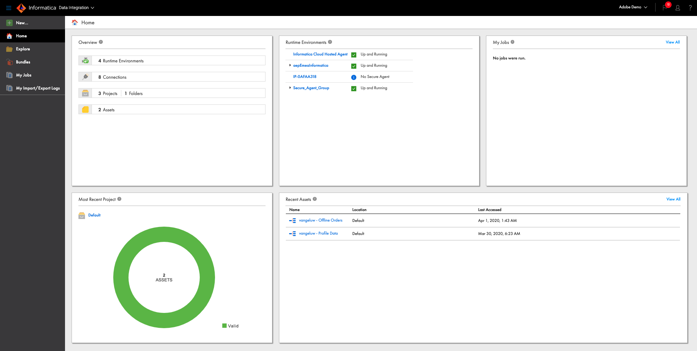
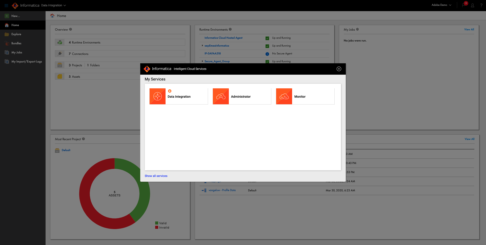
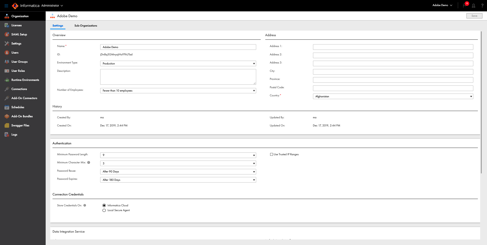
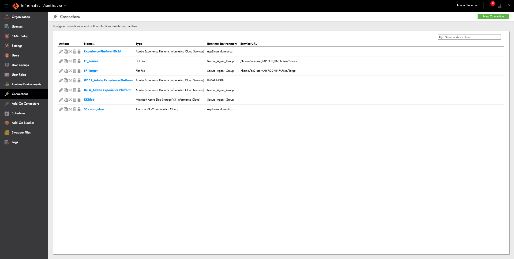
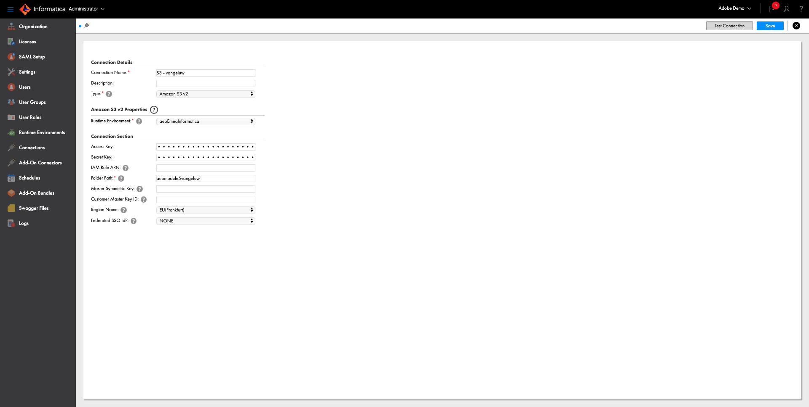
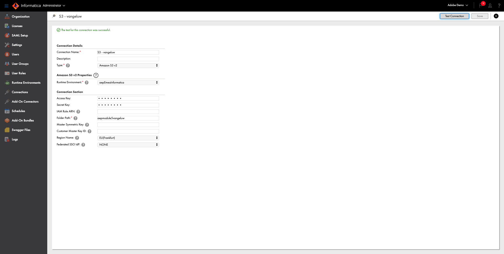

# Exercise 5.2 - Connect Informatica to your AWS S3 bucket

In this exercise, you'll create a connection in Informatica to read data from your AWS S3 bucket.

## Log in to Informatica

Go to [https://apse1.dm-ap.informaticacloud.com/cloudUI/products/administer/main/RuntimeEnvListWS](https://apse1.dm-ap.informaticacloud.com/cloudUI/products/administer/main/RuntimeEnvListWS).

Login using the credentials that were sent to you by email.

You'll then see the Informatica homepage.

In the upper left corner, click on ``Data Integration``.

You'll then see this popup, click ``Administrator``.

You'll then see the Administrator-landing page.

In the left menu, click ``Connections``.

You'll then see all available connections. You now have to create a new connection for your AWS S3-bucket.

Click ``New Connection``.

In Connection Details, configure the fields like this:

- Connection Name: use the name ``S3 - LDAP`` and replace LDAP by your LDAP. In this example, the Connection Name is ``S3 - vangeluw``.
- Type: select the type ``Amazon S3 v2``.

In the Amazon S3 v2 Properties, select ``aepEmeaInformatica`` as the Runtime Environment:

In the Connection Section, configure the fields like this:

- Access Key: this is your Access key ID for your S3 bucket, as defined in the previous exercise.
- Secret Key: this is your Secret access key for your S3 bucket, as defined in the previous exercise.
As a reminder, here's where you could find the Amazon S3 Access and Secret keys:

- Folder Path: folder path should be ``aepmodule5LDAP``, replace LDAP by your LDAP. In this example, the Folder Path is ``aepmodule5vangeluw``.
- Region Name: select ``EU(Frankfurt)``.

After filling out these details, your screen should look like this:

Click ``Save``.

Your connection is now saved and you'll see this:

Let's test your connection now, by clicking the ``Test Connection``button in the upper right corner.

If your connection is set up properly, you should see a confirmation message: ``The test for this connection was successful.``.

If the test was successful, you can continue with the next exercise.

## FYI

You just defined the connection for Informatica to read from your Amazon S3-bucket.
As part of this exercise, you'll also use another connector to write data from Informatica to Adobe Experience Platform.

The connector to write data to Adobe Experience Platform is already configured so you don't need to set it up yourself.

If you'd like to view the setup of the connector, follow these steps:

- In the left menu, click ``Connections``.

  

- Click the connection ``Experience Platform EMEA``

  

  As you can see, this connection uses Adobe IO-credentials to connect to Adobe Experience Platform. It also requires you to upload the private key of your Adobe IO-credentials onto our Informatica-server. This is something only a server admin can do, so you can't setup your integration yourself.
  
Please continue with the next exercise.

Next Step: [Exercise 5.3 - Ingest Offline Order Events into Adobe Experience Platform](./ex3.md)

[Go Back to Module 5](./README.md)

[Go Back to All Modules](../../README.md)
