# 6.2: Journey Orchestration: Setup Journey

In this exercise, you'll configure the journey that needs to be triggered when someone creates an account on the AEP Demo-website.

Login to Journey Orchestration by clicking this link: [https://experience.adobe.com/](https://experience.adobe.com).

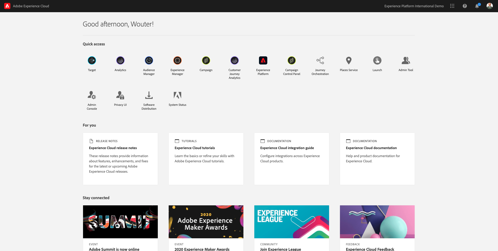

Click on **Journey Orchestration**.

You'll be redirected to the **Journeys** - view in Journey Orchestration.

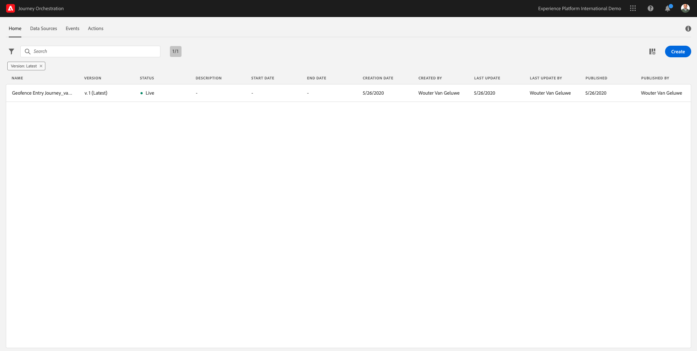

Make sure that you're in the **Home** - view.

Let's create a new journey by clicking the **Create** - button.

You'll then see an empty Journey screen.

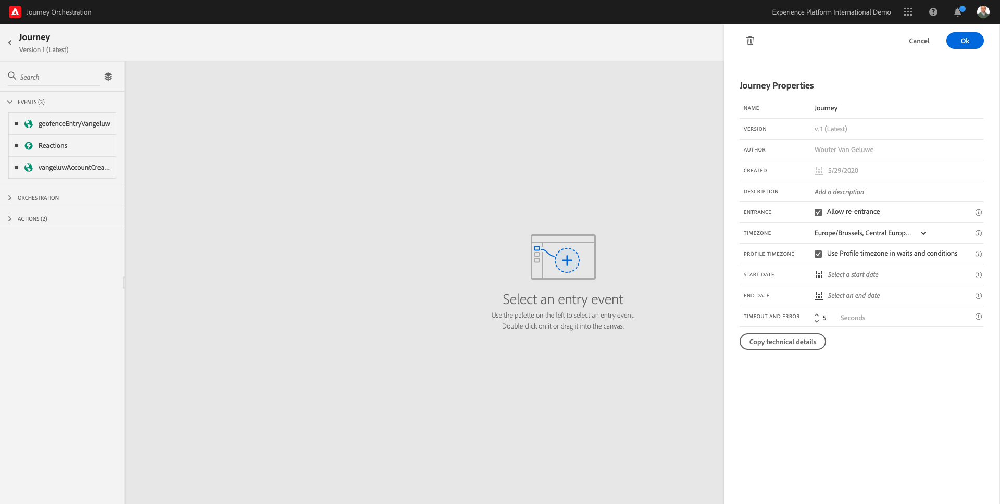

In the previous exercise, you created a new **Event**. You named it like this **ldapAccountCreationEvent** and replaced **ldap** with your ldap. This was the result of the Event creation:

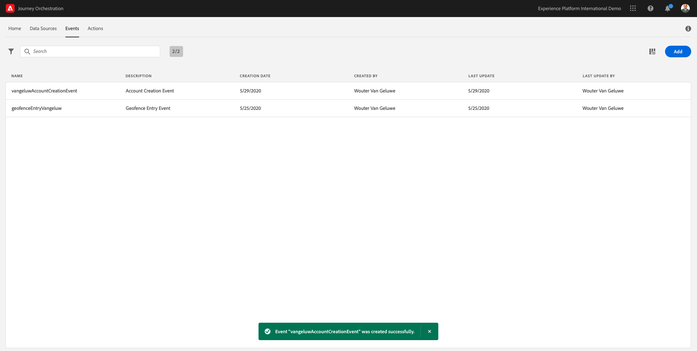

You now need to take this event as the start of this Journey. You can do this by going to the left side of your screen and searching for your event in the list of events.

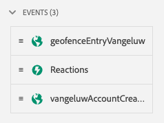

Select your event, drag and drop it on the Journey - canvas. Your Journey now looks like this:

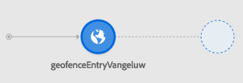

As the second step in the journey, you need to add an **Email** - action. Go to the left side of your screen to **Actions**, select the **Email** - action, then drag and drop it on the second node in your journey.

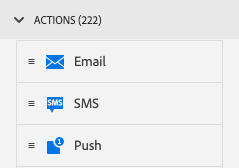

Your journey now looks like this:

On the right side of your screen, you now need to configure the email.

Go to **Message** and open the dropdown-list. In that list, you need to select the template with the name **Thanks for Signing Up**.

Selecting this message automatically opens up a number of additional fields. These are the fields that. have been configured to be dynamic field in the email template. You now need to link each of the expected dynamic fields to a field coming from the Payload that is sent to Platform.

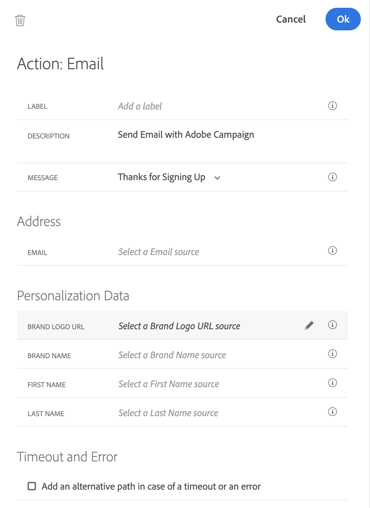

Let's start with the **Email** - field.

Click on the **Edit** - icon.

You'll then see a window to select a source field to use as Email Source.

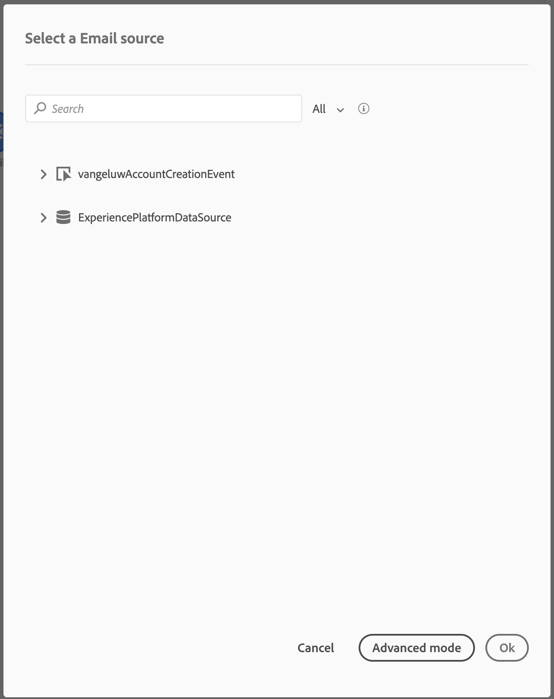

Click on the name of the event you created to open it.

Navigate to **\<aepTenantId>.accountcreation.email** and click it.

Click **OK** to save your configuration.

Next, let's configure the Brand Logo - field. This field has to be configured as you'll be doing many personalized demo's in the future and you probably want those emails to also reference the same brand logo as what is used on the website, mobile app and Alexa. This is where you can make that happen.

Click on the **Edit** - icon.

Navigate to **\<aepTenantId>.brand.brandLogo** and click it.

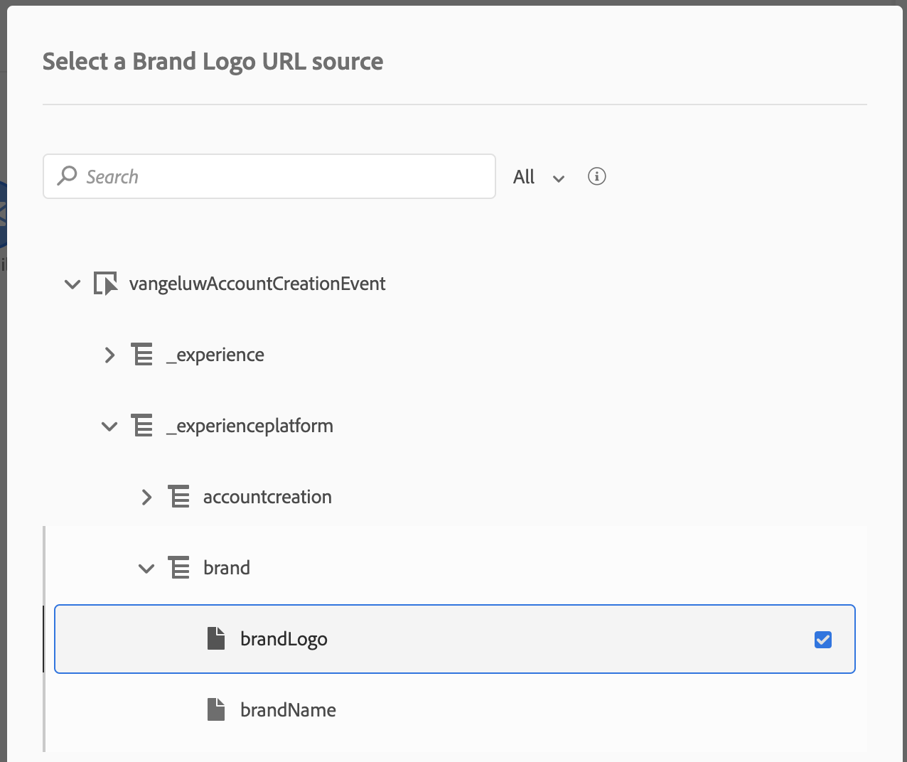

Click **OK** to save your configuration.

Next, let's configure the Brand Name - field. This field has to be configured as you'll be doing many personalized demo's in the future and you probably want those emails to also reference the same Brand Name as what is used on the website, mobile app and Alexa. This is where you can make that happen.

Click on the **Edit** - icon.

Navigate to **\<aepTenantId>.brand.brandName** and click it.

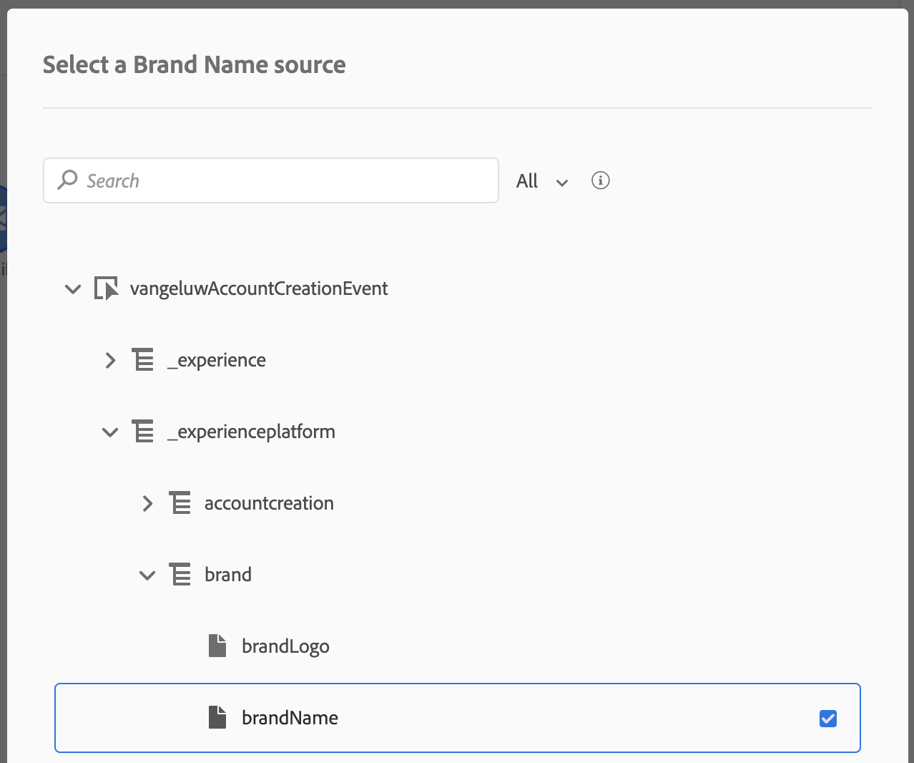

Click **OK** to save your configuration.

Next, let's configure the First Name - field. Personalization requires the usage of First Name.

Click on the **Edit** - icon.

Navigate to **\<aepTenantId>.accountcreation.firstName.** and click it.

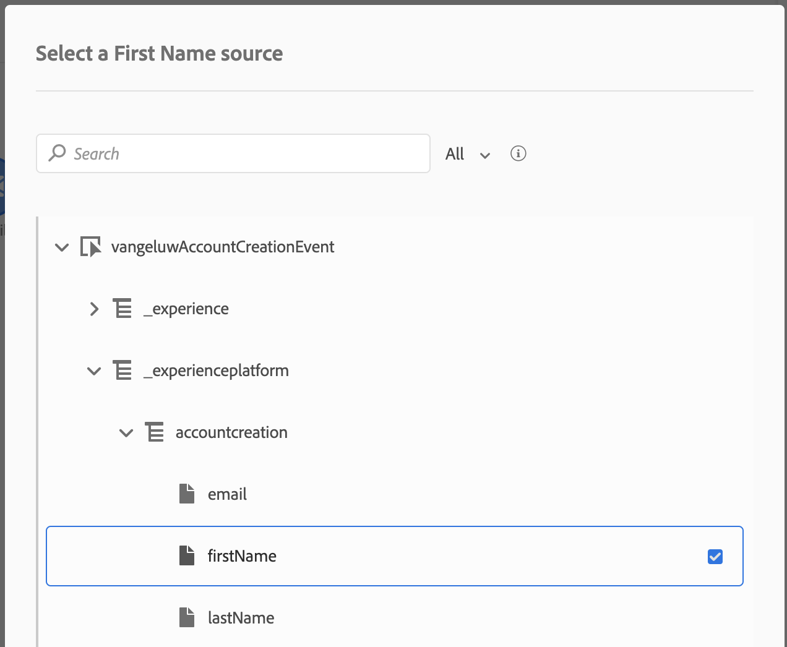

Click **OK** to save your configuration.

Next, let's configure the Last Name - field. Personalization may also require the usage of Last Name.

Click on the **Edit** - icon.

Navigate to **\<aepTenantId>.accountcreation.lastName.** and click it.

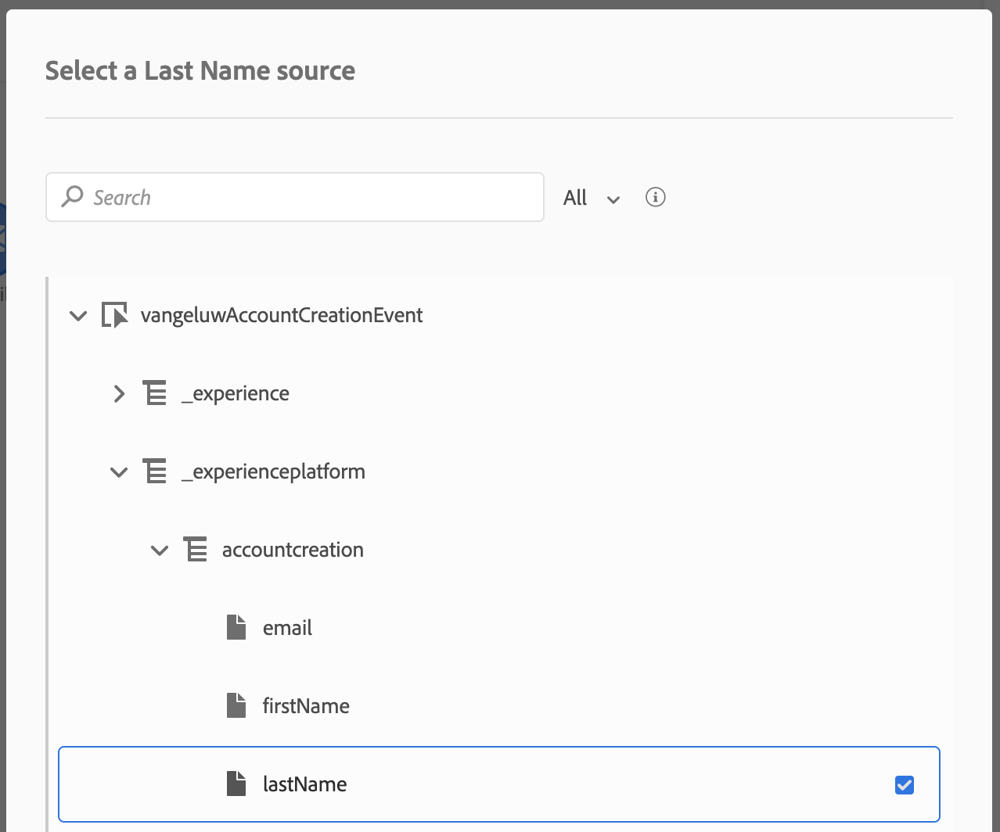

Click **OK** to save your configuration.

Your configuration now looks like this.

Click **OK** again to save your configuration.

For this exercise, our Journey is fine like it is now.

Let's add an Orchestration Event to **End** the Journey. In the left side of the screen, go to **Orchestration** and select **End**. Drag and Drop this onto the 3rd step of the Journey.

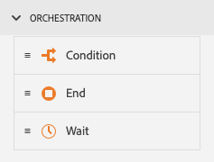

Your Journey now looks like this.

You still need to give your Journey a Name. You can do that by clicking the **Edit** - icon in the top right side of your screen.

You can then enter the Journey's name here. Please use **ldap - Account Creation Journey** as a naming convention and replace **ldap** with your LDAP.
  
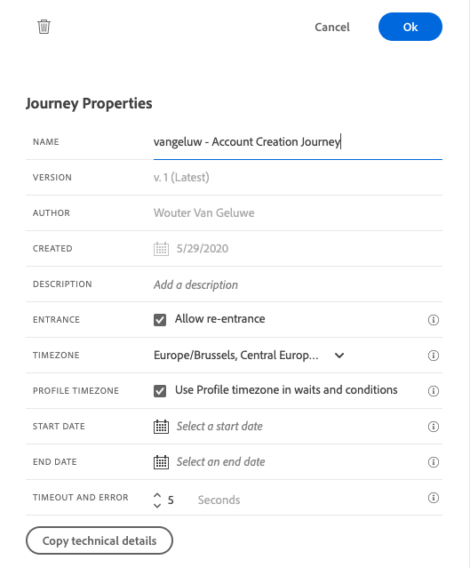

Click **OK** to save your changes.

You now see this in the top of your screen.

You can now publish your journey by clicking **Publish**.

You'll then see a green confirmation bar saying that your Journey is now Publish.

You've now finished this exercise.

Next Step: [6.3: Configure Launch to trigger your Event](./ex3.md)

[Go Back to Module 6](./journey-orchestration-create-account.md)

[Go Back to All Modules](../../overview.md)
