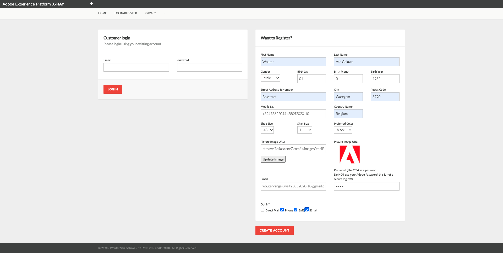

# Exercise 6.3: Configure Launch to trigger your Event

In this exercise, you'll configure Launch so that the Event you created in exercise 1 is now triggered, and activates the Journey that you built in exercise 2.

Go to [https://launch.adobe.com/](https://launch.adobe.com/) and login with your personal login details.

Select your Launch property.

## Exercise 6.3.1 - Edit Rule: Create Account

In the Launch UI, go to Rules.


Click to open the rule ```Create Account```.


Open the action ``Adobe Experience Platform - Send Beacon``. You'll then see this:


In Schema Mapping, you need to add the following Keys and Values to the Send Beacon-action:

| Source Value                 | Target Schema Field               |
|:-------------------------------------------| :------------------ |
|**YourEventID**|_experience.campaign.orchestration.eventID|

The reference to **YourEventID** refers specifically to the EventID of the Event that you configured in Exercise 1. Retrieve the Event ID as indicated in Exercise 1 and paste it by replacing **YourEventID** with your Event ID.

Go to Journey Orchestration, to Events. Select your event and view the payload, scroll down to your eventID:


Scroll down in the Schema Mapping and click ``Add Another``.


Configure your mapping with your eventID, as indicated below:


After the above configuration, your rule looks like this:


Click ```Keep Changes``` to save your Action.

Click ```Save```to save your changes.

You can now publish these changes into your development environment.

In the Launch UI, navigate to the menu option ```Publishing```.


Under Development, you'll see your current Development-environment.
Click on little arrow to open a dropdown-list and click Edit to make changes to your development-library.


Scroll down to the bottom of the window, where you'll see a button called ```+ Add All Changed Resources```.


Click the ```+ Add All Changed Resources``` - button.


Click the ```Save & Build for Development``` - button.


After clicking the ```Save & Build for Development``` - button, your Development-library will be updated and your changes will be available for testing on your AEP Demo - website. It can take a couple of minutes until your Launch-code is updated, wait until you see a green dot next to your Development-library.

(FYI: sometimes the Launch library is cached in your browser so you might have to clear your cache)

Once your Launch - configuration is published, go to your AEP Demo-website, select and load any brand of choice and navigate to the page Login/Register.
Enter your credentials by following the Demo Best Practices as documented [here](../../bestpractices.md).



Click the ``Create Account`` - button. If all goes well, you should receive an email a couple of seconds later.

You've now finished this exercise and this module!

[Go Back to Module 6](./journey-orchestration-create-account.md)

[Go Back to All Modules](../../README.md)
