# (Optional) 6.4: How to create your own email in ACwP

In this optional exercise, you'll learn how to create your own message and event structure in Adobe Campaign with Platform to use in combination with the events coming from Adobe Experience Platform.

You can login to ACwP by clicking this link: [https://experienceplatform-mkt-prod1.campaign.adobe.com/](https://experienceplatform-mkt-prod1.campaign.adobe.com/).

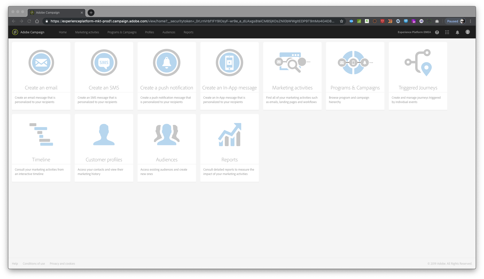

The email you sent following the previous is a so called Adobe Campaign transactional message; i.e. a message not part of a marketing campaign or journey but aimed to be sent immediately. Transactional messages are messages that customers expect to receive instantaneously and as a result always do have priority above any of the marketing campaign journeys being executed in the Adobe Campaign instance.

Transactional messages can be of any delivery type supported in Adobe Campaign: email, SMS, mobile push.

A transactional message in Adobe Campaign always consist of an **event**, defining the payload (data) of the message, and an associated **message**, defining the design / layout.

## 6.4.1: Create an event

To define a transactional message in ACwP:

1. In ACwP main screen, click on **Adobe Campaign** at the top left.
2. ACwP navigation window is displayed.

3. Click on **Marketing plans**.
4. In **> Marketing plans** screen, click on **Transactional messages >**.
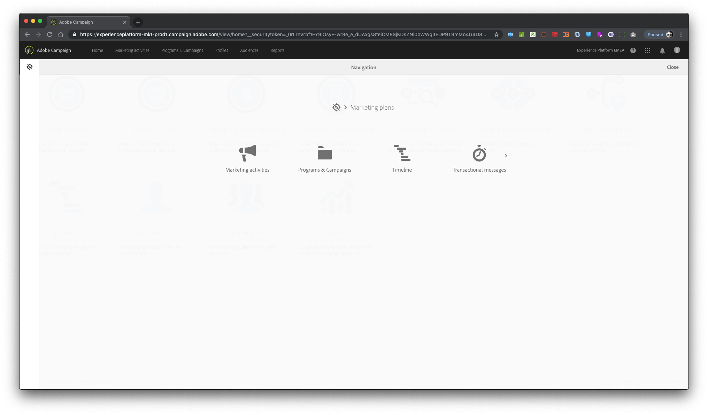
5. In **> Marketing plans > Transactional messages** screen, click on **Event configuration**. Note: You always create a transactional message by first creating the event.
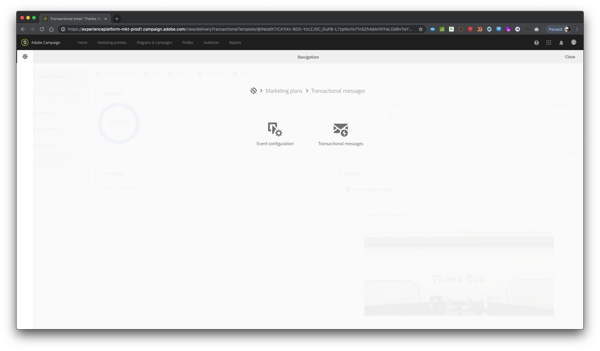
6. You will see a list of all the events already created. To create a new event, click on **Create**.
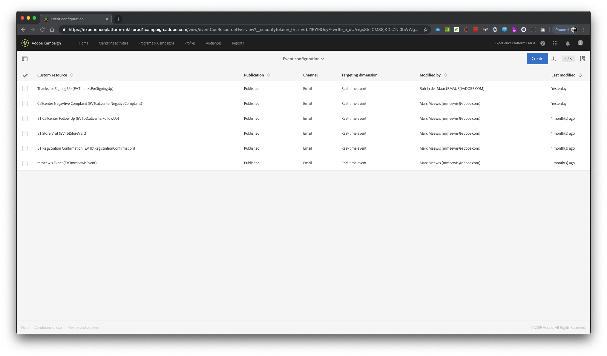
7. In the Configure an event** dialog:
   1. Specify **Label**, e.g. **rmaur - Thanks for signing up**. Make sure you prepend the label with your LDAP name to distinguish it from others.
   2. Specify **ID**, e.g. **rmaurThanksForSigningUp** (no spaces allowed). Ensure you prepend the ID with your LDAP name to distinguish it from others.
   3. Select **Email** as the **Channel** to use.
   4. Select **Real-time event** from the **Targeting dimension** dropdown list.
   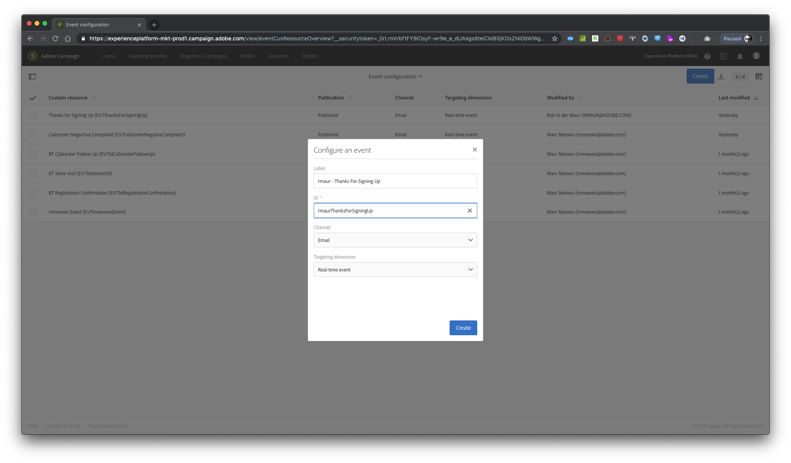
   5. Click **Create** to create the event.
8. You will end up in the **Event configuration '...'** screen where you can further define your event.
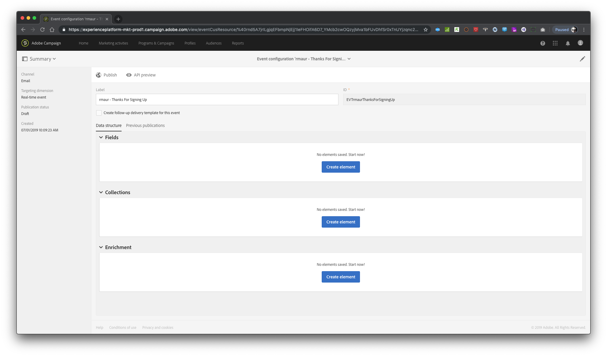
To do so:
    1. Ensure the **Data Structure** tab is active.
    2. Underneath **Field** click on **Create element**.
    3. In the **New field** dialog:
       1. Specify **Brand Name**as **Label**.
       2. Specify **brandName** as **ID**.
       3. Select **Text** as **Type**
       4. Leave value for **Length** unchanged.
       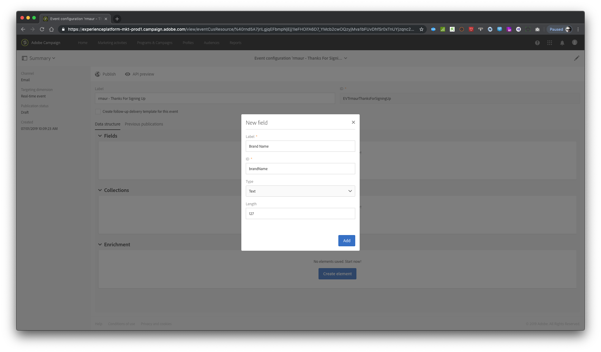
       5. Click on **Add**.
       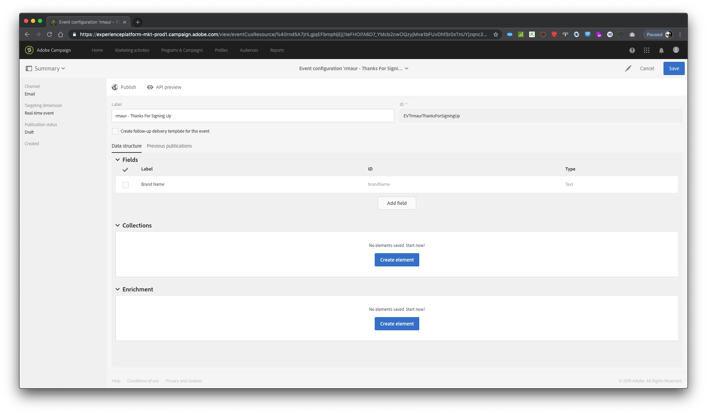
    4. Repeat step 2 and 3 for
       1. **Label** - **Brand Logo URL**,
       **ID** - **brandLogoUrl**,
       **Type** - **Text**,
       **Length** - **127**.
       2. **Label** - **First Name**,
       **ID** - **firstName**,
       **Type** - **Text**,
       **Length** - **127**.
       3. **Label** - **Last Name**,
       **ID** - **lastName**,
       **Type** - **Text**,
       **Length** - **127**.
    5. Your event configuration screen should now look like
    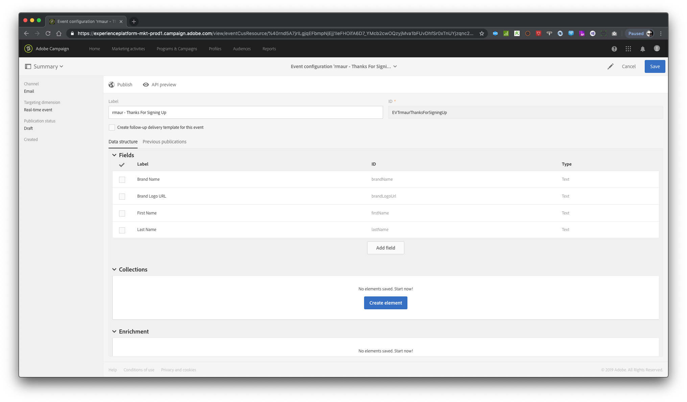
    6. Click on **Save** to save your changes.
    7. Click on **Publish** to publish the event. Click on **OK** in the **Confirm** dialog.
9. The event will be published and you can see progress in the **Publication** screen.
    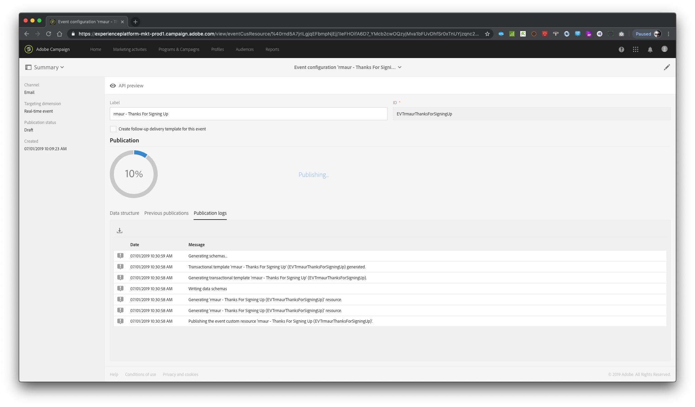
10. When finished, you will see **Publication completed**.
 

You have finished the to create an event in ACwP. Note that the event parameters you created are the ones you will map to the event data coming from Adobe Experience Platform, as was shown in previous exercise.

## 6.4.2: Define the message

In this we are going to define the layout of the message, as well as where in the message we want to make use of the event data we just have created.

By creating the event in the previous exercise, ACwP automatically created a message that you will further define in this exercise.

- If you are still in the **Event configuration '...'** screen, you can go directly to the message itself. To do so:
  1. Click on the link below **Transactional message** in the left pane.

- If you are not anymore in the **Event configuration '...'** screen, ensure you are logged in to ACwP and then:
   1. Click on **Adobe Campaign**.
   2. Click on **Marketing plans**.
   3. Click on **Transactional messages >**.
   4. Click on **Transactional messages**.
   5. You should see your transactional message as a new tile amongst the tiles in the **Transactional messages** screen.
   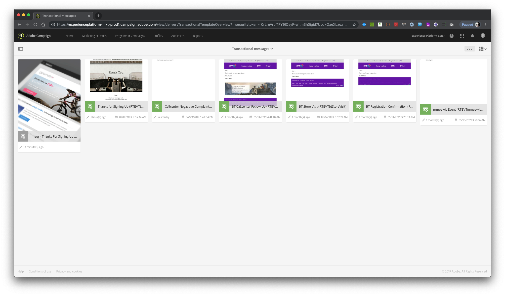

To define the details of this message:

1. Click on the link or the transactional message tile to open the message.
2. You will see the **Transactional email '...'** screen that summarizes the details of your email.
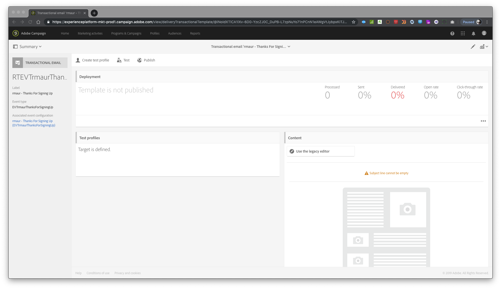
Click on the big thumbnail at the bottom of the **Content** pane. **Note**: Do **NOT** click on **Use the legacy editor**.
3. This will open the email editor **_ldap_ - Thanks For Signing Up**, where you will further define the email.
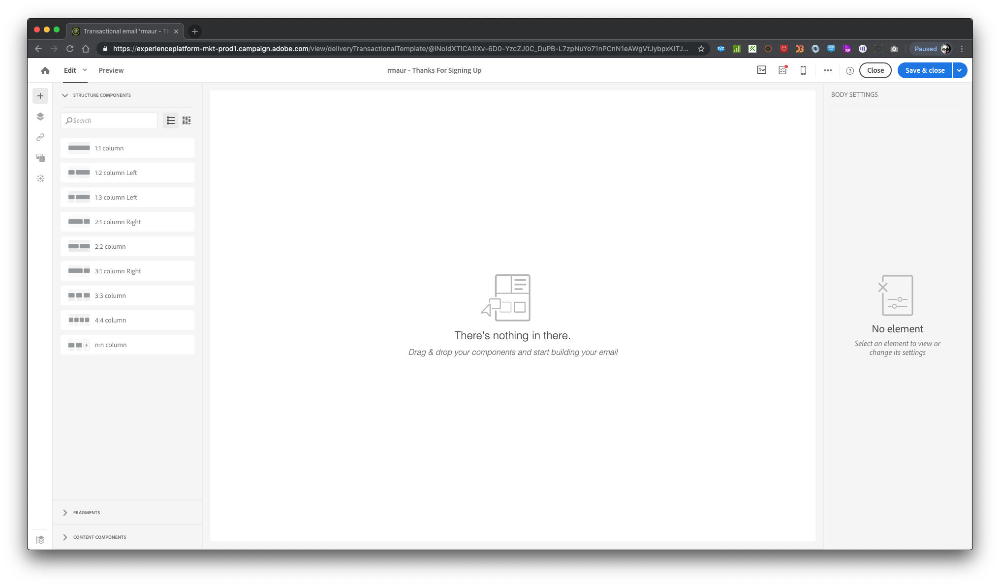
4. Click on the top title **_ldap_ - Thanks for Signing Up** at the top of the screen. In the dialog that opens up, ensure you specify a **Subject**. E.g. **Thanks for signing up!** If the subject remains empty, the email will **NOT** be sent.
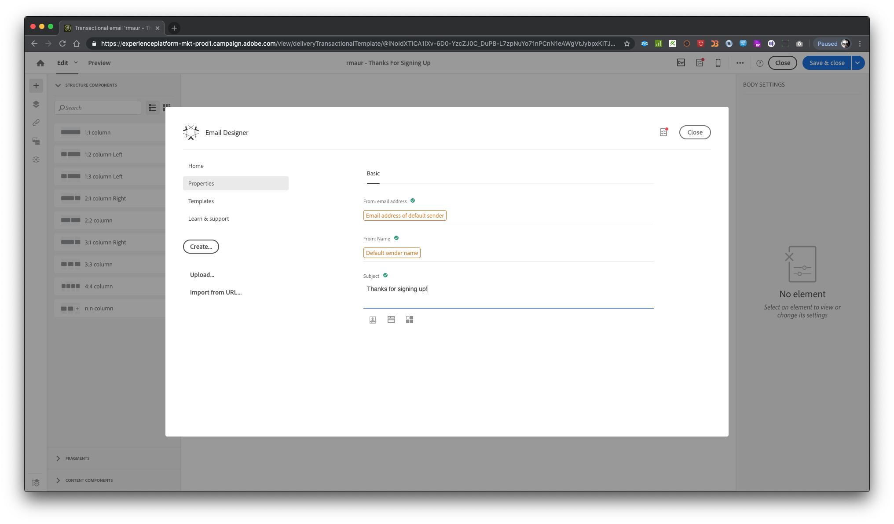
Click on **Close** to close the dialog.
5. Back in the editor, ensure the **Edit** tab is selected, the **+** view is active (**Add Components and Fragments**) and the **Structure Components** are selected (unfolded).
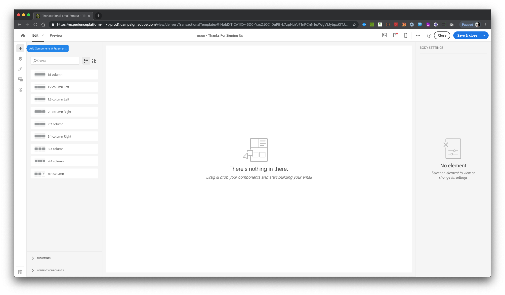
6. Drag the **1:1 column** component from the left pane and drop it in the middle canvas.
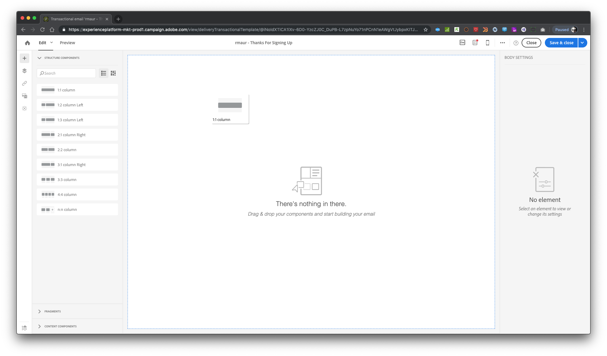
7. You will see the structure component in the canvas.
8. Repeat step 6 and 7 two more times. After that your screen should look like
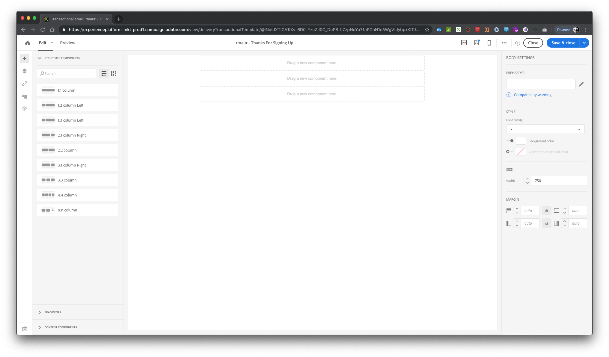
The three structure components define your header, body and footer of your email.
9. Switch to Content Components by clicking **Content Components**. This will reveal the various content components like **Button**, **Text**, **Divider**, etc.
    1. Drag an **Image** component from the left pane on top of the top structure component.
    2. Drag another **Image** component from the left pane on top of the middle structure component.
    3. Drag a **Text** component from the left pane on top of the middle structure component and below the **Image** component.
    4. Drag a **Text** component from the left pane on top of the bottom structure component.
    5. Your screen should look like
    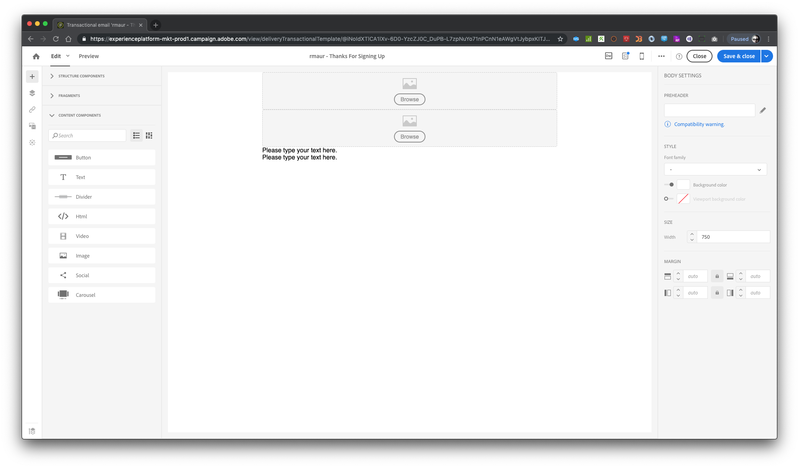
10. Click on **Browse** in the Image component in the top structure component.
    1. The Upload image dialog is shown
    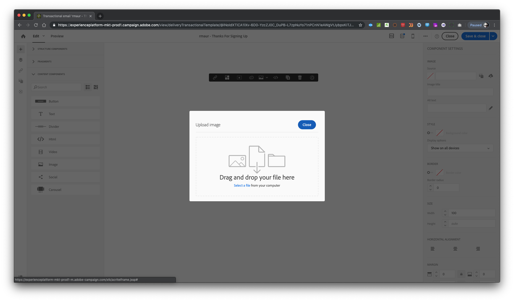
    2. Drag the La Boutique logo image below and drop it on the dialog.
    
    Alternatively, save the file somewhere locally on your computer and select **Upload a file from your computer** and select the file from where you saved it.
    3. With the Image component selected, resize the image to **50%** using the **Width** slider underneath **Size** in the **Component Settings** right pane.
    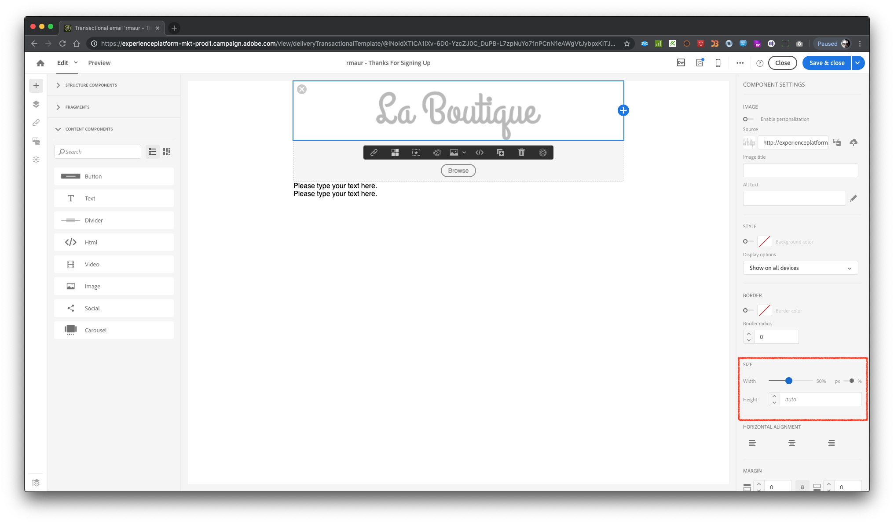
    4. With the Image component still selected, enable **Enable personalization** underneath **Image** at the **Component Settings** pane.
    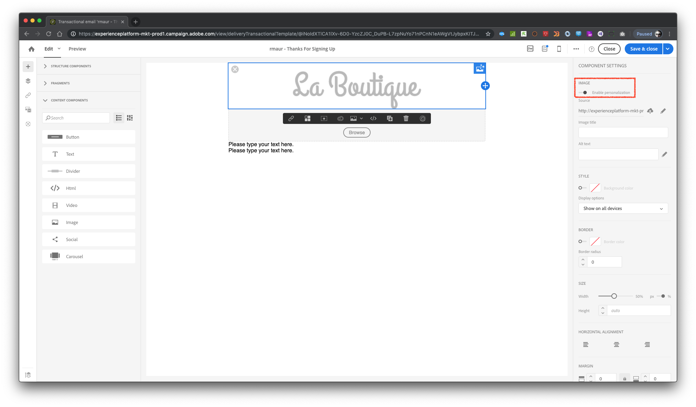
    5. Click on the pencil on the right of the **Source** field.
    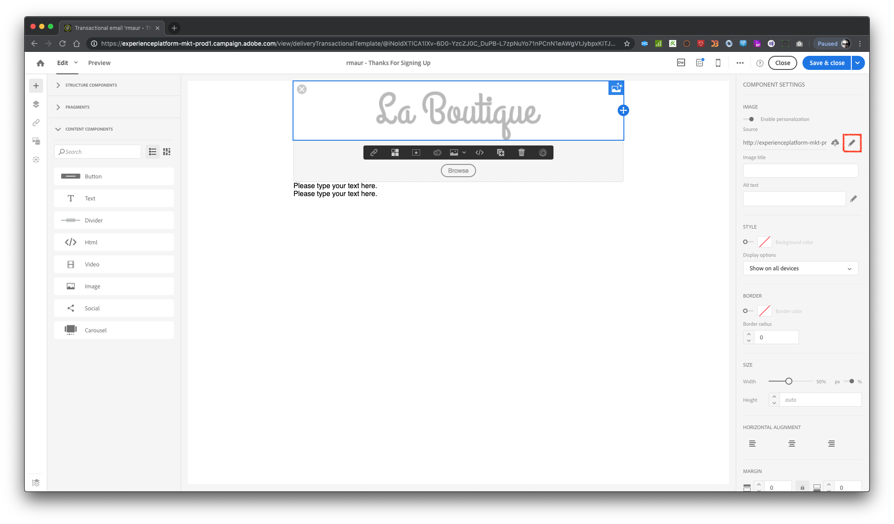
    This will open the Image source URL dialog. In that dialog:
       1. Remove the URL from the text box.
       2. Click on the **Add Personalization field** button.
       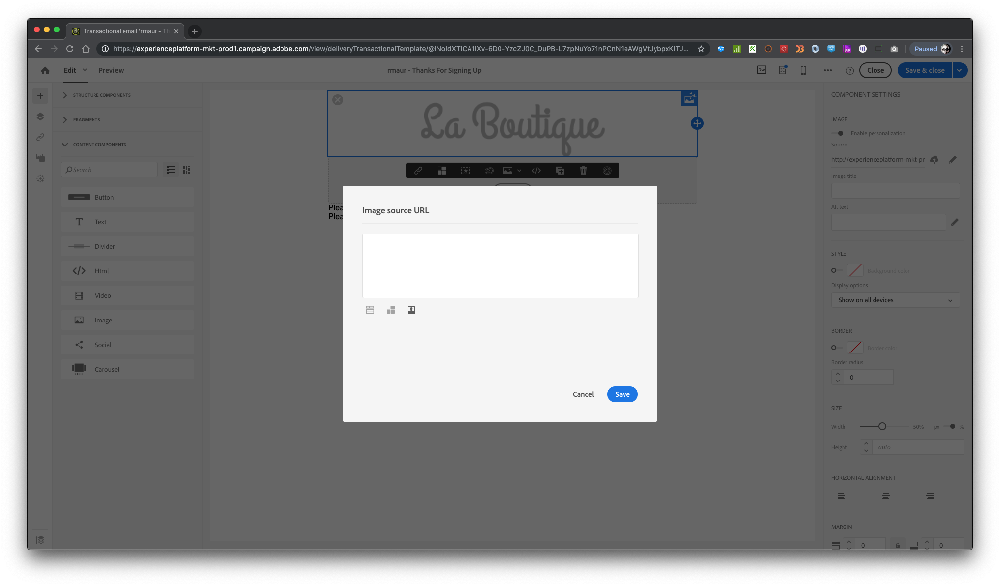
       3. A left **Add personalization field** pane will open.
       4. Scroll down to the bottom in the list until you see **Real-time event (rtEv..** and click on it.
       5. Scroll down even further until you see **Event context (ctx** and click on it.
       6. Double click **Brand Logo**.  **Brand Logo URL (brandLogoUrl)** is inserted in the **Image Source URL** text field.
       
       7. Click on **Save**.
11. Click on **Browse** in the Image component in the middle structure component.
     1. The upload image dialog is shown.
     2. Drag the Thank You image below and drop it on the dialog.
    
    Alternatively, save the file somewhere locally on your computer and select **Upload a file from your computer**.
     3. Your editor should now look like
    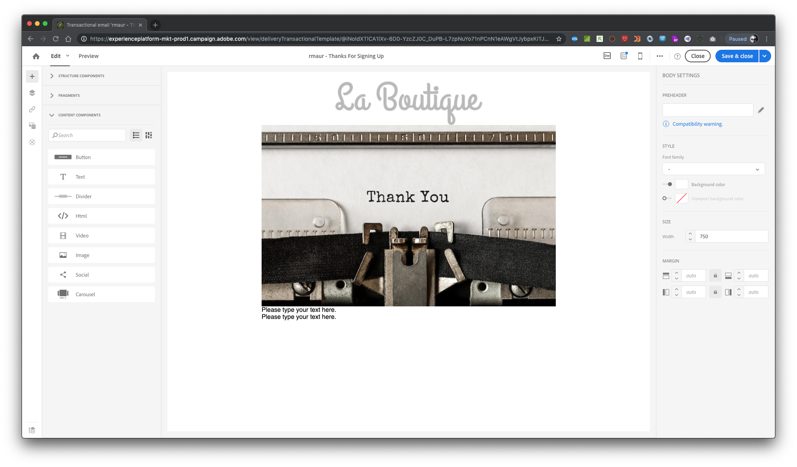
12. Click in the top text box and change the text to
**Dear ,
Thank you for signing up for**.
Then:
    1. Center the text using the toolbar that pops up.
    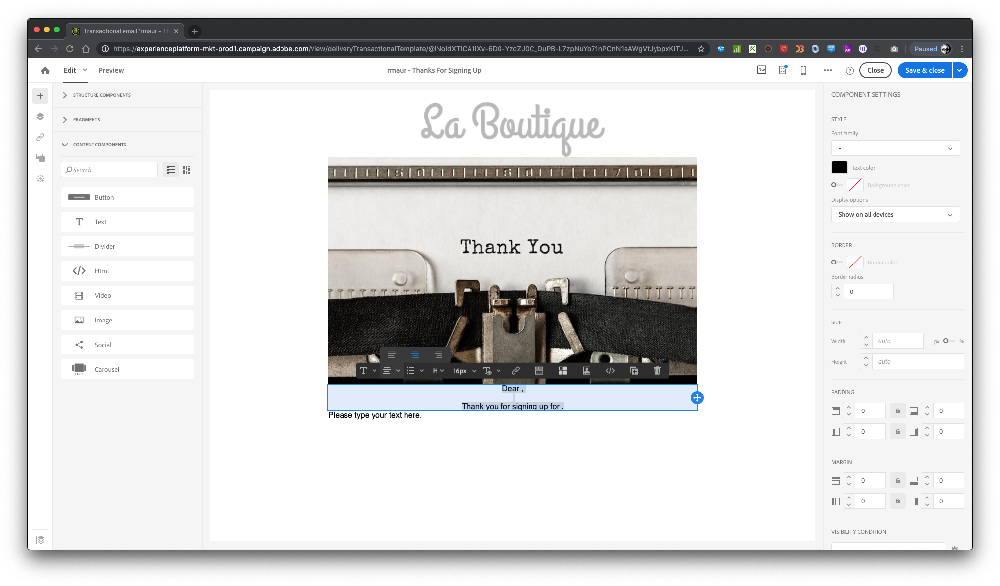
    2. Format the text using the **Component Settings panel**. E.g. set **padding** to **30**.
    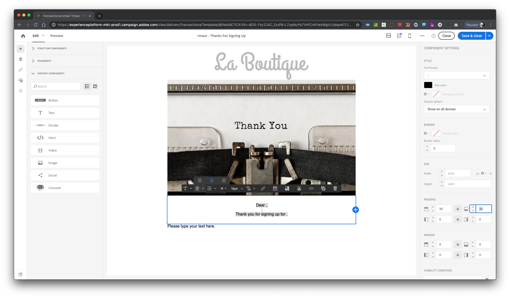
    3. Insert the cursor before the **,**after **Dear**, and click on the **Insert personalization field button**.
    4. The **Select a personalization field** dialog pops up and allows you to select a field similarly as what you have done in step 10.5 above. In this case select **First Name (firstName)**.
    
    5. Click **Confirm**. The personalization field is inserted in the text.
    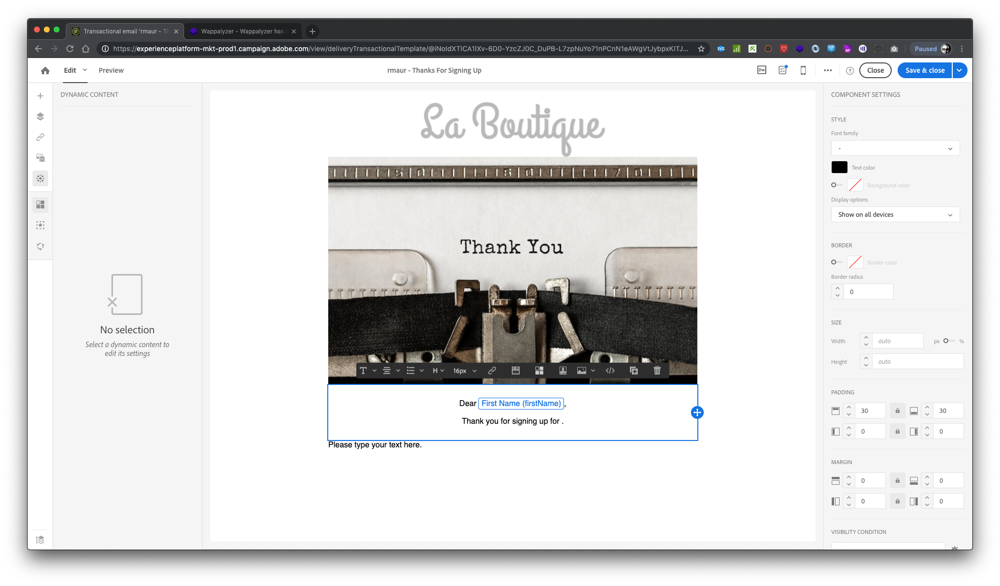
13. Now repeat what you have done in step 12 to insert the Brand Name personalization field in the second line of the first Text component as well as in the Text component of the bottom structure component. You should also modify and format that Text component.
14. Your editor now should look like
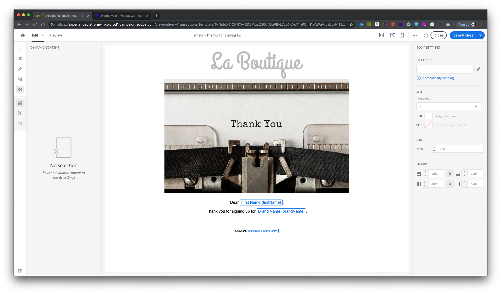
15. Click on **Save & Close** to save and close the editor.
16. Back in the **Transactional email '...'** screen, click on **Publish** to publish your email template.

Your email template is now ready to be invoked using the event you have specified. As you have seen in the earlier that is exactly what Triggered Journey is doing: taking an AEP event, mapping that to a transactional message event that is coupled to a transactional message template (in our case an email).

You've now finished this and this module!

[Go Back to Module 6](./journey-orchestration-create-account.md)

[Go Back to All Modules](../../overview.md)
