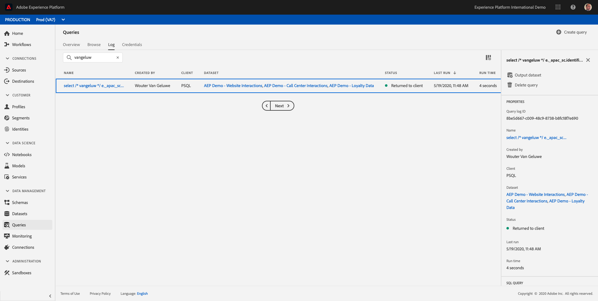
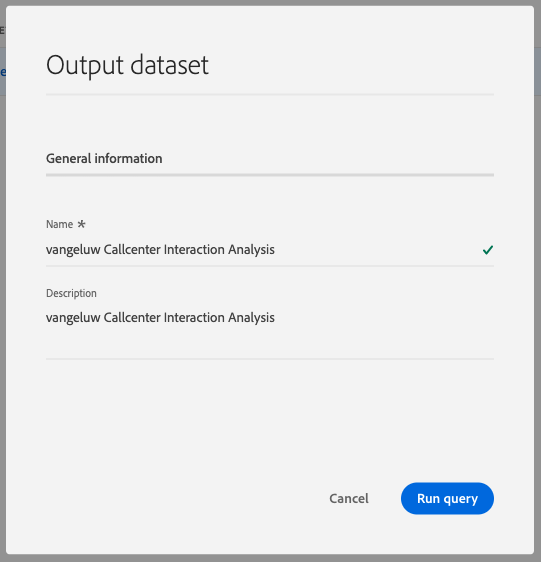
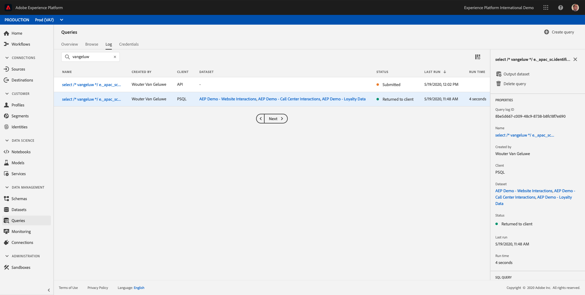
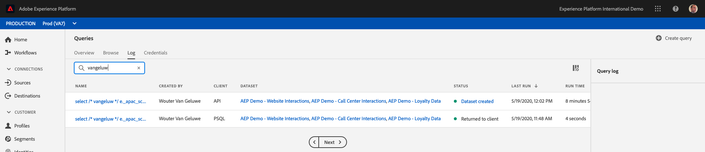

# Exercise 7.4 - Power BI/Tableau

## Objective

Learn how to generate datasets from query results
Connect Microsoft Power BI Desktop/Tableau directly to the Query Service
Creating a report in Microsoft Power BI Desktop/Tableau Desktop

## Lesson Context

A command line interface to query data is exciting but it doesn't present well. In this lesson, we will guide you through a recommended workflow for how you can use Microsoft Power BI Desktop/Tableau directly the Query Service to create visual reports for your stakeholders.

## Exercise 7.4.1 Create a dataset from a SQL query

The complexity of your query will impact how long it takes for the Query Service to return results. And when querying directly from the command line or other solutions like Microsoft Power BI/Tableau the Query Service is configured with a 5 minute timeout (600 seconds). And in certain cases these solutions will be configured with shorter timeouts. To run larger queries and front load the time it takes to return results we offer a feature to generate a dataset from the query results. This feature utilizes the standard SQL feature know as Create Table As Select (CTAS). It is available in the Platform UI from the Query List and also available to be run directly from the command line with PSQL.

In the previous exercise you've replaced ``enter your name`` with your own ldap before executing it in PSQL.

```sql
select /* enter your name */
       e.<aepTenantId>.identification.ecid as ecid,
       e.placeContext.geo.city as city,
       e.placeContext.geo._schema.latitude latitude,
       e.placeContext.geo._schema.longitude longitude,
       e.placeContext.geo.countryCode as countrycode,
       c.<aepTenantId>.callDetails.callFeeling as callFeeling,
       c.<aepTenantId>.callDetails.callTopic as callTopic,
       c.<aepTenantId>.callDetails.contractCancelled as contractCancelled,
       l.<aepTenantId>.loyalty.loyaltyStatus as loyaltystatus,
       l.<aepTenantId>.loyalty.loyaltyPoints as loyaltypoints,
       l.<aepTenantId>.identification.crmid as crmid
from   aep_demo_website_interactions e
      ,aep_demo_call_center_interactions c
      ,aep_demo_loyalty_data l
where  e.<aepTenantId>.brand.brandName like 'Luma Telco'
and    e.web.webPageDetails.name in ('Cancel Service', 'Call Start')
and    e.<aepTenantId>.identification.ecid = c.<aepTenantId>.identification.ecid
and    l.<aepTenantId>.identification.ecid = e.<aepTenantId>.identification.ecid;
```

Navigate to the Adobe Experience Platform UI - [https://platform.adobe.com](https://platform.adobe.com)

You will search for your executed statement in the Adobe Experience Platform Query UI by entering your ldap in the search field:

Select ``Queries``, enter your ldap in the search field, select your query.



Click ``Output Dataset``.

Enter ``ldap Callcenter Interaction Analysis`` as name and description for the dataset and press the ``Run Query`` button



As a result, you will see a new query with a status ``Submitted``.



Upon completion, you will see a new entry for ``Dataset Created`` (you might need to refresh the page).



As soon as you dataset is created (which can take 5-10 minutes), you can continue the exercise.

---

Next Step - Option A: [Exercise 7.4.2 Explore the dataset with Power BI](./ex4a.md)

Next Step - Option B: [Exercise 7.4.2 Explore the dataset with Tableau](./ex4b.md)

[Go Back to Module 7](../README.md)

[Go Back to All Modules](../../README.md)
