# 8.2 - Model Authoring and Operationalization

In 1 we created the training data required to power our Machine Learning model. In this lesson we will show you how you can use this data and author a machine learning model. In the real world, creating a dataset and a machine learning model will be an iterative process.

The URL to login to Adobe Experience Platform is: [https://platform.adobe.com](https://platform.adobe.com)

## Objectives

* Analyze your training data using Notebooks
* Explore the Product Recommendations Recipe
* Learn how the Product Recommendations Recipe can be created

## 8.2.1 - Analyze the Data

Let's explore the generated training data from the previous to get quick insights using the data exploration notebook (recommendations-data-exploration.ipynb).

In Jupyter Notebooks, open the notebook named **luma-retail-recommendations-data-exploration.ipynb** by double-clicking it.

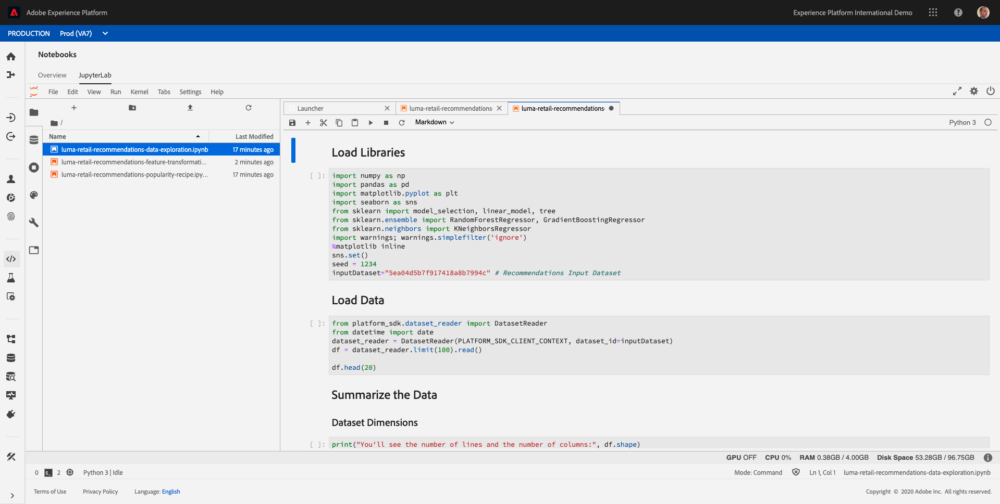

In Jupyter Notebook's menu, go to **Run** and click on **Run All Cells**. This command will run all cells of the notebook in one go.

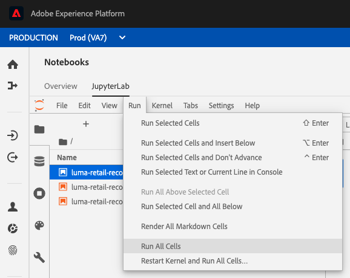

Clicking the **Run All Cells** command will execute these steps:

* Load Libraries
* Load Data
* Summarize the Data
* Peeking at the Data
* Statistical Summary
* Grouping Items by Item ID

Let's have a look at all steps in detail...

### Load Libraries

Click on the first cell in the notebook.

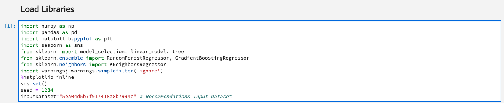

```python
import numpy as np
import pandas as pd
import matplotlib.pyplot as plt
import seaborn as sns
from sklearn import model_selection, linear_model, tree
from sklearn.ensemble import RandomForestRegressor, GradientBoostingRegressor
from sklearn.neighbors import KNeighborsRegressor
import warnings; warnings.simplefilter('ignore')
%matplotlib inline
sns.set()
seed = 1234
inputDataset="5ea04d5b7f917418a8b7994c" # Recommendations Input Dataset
```

Click the play - button to execute this cell.

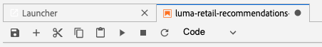

### Load Data

Click on the next cell in the notebook.

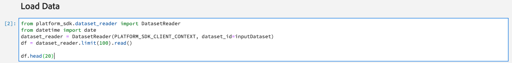

**
from platform_sdk.dataset_reader import DatasetReader
from datetime import date
dataset_reader = DatasetReader(PLATFORM_SDK_CLIENT_CONTEXT, dataset_id=inputDataset)
df = dataset_reader.limit(100).read()

df.head(20)
**

Click the play - button to execute this cell.


This is the result:

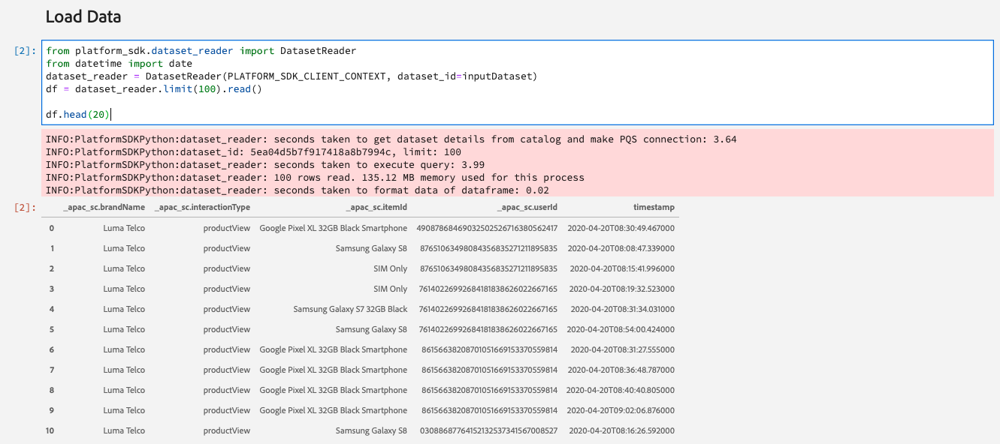

### Summarize the Data

Click on the next cell in the notebook.

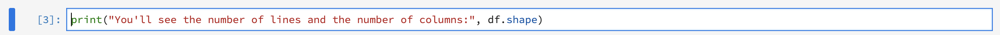

**
print("You'll see the number of lines and the number of columns:", df.shape)
**

Click the play - button to execute this cell.


This is the result:

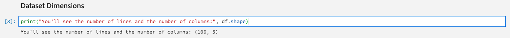

### Peeking at the Data

Click on the fourth cell in the notebook.

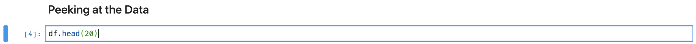

**
df.head(20)
**

Click the play - button to execute this cell.


This is the result:

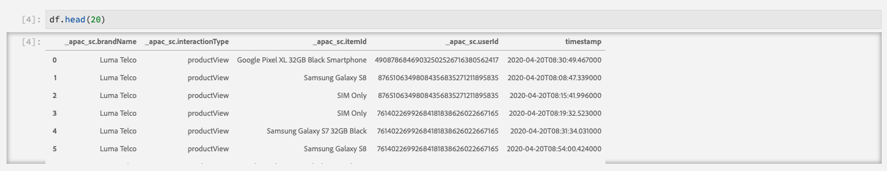

### Statistical Summary

Click on the next cell in the notebook.

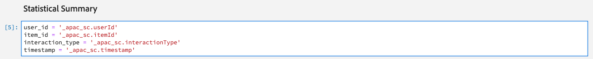

**
user_id = '<aepTenantId>.userId'
item_id = '<aepTenantId>.itemId'
interaction_type = '<aepTenantId>.interactionType'
timestamp = '<aepTenantId>.timestamp'
**

Click the play - button to execute this cell.


Then click on the next cell in the notebook.


**
df.describe()
**

Click the play - button to execute this cell.


This is the result:

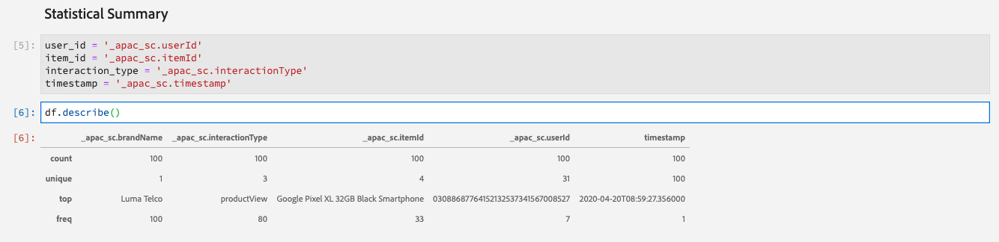

### Grouping Items by Item ID

Click on the seventh cell in the notebook.

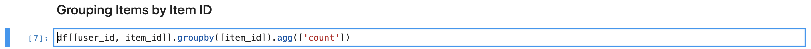

**
df[[user_id, item_id]].groupby([item_id]).agg(['count'])
**

Click the play - button to execute this cell.


This is the result:

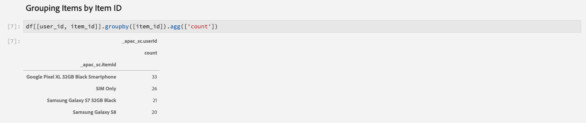

## 2.2 - Recipe Builder Notebook

The Recipe Builder Notebook is one of our recent innovations that templates your model to automatically package and operationalize it. The notebook has multiple templated cells that you fit your model code into:

* The requirements and configuration cells allow you to add additional libraries and configure datasets and tuning parameters for your model
* The evaluator cell enables you to split your data and evaluate the performance of your model
* The training and scoring data loader cells allow you to load the data you need for training and scoring
* Finally, the pipeline cell contains logic required for both training and scoring your model.

We have streamlined the steps needed to operationalize a model by giving you the ability to train, evaluate and score it at scale and then package it in one seamless flow on Adobe Experience Platform. Packaging to a Recipe also allows you to use the same code with different datasets to power different use cases in your organizations. Our specific use case revolves around using the recommendations model code for users searching for products to purchase on the website.

In Jupyter Notebooks, open the notebook named **recommendations-popularity-recipe.ipynb** by double-clicking it.

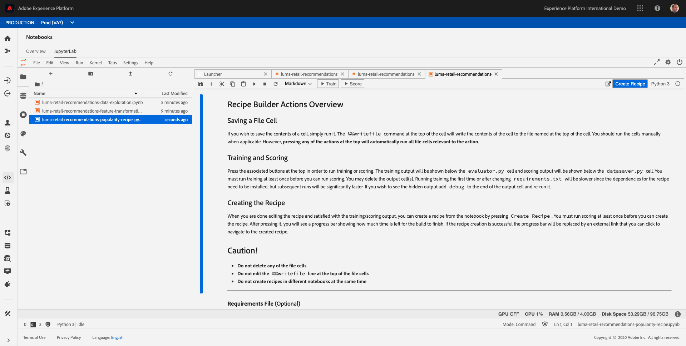

In this notebook, we'll do the following:

* Train a model
* Score a model
* Create a recipe from the model

Let's have a look at all steps in detail...

### Train a model

Training a model is done by clicking the **Train** - button.

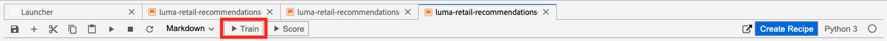

Click **Train** on the top toolbar to create a training run in the cell. This executes the training data loader, pipeline and evaluator cells and generates evaluation metrics to gauge model performance. A log of commands and outputs from the training script will appear in the notebook (under the Evaluator - cell).

After clicking **Train**, the Training Run will start and will need a couple of minutes to complete.

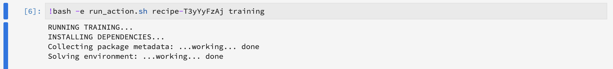
...
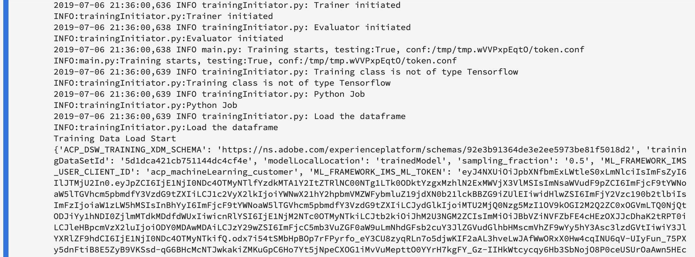
...
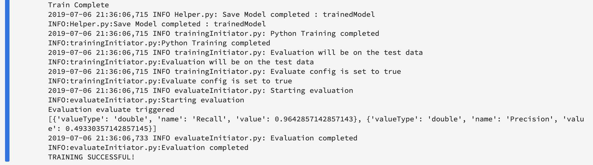

When you click **Train**, the following cells are executed:

* Requirements File
* Configuration Files - Training
* Training Data Loader File
* Pipeline File
* Evaluator File

### Score a model

Training a model is done by clicking the **Score** - button.

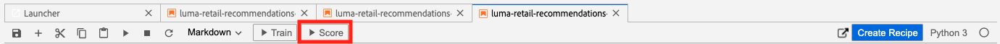

Click **Score** on the top toolbar to create a training run in the cell. This executes the scoring data loader, pipeline and evaluator cells and generates evaluation metrics to gauge model performance. A log of commands and outputs from the training script will appear in the notebook (under the pipeline.py cell).

After clicking **Score**, the Training Run will start and will need a couple of minutes to complete.

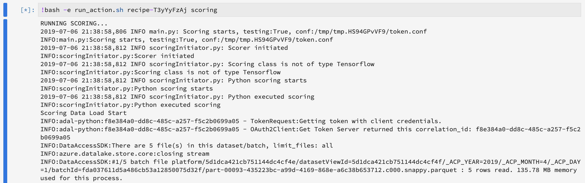
...
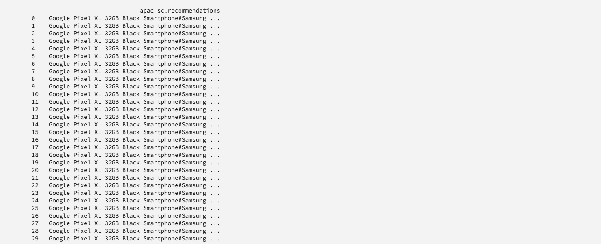
...
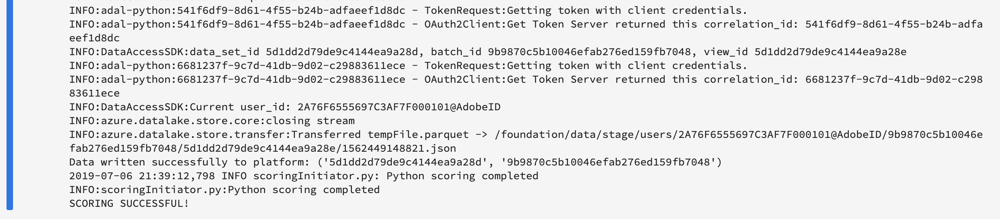

When you click **Score**, the following cells are executed:

* Requirements File
* Configuration Files - Scoring
* Scoring Data Loader File
* Pipeline File
* Evaluator File

Additionally, at the end of the Scoring Run, the output with recommendations is stored in Adobe Experience Platform, in the **AEP Demo - Recommendations Output**-dataset.

You can verify this [by opening the AEP Demo - Recommendations Output-dataset in Adobe Experience Platform](https://platform.adobe.com/dataset).

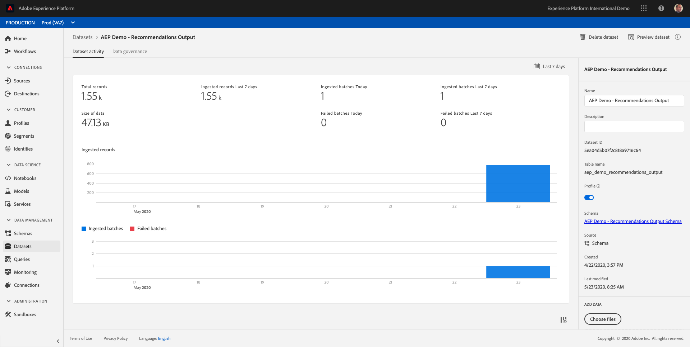

### Create a recipe from the model

Creating a recipe is done by clicking the **Create Recipe** - button.

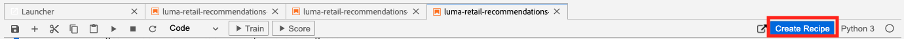

When you are satisfied with the outputs of training and scoring, you can create a recipe. Click the **Create Recipe** - button to start the process.

Creating a recipe enables you to test your model at scale.

After clicking the **Create Recipe** - button, you have to enter a name for your recipe.

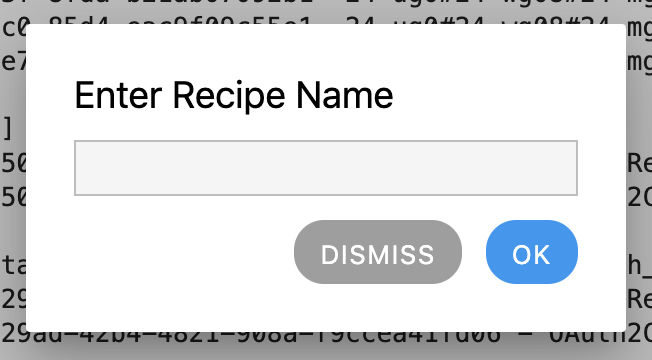

As a naming convention, please use:

* **ldap**Recommendations

Replace **ldap** with your ldap.

Example: for ldap **vangeluw**, the name of your recipe should be: **vangeluwRecommendations**.

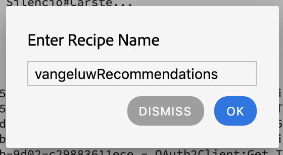

After entering a Recipe Name, click **OK**.


A second popup is shown, telling you that your Recipe is being created. This could take up to 5 minutes, please wait until the process finishes.

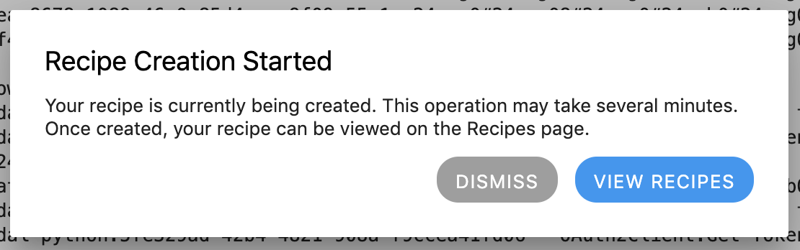

For now, click the **Dismiss** - button.


You can view the progress of the recipe creation process in the top right corner of Jupyter Notebooks.


...


After a couple of minutes, the recipe creation is finished and you can find your recipe in the **Recipes** - section. To go there, click on **Recipes** in the **Models** menu.

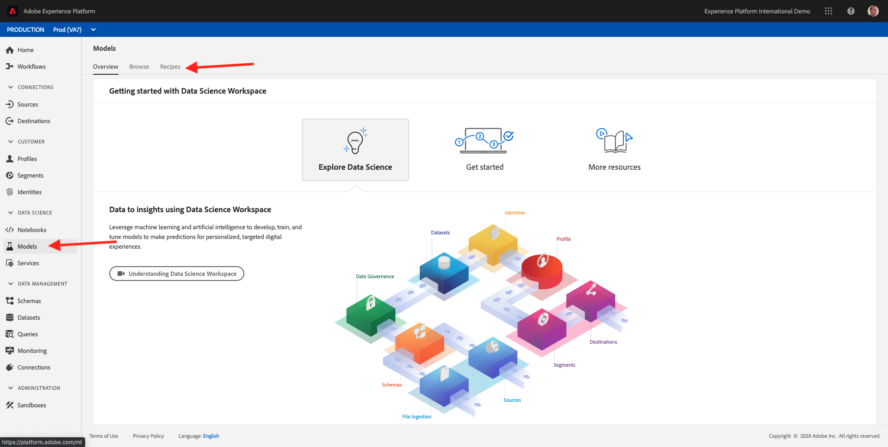

You'll find your recipe in the list.

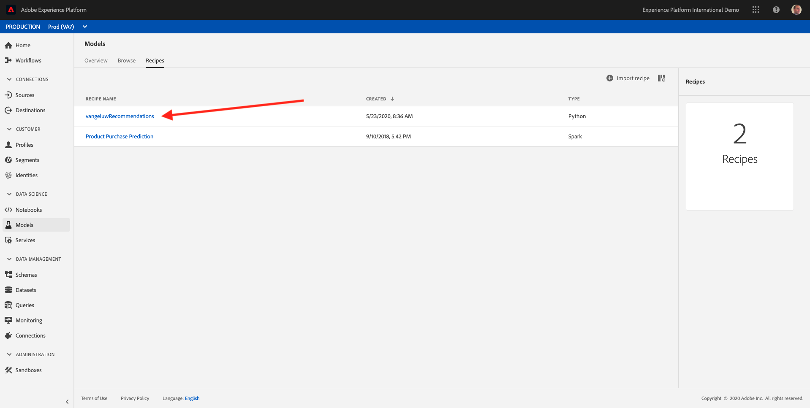

Now that you've created your recipe, let's continue with the next exercise, in which you'll start scalable training and experimentation.

Next Step: [8.3 - Model Training and Experimentation](./ex3.md)

[Go Back to Module 8](./data-science-workspace-popularity-based-recommendations.md)

[Go Back to All Modules](../../README.md)
