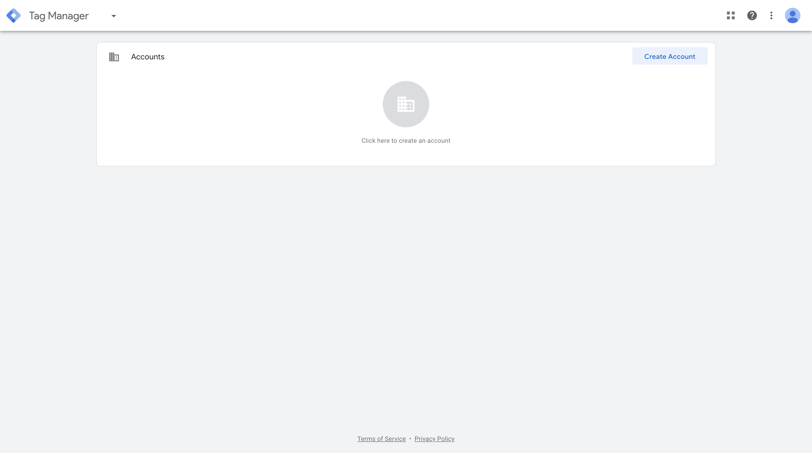
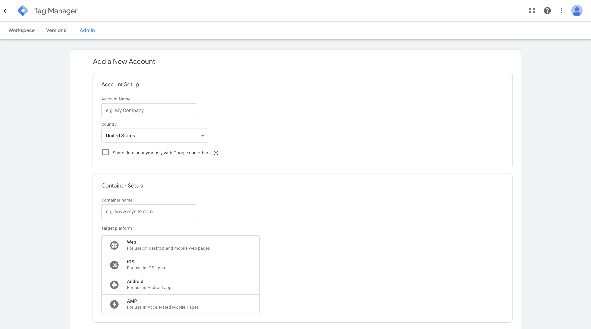
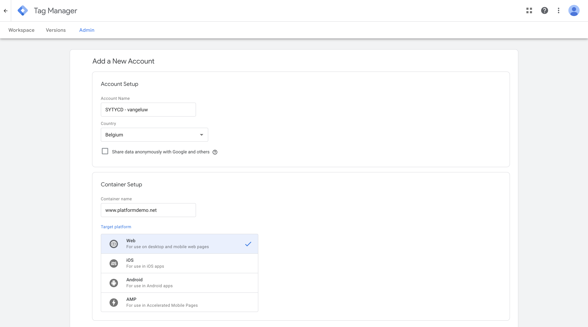
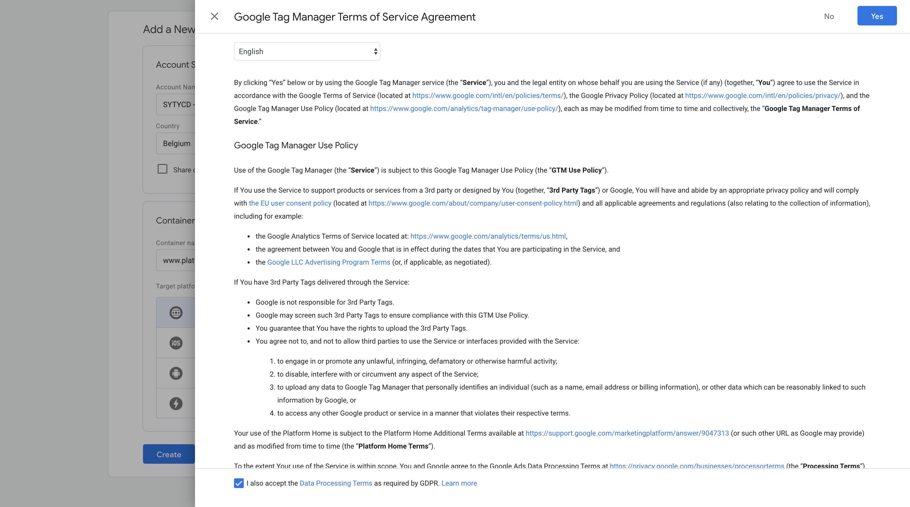
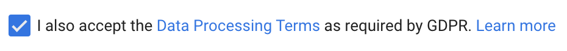
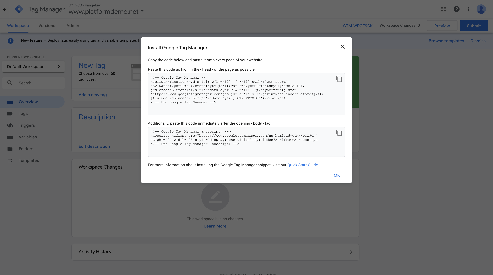
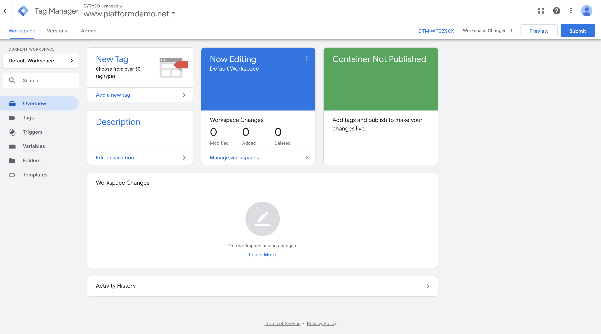

# Exercise 9.1 - Create a Google Tag Manager Property

Go to [https://tagmanager.google.com/](https://tagmanager.google.com/) and login with your Google Account.

Click ``Create Account`` to setup your GTM property.

This will bring you to this form.

Fill in these details:

| Form field                | Value               |
|:-------------------------------------------| :------------------ |
|Account Name|SYTYCD - **ldap**|
|Country|Choose the country where you work, or where your demowebsite runs|
|Container name|www.platformdemo.net|
|Target platform|Web|

After filling in the details your screen should look like this

Click ``Create``

This brings you to the screen where you'll have to accept the terms.

Check the checkbox for ``I also accept the Data Processing Terms as required by GDPR. Learn more``.

Click ``Yes``.

Accepting the terms brings you to the screen where you can copy the code for Google tag Manager to run on your website. You can disregard this for now as we'll do this in a later exercise.

Click OK.

After clicking OK, you're now seeing the standard GTM homepage.

You can now proceed with the next step, where we'll setup Google Analytics.

Next Step: [Exercise 9.2 - Configure Google Analytics](./ex2.md)

[Go Back to Module 9](./README.md)

[Go Back to All Modules](../../README.md)
