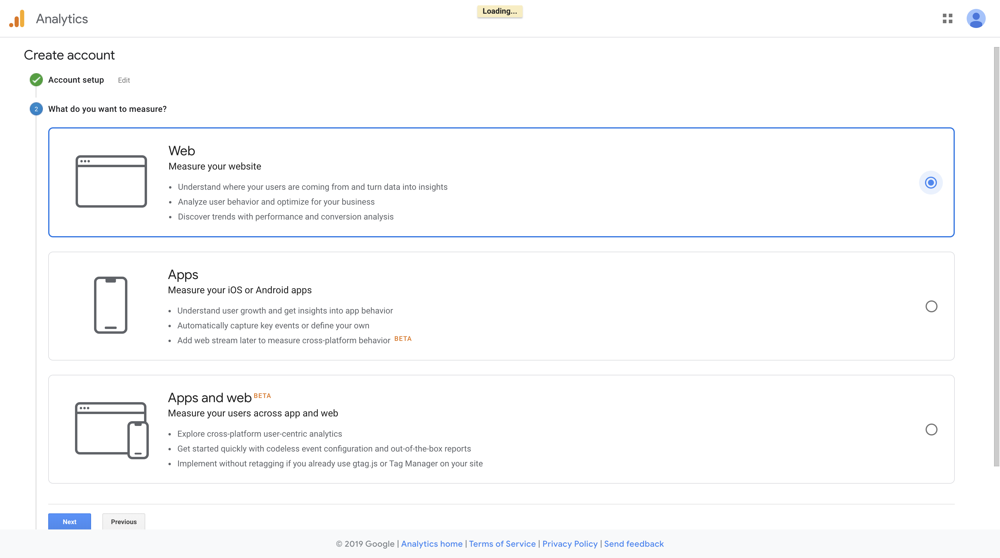
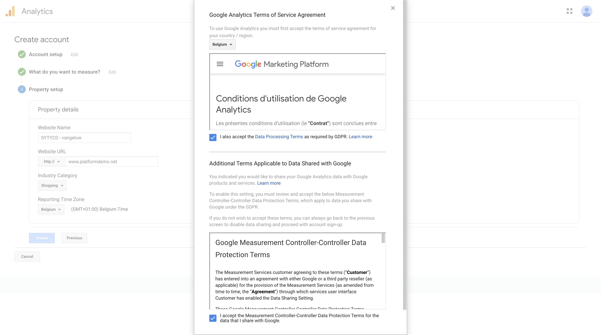
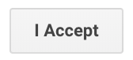
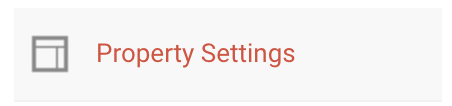
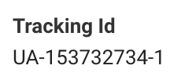
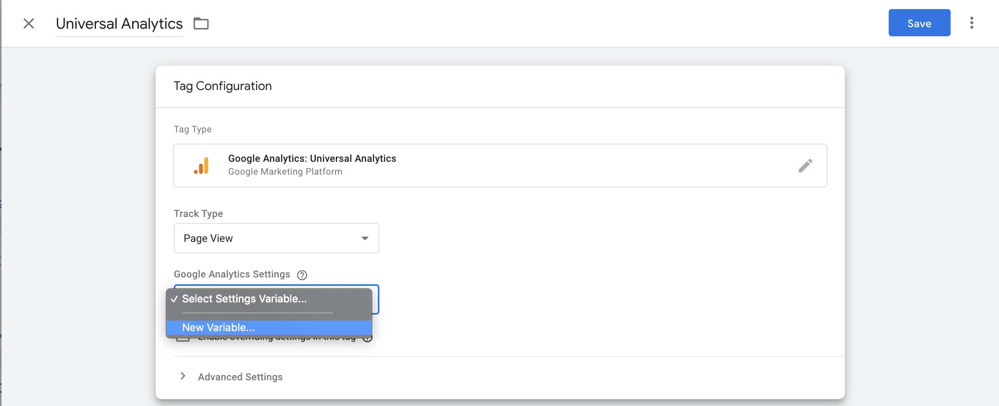
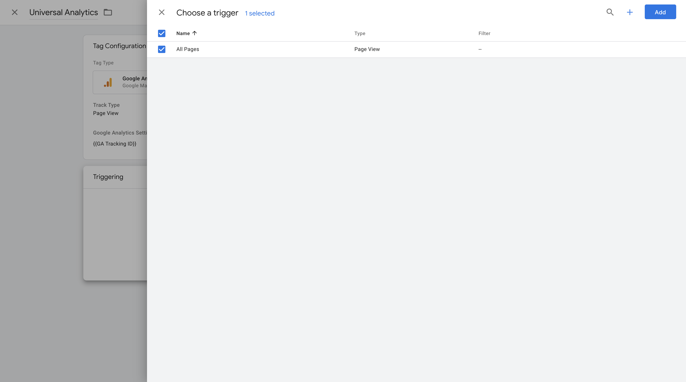
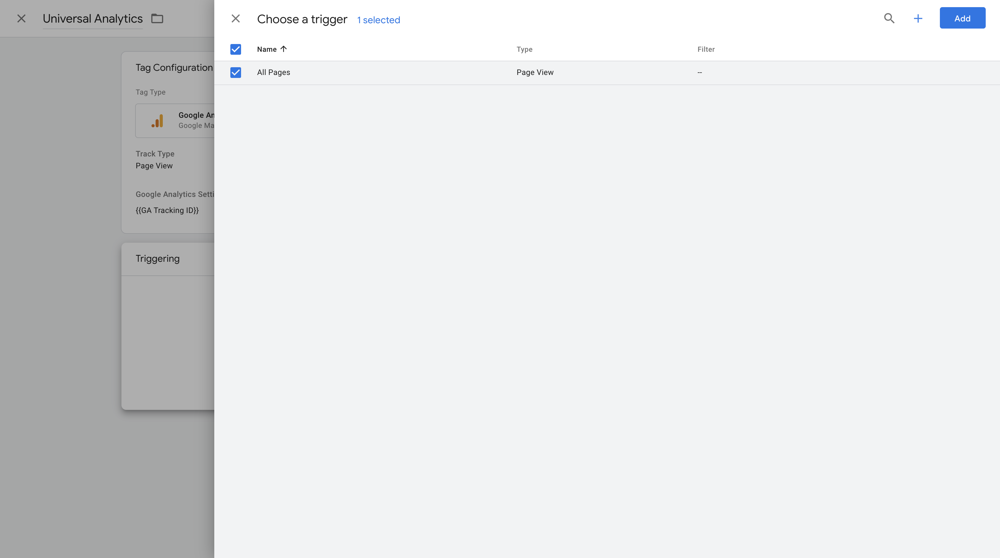
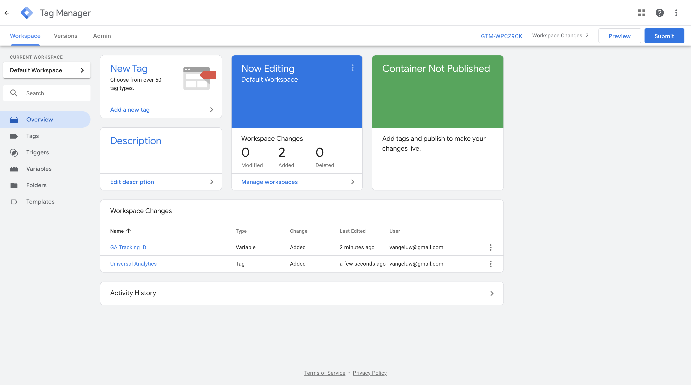

# Exercise 9.2 - Setup Google Analytics & link it to GTM

Go to [https://analytics.google.com/](https://analytics.google.com/) and login with your Google Account.

If this is the first time you do this, your screen will look like this.

Click on ``Start measuring``.

You'll need to fill in some Account details about the website you want to analyze. Please use ``SYTYCD - ldap``, and leave the fields checked, unless you have a specific reason to uncheck them.

Click ``Next`` to proceed to ``What do you want to measure?``.

Select ``Web``.

Click ``Next`` to proceed to ``Property setup``.

You can fill in these fields:

| Form field                | Value               |
|:-------------------------------------------| :------------------ |
|Website Name|SYTYCD - **ldap**|
|Website URL|www.platformdemo.net|
|Industry Category|Shopping|
|Reporting Time Zone|the timezone where you work|

Click ``Create``.

Accept the Terms & Conditions by checking the 2 checkboxes.

Then click ``I accept``.

You'll now see the ``Admin`` - page of your Google Analytics - property.

Click on ``Property Settings``.

You now need to copy the value of ``Tracking ID``.

Google Tag Manager is able to manage the Google Analytics tags by using this Tracking ID.
So let's go back to GTM to store the Tracking ID there.

Go to [https://tagmanager.google.com/](https://tagmanager.google.com/) by following the URL of by clicking the ``Product Switcher`` - item at the top right of the screen.

Next choose Tag Manager at the bottom of the list.

You might need to login again, then choose the container in GTM for ``www.platformdemo.net``.

You are now on the overview page of GTM where nothing has been added yet.

If you're familiar to Adobe Launch you use ``Extensions``, ``Data elements`` and ``Rules``. In GTM you use in more or less the same way ``Tags``, ``Variables`` and ``Triggers``.
We're going to create a ``Tag`` for GA, then a ``Trigger`` when to fire the GA-tag.

Create the tag by clicking ``New Tag``.

You'll then see this screen:

Give this tag a name by changing ``Untitled Tag`` into ``Universal Analytics``:

| Form field                | Value               |
|:-------------------------------------------| :------------------ |
|Tag Name|Universal Analytics|

Then press ``Tag Configuration``, where you can choose from a list of available tags.

Choose ``Google Analytics: Universal Analytics``. You'll then see this screen:

Click the ``Google Analytics Settings`` - dropdown list and choose ``New Variable``.

Then add the following fields:

| Form field                | Value               |
|:-------------------------------------------| :------------------ |
|Track Type|Page View|
|Google Analytics settings|New Variable|

This selection gives you a next screen where you can enter as a Tracking ID the one you copied earlier from Google Analytics.
Name this one ``GA Tracking ID``. By doing that, you've also automatically created a new GTM Variable.

Click ``Save`` to proceed.

You now see the name of the newly created data element appearing. You're now ready with the Tag Configuration, now it's time to tell GTM, that this tag should be triggered on each page view. You do that by clicking the ``Triggering`` element in your screen.

Currently there's only the default trigger ``All Pages``. Later we'll define new triggers for specific pages. Choose this one by selecting it with your mouse.

Your screen will now show a checked box, proceed by clicking ``Add``.

You are now ready to save the Universal Analytics Tag by clicking ``Save``.

You are now again on the overview page, but here you see that there are two changes to be published in the workflow.
Click ``Submit``.

First you see this screen where you can fill in descriptive information about the change you're going to publish. Add a short description and a more describing one.

Now click ``Publish``.

You're then seeing the versions tab in GTM, showing you the summary of what you just published. This will not be active yet, since we have not yet implemented the GTM tag on the SYTYCD-website. We'll be doing that in a later exercise.

From here you can click back to the ``Workspace`` tab, where you can add more Tags, Triggers and Variables, which we'll be doing in the next Exercise.

Next Step: [Exercise 9.3 - Configure GTM Variables](./ex3.md)

[Go Back to Module 9](./README.md)

[Go Back to All Modules](../../README.md)
