# 9.3 Configure GTM Variables

Go to [https://tagmanager.google.com/](https://tagmanager.google.com/) and login with your personal login details.

After creating and configuring the GA Tag, we're now ready to configure GTM Variables (like the Data Elements we use in Adobe Launch).

In the GTM UI, go to **Variables**. You'll see the list of built-in Variables and the one User-Defined Variable we created in the previous exercise.

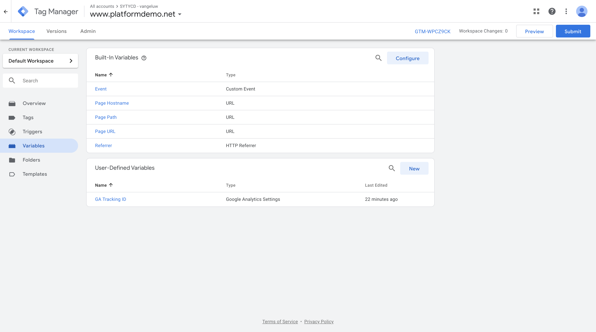

The first Variable we need to add is called **customerEmail**. When a customer creates a profile on the Platform Demo-website, we'll link the customer's email address to his or her customer profile in Platform.
In the Platform Demo-website, information is often stored in localStorage. To access this we need a Custom Javascript to populate the GTM Variable.

In the **User-Defined Variables** - section, click **New**:


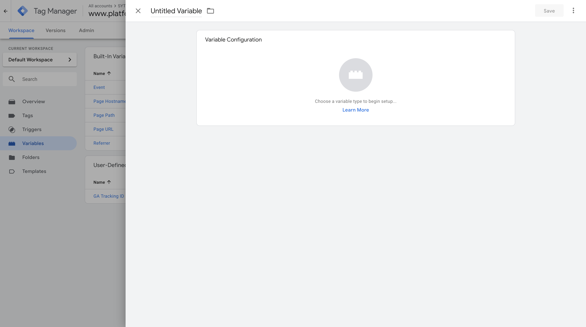

First rename "Untitled Variable" into a more descriptive name:

| Untitled Variable |
| ------------- |
| customerEmail |

Then click in the Configuration part, this lets you choose a variable type.

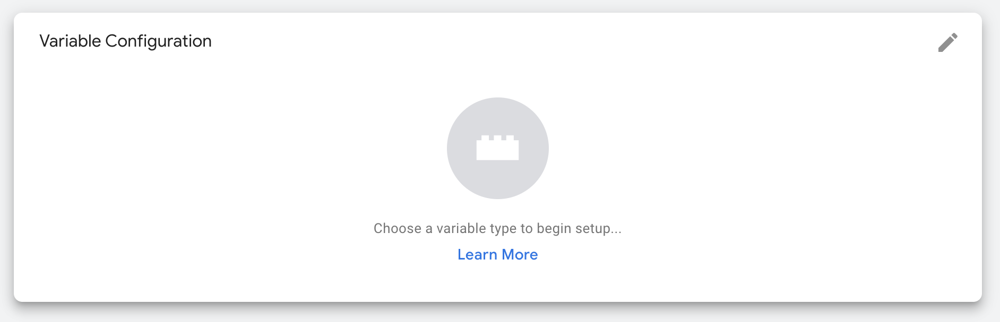

Choose this one.

| Variable Type     |
|-------------|
| Custom Javascript |


This is the custom code to enter in the screen below:

```javascript
function() {
  var email = localStorage.getItem("email");
  return email;
}
```

So after pasting the code your screen looks like this.
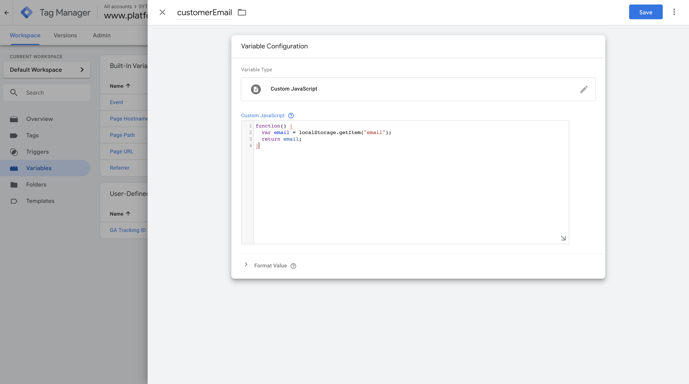

Click **Save** to save your new Variable.


You're screen will look like this.

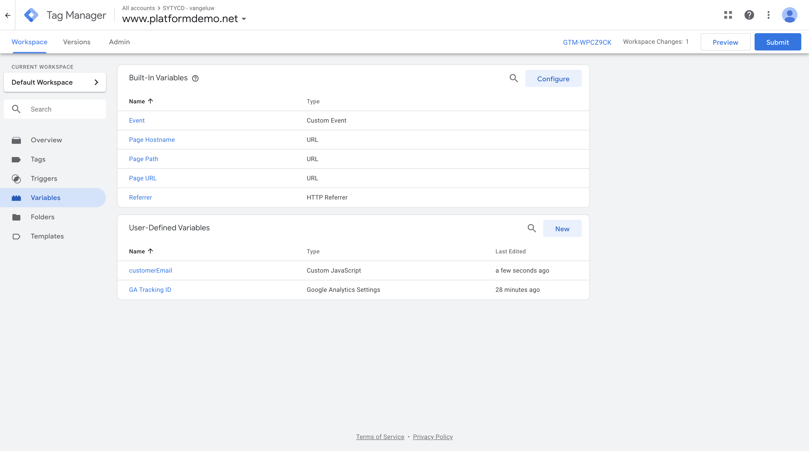

For the next variables, you'll repeat this process:

* In the **User-Defined Variables** - section, click **New**.
* Rename the Untitled Variable
* Select **Custom JavaScript** - Configuration Type
* Paste the Java-Script code
* Click **Save** to save your new Variable.

The next Variable will be **customerMobileNr**. When a customer creates a profile on the SYTYCD website, we'll link the customer's Mobile Number to his or her customer profile in Platform.

In the **User-Defined Variables** - section, click **New**.

* Rename **Untitled Variable** to **customerMobileNr**
* Choose **Custom Javascript** as Variable Type
* Paste this Custom JavaScript code:

```javascript
function() {
  var mobilenr = localStorage.getItem("mobilenr");
  return mobilenr;
}
```

Your screen should look like this.

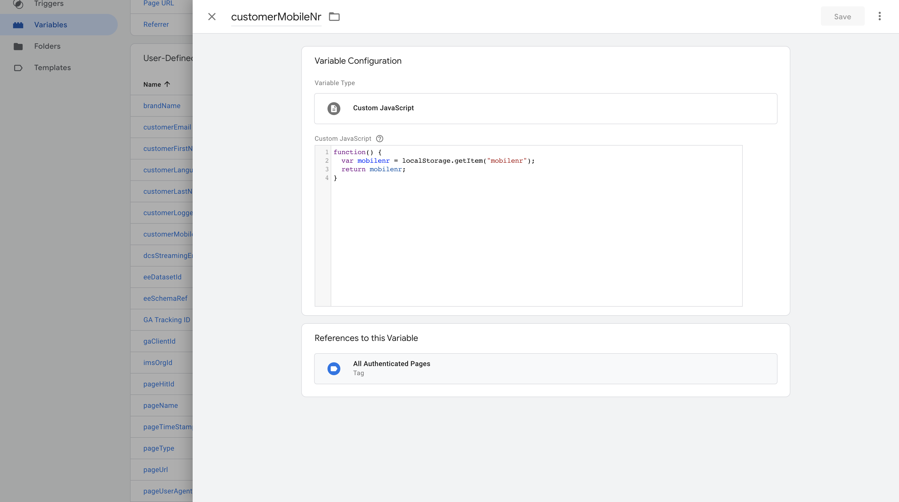

Click **Save** to save your new Variable.


The next Variable will be **customerFirstName**. When a customer creates a profile on the SYTYCD website, we'll link the customer's first name to his or her customer profile in Platform.

In the **User-Defined Variables** - section, click **New**.

* Rename **Untitled Variable** to **customerFirstName**
* Choose **Custom Javascript** as Variable Type
* Paste this Custom JavaScript code:

```javascript
function() {
  var firstname = localStorage.getItem("firstname");
  return firstname;
}
```

Your screen should look like this.

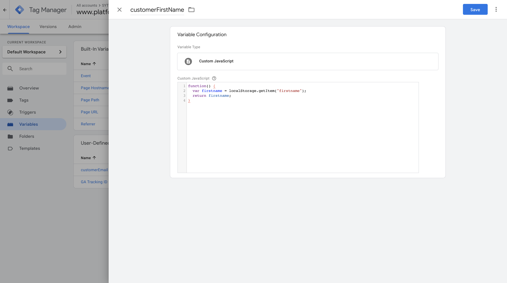

Click **Save** to save your new Variable.


Next: **customerLastName**. When a customer creates a profile on the Platform Demo website, we'll link the customer's last name to his or her customer profile in Platform.

In the **User-Defined Variables** - section, click **New**.

* Rename **Untitled Variable** to **customerLastName**
* Choose **Custom Javascript** as Variable Type
* Paste this Custom JavaScript code:

```javascript
function() {
  var lastname = localStorage.getItem("lastname");
  return lastname;
}
```

Your screen should look like this.

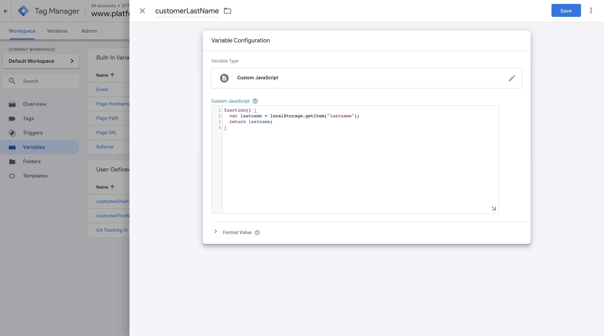

Click **Save** to save your new Variable.


Next: **aepTenantId**. When a customer creates a profile on the Platform Demo website, we'll link the customer's last name to his or her customer profile in Platform.

In the **User-Defined Variables** - section, click **New**.

* Rename **Untitled Variable** to **aepTenantId**
* Choose **Custom Javascript** as Variable Type
* Paste this Custom JavaScript code:

```javascript
function() {
  var aepTenantId = localStorage.getItem("aepTenantId");
  return aepTenantId;
}
```

Your screen should look like this.

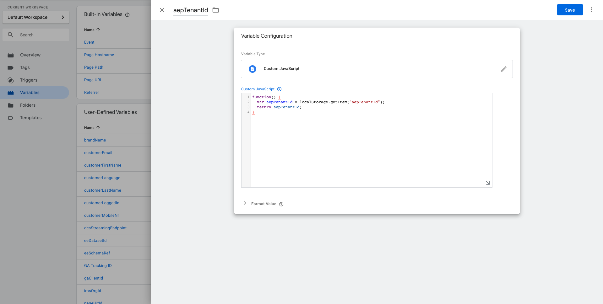

Click **Save** to save your new Variable.


Next: **customerLoggedIn**. When a customer is logged in on the Platform Demo website, we'll set this variable to Yes and use that condition in a Launch Rule configuration.

In the **User-Defined Variables** - section, click **New**.

* Rename **Untitled Variable** to **customerLoggedIn**
* Choose **Custom Javascript** as Variable Type
* Paste this Custom JavaScript code:

```javascript
function() {
  var loggedin = localStorage.getItem("loggedin");
  return loggedin;
}
```

Your screen should look like this.
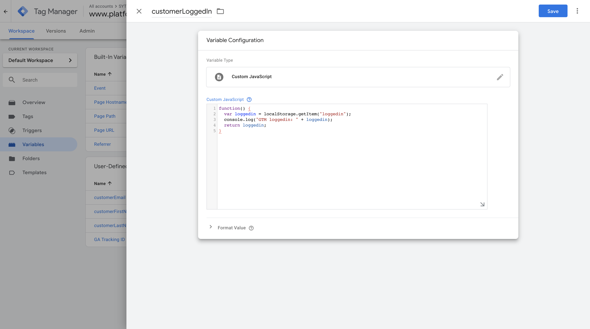

Click **Save** to save your new Variable.


Next: **brandName**. When you select a brand to demo from the **Admin** - menu, the brandName will be sent to Adobe Experience Platform.

In the **User-Defined Variables** - section, click **New**.

* Rename **Untitled Variable** to **brandName**
* Choose **Custom Javascript** as Variable Type
* Paste this Custom JavaScript code:

```javascript
function() {
  var brandName = localStorage.getItem("brandName");
  return brandName;
}
```

Your screen should look like this.
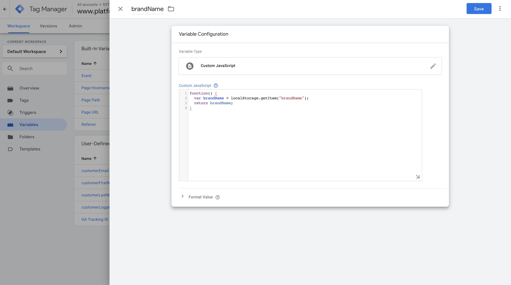

Click **Save** to save your new Variable.


The next Variables will be created in the same process, but with a little different code.

The next Variable we need is called **productProductView**. When a customer view a product, this Variable will store the product view information.

In the **User-Defined Variables** - section, click **New**.

* Rename **Untitled Variable** to **productProductView**
* Choose **Custom Javascript** as Variable Type
* Paste this Custom JavaScript code:

```javascript
function() {
  var productview = JSON.parse(localStorage.getItem("thisProductView"));
  return productview;
}
```

Your screen should look like this.

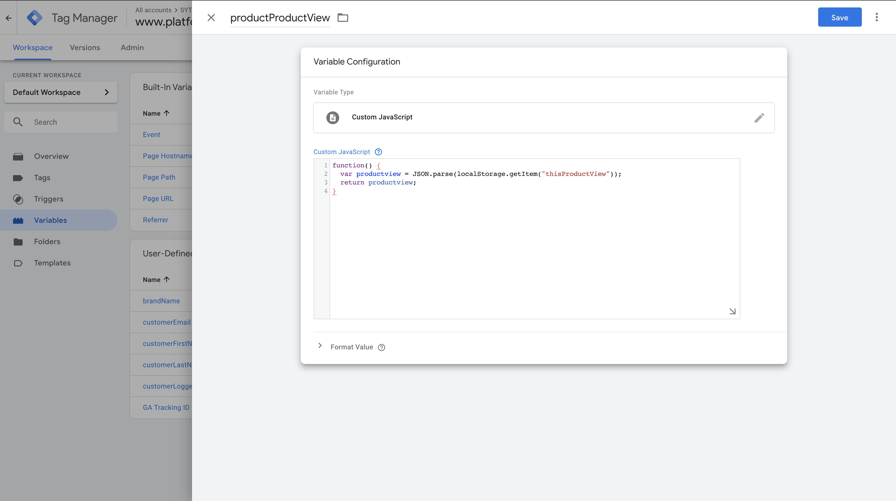

Click **Save** to save your new Variable.


The next Variable is called **return1**. We'll use this Variable to return a Number-value of 1 when needed.

In the **User-Defined Variables** - section, click **New**.

* Rename **Untitled Variable** to **return1**
* Choose **Custom Javascript** as Variable Type
* Paste this Custom JavaScript code:

```javascript
function() {
  return 1;
}
```

Your screen should look like this.

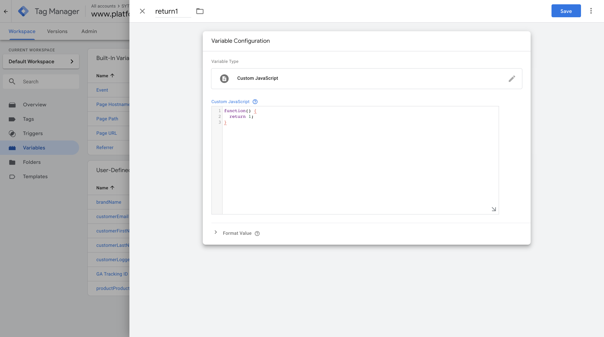

Click **Save** to save your new Variable.


Had we worked with Adobe applications, we would have to capture the ECID. Since we will showcase, that we can also do this with a **Google-only** approach to platform we'll store a unique Google identifier, from Google Analytics. We'll assign the value of the client-side id to this Variable.

The next Variable is called **gaClientId**. We'll use this Variable to as a key for all Google Analytics data.

In the **User-Defined Variables** - section, click **New**.

* Choose **1st-Party Cookie** as Variable Type

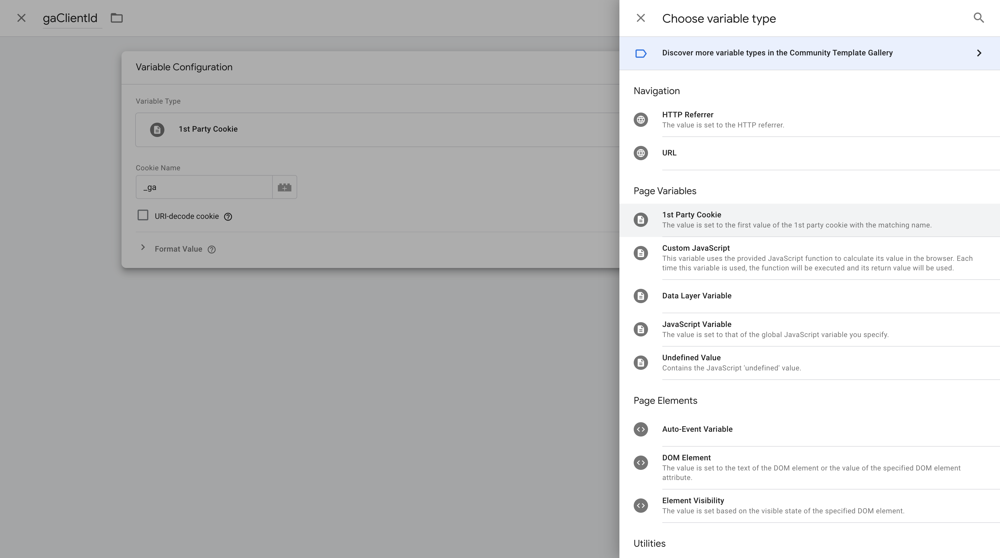

* Choose **_ga** as Cookie Name

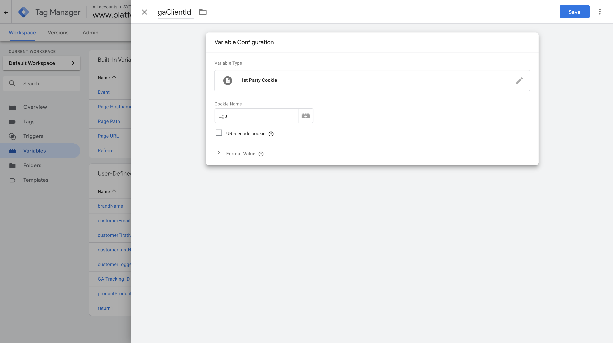

Click **Save** to save your new Variable.


Next: **pageTimeStamp**. We need a unique timestamp on every call to Platform.

In the **User-Defined Variables** - section, click **New**.

* Rename **Untitled Variable** to **pageTimeStamp**
* Choose **Custom Javascript** as Variable Type
* Paste this Custom JavaScript code:

```javascript
function() {
var date = new Date();

var month = date.getUTCMonth();
var day = date.getUTCDate();
var hour = date.getUTCHours();
var min = date.getUTCMinutes();
var sec = date.getUTCSeconds();

month = (month < 9 ? "0" : "") + (month+1);
day = (day < 10 ? "0" : "") + day;
hour = (hour < 10 ? "0" : "") + hour;
min = (min < 10 ? "0" : "") + min;
sec = (sec < 10 ? "0" : "") + sec;

var str = date.getFullYear() + "-" + month + "-" + day + "T" +  hour + ":" + min + ":" + sec + "Z";

return str;
}
```

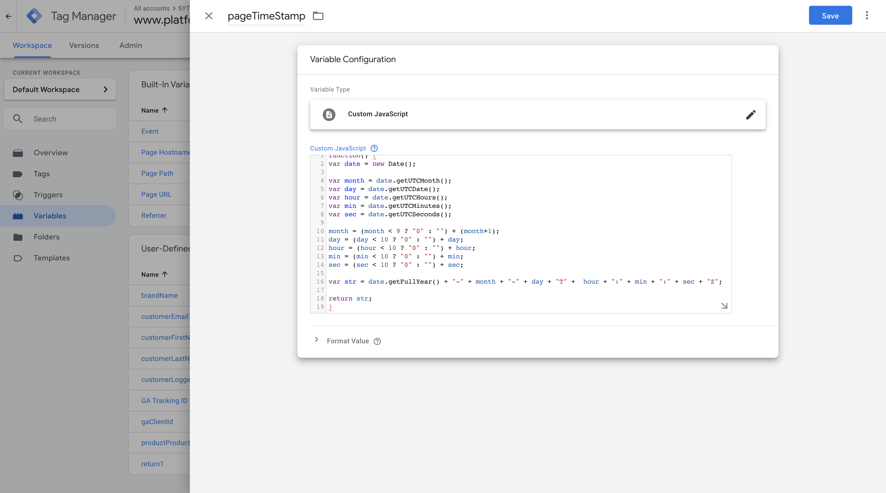

Click **Save** to save your new Variable.


Next: **pageHitId**. We need a unique HitId on every call to Platform.

In the **User-Defined Variables** - section, click **New**.

* Rename **Untitled Variable** to **pageHitId**
* Choose **Custom Javascript** as Variable Type
* Paste this Custom JavaScript code:

```javascript
function() {
  var min = 111111111;
  var max = 9999999999999;
  var randomNumber = Math.random() * (max - min) + min;
  return String(randomNumber);
}
```

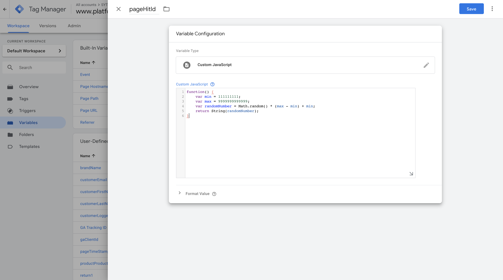

Save your code fragment and then click **Save** again to save your Variable configuration.


Next we'll be capturing some Variables that are available to GTM without custom code, by referencing JavaScript objects.

To do that, follow these four steps:

In the **User-Defined Variables** - section, click **New**.

* Rename the **Untitled Variable**
* Choose **JavaScript Variable** as Variable type
* Enter the JavaScript Variable name
* Click **Save** to save your new Variable.

First: **customerLanguage**. We'll capture the customer's preferred language by taking it from the browser's settings.

In the **User-Defined Variables** - section, click **New**.

* Rename the **Untitled Variable** to **customerLanguage**.
* Choose  **JavaScript Variable** as Variable type.

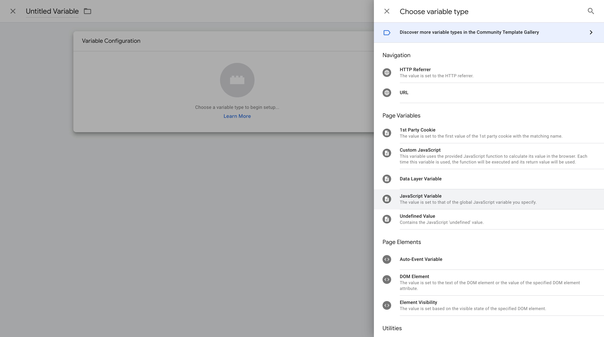

* Enter the JavaScript Variable name: **navigator.language**.
Your screen should now look like this:

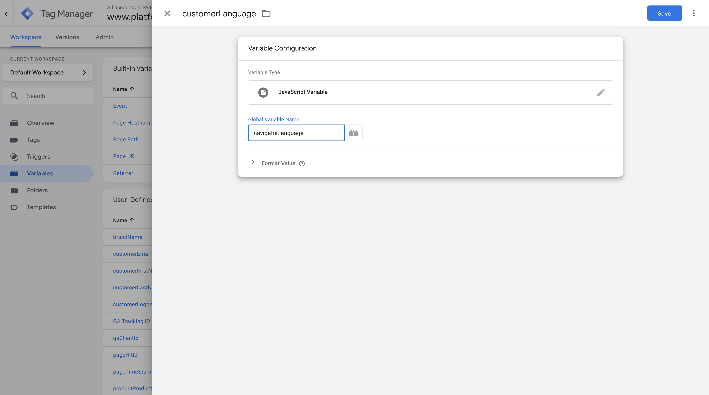

* Click **Save** to save your new Variable.


Next: **pageType**. On every new page load, we need to capture the type of the page.

In the **User-Defined Variables** - section, click **New**.

* Rename the **Untitled Variable** to **pageType**.
* Choose  **JavaScript Variable** as Variable type.
* Enter the JavaScript Variable name: **digitalData.category.siteSection**.

Your screen should now look like this:
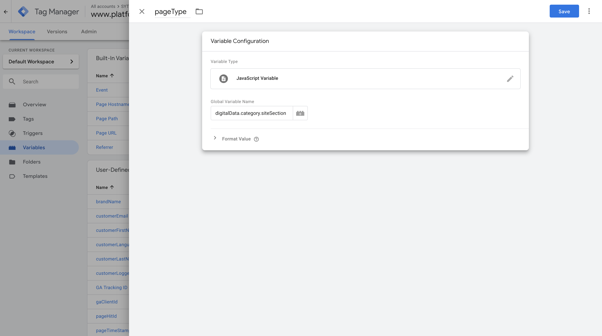

* Click **Save** to save your new Variable.


Next: **productCategory**. For every product view, we need to capture the product's category and send it to Platform.

In the **User-Defined Variables** - section, click **New**.

* Rename the **Untitled Variable** to **productCategory**.
* Choose  **JavaScript Variable** as Variable type.
* Enter the JavaScript Variable name: **digitalData.product.category**.

Your screen should now look like this:
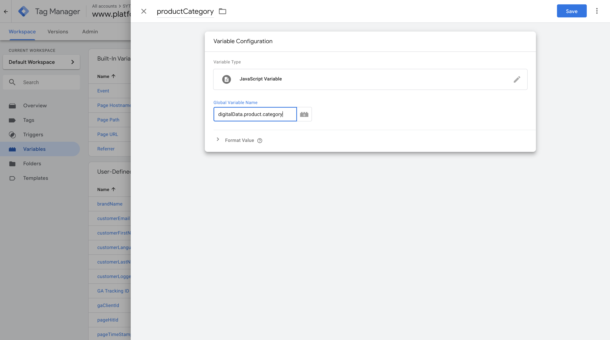

* Click **Save** to save your new Variable.


Next: **productName**. For every product view, we need to capture the product's name and send it to Platform.

In the **User-Defined Variables** - section, click **New**.

* Rename the **Untitled Variable** to **productName**.
* Choose  **JavaScript Variable** as Variable type.
* Enter the JavaScript Variable name: **digitalData.product.name**.

Your screen should now look like this:


* Click **Save** to save your new Variable.


Next: **productPrice**. For every product view, we need to capture the product's price and send it to Platform.

In the **User-Defined Variables** - section, click **New**.

* Rename the **Untitled Variable** to **productPrice**.
* Choose  **JavaScript Variable** as Variable type.
* Enter the JavaScript Variable name: **digitalData.product.price**.

Your screen should now look like this:


* Click **Save** to save your new Variable.


Next: **productImageUrl**. For every product view, we need to capture the product's image URL and send it to Platform.

In the **User-Defined Variables** - section, click **New**.

* Rename the **Untitled Variable** to **productImageUrl**.
* Choose  **JavaScript Variable** as Variable type.
* Enter the JavaScript Variable name: **digitalData.product.imageUrl**.

Your screen should now look like this:
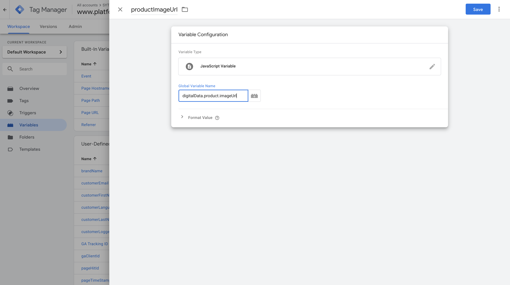

* Click **Save** to save your new Variable.


Next: **productInteraction**. For every product view, we need to capture the type of interaction (View, Add To Cart, Purchase, etc) and send it to Platform.

In the **User-Defined Variables** - section, click **New**.

* Rename the **Untitled Variable** to **productInteraction**.
* Choose  **JavaScript Variable** as Variable type.
* Enter the JavaScript Variable name: **digitalData.product.interaction**.

Your screen should now look like this:


* Click **Save** to save your new Variable.


Next: **pageUserAgent**. For every page view, we need to capture the user device type and Operating System and send it to Platform. We use the User Agent to derive this information. More info on User Agent can be found here: [https://en.wikipedia.org/wiki/User_agent](https://en.wikipedia.org/wiki/User_agent)

In the **User-Defined Variables** - section, click **New**.

* Rename the **Untitled Variable** to **pageUserAgent**.
* Choose  **JavaScript Variable** as Variable type.
* Enter the JavaScript Variable name: **navigator.userAgent**.

Your screen should now look like this:


* Click **Save** to save your new Variable.


Almost done, now time for : **pageName**. On every new page load, we need to capture the page name and send it to AA, AAM and Platform.

In the **User-Defined Variables** - section, click **New**.

* Rename the **Untitled Variable** to **pageName**.
* Choose  **JavaScript Variable** as Variable type.
* Enter the JavaScript Variable name: **document.title**.

Your screen should now look like this:
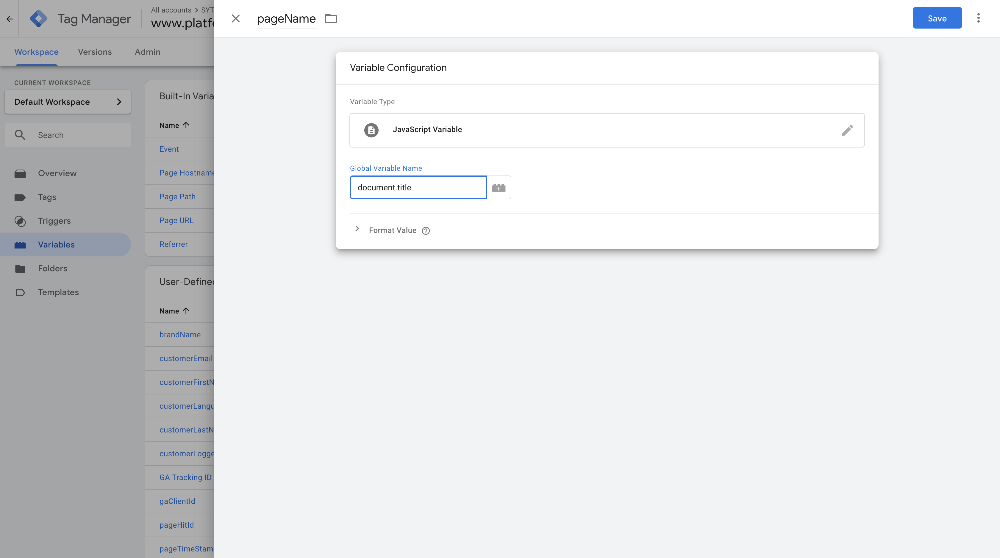

* Click **Save** to save your new Variable.


And the final one:: **pageUrl**. On every new page load, we need to capture the URL to send it to other solutions.
Page URL is already a built-in variable in GTM, so we do not really need to define this. But for consistency with other information on Platform we'll define pageUrl anyway.

In the **User-Defined Variables** - section, click **New**.

* Rename the **Untitled Variable** to **pageUrl**.
* Choose  **URL** as Variable type.

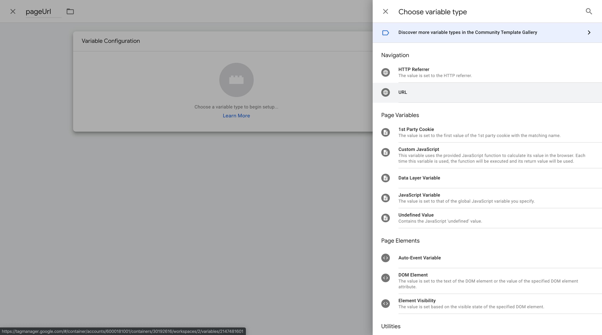

Your screen should now look like this:
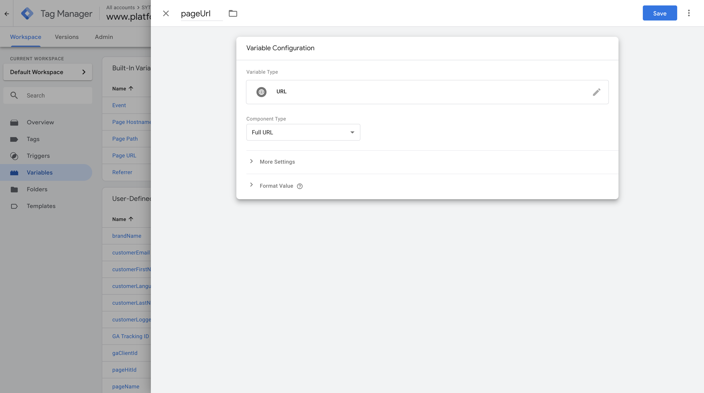

* Click **Save** to save your new Variable.


You've finished configuring all required GTM Variables!

Next Step: [9.4 Retrieve Platform Datasets](./ex4.md)

[Go Back to Module 9](./data-ingestion-using-google-tag-manager-and-google-analytics.md)

[Go Back to All Modules](../../overview.md)
