# Exercise 9.7 - Implement GTM Tag on SYTYCD website

Go to [https://tagmanager.google.com/](https://tagmanager.google.com/) and login with your personal login details.

In the GTM UI, navigate to the menu option ``Admin``.

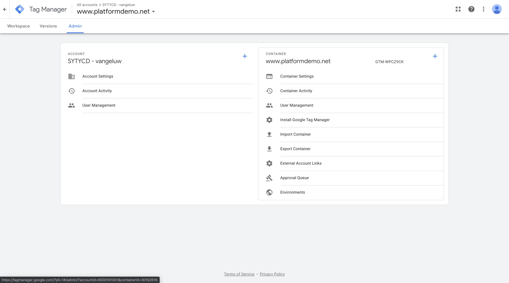

Go to ``Install Google Tag Manager``.

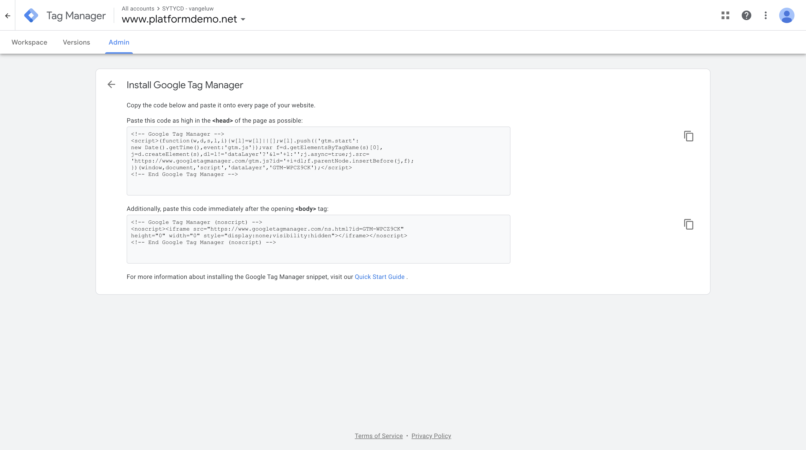

You now see 2 code fragments that need to be implemented on your SYTYCD - website.
The first code fragments needs to be implemented in the ``<head>`` - section of the website, the second code fragments needs to be implemented in the ``<body>`` - section of the website.

To do this dynamically without having to change every individual web page, we created 2 JavaScript files that are part of the SYTYCD - website. These 2 files are named ``launch.js`` (which you've used before as part of Modulles 1-2-3) and ``tags_body.js`` (which is a new file).

You'll now need to copy some pieces (not all) of these 2 GTM code fragments into those 2 JavaScript - files.

You can find these files in your SYTYCD-website directory in the folder ``js``.

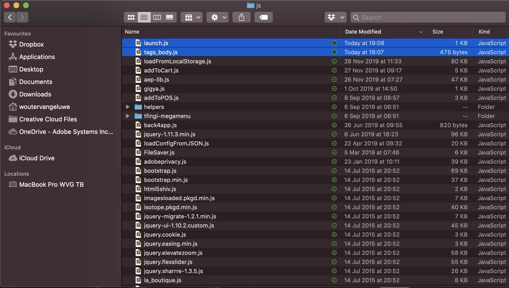

First of all, copy the first code fragment.

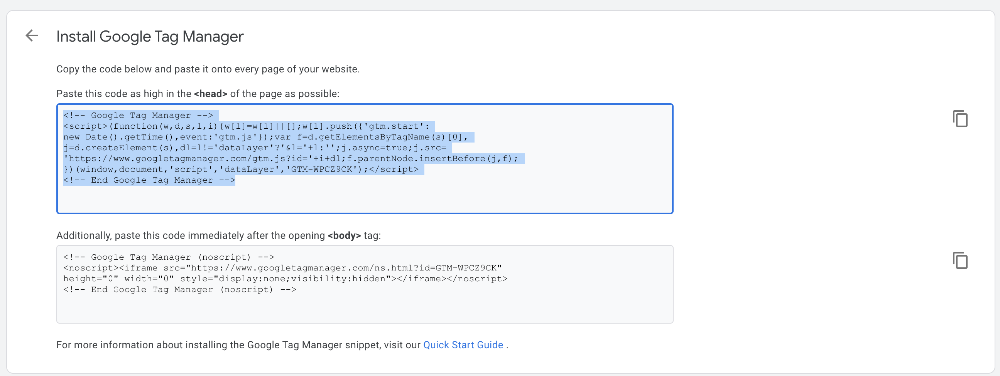

Open a new empty text file in your preferred Text Editor. Paste the code you copied in that new Text Editor file.

You now need to remove a number of elements.

* On line 1, delete the text ``<!-- Google Tag Manager -->``.
* On line 2, delete the text ````.
* On line 7, delete the text ``<!-- End Google Tag Manager -->``.

You now have this result:

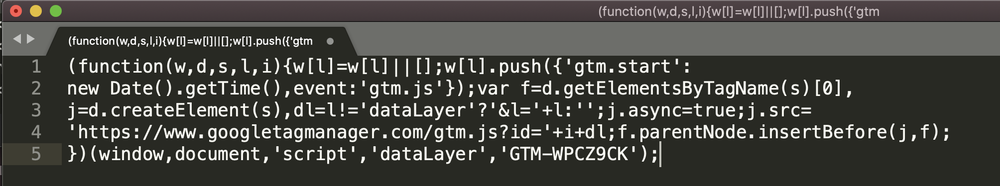

Next, you need to make sure that all this text is part of the same line. There cannot be any line breaks.
This means:

* On line 5, set your cursor to the first position before ``}`` and click backspace.
* On line 4, set your cursor to the first position before ``'`` and click backspace.
* On line 3, set your cursor to the first position before ``j`` and click backspace.
* On line 2, set your cursor to the first position before ``n`` and click backspace.

You now have this result:

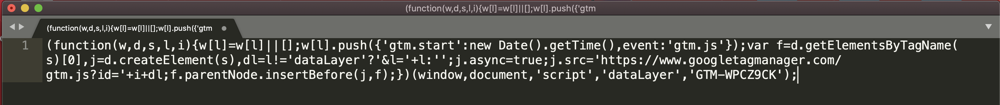

Select everything in this file and copy it.

Now open the file ``launch.js`` which you can find in the folder ``js`` in your SYTYCD-website directory. The file looks like this:

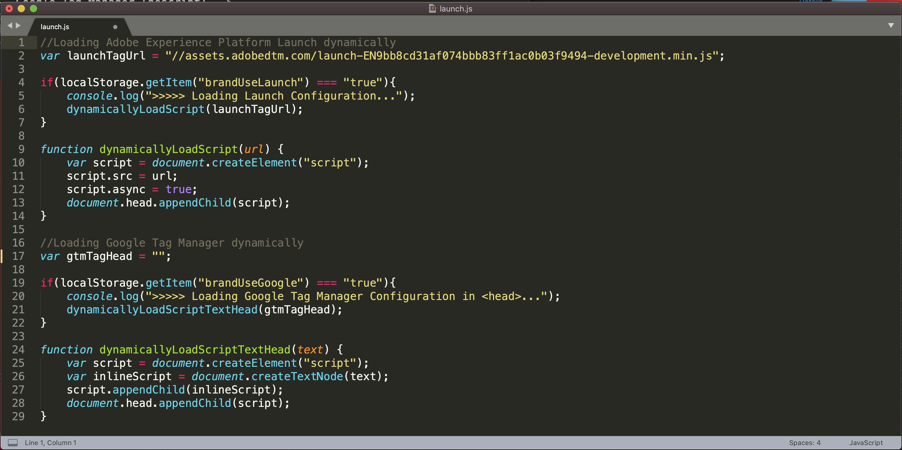

On line 17, you see ``var gtmTagHead = "";``

Set your cursor between the 2 quotes and paste the GTM Tag that you just copied.

Your ``launch.js`` - file and line 17 should now look like this:

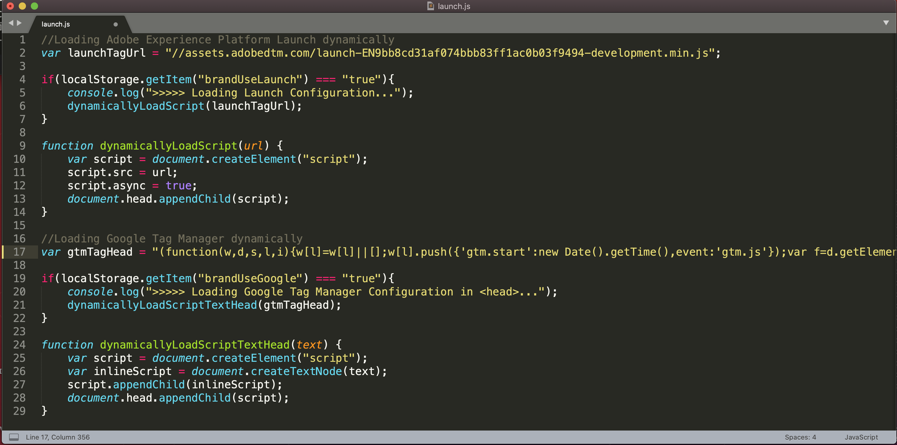

Save your changes in the ``launch.js`` - file.

Next, go back to GTM.

Copy the second code fragment.

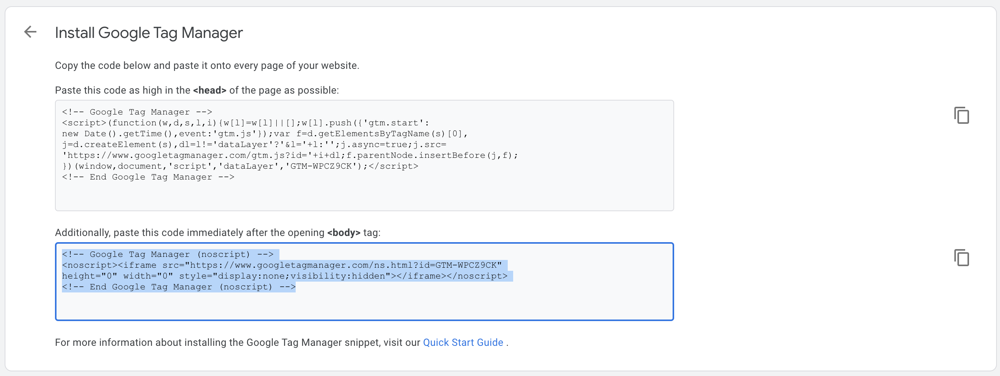

Open a new empty text file in your preferred Text Editor. Paste the code you copied in that new Text Editor file.

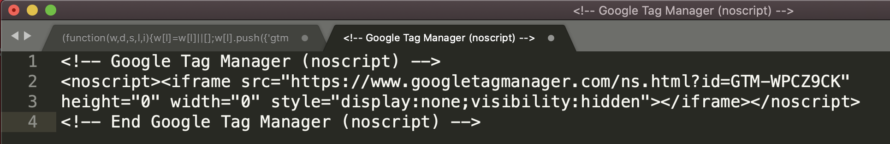

You now need to remove a number of elements and basically, you only need to keep the iframe src URL. Everything else can be deleted.

You now have this result:

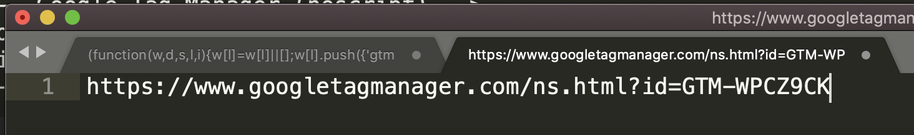

Select everything in this file and copy it.

Now open the file ``tags_body.js`` which you can find in the folder ``js`` in your SYTYCD-website directory. The file looks like this:

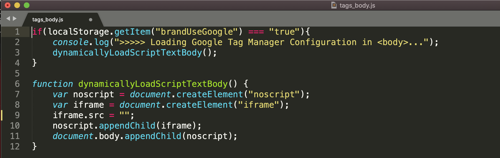

On line 9, you see ``iframe.src = "";``

Set your cursor between the 2 quotes and paste the GTM Tag that you just copied.

Your ``tags_body.js`` - file and line 9 should now look like this:

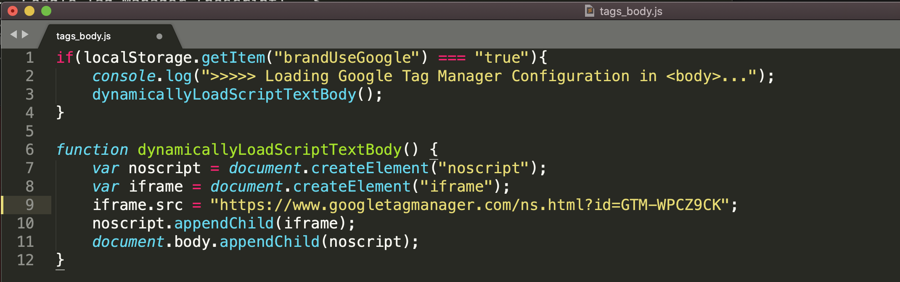

Save your changes in the ``tags_body.js`` - file.

FYI: in the ``iframe.src`` - tag, you can find your **GTM Container ID**. In this example, the GTM Container ID is ``GTM-WPCZ9CK``.

After this change, your website and configuration are ready for Production!

Next Step: [Exercise 9.8 - Activate GTM-tag in SYTYCD Admin](./ex8.md)

[Go Back to Module 9](./data-ingestion-using-google-tag-manager-and-google-analytics.md)

[Go Back to All Modules](../../README.md)
