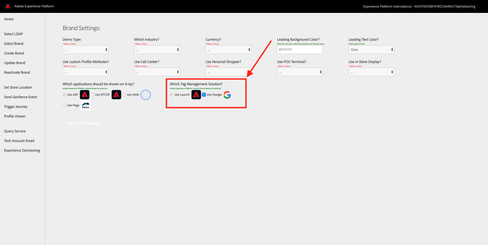

# Exercise 9.8 - Activate GTM-tag in SYTYCD Admin

After implementing the GTM Tag on your website, you should control the behavior of the GTM Tag for your custom demo brands.

Generic Demo Brands will automatically load the GTM Tag and send calls to Adobe Experience Platform, so when you load any of the generic Demo Brands, no additional action is needed to have calls sent to Adobe Experience Platform using your GTM Tag configuration.

When you create a custom Demo Brand, you can now configure the activation of your GTM Configuration in the ``Create Brand`` - menu.

By checking the checkbox for ``Use Google``, you'll make sure that the GTM Tag will be loaded and send calls to Adobe Experience Platform.

Next Step: [Exercise 9.9 - Verify Data Ingestion from website into Platform](./ex9.md)

[Go Back to Module 9](./README.md)

[Go Back to All Modules](../../README.md)
