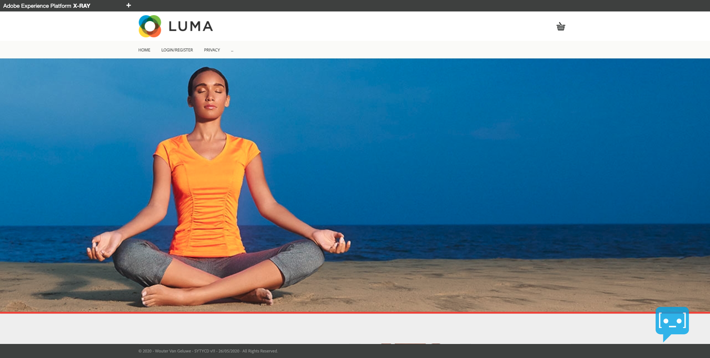

# Comprehensive Technical Tutorial for Adobe Experience Platform

## Overview

This tutorial is the perfect starting point for Data Engineers, Data Analysts, Data Architects, Data Scientists, Orchestration Engineers and Marketers to gain a full understanding of the business value of Adobe Experience Platform and all of its Application Services. Each lesson focuses on a real challenge businesses face in today's complex ecosystem of personalization, and breaks down the solution to that challenge in various hands-on instructions.

This tutorial is very diverse and offers clear insights in the following applications:

- Adobe Experience Platform
- Adobe Experience Platform Launch
- Real-time CDP
- Journey Orchestration
- Customer Journey Analytics
- Offer Decisioning

This tutorial doesn't just focus on Adobe applications, but takes into account the broader ecosystem in which brands operate. This means that in several of these lessons, there's a lot of focus on how non-Adobe applications integrate with Adobe Experience Platform. As such, you'll gain a deep understanding in how the following applications will work together with Adobe Experience Platform:

- Amazon: AWS Lambda, AWS S3, AWS Kinesis, AWS SQS, Alexa
- Google: Google Tag Manager, Google Analytics, Google Cloud Platform, Google BigQuery
- Microsoft: Azure EventHub, Azure Blob Storage, Dynamics 365, ...
- Apache Kafka
- Postman
- Informatica
- Stackchat
- ...

After completing this tutorial, you will be able to:

- Configure Schemas, Mixins, Datasets, Identifiers
- Configure a Launch property and setup the new WebSDK extension in Launch
- Stream data into Adobe Experience Platform in real-time using Launch, Google Tag Manager or Amazon Alexa
- Batch ingest data into Adobe Experience Platform using a workflow or by using an ETL application
- Visualize and use the Real-time Customer Profile in Adobe Experience Platform
- Create segments
- Consume several Adobe Experience Platform APIs
- Use SQL to query your data in Adobe Experience Platform
- Configure, Train and Score Machine Learning Models in Adobe Experience Platform
- Use Journey Orchestration to configure real-time, trigger-based journeys
- Use Real-time CDP to take action by activating a segment to various destinations
- Use Customer Journey Analytics to report on omnichannel customer data from various sources, including Google BigQuery

## Prerequisites

- Access to Adobe Experience Platform: [https://platform.adobe.com](https://platform.adobe.com)
- Access to Adobe Experience Platform Launch: [https://launch.adobe.com](https://launch.adobe.com)
- Access to an AEP demo website
- This documentation has been created to facilitate hands-on, technical enablement around Adobe Experience Platform. In order to complete some of the modules, you'll need to change some variables and replace them by your specific **Environment Variables**. Please contact your Adobe contact who will provide you with the required **Environment Variables** of your specific Adobe Experience Platform instance.

>[!NOTE]
>
>If you don't have access to your own Adobe Experience Platform instance, don't let it stop you! You'll still learn a lot by reading through these very detailed tutorials.

## About this tutorial

In these lessons, you will implement Adobe Experience Platform and Application Services into an AEP Demo website which supports multiple demo industries. The AEP Demo website and mobile app have a rich data layer and functionality that will allow you to build a realistic implementation. It provides access to demo brands such as **Luma Retail**, **Luma News**, **Luma Insurance**, **Luma Car** and several others. You will build your own Launch property, in your own Experience Cloud organization, and map it to our hosted AEP Demo website using the Experience Cloud Debugger. This will then generate data that is sent into your own Adobe Experience Platform instance.

## Architecture

Before you start with the hands-on exercises, have a look at the Architecture behind this tutorial. As you can see in the above Overview, this tutorial will go deep on a number of features and functionalities of Adobe Experience Platform, but will also discuss multiple integrations across a variety of Sources and Destinations. In order for you to properly understand the architecture behind this tutorial and the overall positioning of Adobe Experience Platform into your Enterprise ecosystem, start by reviewing the architecture video and diagram.

Go to [Architecture](./architecture.md).

## Content

[1. Foundation - Setup of Launch & WebSDK](./modules/module1/data-ingestion-launch-websdk.md)

- **Audience:** Data Engineer, Data Architect
- **Prerequisites:** Access to Adobe Experience Platform and Adobe Experience Platform Launch
- **Description:** In this foundational module the focus is on configuring Launch by making use of the new WebSDK extension and implementing Launch on the AEP Demo website.
- **Time Investment:** 120 minutes

[2. Foundation - Data Ingestion](./modules/module2/data-ingestion.md)

- **Audience:** Data Engineer, Data Architect
- **Prerequisites:** Access to Adobe Experience Platform and Adobe Experience Platform Launch
- **Description:** In this foundational module the focus is on data ingestion by making use of the website
- **Time Investment:** 120 minutes

[3. Foundation - Real-time Customer Profile](./modules/module3/real-time-customer-profile.md)

- **Audience:** Data Engineer, Data Architect, Marketer
- **Prerequisites:** Access to Adobe Experience Platform and Postman
- **Description:** In this foundational module you'll be exploring the Real-time Customer Profile in Adobe Experience Platform by making use of the UI and API.
- **Time Investment:** 90 minutes

[4. Voice Assistant - Amazon Alexa](./modules/module4/data-ingestion-amazon-alexa.md)

- **Audience:** Developer
- **Prerequisites:** Access to Adobe Experience Platform, AWS Lambda and Amazon Alexa
- **Description:** In this module you'll add an Amazon Alexa Skill to your live demo environment.
- **Time Investment:** 60 minutes

[5. Extract, Transform, Load data using a 3rd party ETL-tool](./modules/module5/data-ingestion-informatica-etl.md)

- **Audience:** Data Engineer, Data Architect
- **Prerequisites:** Access to Adobe Experience Platform, Informatica ETL
- **Description:** In this module you'll use an ETL-tool to extract, transform and load data in Adobe Experience Platform.
- **Time Investment:** 60 minutes

[6. Journey Orchestration](./modules/module6/journey-orchestration-create-account.md)

- **Audience:** Data Engineer, Data Architect, Orchestration Engineer
- **Prerequisites:** Access to Adobe Experience Platform, Journey Orchestration and Adobe Campaign with Platform (on Azure)
- **Description:** In this module you'll use Journey Orchestration to build out a trigger-based journey.
- **Time Investment:** 60 minutes

[7. Query Service](./modules/module7/query-service.md)

- **Audience:** Data Engineer, Data Architect, Data Analyst, BI Expert
- **Prerequisites:** Access to Adobe Experience Platform, Query Service, Power BI or Tableau
- **Description:** In this module you'll learn how to use Adobe Experience Platform Query Service.
- **Time Investment:** 90 minutes

[8. Data Science Workspace - Popularity Based Recommendations](./modules/module8/data-science-workspace-popularity-based-recommendations.md)

- **Audience:** Data Engineer, Data Architect, Data Scientist
- **Prerequisites:** Access to Adobe Experience Platform and Data Science Workspace
- **Description:** In this module you'll learn how to use Adobe Experience Platform Data Science Workspace to build a Popularity Based Recommendations Recipe.
- **Time Investment:** 90 minutes

[9. Data Ingestion using Google Tag Manager and Google Analytics](./modules/module9/data-ingestion-using-google-tag-manager-and-google-analytics.md)

- **Audience:** Data Engineer, Data Architect
- **Prerequisites:** Access to Adobe Experience Platform, Google Tag Manager and Google Analytics
- **Description:** In this module you'll learn how to use Google Tag Manager to ingest clickstream data in real-time into Adobe Experience Platform.
- **Time Investment:** 90 minutes

[10. Data Science Workspace - Churn Prediction Model](./modules/module10/data-science-workspace-churn-prediction-model.md)

- **Audience:** Data Engineer, Data Architect, Data Scientist
- **Prerequisites:** Access to Adobe Experience Platform, Data Science Workspace
- **Description:** In this module you'll learn basic Data Science concepts, and also, how to use Adobe Experience Platform Data Science Workspace to build a Churn Prediction Model.
- **Time Investment:** 60 minutes

[11. RTCDP - Build a segment and take action](./modules/module11/real-time-cdp-build-a-segment-take-action.md)

- **Audience:** Data Architect, Orchestration Engineer, Marketer
- **Prerequisites:** Access to Adobe Experience Platform, Real-time CDP, Adobe Audience Manager, Adobe Target, AWS S3
- **Description:** In this module you'll configure a segment, enable it for Streaming Segmentation and activate the segment to several destinations, including Google DV360, Google AdWords, Adobe Audience Manager, Adobe Target and S3-destinations like Salesforce Marketing Cloud.
- **Time Investment:** 90 minutes

[12. Journey Orchestration - External Weather API, SMS Action & more](./modules/module12/journey-orchestration-external-weather-api-sms.md)

- **Audience:** Data Engineer, Data Architect, Orchestration Engineer, Marketer
- **Prerequisites:** Access to Adobe Experience Platform, Journey Orchestration, Open Weather API, Twilio
- **Description:** In this module you'll use Journey Orchestration to listen to customer behavior, both online and offline, and respond to it in an intelligent, contextual and real-time way over various channels.
- **Time Investment:** 90 minutes

[13. Customer Journey Analytics (CJA) - Build a dashboard using Analysis Workspace on top of Adobe Experience Platform](./modules/module13/customer-journey-analytics-build-a-dashboard.md)

- **Audience:** Data Engineer, Data Architect, Data Analyst
- **Prerequisites:** Access to Adobe Experience Platform and Customer Journey Analytics
- **Description:** In this module you'll get Online to Offline insights by configuring a dashboard containing omni-channel data like Website Interactions, Mobile App Interactions, Call Center Interactions, In-Store Interactions and much more.
- **Time Investment:** 120 minutes

[14. Offer Decisioning](./modules/module14/offer-decisioning.md)

- **Audience:** Data Engineer, Data Architect, Orchestration Engineer, Marketer
- **Prerequisites:** Access to Adobe Experience Platform and Offer Decisioning
- **Description:** **This module is not available yet.** In this module you'll get a hands-on preview of the Adobe Experience Platform - Offers/Decisioning Service.
- **Time Investment:** 90 minutes

[15. Data Science Workspace - Car Insurance Sales Propensity](./modules/module15/data-science-workspace-car-insurance-sales-propensity.md)

- **Audience:** Data Engineer, Data Architect, Data Scientist
- **Prerequisites:** Access to Adobe Experience Platform, Data Science Workspace, Anaconda
- **Description:** In this module you'll learn basic Data Science concepts, and also, how to use Adobe Experience Platform Data Science Workspace to build a Car Insurance Sales Propensity Model, schedule the model to re-train, and prepare the model for Real-time Scoring.
- **Time Investment:** 120 minutes

[16. Ingest & Analyze Google Analytics data in Adobe Experience Platform with the BigQuery Source Connector](./modules/module16/customer-journey-analytics-bigquery-gcp.md)

- **Audience:** Data Engineer, Data Architect, Data Analyst
- **Prerequisites:** Access to Adobe Experience Platform, Customer Journey Analytics, Google Cloud Platform, Google BigQuery
- **Description:** In this module you'll setup your own instance of Google Cloud Platform, load demo data in Google Cloud Platform and you'll then use the BigQuery Source Connector to ingest that data from Google Cloud Platform into Adobe Experience Platform. Finally, you'll use Customer Journey Analytics to visualize that data.
- **Time Investment:** 120 minutes

>[!NOTE]
>
>Thank you for investing your time in learning all there is to know about Adobe Experience Platform. If you have questions, want to share general feedback of have suggestions on future content, please contact Wouter Van Geluwe directly, by sending an email to **vangeluw@adobe.com**.
