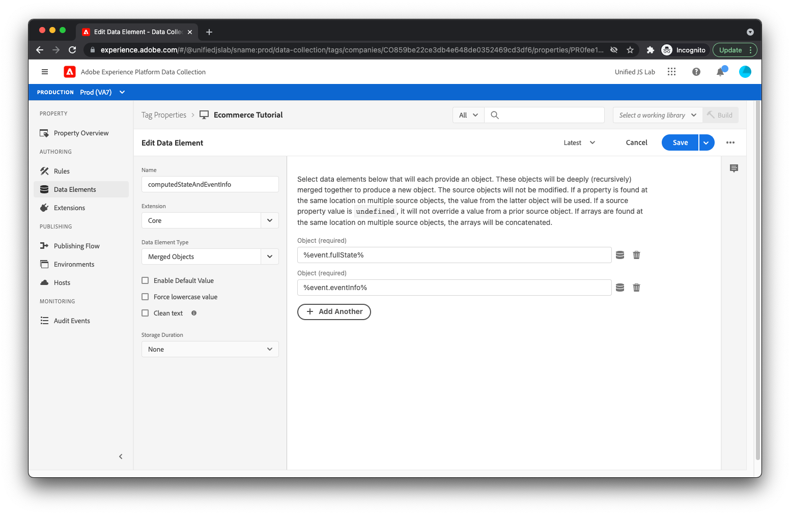
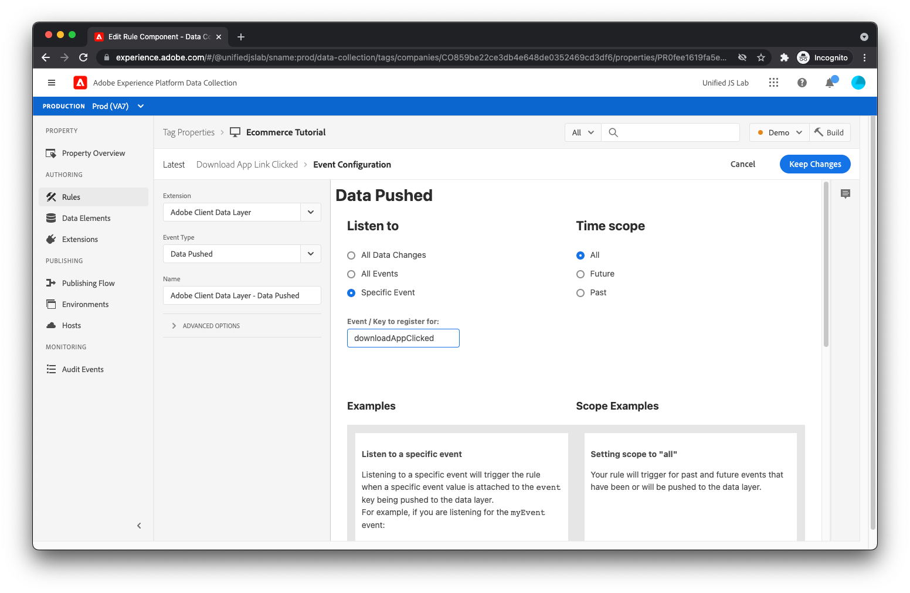

# Create a data element and rule for tracking app downloads

As a reminder, when tracking when a user clicks the [!UICONTROL Download the app] link, you pushed to the data layer as follows:

```js
window.adobeDataLayer.push({
  "event": "downloadAppClicked",
  "eventInfo": {
    "web": {
      "webInteraction": {
        "URL": "https://example.com/download",
        "name": "App Download",
        "type": "download"
      }
    }
  }
});
```

You used the `eventInfo` key, which tells the data layer to communicate this data along with the event, but to _not_ retain the data within the data layer. For a link click, it's not useful to add information about the clicked link to the data layer because it's not applicable to other events that may occur later on the page.

For this implementation, you'll send an experience event to Adobe Experience Platform containing the merged result of (1) the computed state of the data layer and (2) the contents of `eventInfo`.

To do this, you'll first need to create a data element that merges these two chunks of information.

## Create a data element

To create the appropriate data element, click [!UICONTROL Data Elements] in the left-hand menu. Next, click the [!UICONTROL Add Data Element] link.

For the data element name, enter `computedStateAndEventInfo`. For the [!UICONTROL Extension] field, select [!UICONTROL Core] if it isn't selected already. For the [!UICONTROL Data Element Type] field, select [!UICONTROL Merged Objects]. This data element allows you to deeply merge multiple objects. The merged result is returned by the data element.

For the first object you want to include in the merge, enter `%event.fullState%`. When used inside a rule triggered by a [!UICONTROL Data Pushed] rule event, this references the computed state of the Adobe Client Data Layer at the time the rule was triggered.

Click [!UICONTROL Add Another].

For the second object, enter `%event.eventInfo%`. When used inside a rule triggered by a [!UICONTROL Data Pushed] rule event, this references the `eventInfo` portion that was pushed to the Adobe Client Data Layer.



The data element is complete. Save the data element by clicking the [!UICONTROL Save] button.

## Create a rule

To create the rule for tracking clicks on the [!UICONTROL Download the app] link, first click [!UICONTROL Rules] in the left-hand menu.

Click [!UICONTROL Add Rule].

For the rule name, enter _Download app link clicked_.

## Add an event

Click the [!UICONTROL Add] button under [!UICONTROL Events]. You show now be on the event view. For the [!UICONTROL Extension] field, select [!UICONTROL Adobe Client Data Layer]. For the [!UICONTROL Event Type] field, select [!UICONTROL Data Pushed].

Because you only want this rule to be triggered when the `downloadAppClicked` event is pushed to the data layer, select the [!UICONTROL Specific Event] radio under [!UICONTROL Listen to] and type _downloadAppClicked_ into the [!UICONTROL Event / Key to register for]  text field that is displayed.



Click [!UICONTROL Keep Changes].

## Add an action

Now that you're back at the rule view, click the [!UICONTROL Add] button under [!UICONTROL Actions]. You should now be on the action view. For the [!UICONTROL Extension] field, select [!UICONTROL Adobe Experience Platform Web SDK]. For the [!UICONTROL Action Type] field, select [!UICONTROL Send event].

On the right side of the screen, find the [!UICONTROL Type] field and select `web.webinteraction.linkClicks`.

For the [!UICONTROL XDM data] field, click the data element selector button and select [!UICONTROL computedStateAndEventInfo]. This is the data element you just created.

For this rule (unlike the other rules you've created), you will check the [!UICONTROL Document will unload] checkbox. This essentially tells the SDK that the user will be navigating away from the page when they click the link. This is important, because it allows the SDK to make the request in manner that even if the user navigates away from the page, the request will still keep running in the background and reach the server. If this checkbox is unchecked, the request will not be made in this manner and therefore will likely be canceled when the current document unloads.

You may be asking yourself, "That sounds nice. Why isn't this option always enabled then?"

Well, it's a bit complicated, but when using this feature, the SDK uses a browser method called [`sendBeacon`](https://developer.mozilla.org/en-US/docs/Web/API/Navigator/sendBeacon) to send the request. When sending a request using `sendBeacon`, the browser doesn't allow the SDK (or anything else) to access any data returned from the server. If the SDK were to use this feature for every request, the SDK would never be able to receive any data from the server. For this reason, it's important to check the [!UICONTROL Document will unload] checkbox only when the current document will unload, in which case the response data can be discarded anyway.


Save the action by clicking the [!UICONTROL Keep Changes] button.

## Save the rule

Your rule should now be complete.


Save the rule by clicking [!UICONTROL Save].
