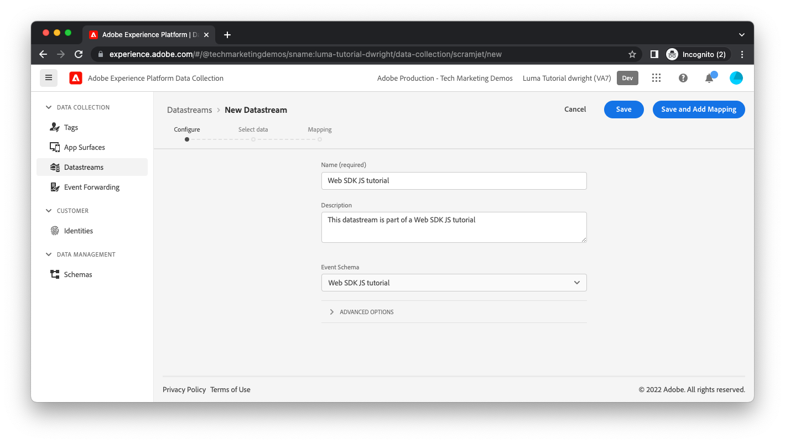

# Create a datastream

The data you send from your website reaches a set of Adobe servers called [Adobe Experience Platform Edge Network](https://business.adobe.com/products/experience-platform/experience-platform-edge-network.html). This network is capable of sending your data to the [Adobe Experience Platform dataset you previously created](create-a-schema.md) and other products within Adobe Experience Cloud. These Adobe products may also respond with data to your web page. For example, Edge Network may return personalization content from Adobe Target.

To configure which Adobe products Edge Network shuttles data to and from, you must create a datastream. When Edge Network receives data from your web page, it consults the datastream you have created, read its configuration, then forward data to the appropriate Adobe products.

To create a datastream, first navigate to the [!UICONTROL Datastreams] view within [!UICONTROL Data Collection]. Click [!UICONTROL Create Datastream] in the top-right corner. Provide a name for the datastream.

The next screen allows you to configure which Adobe products should receive the data you send from your website. For the purposes of this tutorial, enable only Adobe Experience Platform, select the dataset you previously created (which will be in the default [!UICONTROL Prod] sandbox), and click [!UICONTROL Save].

Your datastream has been created.

## Datastream environments

Companies typically have a promotion path for any website updates. Someone at the company (a marketer or engineer, depending on the changes) typically tests out their changes in a development environment that only that person is using. Once they feel comfortable with the changes, the changes are promoted to a staging environment where they receive further testing. Finally, the changes are published to the production website that users see. Datastreams support this promotion pattern.

After you clicked [!UICONTROL Save], you should have noticed that three datastream environments were automatically created for you: [!UICONTROL Development Environment], [!UICONTROL Staging Environment], and [!UICONTROL Production Environment].

If you click on each datastream environment, you'll notice they have all been given the same configuration you provided. These environments can be individually customized, however.

If you're familiar with Adobe Experience Platform Tags, you may already be comfortable with the concept of a development, staging, and production environment. Environments within Tags are related to environments within a datastream. As you move a tag library through the Tags publishing workflow from development, to staging, to production, the datastream environment that is used will likewise automatically switch from [!UICONTROL Development Environment], to [!UICONTROL Staging Environment], to [!UICONTROL Production Environment]. This allows you to, for example, send data into one dataset while your changes are in development and send data to a different dataset once your changes are in production. This can keep your production data free of any garbage data you may generate during the development process. We'll discuss datastream environments later when configuring extensions in your tag property. 

The server is now fully configured to receive data from your web page.

[Next: **What's a data layer?**](configure-the-client/whats-a-data-layer.md)

>[!NOTE]
>
>Thank you for investing your time in learning about Adobe Experience Platform Web SDK. If you have questions, want to share general feedback, or have suggestions on future content, please share them on this [Experience League Community discussion post](https://experienceleaguecommunities.adobe.com/t5/adobe-experience-platform-launch/tutorial-discussion-implement-adobe-experience-cloud-with-web/td-p/444996)