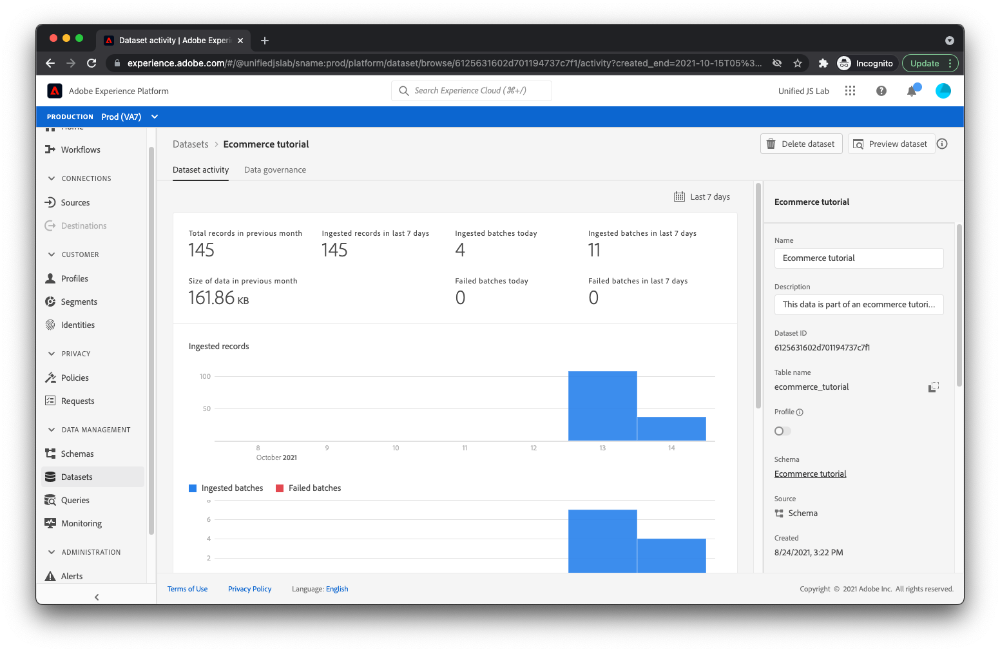

# Test the implementation

Now that you have your webpage set up and your Adobe Experience Platform tag library deployed, it's time to test the implementation.

Open up your product page in your browser. You can do this by clicking _File_ then _Open File..._ in your browser or you can host your page on a web server and enter the appropriate URL.

After the page loads, you should see something like this:

It's not pretty, but it will do the job.

## Inspect the page view and product view events

Open the developer tools in your browser and click on the network panel. Refresh your page.

At this point, you should see four requests:

1. product.html - Your web page.
2. launch-############-development.js - Your Launch library.
3. interact - The page view event being sent to the server.
4. interact - The product view event being sent to the server.

Feel free to inspect the payloads of each request. For the first `interact` request, you should be able to see the payload being sent with an `eventType` of `web.webpagedetails.pageViews`.

For the second `interact` request, you should be able to see the payload being sent with an `eventType` of `commerce.productViews`.

Feel free to poke around the rest of the data being sent, including the product information.

## Inspect the open cart and add to cart events

Now click the _Add to cart_ button.

You should see two additional requests, the first with an `eventType` of `commerce.productListOpens` (for opening a new cart) and the second with an `eventType` of `commerce.productListAdds` (for adding the product to the cart).

## Inspect the download app link click event

Depending on the browser, clicking a link that navigates you away from the current page may clear out your network panel. Because you want to inspect the network request for the link click event that occurs right before you navigate away from the page, you'll need to configure your browser to preserve network logs across pages. This is done by either checking a _Preserve log_ checkbox in the network panel (Chrome, Safari, Edge) or clicking a gear icon and checking a _Persist logs_ item on the displayed menu (Firefox).

Now click the _Download the app_ link.

You should see one more `interact` request show up in the network panel. If you inspect the request, you should find an `eventType` of `web.webinteraction.linkClicks` as well as details about the link that was clicked.

## Check that data arrives in the Adobe Experience Platform dataset

Now that requests are being sent, you'll also want to check whether the data is safely arriving in the Adobe Experience Platform dataset you created. Start by navigating to the [!UICONTROL Datasets] view inside Adobe Experience Platform.

Select the dataset you previously created.

You may need to wait a few minutes, but soon you should see indications of data being processed and inserted into your dataset. You should also see whether processing succeeded or failed. If it failed, you'll be able to see why it failed. Failures typically occur because the data you are sending does not match the schema and you'll need to adjust your data or schema accordingly.

## Use the Adobe Experience Platform Debugger extension

For greater insight into how your implementation is behaving both on the browser and on Adobe's servers, check out the Adobe Experience Platform Debugger browser extension!

[Adobe Experience Platform Debugger extension for Chrome](https://chrome.google.com/webstore/detail/adobe-experience-platform/bfnnokhpnncpkdmbokanobigaccjkpob)

[Adobe Experience Platform Debugger extension for Firefox](https://addons.mozilla.org/en-US/firefox/addon/adobe-experience-platform-dbg/)

[Next: **Summary**](summary.md)

>[!NOTE]
>
>Thank you for investing your time in learning about Adobe Experience Platform Web SDK. If you have questions, want to share general feedback, or have suggestions on future content, please share them on this [Experience League Community discussion post](https://experienceleaguecommunities.adobe.com/t5/adobe-experience-platform-launch/tutorial-discussion-implement-adobe-experience-cloud-with-web/td-p/444996)
