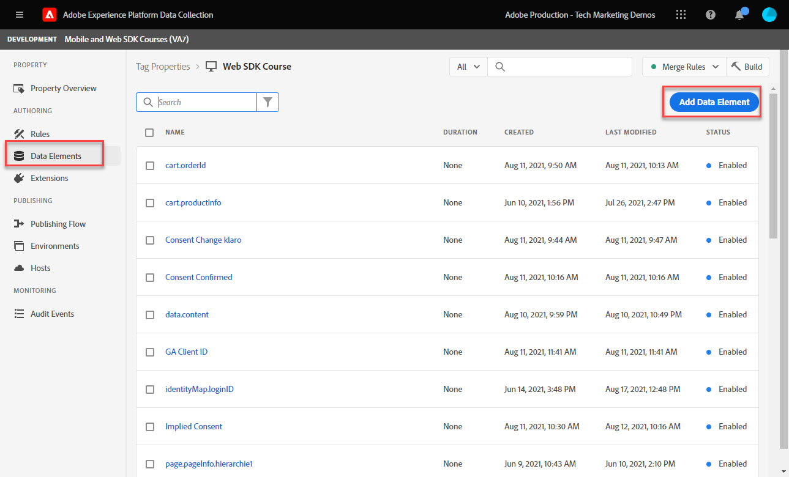
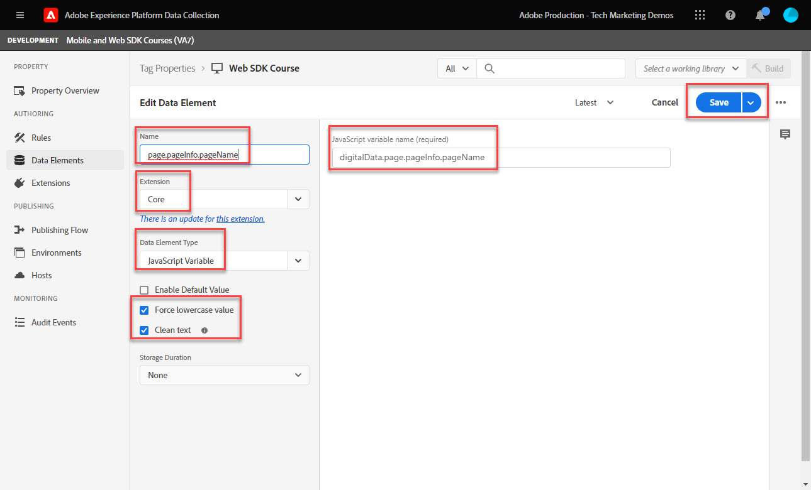
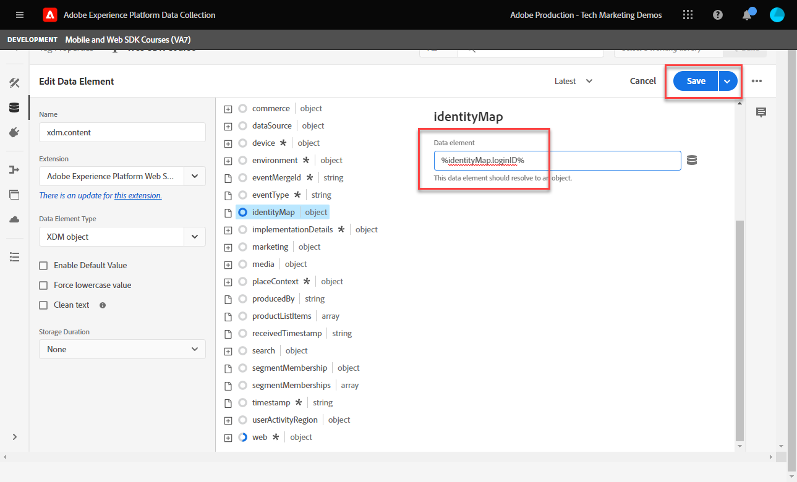

# Create data elements

Learn how to create the essential data elements needed to capture data with Experience Platform Web SDK. Capture both content and identity data on the [Luma demo site](https://luma.enablementadobe.com/content/luma/us/en.html). Learn how to use the XDM schema you created earlier for collecting data using Platform Web SDK data element type called Variable. 

>[!NOTE]
>
> For demonstration purposes, the exercises in this lesson build upon the example used during [Configure a schema](configure-schemas.md) step; creating example XDM objects that capture content viewed and identities of users on the [Luma demo site](https://luma.enablementadobe.com/content/luma/us/en.html). 

>[!IMPORTANT]
>
>The data for this lesson comes from the `[!UICONTROL digitalData]` data layer on the Luma site. To view the data layer, open your developer console and type in `[!UICONTROL digitalData]` to see the full data layer available.


Regardless of Platform Web SDK, you must continue to create data elements inside your tags property that map to data collection variables from your website, such as a data layer, HTML attribute, or others. Once you create those data elements, you must map them to the XDM schema you created during the [configure schemas](configure-schemas.md) lesson. Therefore, creating data elements consists of two actions: 

1. Mapping website variables to data elements, and 
1. Mapping those data elements to an XDM object

For step 1, you continue to map your data layer to data elements the way you currently do, using any of the Core tag extension's data element types. For step 2, Platform Web SDK extension has the following data element types available: 

* Event merge ID
* Identity map
* Variable
* XDM object

This lesson focuses on the Variable data element type. You create a data element to capture Luma visitors' activity based on the available data layer on the Luma site. In the next lesson, you will learn about Identity map. 

>[!NOTE]
>
> Event merge ID and XDM object data element types are rarely used for edge cases.

## Learning objectives

At the end of this lesson, you are able to:

* Understand different approaches to mapping a data layer to XDM
* Create data elements to capture content data
* Map data elements to an XDM object data element


## Prerequisites 

You have an understanding of what a data layer is, gotten familiar with the [Luma demo site](https://luma.enablementadobe.com/content/luma/us/en.html){target="_blank"} data layer, and know how to reference data elements in tags. You must have completed the following previous steps in the tutorial.

* [Configure an XDM schema](configure-schemas.md)
* [Configure an identity namespace](configure-identities.md)
* [Configure a datastream](configure-datastream.md)
* [Web SDK extension installed in the tag property](install-web-sdk.md)

>[!IMPORTANT]
>
>The [Experience Cloud ID Service extension](https://exchange.adobe.com/experiencecloud.details.100160.adobe-experience-cloud-id-launch-extension.html) is not needed when implementing Adobe Experience Platform Web SDK, as the ID Service functionality is built into Platform Web SDK.

## Data Layer approaches

There are multiple ways to map data from your data layer to XDM using the tags functionality of Adobe Experience Platform. Below are a few pros and cons of three different approaches:

* [Implement XDM in the data layer](create-data-elements.md#implement-xdm-in-the-data-layer)
* [Map to XDM in the datastream](create-data-elements.md#map-to-xdm-in-the-datastream)
* [Map to XDM in tags](create-data-elements.md#map-data-layer-in-tags)

>[!NOTE]
>
>The examples in this tutorial follow the Map to XDM in tags approach.


### Implement XDM in the data layer

This approach involves using the fully defined XDM object as the structure for your data layer. Then you map the entire data layer to an XDM object data element in Adobe Tags. If your implementation is not using a tag manager, this approach may be ideal because you can send data to XDM directly from your application using the [XDM sendEvent command](https://experienceleague.adobe.com/docs/experience-platform/edge/fundamentals/tracking-events.html?lang=en#sending-xdm-data). If you do you use Adobe tags, you can create a custom code data element capturing the entire data layer as a pass-through JSON object to the XDM. Then, you map the pass-through JSON to the XDM object field in the Send Event Action. 

Below is an example of how the data layer would look like using the Adobe Client Data Layer format:

+++XDM in Data Layer example

```JSON
window.adobeDataLayer.push({
"eventType": "web.webPageDetails.pageViews",
"web":{
         "webInteraction":{
            "linkClicks":{
               "id":"",
               "value":""
            },
            "URL":"",
            "name":"",
            "region":"",
            "type":""
         },
         "webPageDetails":{
            "pageViews":{
               "id":"",
               "value":"1"
            },
            "URL":"https://luma.enablementadobe.com/",
            "isErrorPage":"",
            "isHomePage":"",
            "name":"luma:home",
            "server":"enablementadobe.com",
            "siteSection":"home",
            "viewName":""
         },
         "webReferrer":{
            "URL":"",
            "type":""
         }
      }
});
```

+++

Pros

* Skips steps to map individual data layer variables to XDM
* May be quicker to deploy if your development team owns tagging digital behavior

Cons

* Complete reliance on development team and dev cycle for updating what data goes to XDM
* Limited flexibility as XDM receives the exact payload from the data layer 
* Cannot use tags built-in features, such as scraping, persistence, features for quick deployments
* Cannot use the data layer for third-party pixels
* No ability to transform the data between the data layer and XDM

### Map to XDM in the datastream

This approach uses functionality built-into the datastream configuration called [Data Prep for Data Collection](https://experienceleague.adobe.com/docs/experience-platform/datastreams/data-prep.html) and skips mapping data layer variables to XDM in tags. 

Pros

* Flexible as you can map individual variables to XDM
* Ability to [compute new values](https://experienceleague.adobe.com/docs/experience-platform/data-prep/functions.html) or [transform data types](https://experienceleague.adobe.com/docs/experience-platform/data-prep/data-handling.html) from a data layer before it goes to XDM 
* Leverage a [Mapping UI](https://experienceleague.adobe.com/docs/experience-platform/datastreams/data-prep.html#create-mapping) to map fields in your source data to XDM with a point-and-click UI

Cons

* Cannot use data layer variables as data elements for client-side third-party pixels, but can use them with Adobe tags event-forwarding
* Cannot use the scraping functionality of the tags feature of Adobe Experience Platform 
* Maintenance complexity increases if mapping the data layer both in tags and in datastream 

### Map data layer in tags 

This approach involves mapping individual data layer variables OR data layer objects to data elements in tags and eventually to XDM. This is the traditional approach to implementation using a tag management system. 

Pros

* The most flexible approach as you can control individual variables and transform data before it gets to XDM
* Can use Adobe tags triggers and scraping functionality to pass data to XDM
* Can map data elements to third-party pixels client-side

Cons

* May take longer to implement

>[!TIP] 
>
> Google Data Layer
> 
> If your organization already uses Google Analytics and has the traditional Google dataLayer object on your website, you can use the [Google Data Layer extension](https://experienceleague.adobe.com/docs/experience-platform/tags/extensions/client/google-data-layer/overview.html?lang=en) in Adobe Tags. This allows you to deploy Adobe technology quicker without having to request support from your IT team. Mapping the Google data layer to XDM would follow the same steps as above.

>[!IMPORTANT]
>
>As noted earlier, the examples in this tutorial follow the Map to XDM in tags approach.

## Create data elements to capture the data layer

Before you create the XDM object, create the following set of data elements for the [Luma demo site](https://luma.enablementadobe.com/content/luma/us/en.html){target="_blank"} data layer:

1. Go to **[!UICONTROL Data Elements]** and select **[!UICONTROL Add Data Element]** (or **[!UICONTROL Create New Data Element]** if there are no existing data elements in the tag property)

    

1. Name the data element `page.pageInfo.pageName`
1. Use the **[!UICONTROL JavaScript Variable]** **[!UICONTROL Data Element type]** to point to a value in Luma's data layer: `digitalData.page.pageInfo.pageName`

1. Check the boxes for **[!UICONTROL Force lowercase value]** and **[!UICONTROL Clean text]** to standardize the case and remove extraneous spaces

1. Leave `None` as the **[!UICONTROL Storage Duration]** setting since this value is different on every page

1. Select **[!UICONTROL Save]**

    

Create these four additional data elements by following the same steps:

* **`page.pageInfo.server`**  mapped to 
`digitalData.page.pageInfo.server`

* **`page.pageInfo.hierarchie1`**  mapped to 
`digitalData.page.pageInfo.hierarchie1`

* **`user.profile.attributes.username`**  mapped to 
`digitalData.user.0.profile.0.attributes.username`

* **`user.profile.attributes.loggedIn`** mapped to
`digitalData.user.0.profile.0.attributes.loggedIn`

* **`cart.orderId`** mapped to `digitalData.cart.orderId` (you use this during the [Setup Analytics](setup-analytics.md) lesson)


>[!CAUTION]
>
>The [!UICONTROL JavaScript variable] data element type treats array references as dots instead of brackets, so referencing the username data element as `digitalData.user[0].profile[0].attributes.username` **will not work**.

## Create Variable data element

After you create the data elements, map them to the XDM using the **[!UICONTROL Variable]** data element that defines the schema used for the XDM object. This object should conform to the XDM schema you created during the [Configure a schema](configure-schemas.md) lesson. 

To create the Variable data element:

1. Select **[!UICONTROL Add Data element]**
1. Name your Data Element `xdm.variable.content`. It is recommended you prefix with "xdm" the Data Elements specific to XDM to better organize your tag property
1. Select the **[!UICONTROL Adobe Experience Platform Web SDK]** as the **[!UICONTROL Extension]**
1. Select the **[!UICONTROL Variable]** as the **[!UICONTROL Data Element Type]**
1. Select the appropriate Experience Platform **[!UICONTROL Sandbox]**
1. Select the appropriate **[!UICONTROL Schema]**, in this case `Luma Web Event Data`
1. Select **[!UICONTROL Save]**

    

<!-- There are different ways to map data elements to XDM object fields. You can map individual data elements to individual XDM fields or map data elements to entire XDM objects as long as your data element matches the exact key-value pair schema present in the XDM object. In this lesson, you will capture content data by mapping to individual fields. You will learn how to [map a data element to an entire XDM object](setup-analytics.md#Map-an-entire-array-to-an-XDM-Object) in the [Setup Analytics](setup-analytics.md) lesson. 

Create an XDM object to capture content data:

1. In the left navigation, select **[!UICONTROL Data Elements]**
1. Select **[!UICONTROL Add Data Element]**
1. **[!UICONTROL Name]** the data element **`xdm.content`**
1. As the **[!UICONTROL Extension]** select `Adobe Experience Platform Web SDK`
1. As the **[!UICONTROL Data Element Type]** select `XDM object`
1. Select the Platform **[!UICONTROL Sandbox]** in which you created the XDM schema in during the [Configure an XDM Schema](configure-schemas.md) lesson, in this example `DEVELOPMENT Mobile and Web SDK Courses`
1. As the **[!UICONTROL Schema]**, select your `Luma Web Event Data` schema:

    

    >[!NOTE]
    >
    >The sandbox corresponds to the Experience Platform sandbox in which you created the schema. There can be multiple sandboxes available in your Experience Platform instance, so make sure to select the right one. Always work in development first, then production.

1. Scroll down until you reach the **`web`** object
1. Select to open it

    


1. Map the following web XDM variables to data elements

    * **`web.webPageDetials.name`** to `%page.pageInfo.pageName%`
    * **`web.webPageDetials.server`** to `%page.pageInfo.server%`
    * **`web.webPageDetials.siteSection`** to `%page.pageInfo.hierarchie1%`

    

1. Next, find the `identityMap` object in the schema and select it
 
1. Map to the `identityMap.loginID` data element

1. Select **[!UICONTROL Save]**

   

-->

At the end of these steps, you should have the following data elements created:

|CORE Extension Data Elements | Platform Web SDK Data Elements|
-----------------------------|-------------------------------
| `cart.orderId` | `xdm.variable.content` |
| `page.pageInfo.hierarchie1` | |
| `page.pageInfo.pageName` | |
| `page.pageInfo.server` | |
| `user.profile.attributes.loggedIn` | |
| `user.profile.attributes.username` | |


>[!TIP]
>
>In a future [Create a tag rule](create-tag-rule.md) lesson, you learn how the **[!UICONTROL Variable]** data element allows you to stack multiple rules in tags using the **[!UICONTROL Update Variable Action type]**. Then, you can independently send the XDM object to Adobe Experience Platform Edge Network using a separate **[!UICONTROL Send Event action type]**. 

With these data elements in place, you are ready to start sending data to Platform Edge Network with a tags rule. But first, learn about collecting identities with Web SDK. 

[Next: **Create identities**](create-identities.md)

>[!NOTE]
>
>Thank you for investing your time in learning about Adobe Experience Platform Web SDK. If you have questions, want to share general feedback, or have suggestions on future content, please share them on this [Experience League Community discussion post](https://experienceleaguecommunities.adobe.com/t5/adobe-experience-platform-launch/tutorial-discussion-implement-adobe-experience-cloud-with-web/td-p/444996)
