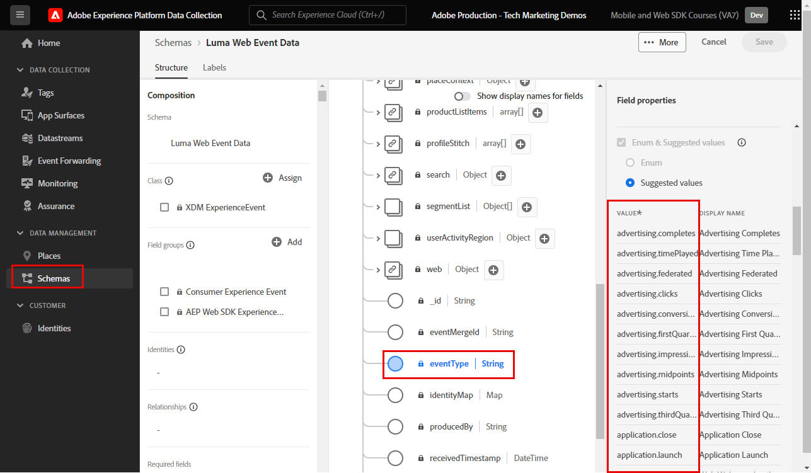

# Create tag rules

Learn how to send events to the Platform Edge Network with your XDM object using tag rules. A tag rule is a combination of events, conditions, and actions that tells the tag property to do something.

>[!NOTE]
>
> For demonstration purposes, the exercises in this lesson build upon the example used during the [Create identities](create-identities.md) step; sending an XDM event action to capture content and identities from users on the [Luma demo site](https://luma.enablementadobe.com/content/luma/us/en.html).

 
## Learning objectives

At the end of this lesson, you are able to:

* Use a naming convention for managing rules within tags
* Send an XDM event by using Update Variable and Send Event action types in a tag rule
* Publish a tag rule to a development library

## Prerequisites

You are familiar with Data Collection tags and the [Luma demo site](https://luma.enablementadobe.com/content/luma/us/en.html), and you must have completed the following previous lessons in the tutorial:

* [Configure an XDM schema](configure-schemas.md)
* [Configure an identity namespace](configure-identities.md)
* [Configure a datastream](configure-datastream.md)
* [Web SDK extension installed in the tag property](install-web-sdk.md)
* [Create data elements](create-data-elements.md)
* [Create identities](create-identities.md)

## Naming Conventions

To better manage rules in tags, it is recommended to follow a standard naming convention. This tutorial uses a three-part naming convention:

* [**location**] - [**event**] - [**tool**] (**sequence**)

where;

1. **location** is the page or pages on the site where the rule fires
1. **event** is the trigger for the rule
1. **tool** is the specific application or applications used in the action step for that rule
1. **sequence** is the order in which the rule should fire in relation to other rules
<!-- minor update --> 

## Create tag rules

In tags, rules are used to execute actions (fire calls) under various conditions. The Platform Web SDK tags extension includes two actions which will be used in this lesson:

* **[!UICONTROL Update variable]** maps data elements to XDM fields
* **[!UICONTROL Send Event]** sends the XDM object to Experience Platform Edge Network

First we define a rule with the **[!UICONTROL Update Variable]** action, which defines a "global configuration" of XDM fields we want to send on every page of the site (for example, the page name). 

Then, we can can define additional rules with the **[!UICONTROL Update Variable]** action which will supplement the global XDM fields with additional fields which are only available under certain conditions (for example, adding product details on product pages).

Finally, we will use another rule with the **[!UICONTROL Send Event]** action which will send the complete XDM object to Adobe Experience Platform Edge Network.

### Update variable rules

#### Global fields

To create a tag rule for the global XDM fields:

1. Open the tag property that you are using for this tutorial

1. Go to **[!UICONTROL Rules]** in the left navigation

1. Select the **[!UICONTROL Create New Rule]** button

    
    
1. Name the rule `all pages global content variables - library loaded - AA (order 1)`

1. In the **[!UICONTROL Events]** section, select **[!UICONTROL Add]**

       

1. Use the **[!UICONTROL Core Extension]** and select `Page Bottom` as the **[!UICONTROL Event Type]** 

1. Under the **[!UICONTROL Name]** field, name it `Core - Page Bottom - order 1`. This helps you describe the trigger with a meaningful name.

1. Select **[!UICONTROL Advanced]** dropdown and enter `1` in **[!UICONTROL Order]**

    >[!NOTE]
    >
    > The higher the number you enter, the later in the overall order of operations it triggers.

1. Select **[!UICONTROL Keep Changes]** to return to the main rule screen
    

1. In the **[!UICONTROL Actions]** section, select **[!UICONTROL Add]**

1. As the **[!UICONTROL Extension]**, select **[!UICONTROL Adobe Experience Platform Web SDK]** 

1. As the **[!UICONTROL Action Type]**, select **[!UICONTROL Update variable]** 

1. As the **[!UICONTROL Data element]**, select the `xdm.variable.content` you created in the [Create data elements](create-data-elements.md) lesson

    

Now map your [!UICONTROL data elements] to the [!UICONTROL schema] used by your XDM object.  

>[!NOTE] 
> 
> You can map to individual properties or entire objects. In this example, you map to individual properties.

1. Scroll down until you reach the **`web`** object

1. Select to open it

1. Map the following data elements to the corresponding `web` XDM variables

    * **`web.webPageDetials.name`** to `%page.pageInfo.pageName%`
    * **`web.webPageDetials.server`** to `%page.pageInfo.server%`
    * **`web.webPageDetials.siteSection`** to `%page.pageInfo.hierarchie1%`

1. Set `web.webPageDetials.pageViews.value` to `1`

    

1. Next, find the `identityMap` object in the schema and select it
 
1. Map to the `identityMap.loginID` data element

   

1. Next, find the eventType field and select it 

1. Enter the value `web.webpagedetails.pageViews`

    >[!WARNING]
    >
    > This dropdown populates the **`xdm.eventType`** variable in the XDM object. While you are also able to type free-form labels in this field, it is highly recommended you **do not** as it has adverse effects with Platform.

    >[!TIP]
    >
    > To understand what values to populate in the `eventType` field, you must go to the schema page and select the `eventType` field to view the suggested values on the right rail. 

    >[!TIP]
    >
    > While neither `web.webPageDetials.pageViews.value` nor `eventType` set to `web.webpagedetails.pageViews` are required for Adobe Analytics to process a beacon as a page view, it is useful to have a standard way to indicate a page view for other downstream applications.

    

1. Select **[!UICONTROL Keep Changes]** and then **[!UICONTROL Save]** the rule in the next screen to finish creating the rule

#### Enrich the XDM object using additional rules with the Update variable action

You can use **[!UICONTROL Update variable]**  in multiple, sequenced rules to enrich the XDM object before sending it to [!UICONTROL Platform Edge Network]. 

>[!TIP]
>
>Rule order determines which rule runs first when an event is triggered. If two rules have the same event type, the one with the lowest number runs first.
> 
>

##### Product page fields

Start by tracking product views on the product detail page of Luma:

1. Select **[!UICONTROL Add Rule]**
1. Name it  [!UICONTROL `ecommerce - pdp library loaded - AA (order 20)`]
1. Select the  under Event to add a new trigger
1. Under **[!UICONTROL Extension]**, select **[!UICONTROL Core]**
1. Under **[!UICONTROL Event Type]**, select **[!UICONTROL Page Bottom]**
1. Name it `Core - Page Bottom - order 20`
1. Select to open **[!UICONTROL Advanced Options]**, type in `20`. This ensures the rule runs after the `all pages global content variables - library loaded - AA (order 1)` that sets the global content variables, but before the `all pages send event - library loaded - AA (order 50)` that sends the XDM event.

    

1. Under **[!UICONTROL Conditions]**, select to **[!UICONTROL Add]**
1. Leave **[!UICONTROL Logic Type]** as **[!UICONTROL Regular]**
1. Leave **[!UICONTROL Extensions]** as **[!UICONTROL Core]**
1. Select **[!UICONTROL Condition Type]** as **[!UICONTROL Path Without Query String]**
1. On the right, enable the **[!UICONTROL Regex]** toggle
1. Under **[!UICONTROL path equals]** set `/products/`. For the Luma demo site, it ensures the rule only triggers on product pages
1. Select **[!UICONTROL Keep Changes]**

    

1. Under **[!UICONTROL Actions]** select **[!UICONTROL Add]**
1. Select **[!UICONTROL Adobe Experience Platform Web SDK]** extension
1. Select **[!UICONTROL Action Type]** as **[!UICONTROL Update variable]**
1. Scroll down to the `commerce` object and select to open it.
1. Open the **[!UICONTROL productViews]** object and set **[!UICONTROL value]** to `1`

    

    >[!TIP]
    >
    >Setting commerce.productViews.value=1 in XDM automatically maps to the `prodView` event in Analytics

1. Scroll down to and select `productListItems` array
1. Select **[!UICONTROL Provide individual items]**
1. Select **[!UICONTROL Add Item]**
    
    

    >[!CAUTION]
    >
    >The **`productListItems`** is an `array` data type so it expects data to come in as a collection of elements. Because of the Luma demo site's data layer structure and because it's only possible to view one product at a time on the Luma site, you add items individually. When implementing on your own website, depending on your data layer structure, you may be able to provide an entire array.

1. Select to open **[!UICONTROL Item 1]** 
1. Map **`productListItems.item1.SKU`** to `%product.productInfo.sku%`

    

1. Find `eventType` and set it to `commerce.productViews`

1. Select **[!UICONTROL Keep Changes]**

1. Select **[!UICONTROL Save]** to save the rule

### Shopping cart fields

You can map entire array to an XDM object, provided the array matches the format of the XDM schema. The custom code data element `cart.productInfo` you created earlier loops through the `digitalData.cart.cartEntries` data layer object on Luma and translates it into the required format of the `productListItems` object of the XDM schema.

To illustrate, see the comparison below of the Luma site data layer (left) to the translated data element (right): 

Compare the data element to the `productListItems` structure (hint, it should match).

>[!IMPORTANT]
>
>Note how numeric variables are translated, with string values in the data layer such as `price` and `qty` reformatted to numbers in the data element. These format requirements are important for data integrity in Platform and are determined during the [configure schemas](configure-schemas.md) step. In the example, **[!UICONTROL quantity]** uses the **[!UICONTROL Integer]** data type.
> 

Now, let's map our array to the XDM object"

1. Create a new rule named `ecommerce - cart library loaded - AA (order 20)`
1. Select the  under Event to add a new trigger
1. Under **[!UICONTROL Extension]**, select **[!UICONTROL Core]**
1. Under **[!UICONTROL Event Type]**, select **[!UICONTROL Page Bottom]**
1. Name it `Core - Page Bottom - order 20`
1. Select to open **[!UICONTROL Advanced Options]**, type in `20`
1. Select **[!UICONTROL Keep Changes]**

    

1. Under **[!UICONTROL Conditions]**, select to **[!UICONTROL Add]**
1. Leave **[!UICONTROL Logic Type]** as **[!UICONTROL Regular]**
1. Leave **[!UICONTROL Extensions]** as **[!UICONTROL Core]**
1. Select **[!UICONTROL Condition Type]** as **[!UICONTROL Path Without Query String]**
1. On the right, **do not** enable the **[!UICONTROL Regex]** toggle
1. Under **[!UICONTROL path equals]** set `/content/luma/us/en/user/cart.html`. For the Luma demo site, it ensures the rule only triggers on the cart page
1. Select **[!UICONTROL Keep Changes]**

    

1. Under **[!UICONTROL Actions]** select **[!UICONTROL Add]**
1. Select **[!UICONTROL Adobe Experience Platform Web SDK]** extension
1. Select **[!UICONTROL Action Type]** as **[!UICONTROL Update variable]**
1. Scroll down to the `commerce` object and select to open it.
1. Open the **[!UICONTROL productListViews]** object and set **[!UICONTROL value]** to `1`

    

    >[!TIP]
    >
    >Setting commerce.productListViews.value=1 in XDM automatically maps to the `scView` event in Analytics

    
1. Scroll down to and select **[!UICONTROL productListItems]** array

1. Select **[!UICONTROL Provide entire array]**

1. Map to **`cart.productInfo`** data element

1. Select `eventType` and set to `commerce.productListViews`

1. Select **[!UICONTROL Keep Changes]**

1. Select **[!UICONTROL Save]** to save the rule

Create two other rules for checkout and purchase following the same pattern with the below differences:

**Rule name**: `ecommerce - checkout library loaded - AA (order 20)`

* **[!UICONTROL Condition]**: /content/luma/us/en/user/checkout.html
* Set `eventType` to `commerce.checkouts`
* Set **XDM Commerce event**: commerce.checkout.value to `1`

    >[!TIP]
    >
    >This is equivalent to setting `scCheckout` event in Analytics 

**Rule name**: `ecommerce - purchase library loaded - AA (order 20)`

* **[!UICONTROL Condition]**: /content/luma/us/en/user/checkout/order/thank-you.html
* Set `eventType` to `commerce.purchases`
* Set **XDM Commerce event**: commerce.purchases.value to `1`

    >[!TIP]
    >
    >This is equivalent to setting `purchase` event in Analytics 

There are additional steps for capturing all the required `purchase` event variables:

1. Open **[!UICONTROL commerce]** object
1. Open the **[!UICONTROL order]** object
1. Map **[!UICONTROL purchaseID]** to the `cart.orderId` data element
1. Set **[!UICONTROL currencyCode]** to the hardcoded value `USD`

    

    >[!TIP]
    >
    >This is equivalent to setting `s.purchaseID` and `s.currencyCode` variables in Analytics 

1. Scroll down to and select **[!UICONTROL productListItems]** array
1. Select **[!UICONTROL Provide entire array]**
1. Map to **`cart.productInfo.purchase`** data element
1. Select **[!UICONTROL Save]**

When you are done, you should see the following rules created.

### Send event

Now that you have set the variables, you can create the second rule to send the XDM object to Platform Edge Network with the **[!UICONTROL Send event]** action type.

1. On the right, select to **[!UICONTROL Add Rule]** to create another rule

1. Name the rule `all pages send event - library loaded - AA (order 50)`

1. In the **[!UICONTROL Events]** section, select **[!UICONTROL Add]**

1. Use the **[!UICONTROL Core Extension]** and select `Page Bottom` as the **[!UICONTROL Event Type]** 

1. Under the **[!UICONTROL Name]** field, name it `Core - Page Bottom - order 50`. This helps you describe the trigger with a meaningful name.

1. Select **[!UICONTROL Advanced]** dropdown and enter `50` in **[!UICONTROL Order]**. This will ensure the second rule triggers after the first rule you set to trigger as `1`.

1. Select **[!UICONTROL Keep Changes]** to return to the main rule screen
    

1. In the **[!UICONTROL Actions]** section, select **[!UICONTROL Add]**

1. As the **[!UICONTROL Extension]**, select  **[!UICONTROL Adobe Experience Platform Web SDK]** 

1. As the  **[!UICONTROL Action Type]**, select  **[!UICONTROL Send event]** 

1. As the **[!UICONTROL XDM]**, select the `xdm.variable.content` data element created in the previous lesson

1. Select **[!UICONTROL Keep Changes]** to return to the main rule screen

    
1. Select **[!UICONTROL Save]** to save the rule    

       

## Publish the rule in a library

Next, publish the rule to your development environment so you can verify it works.

To create a library:

1. Go to **[!UICONTROL Publishing Flow]** in the left navigation

1. Select **[!UICONTROL Add Library]**

    
1. For the **[!UICONTROL Name]**, enter `Luma Web SDK Tutorial`
1. For the **[!UICONTROL Environment]**, select `Development`
1. Select  **[!UICONTROL Add All Changed Resources]** 

    >[!NOTE]
    >
    >    In addition to the Adobe Experience Platform Web SDK extension and the `all pages global content variables - library loaded - AA (order 50)` rule, you see the tag components created in previous lessons. The Core extension contains the base JavaScript required by all web tag properties.

1. Select **[!UICONTROL Save & Build for Development]**

    

The library may take a few minutes to build and when it is complete it displays a green dot to the left of the library name:

   

As you can see on the [!UICONTROL Publishing Flow] screen, there is a lot more to the publishing process which is beyond the scope of this tutorial. This tutorial just uses a single library in your Development environment.

Now you are ready to validate the data in the request using the Adobe Experience Platform Debugger.

[Next **Validate with Debugger and Assurance**](validate-with-debugger.md)

>[!NOTE]
>
>Thank you for investing your time in learning about Adobe Experience Platform Web SDK. If you have questions, want to share general feedback, or have suggestions on future content, please share them on this [Experience League Community discussion post](https://experienceleaguecommunities.adobe.com/t5/adobe-experience-platform-launch/tutorial-discussion-implement-adobe-experience-cloud-with-web/td-p/444996)
