# Set up Journey Optimizer web channel

Learn how to implement the Journey Optimizer web channel using Platform Web SDK. This guide covers the foundational Web Channel prerequisites, detailed steps for configuration, and a deep dive into a use case centered on loyalty status.

By following this guide, Journey Optimizer users are equipped to effectively apply the web channel for advanced online personalization using the Journey Optimizer Web Designer.

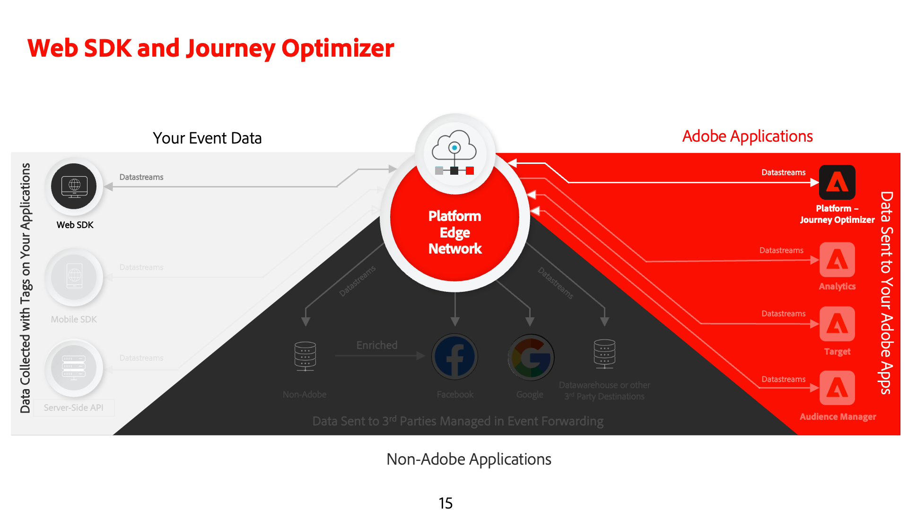  

## Learning Objectives

At the end of this lesson, you are able to:

* Understand the function and significance of the Web SDK in delivering the web channel experience.
* Understand the process of creating a web channel campaign from start to finish utilizing the sample Luma Loyalty Rewards use case.
* Configure campaign properties, actions, and schedules within the interface.
* Understand the functionality and benefits of the Adobe Experience Cloud Visual Editing Helper extension.
* Learn to edit web page content, including images, headers, and other elements, using the Web Designer.
* Learn how to insert offers into a web page using the Offer decision component.
* Familiarize yourself with best practices for ensuring the quality and success of a web channel campaign.

## Prerequisites

To complete the lessons in this section, you must first:

* Ensure that your Adobe Experience Platform Web SDK tags extension version is 2.16 or above.
* If you are using the Journey Optimizer web designer to author your web channel experience, ensure you are using either the Google Chrome or Microsoft&reg; Edge browsers.
* Also ensure you have downloaded the Adobe Experience Cloud Visual Editing Helper browser extension. Enable The Visual Editing Helper browser extension in your browser toolbar before creation of the web channel experience.
    * In the Journey Optimizer web designer, certain websites may not reliably open due to one of the following reasons:
        1. The website has stringent security policies.
        1. The website is embedded within an iframe.
        1. The customer's QA or stage site is not externally accessible (it is an internal site).
* Ensure that third-party cookies are allowed in your browser. It may be necessary to disable any ad blockers in your browser as well.
* When creating web experiences and including content from the Adobe Experience Manager Assets Essentials library, it's necessary to configure the subdomain for publishing this content. [Learn more](https://experienceleague.adobe.com/docs/journey-optimizer/using/web/web-delegated-subdomains.html?lang=en).
* If using the content experimentation feature, ensure that your web dataset is also included in your reporting configuration.
* Currently, two types of implementations are supported for enabling the authoring and delivery of web channel campaigns on your web properties:
    * Client-side only: To modify your website, you must implement the Adobe Experience Platform Web SDK.
    * Hybrid mode: You can utilize the Platform Edge Network Server API to request personalization server-side. The response from the API is then provided to the Adobe Experience Platform Web SDK for rendering modifications on the client-side. For more information, refer to the Adobe Experience Platform Edge Network Server API documentation. Additional details and implementation samples for the hybrid mode can be found in this blog post.

>[!NOTE]
>
>Server-side only implementation is not currently supported.

## Terminology

First, you should understand the terminology used within web channel campaigns.

* **Web Channel**: A medium for communication or the delivery of content via the web. In the context of this guide, it refers to the mechanism through which personalized content is delivered to website visitors using the Platform Web SDK, within Adobe Journey Optimizer.
* **Web Surface**: Refers to a web property identified by a URL where content is delivered. It can encompass a single or multiple web pages.
* **Journey Optimizer Web Designer**: A specific tool or interface within the Journey Optimizer where users can design their web channel experiences.
* **Adobe Experience Cloud Visual Editing Helper**: A browser extension that assists in visually editing and designing web channel experiences.
* **Datastream**: A configuration within the Adobe Experience Platform service that ensures web channel experiences can be delivered.
* **Merge Policy**: A configuration that ensures the accurate activation and publication of inbound campaigns.
* **Audience**: A specific segment of users or site visitors who meet certain criteria.
* **Web Designer**: An interface or tool that aids in visually editing and designing web experiences without diving deep into code.
* **Expression Editor**: A tool within the Web Designer that allows users to add personalization to web content, potentially based on data attributes or other criteria.
* **Offer Decision Component**: A component in the Web Designer that helps in deciding which offer is best suited to be displayed to a specific visitor based on decision management.
* **Content Experiment**: A method to test different content variations to find out which one performs best in terms of the desired metric, such as inbound clicks.
* **Treatment**: In the context of content experiments, a treatment refers to a specific variation of content being tested against another.
* **Simulation**: A preview mechanism to visualize the web channel experience before activating it for live audiences.

## Configure the datastream

Ensure that a datastream is defined within the Adobe Experience Platform service, and that the Adobe Journey Optimizer option is enabled. This must be configured before any web channel experience can be delivered by Platform Web SDK.

To configure Adobe Journey Optimizer in the datastream:

1. Go to the [Data Collection](https://experience.adobe.com/#/data-collection){target="blank"} interface.
1. On the left navigation, select **[!UICONTROL Datastreams]**.
1. Select the previously created Luma Web SDK datastream.

    

1. Select **[!UICONTROL Edit]** within the Adobe Experience Platform Service.
    
    

1. Check the **[!UICONTROL Adobe Journey Optimizer]** box.

    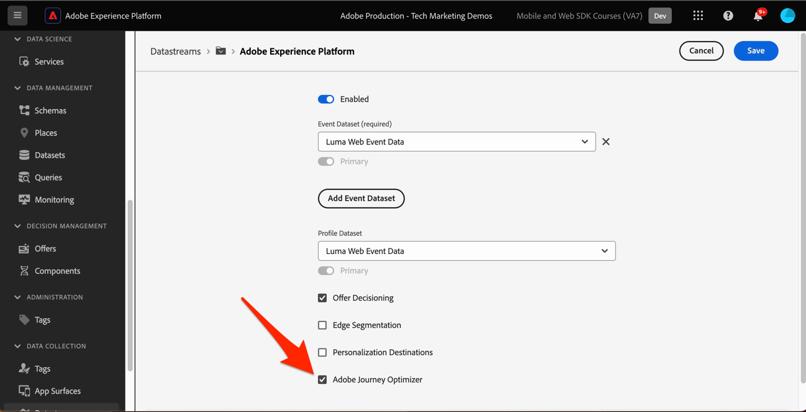

1. Select **[!UICONTROL Save]**.

This ensures that inbound events for Journey Optimizer are correctly handled by the Adobe Experience Platform Edge.

## Configure the merge policy

Ensure that a merge policy is defined with the **[!UICONTROL Active-On-Edge Merge Policy]** option enabled. This merge policy option is employed by Journey Optimizer inbound channels to ensure the accurate activation and publication of inbound campaigns on the edge.

To configure the option in the merge policy:

1. Go to the **[!UICONTROL Customer]** > **[!UICONTROL Profiles]** page in either the Experience Platform or Journey Optimizer interface.
1. Select the **[!UICONTROL Merge Policies]** tab.
1. Select your policy, and toggle the **[!UICONTROL Active-On-Edge Merge Policy]** option within the **[!UICONTROL Configure]** step.

   

## Configure the web dataset for content experimentation

To use content experiments within web channel campaigns, you must ensure the web dataset used is also included in your reporting configuration. The Journey Optimizer reporting system uses the dataset in a read-only fashion to populate out-of-the-box content experimentation reports.

[Adding datasets for content experiment reporting is detailed in this section](https://experienceleague.adobe.com/docs/journey-optimizer/using/campaigns/content-experiment/reporting-configuration.html?lang=en#add-datasets).

## Use Case Overview – Loyalty Rewards

In this lesson, a sample Loyalty Rewards use case is used to detail implementation of a web channel experience using the Web SDK.

This use case enables you to better understand how Journey Optimizer can help deliver the best inbound experiences to your customers, utilizing the Journey Optimizer campaigns, and the Web Designer.

>[!NOTE]
>
>As this tutorial is aimed at implementers, it's worth noting that this lesson involves substantial interface work in Journey Optimizer. While such interface tasks are typically handled by marketers, it can be beneficial for implementers to gain insight into the process, even if they are not responsible for web channel campaign creation in the end.

### Create a Loyalty schema and ingest sample data

When Web SDK data is ingested into Adobe Experience Platform, it can be enriched by all of the other data you have ingested. When a user authenticates into the Luma site, and authenticated identity is sent to Platform representing an identity in Luma's CRM system. An identity graph is constructed in Experience Platform and all other profile-enabled datasets also containing identities with the `lumaCrmId` namespace can be joined together to build Real-Time Customer Profiles. We will quickly create another dataset in Adobe Experience Platform with some sample loyalty data so we can demonstrate how Real-Time Customer Profiles can be used in Journey Optimizer web campaigns. Since you have already done similar exercises the instructions will be brief.

### Create Loyalty Rewards Campaign

Now that we have ingested our sample loyalty data we can create the Loyalty Rewards web channel campaign in Adobe Journey Optimizer.

To create the sample campaign:

1. Navigate to **[!UICONTROL Journey Management]** > **[!UICONTROL Campaigns]** in the left navigation
1. Click **[!UICONTROL Create campaign]** in the upper right.
1. In the **[!UICONTROL Properties]** section, specify how you want to execute the campaign. For the Loyalty Rewards use case, choose **Scheduled**.

    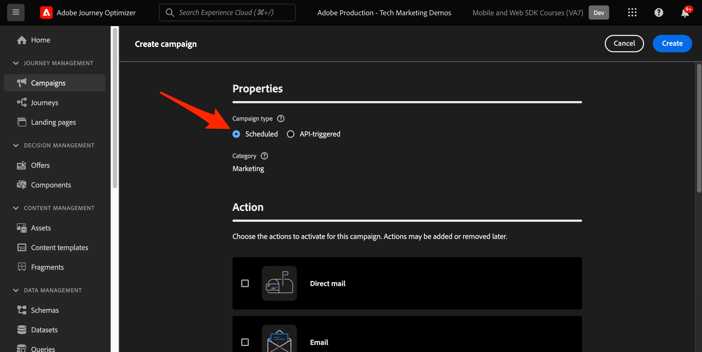

1. In the **[!UICONTROL Actions]** section, choose the **[!UICONTROL Web channel]**. As the  **[!UICONTROL Web surface]**, select **[!UICONTROL Page URL]**.

>[!NOTE]
>
>A web surface refers to a web property identified by a URL where content is delivered. It can correspond to a single page URL or encompass multiple pages, enabling you to apply modifications across one or multiple web pages.

Choose the **[!UICONTROL Page URL]** web surface option to deploy the experience on one page for this campaign. Enter the URL for the Luma page.

1. Once the web surface is defined, select **[!UICONTROL Create]**.

    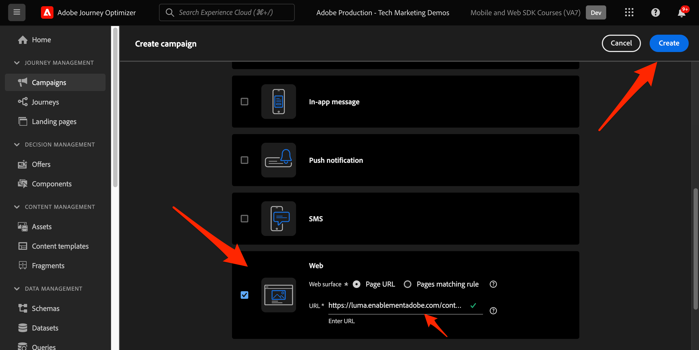

1. Now add some additional details to the new web channel campaign. First, name the campaign. Call it `Luma Loyalty Rewards – Gold Status – October 2023`. Optionally, you can add a description to the campaign. Also add **[!UICONTROL Tags]** to improve the overall campaign taxonomy.

    

1. By default, the campaign is active for all site visitors. For the purposes of this use case, only gold status reward members should see the experience. To enable this, click **[!UICONTROL Select audience]** and choose the `Luma Loyalty Rewards – Gold Status` audience.

1. In the **[!UICONTROL Identity namespace]** field, select the namespace for identifying individuals within the chosen segment. Since you are deploying the campaign on the Luma site, you can choose the ECID namespace. Profiles within the `Luma Loyalty Rewards – Gold Status` audience lacking the ECID namespace among their various identities are not targeted by the web channel campaign.

    

1. Schedule the campaign to begin on December 1 using the **[!UICONTROL Campaign start]** option, and end on December 31 using the **[!UICONTROL Campaign end]** option.

    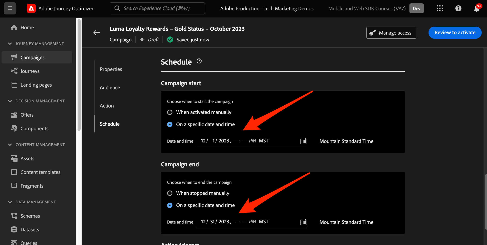

>[!NOTE]
>
>Keep in mind that for web channel campaigns, the web experience is shown when the visitor opens the page. Therefore, unlike other types of campaigns in Adobe Journey Optimizer, the **[!UICONTROL Action triggers]** section is not configurable.

### Experiment with Loyalty Rewards Content

In the **[!UICONTROL Action]** section, you can optionally create an experiment to test out which content works better for the `Luma Loyalty Rewards – Gold Status` audience. Let's create and test two treatments as a component of the campaign configuration.

To create the content experiment:

1. Click **[!UICONTROL Create experiment]**.

    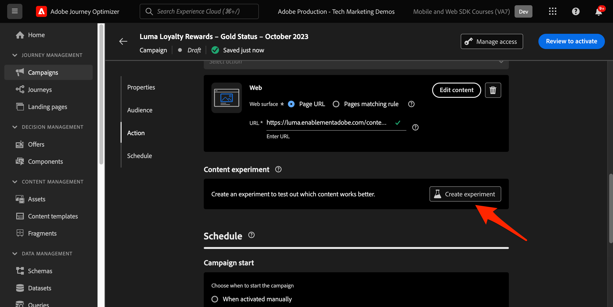

1. First choose a **[!UICONTROL Success metric]**. This is the metric for determining content effectiveness. Choose **[!UICONTROL Unique Inbound Clicks]**, to see which content treatment generates more clicks on the web experience CTA.

    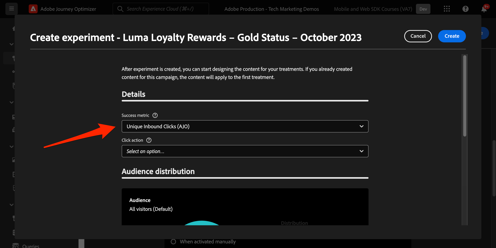

1. When setting up an experiment using web channel and choosing the **[!UICONTROL Inbound Clicks]**, **[!UICONTROL Unique Inbound Clicks]**, **[!UICONTROL Page Views]**, or **[!UICONTROL Unique Page Views]** metrics, the **[!UICONTROL Click Action]** drop-down enables you to precisely track and monitor clicks and views on specific pages.

1. Optionally you can designate a **[!UICONTROL Holdout]** that does not receive either of the two treatments. Leave this unchecked for now.

1. Also optionally, choose to **[!UICONTROL Distribute evenly]**. Check this option to ensure the treatment splits are always evenly split.

[Learn more about content experiments in Adobe Journey Optimizer Web Channel](https://experienceleague.adobe.com/docs/journey-optimizer/using/campaigns/content-experiment/get-started-experiment.html?lang=en).

### Edit Content using the Visual Helper

Now let's author the web channel experience. To do so, use the Adobe Experience Cloud **[!UICONTROL Visual Helper]**. This tool is a browser extension compatible with Google Chrome and Microsoft&reg; Edge. Make sure you have downloaded the extension before attempting to build your experiences. Also ensure that the web page includes the Web SDK.

1. Within the **[!UICONTROL Action]** tab of the campaign, click **[!UICONTROL Edit content]**. Since you entered a single page URL as the surface, you should be ready to begin working in the composer.

    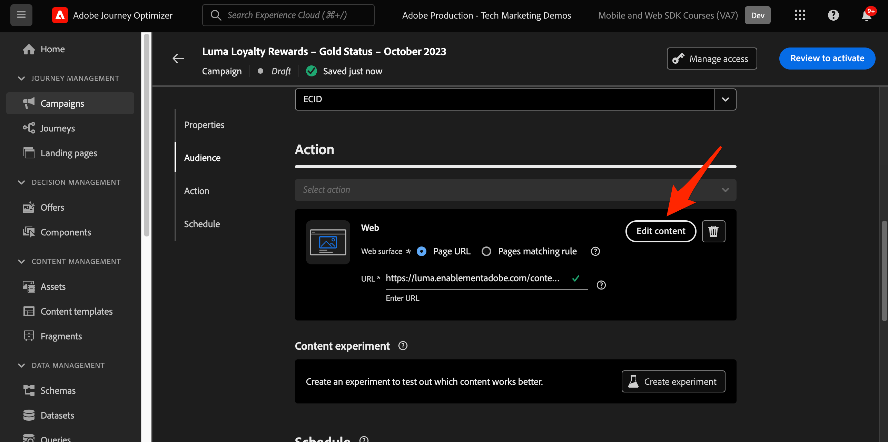

1. Now click **[!UICONTROL Edit web page]** to begin authoring.

    

1. Start by editing some elements using the web composer. Use the contextual menu to edit the Luma hero image header. Adjust the style of the contextual pane on the right.

    

1. Also add personalization to the container using the **[!UICONTROL Expression editor]**.

    

1. Ensure that the experience is properly tracked for clicks. Choose **[!UICONTROL Click track element]** from the contextual menu.

    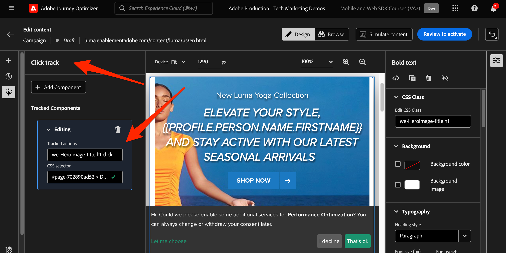

1. Use the **[!UICONTROL Offer decision component]** to insert offers in the web page. This component uses **[!UICONTROL Decision Management]** to pick the best offer to deliver to Luma visitors.

### HTML Design Changes

There are a few methods available if you want to make more advanced, or custom changes to the site as a component of the Loyalty Rewards campaign.

Use the **[!UICONTROL Components]** pane to add HTML, or other content directly to the Luma site.

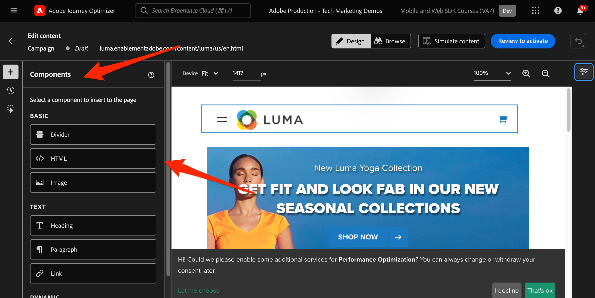

Add a new HTML component at the top of the page. Edit the HTML within the component from the design interface or **[!UICONTROL Contextual]** pane.

Alternatively, add HTML edits from the **[!UICONTROL Modifications]** pane. This pane allows you to select a component on the page and edit it from the designer interface.

Within the editor, add the HTML for the `Luma Loyalty Rewards – Gold Status` audience. Select **[!UICONTROL Validate]**.

Now review the new custom HTML component for fit and feel.

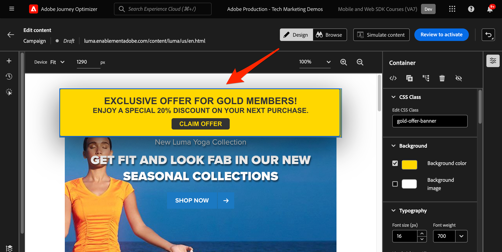

Edit a specific component using the **[!UICONTROL CSS selector type]** modification.

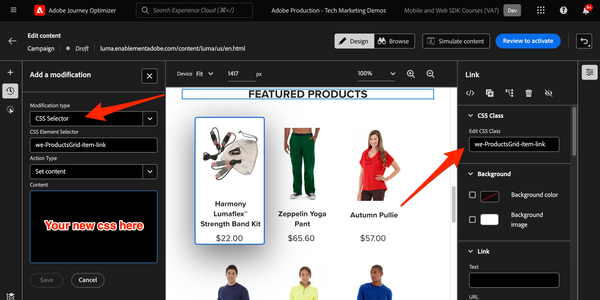

Add custom code using the **Page `<head>` type** modification.

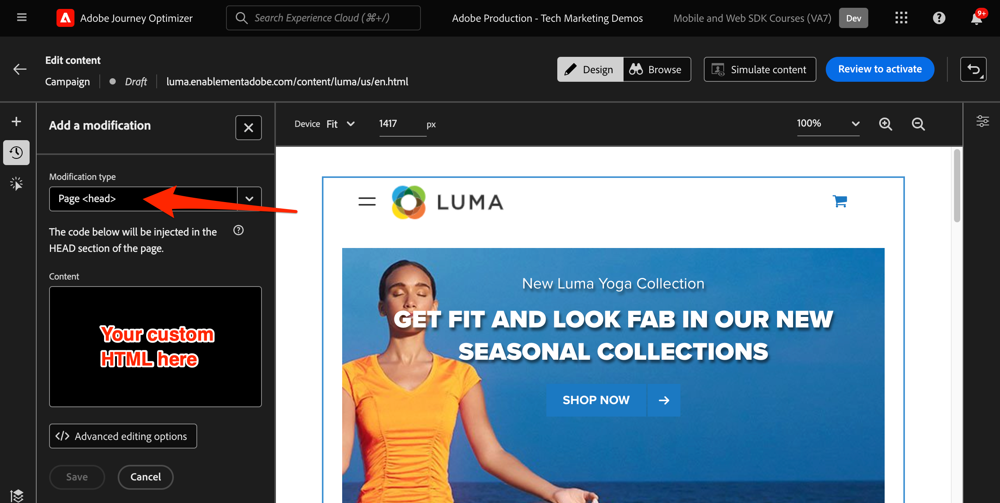

The possibilities are endless using the **[!UICONTROL Visual Helper]**.

### Simulate Loyalty Rewards Content

Look at a preview of the modified web page before activating the campaign. Keep in mind that you must have test profiles configured to simulate web channel experiences.

To simulate the experience:

1. Select **[!UICONTROL Simulate content]** within the campaign.

    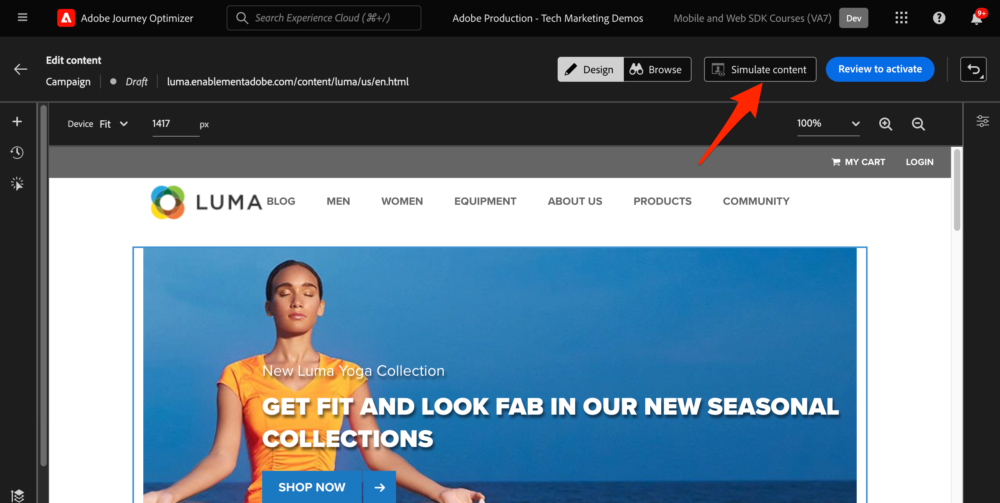

1. Choose a test profile to receive the simulation. Keep in mind that the test profile should be in the `Luma Loyalty Rewards – Gold Status` audience to receive the proper treatment.

1. The preview is displayed for the test profile.

### Activating the Loyalty Rewards Campaign

Finally, activate the web channel campaign.

1. Select **Review to activate**.

1. You are prompted to confirm the campaign details one final time. Select **[!UICONTROL Activate]**. It can take up to 15 minutes for the campaign to become live on the site.

### Loyalty Rewards QA

As a best practice, monitor the **[!UICONTROL Web]** tab of the campaign live and global reports for the campaign-specific KPIs. For this campaign, monitor experience impressions, and click rate.

### Web Channel Validation using Adobe Experience Platform Debugger

The Adobe Experience Platform Debugger extension, available for both Chrome and Firefox, analyzes your web pages to identify issues in the implementation of Adobe Experience Cloud solutions.

You can use the debugger on the Luma site to validate the web channel experience in production. This is a best practice once the Loyalty Rewards use case is up and running, to ensure everything is configured correctly.

[Learn how to configure the debugger in your browser using the guide here](https://experienceleague.adobe.com/docs/platform-learn/data-collection/debugger/overview.html?lang=en).

To begin validation using the debugger:

1. Navigate to the Luma web page with the web channel experience.
    <!--
    
    -->
1. While on the web page, open the **[!UICONTROL Adobe Experience Platform Debugger]**.
    <!--
    
    -->
1. Navigate to **Summary**. Verify that the **[!UICONTROL Datastream ID]** matches the **[!UICONTROL datastream]** in **[!UICONTROL Adobe Data Collection]** for which you enabled Adobe Journey Optimizer.
    <!--
    
    -->
1. You can then log in to the site with various Luma loyalty accounts, and use the debugger to validate the requests sent to the Adobe Experience Platform Edge Network.
    <!--
    
    -->
1. Under **[!UICONTROL Solutions]** navigate to the **[!UICONTROL Experience Platform Web SDK]**.
    <!--
    
    -->
1. Within the **Configuration** tab, Toggle on **[!UICONTROL Enable Debugging]**. This enables logging for the session within an **[!UICONTROL Adobe Experience Platform Assurance]** session.
    <!--
    
    -->
1. Log in to the site with various Luma loyalty accounts, and use the debugger to validate the requests sent to the **[!UICONTROL Adobe Experience Platform Edge network]**. All of these requests should be captured in **[!UICONTROL Assurance]** for log tracking.
<!--
   
-->
