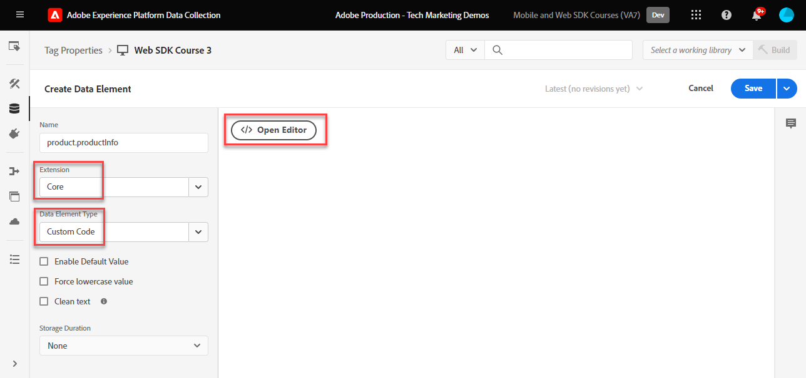
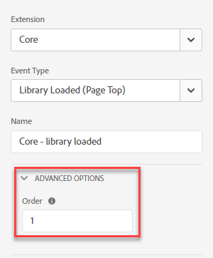
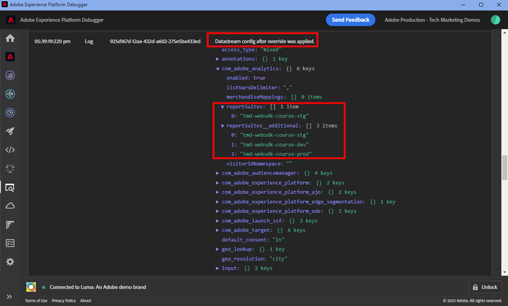
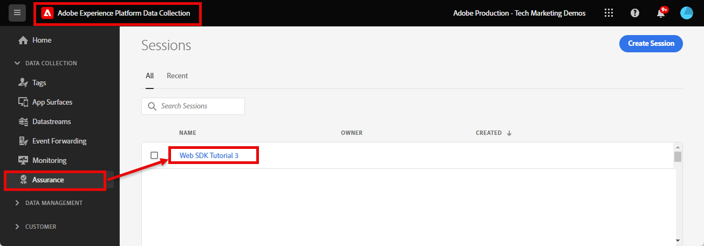

# Set up Adobe Analytics with Platform Web SDK

Learn how to set up Adobe Analytics using [Experience Platform Web SDK](https://experienceleague.adobe.com/docs/platform-learn/data-collection/web-sdk/overview.html), create tag rules to send data to Adobe Analytics, and validate that Analytics is capturing data as expected.

[Adobe Analytics](https://experienceleague.adobe.com/docs/analytics.html) is an industry-leading application that empowers you to understand your customers as people and steer your business with customer intelligence.

  

## Learning objectives

At the end of this lesson, you will be able to:

* Configure an XDM schema for Adobe Analytics 
* Understand the difference between auto-mapped and manually mapped XDM variables for Analytics
* Configure a datastream to enable Adobe Analytics
* Override a datastream to send data to another Adobe Analytics report suite
* Map individual or entire array data elements to the XDM object
* Use the Update variable rule action type to stack multiple rules into one XDM event
* Capture page views in Adobe Analytics with the XDM object
* Capture e-commerce data with the XDM object for the Adobe Analytics product string
* Set a Product Syntax Merchandising eVar using XDM
* Validate Adobe Analytics variables are set with the XDM object using Experience Platform Debugger
* Use Adobe Analytics processing rules to set custom variables
* Validate data is captured by Adobe Analytics using Adobe Experience Platform Assurance
* Validate data is captured by Adobe Analytics using Real-Time Reports

## Prerequisites

You are familiar with tags, Adobe Analytics, and the [Luma demo site](https://luma.enablementadobe.com/content/luma/us/en.html){target="_blank"} login and shopping functionality. 

You need at least one test/dev report suite ID. If you don't have a test/dev report suite that you can use for this tutorial, [please create one](https://experienceleague.adobe.com/docs/analytics/admin/manage-report-suites/new-report-suite/t-create-a-report-suite.html).

You must have completed all the steps from the previous sections in the tutorial:

* Initial Configuration 
  * [Configure an XDM schema](configure-schemas.md)
  * [Configure an identity namespace](configure-identities.md)
  * [Configure a datastream](configure-datastream.md)
* Tags Configuration
  * [Install Web SDK extension](install-web-sdk.md)
  * [Create data elements](create-data-elements.md)
  * [Create identities](create-identities.md)
  * [Create a tag rule](create-tag-rule.md)
  * [Validate with Adobe Experience Platform debugger](validate-with-debugger.md)

You also need to [Enable User Access to Adobe Experience Platform Assurance](https://experienceleague.adobe.com/docs/experience-platform/assurance/user-access.html) so that you can validate your Adobe Analytics data with Adobe Experience Platform Assurance. (If you have access schemas, identity namespaces, and datastreams you will already have access to Assurance)

## XDM schemas and Analytics variables

Congratulations! You already configured a schema compatible with Adobe Analytics in the [Configure a schema](configure-schemas.md) lesson! However, for Adobe Analytics there are two general approaches to defining the XDM for Adobe Analytics. 

<!-- Implementing Platform Web SDK should be as product-agnostic as possible. For Adobe Analytics, mapping eVars, props, and events doesn't occur during schema creation, nor during the tag rules configuration as it has been done traditionally. Instead, every XDM key-value pair becomes a Context Data Variable that maps to an Analytics variable in one of two ways: 

1. Automatically mapped variables using reserved XDM fields
1. Manually mapped variables using Analytics Processing Rules

To understand what XDM variables are auto-mapped to Adobe Analytics, please see [Variables automatically mapped in Analytics](https://experienceleague.adobe.com/docs/experience-platform/edge/data-collection/adobe-analytics/automatically-mapped-vars.html?lang=en). Any variable that is not auto-mapped must be manually mapped. -->

 1. **Product-agnostic XDM**: maintain a semantic key-value pair XDM schema and use [Adobe Analytics Processing Rules](https://experienceleague.adobe.com/docs/analytics/admin/admin-tools/manage-report-suites/edit-report-suite/report-suite-general/c-processing-rules/processing-rules.html) to map the XDM fields to eVars, props, and so on. By a semantic XDM schema, we mean that the field names themselves have meaning. For example, the field name `web.webPageDetails.pageName` has more meaning than say `prop1` or `evar3`.

    >[!IMPORTANT]
    >
    > All fields in the XDM schema become available to Adobe Analytics as Context Data Variables with the following prefix `a.x.`. For example, `a.x.web.webinteraction.region`

 1. **Analytics-specific XDM**: Use a purpose-built Adobe Analytics field group in the XDM schema called `Adobe Analytics ExperienceEvent Template`
 
The approach Adobe has seen customers prefer is the **Analytics-specific XDM**, because it skips the mapping step in the Adobe Analytics Processing Rules interface. The steps in this lesson use the **Analytics-specific XDM** approach.

## Mapping XDM to Adobe Analytics

Many XDM fields are automatically mapped to Analytics variables.

The schema created in the [Configure a schema](configure-schemas.md) lesson contains a few auto-mapped to Analytics variables, as outlined in this table:

|XDM to Analytics auto-mapped variables|Adobe Analytics variable|
|-------|---------|
|`identitymap.ecid.[0].id`| mid|
|`web.webPageDetails.name`|s.pageName|
|`web.webPageDetails.server`|s.server|
|`web.webPageDetails.siteSection`|s.channel|
|`commerce.productViews.value`|prodView|
|`commerce.productListViews.value`|scView|
|`commerce.checkouts.value`|scCheckout|
|`commerce.purchases.value`|purchase|
|`commerce.order.currencyCode`|s.currencyCode|
|`commerce.order.purchaseID`|s.purchaseID|
|`productListItems[].SKU`|s.products=;product name;;;; (primary - see Note below)|
|`productListItems[].name`|s.products=;product name;;;; (fallback - see Note below)|
|`productListItems[].quantity`|s.products=;;product quantity;;;|
|`productListItems[].priceTotal`|s.product=;;;product price;;|

>[!NOTE]
>
>The individual sections of the Analytics product string are set through different XDM variables under the `productListItems` object. 
>As of August 18, 2022, `productListItems[].SKU` takes priority for mapping to the product name in the s.products variable. 
>The value set to `productListItems[].name` is mapped to the product name only if `productListItems[].SKU` does not exist. Otherwise, it is unmapped and available in context data. 
>Do not set an empty string or null to  `productListItems[].SKU`. This has the undesired effect of mapping to the product name in the s.products variable.

For the most up-to-date list of mappings, please see [Analytics variable mapping in Adobe Experience Edge](https://experienceleague.adobe.com/docs/experience-platform/edge/data-collection/adobe-analytics/automatically-mapped-vars.html). 

For XDM variables that are not automatically mapped, use the `Adobe Analytics ExperienceEvent Template` field group as detailed in the upcoming section below. 


## Configure the datastream

Platform Web SDK sends data from your website to Platform Edge Network. Your datastream then tells Platform Edge Network to which of your Adobe Analytics report suites to forward that data.

1. Go to [Data Collection](https://experience.adobe.com/#/data-collection){target="blank"} interface
1. On the left navigation, select **[!UICONTROL Datastreams]** 
1. Select the previously created `Luma Web SDK: Development Environment` datastream

    

1. Select **[!UICONTROL Add Service]**
     
1. Select **[!UICONTROL Adobe Analytics]** as the **[!UICONTROL Service]**
1. Enter the  **[!UICONTROL Report Suite ID]** of your development report suite
1. Select **[!UICONTROL Save]**

    

    >[!TIP]
    >
    >Adding more report suites by selecting **[!UICONTROL Add Report Suite]** is equivalent to multi-suite tagging.

>[!WARNING]
>
>In this tutorial, you only configure the Adobe Analytics report suite for your development environment. When you create datastreams for your own website, you would create additional datastreams and report suites for your staging and production environments.

### Configure a datastream report suite override

You might want to change which Adobe Analytics report suite data is sent to when visitors are on certain pages. To configure a datastream override setting for Adobe Analytics:

1. Edit the **[!UICONTROL Adobe Analytics]** configuration by opening the  menu and then selecting **[!UICONTROL Edit]** 

   

1. Select the **[!UICONTROL Advance Options]** to open **[!UICONTROL Report Suite Overrides]**

1. Select the report suites that you would like to override. In this case, `Web SDK Course Dev` and `Web SDK Course Stg`

1. Select Save

   

Later in this lesson you [create a rule to send a page view to a different report suite with datastream override](setup-analytics.md###send-a-page-view-to-a-different-report-suite-with-datastream-override).

## Create additional e-commerce data elements

Next, capture additional data from the Luma data layer and send it to Platform Edge Network. While the lesson focuses on common Adobe Analytics requirements, all data captured can easily be sent to other destinations based on your datastream configuration. For example, if you completed the Adobe Experience Platform lesson, the additional data you capture in this lesson is also sent to Platform.

During the Create data elements lesson, you [created JavaScript data elements](create-data-elements.md#create-data-elements-to-capture-the-data-layer) that captured content and identity details. Now you create additional data elements to capture e-commerce data. Because the [Luma demo site](https://luma.enablementadobe.com/content/luma/us/en.html){target="_blank"} uses different data layer structures for product detail pages and products in the cart, you must create separate data elements for each scenario. Use custom code data elements to grab what you need from the Luma data layer, which may or may not be necessary when implementing on your own site. In this case, you must loop through an array of shopping cart items to grab specific details of each product. Use the provided code snippets below:

1. Open the tag property that you are using for the tutorial

1. Go to **[!UICONTROL Data Elements]**

1. Select **[!UICONTROL Add Data Element]**

1. Name it **`product.productInfo.sku`**

1. Use the **[!UICONTROL Custom Code]** **[!UICONTROL Data Element Type]**

1. Leave check boxes for **[!UICONTROL Force lowercase value]** and **[!UICONTROL Clean text]** unchecked

1. Leave `None` as the **[!UICONTROL Storage Duration]** setting since this value is different on every page

1. Select **[!UICONTROL Open Editor]**

    

1. Copy-and-paste the following code


    ```javascript
    var cart = digitalData.product;
    var cartItem;
    cart.forEach(function(item){
    cartItem = item.productInfo.sku;
    });
    return cartItem;
    ```

1. Select **[!UICONTROL Save]** to save the custom code

1. Select **[!UICONTROL Save]** to save the data element

Follow the same steps to create these additional data elements:

* **`product.productInfo.title`**

    ```javascript
    var cart = digitalData.product;
    var cartItem;
    cart.forEach(function(item){
    cartItem = item.productInfo.title;
    });
    return cartItem;
    ```

<!--* **`product.productInfo.name`**

    ```javascript
    var cart = digitalData.product;
    var cartItem;
    cart.forEach(function(item){
    cartItem = item.productInfo.name;
    });
    return cartItem;
    ```-->

<!--* **`cart.productInfo`**

    ```javascript
    var cart = digitalData.cart.cartEntries; 
    var cartItem = [];
    cart.forEach(function(item, index, array){
    var qty;
    if(window.location.pathname.includes("thank-you.html")){
    qty = parseInt(item.qty);
    }else{
    qty = "";
    }
    var price = parseInt(item.price);
    cartItem.push({
    "SKU": item.sku,
    "quantity": qty,
    "priceTotal": price
    });
    });
    return cartItem; 
    ```-->

* **`cart.productInfo`**

    ```javascript
    var cart = digitalData.cart.cartEntries; 
    var cartItem = [];
    cart.forEach(function(item, index, array){
    cartItem.push({
    "SKU": item.sku
    });
    });
    return cartItem; 
    ```

* **`cart.productInfo.purchase`**

    ```javascript
    var cart = digitalData.cart.cartEntries; 
    var cartItem = [];
    cart.forEach(function(item, index, array){
    var qty = parseInt(item.qty);
    var price = parseInt(item.price);
    cartItem.push({
    "SKU": item.sku,
    "quantity": qty,
    "priceTotal": price
    });
    });
    return cartItem; 
    ```

    >[!TIP]
    >
    > This code snippet contains a custom eVar1 setting used during the Product Merchandising eVars lesson

After adding these data elements and having  created the previous ones in the [Create Data Elements](create-data-elements.md) lesson, you should have the following data elements:

|Data Elements |
-----------------------------|
|`cart.orderId`|
|`cart.productInfo`|
|`cart.productInfo.purchase`|
|`identityMap.loginID`|
|`page.pageInfo.hierarchie1`|
|`page.pageInfo.pageName`|
|`page.pageInfo.server`|
|`product.productInfo.sku`|
|`product.productInfo.title`|
|`user.profile.attributes.loggedIn`|
|`user.profile.attributes.username`|
|`xdm.variable.content`|

<!-- 
>[!IMPORTANT]
>
>In this tutorial, you will create a different XDM object for each event. That means you must remap variables that would be considered to be "globally" available on every hit, such as page name and identityMap. However, you may [Merge Objects](https://experienceleague.adobe.com/docs/experience-platform/tags/extensions/adobe/core/overview.html#merged-objects) or use [Mapping Tables](https://exchange.adobe.com/experiencecloud.details.103136.mapping-table.html) to manage your XDM objects more efficiently in a real-life situation. For this lesson, the global variables are considered as:
>
>* **[!UICONTROL identityMap]** to capture the authenticated ID as per the [Create Identity Map Data Element](create-data-elements.md#create-identity-map-data-element) exercise in the [Create Data Elements](create-data-elements.md) lesson.
>* **[!UICONTROL web]** object to capture content as per the [content XDM object](create-data-elements.md#map-content-data-elements-to-XDM-Schema-individually) exercise in the [Create Data Elements](create-data-elements.md) lesson on every data element above. 
-->

## Create additional rules

In the [Create a tag rule](create-tag-rule.md) lesson, you set up an `all pages global content variables - library loaded - AA (order 1)` rule that [created a baseline XDM object using the **[!UICONTROL Update variable]** **[!UICONTROL action types]**](create-tag-rule.md#create-tag-rule). The following exercises enrich that XDM object to capture additional data specific to certain pages. 

### Increment page views

Since you are now sending data to Adobe Analytics, we recommend you map an extra XDM field to indicate a page view. While technically not required for Analytics to process a beacon as a page view, it is useful to have a standard way to indicate a page view for other downstream applications.

1. Open the `all pages global content variables - library loaded - AA (order 1)` rule
1. Open the **[!UICONTROL Update variable]** action
1. Scroll down and select to open until `web.webPageDetails`
1. Select to open the **[!UICONTROL pageViews]** object
1. Set **[!UICONTROL value]** to `1`
1. Select **[!UICONTROL Keep Changes]**

    


### Send a page view to a different report suite with datastream override

Create a rule to send an additional page view call to a different report suite. Use the datastream override feature to change the report suite for a page using the **[!UICONTROL Send Event]** Action.

1. Create a new rule, name it `homepage report suite override - library loaded - AA (order 51)`

1. Select the plus sign under **[!UICONTROL Event]** to add a new trigger

1. Under **[!UICONTROL Extension]**, select **[!UICONTROL Core]**

1. Under **[!UICONTROL Event Type]**, select **[!UICONTROL library loaded]**

1. Name it `Core - library loaded - order 51`

1. Select to open **[!UICONTROL Advanced Options]**, type in `51`. This ensures the rule runs after the `all pages global content variables - library loaded - AA (order 50)` that sets the baseline XDM with the **[!UICONTROL Update variable]** action type.

    

1. Under **[!UICONTROL Conditions]**, select to **[!UICONTROL Add]**

1. Leave **[!UICONTROL Logic Type]** as **[!UICONTROL Regular]**

1. Leave **[!UICONTROL Extensions]** as **[!UICONTROL Core]**

1. Select **[!UICONTROL Condition Type]** as **[!UICONTROL Path Without Query String]**

1. On the right, leave the **[!UICONTROL Regex]** toggle disabled

1. Under **[!UICONTROL path equals]** set `/content/luma/us/en.html`. For the Luma demo site, it ensures the rule only triggers on home page

1. Select **[!UICONTROL Keep Changes]**

    

1. Under **[!UICONTROL Actions]** select **[!UICONTROL Add]**

1. As the **[!UICONTROL Extension]**, select **[!UICONTROL Adobe Experience Platform Web SDK]** 

1. As the **[!UICONTROL Action Type]**, select **[!UICONTROL Send Event]** 

1. As the **[!UICONTROL Type]**, select `web.webpagedetails.pageViews`

1. As the **[!UICONTROL XDM data]**, select the `xdm.variable.content` you created in the [Create data elements](create-data-elements.md) lesson

    

1. Scroll down to the **[!UICONTROL Datastream Configurations Overrides]** section

1. Leave the **[!UICONTROL Development]** tab selected. 

    >[!TIP]
    >
    >    This tab determines in which tags environment the override occurs. For this excerise, you only specify the Development environment but when you deploy this to production remember to also do it in the **[!UICONTROL Production]** environment.


1. Select the **[!UICONTROL Datastream]**, in this case `Luma Web SDK: Development Environment`

1. Under **[!UICONTROL Report suites]**, select the report site you would like to use to override for. In this case, `tmd-websdk-course-stg`. 


    >[!TIP]
    >
    >The list of report suites shown here is determined by the [configure a datastream report suite override](configure-datastream.md###configure-a-datastream-report-suite-override) step. Add report suite would be equivalent of multi-suite tagging.

1. Select **[!UICONTROL Keep Changes]** 

1. And **[!UICONTROL Save]** your rule 

    

### Enrich the XDM object using Update variable 

Using the **[!UICONTROL Update variable]** action type you can create additional rules to enrich the "global content XDM" before it gets sent to the [!UICONTROL Platform Edge Network]. Accomplish this by sequencing the new rules before the `all pages send event - library loaded - AA (order 50)` which sends the event [!UICONTROL Platform Edge Network].

>[!TIP]
>
>Rule order determines which rule runs first when an event is triggered. If two rules have the same event type, the one with the lowest number runs first.
> 
>

## Set the product string

Before you map to the product string, it is important to understand there are two main objects within the XDM schema that are used for capturing e-commerce data which have special relationships with Adobe Analytics:

1. The `commerce` object sets Analytics events such as `prodView`, `scView`, and `purchase`
1. The `productListItems` object sets Analytics dimensions such as `productID`.

See [Collect Commerce and Products Data](https://experienceleague.adobe.com/docs/experience-platform/edge/data-collection/collect-commerce-data.html?lang=en) for more details.


Start by tracking product views on the product detail page of Luma. 

1. From the left navigation, select **[!UICONTROL Rules]** and then select **[!UICONTROL Add Rule]**
1. Name it  [!UICONTROL `ecommerce - pdp library loaded - AA (order 20)`]
1. Select the  under Event to add a new trigger
1. Under **[!UICONTROL Extension]**, select **[!UICONTROL Core]**
1. Under **[!UICONTROL Event Type]**, select **[!UICONTROL library loaded]**
1. Name it `Core - library loaded - order 20`
1. Select to open **[!UICONTROL Advanced Options]**, type in `20`. This ensures the rule runs after the `all pages global content variables - library loaded - AA (order 1)` that sets the global content variables, but before the `all pages send event - library loaded - AA (order 50)` that sends the XDM event.

    

1. Under **[!UICONTROL Conditions]**, select to **[!UICONTROL Add]**
1. Leave **[!UICONTROL Logic Type]** as **[!UICONTROL Regular]**
1. Leave **[!UICONTROL Extensions]** as **[!UICONTROL Core]**
1. Select **[!UICONTROL Condition Type]** as **[!UICONTROL Path Without Query String]**
1. On the right, enable the **[!UICONTROL Regex]** toggle
1. Under **[!UICONTROL path equals]** set `/products/`. For the Luma demo site, it ensures the rule only triggers on product pages
1. Select **[!UICONTROL Keep Changes]**

    

1. Under **[!UICONTROL Actions]** select **[!UICONTROL Add]**
1. Select **[!UICONTROL Adobe Experience Platform Web SDK]** extension
1. Select **[!UICONTROL Action Type]** as **[!UICONTROL Update variable]**
1. Scroll down to the `commerce` object and select to open it.
1. Open the **[!UICONTROL productViews]** object and set **[!UICONTROL value]** to `1`

    

    >[!TIP]
    >
    >Setting commerce.productViews.value=1 in XDM automatically maps to the `prodView` event in Analytics

It is also important to understand that you can **[!UICONTROL provide individual attributes]** to individual XDM fields or **[!UICONTROL provide an entire array]** to an XDM object.


### Map individual attributes to an XDM object

Because of the data layer structure on Luma, you can map to individual variables to capture data on the product details page of the Luma Demo site.

1. Scroll down to and select `productListItems` array
1. Select **[!UICONTROL Provide individual items]**
1. Select **[!UICONTROL Add Item]**
    
    

    >[!CAUTION]
    >
    >The **`productListItems`** is an `array` data type so it expects data to come in as a collection of elements. Because of the Luma demo site's data layer structure and because it's only possible to view one product at a time on the Luma site, you add items individually. When implementing on your own website, depending on your data layer structure, you may be able to provide an entire array.

1. Select to open **[!UICONTROL Item 1]** 
1. Map **`productListItems.item1.SKU`** to `%product.productInfo.sku%`

    

1. Find `eventType` and set it to `commerce.productViews`

1. Do not select Keep Changes yet

### Set a merchandising eVar in the product string

By using the `Adobe Analytics ExperienceEvent Template` field group to define the  XDM schema, you are able to map variables to merchandising eVars or events within the product string. This is also known as setting **Product Syntax Merchandising**. Notice the `_experience` object under `productListItems` > `Item 1`. Setting any variable under this [!UICONTROL object] sets Product Syntax eVars or Events.

1. Select to open `_experience > analytics > customDimensions > eVars > eVar1`

1. Set the **[!UICONTROL Value]** to `%product.productInfo.title%`

1. Select **[!UICONTROL Keep Changes]**

    

1. Select **[!UICONTROL Save]** to save the rule

<!--
1. The **[!UICONTROL Type]** field has a drop-down list of values to choose from. Select `[!UICONTROL commerce.productViews]`

    [!TIP]
    >
    >The value selected here has no effect on how data is mapped to Analytics, however it is recommended to thoughtfully apply this variable, as it is used in Adobe Experience Platform's segment builder interface. The value selected is available to use in the `[!UICONTROL c.a.x.eventtype]` context data variable downstream.

1. Under **[!UICONTROL XDM Data]**, select the `[!UICONTROL xdm.commerce.prodView]` XDM object data element
1. Select **[!UICONTROL Keep Changes]**

    

1. Your rule should look similar to the below. Select **[!UICONTROL Save]**

     -->


### Map an entire array to an XDM object

As noted earlier, the Luma Demo site uses a different data layer structure for products in the cart. The custom code data element `cart.productInfo` you created earlier loops through the `digitalData.cart.cartEntries` data layer object and translates it into the required XDM object schema. The new format **must exactly match** the schema defined by the `productListItems` object of the XDM schema.

To illustrate, see the comparison below of the Luma site data layer (left) to the translated data element (right): 


Compare the data element to the `productListItems` structure (hint, it should match).

>[!IMPORTANT]
>
>Note how numeric variables are translated, with string values in the data layer such as `price` and `qty` reformatted to numbers in the data element. These format requirements are important for data integrity in Platform and are determined during the [configure schemas](configure-schemas.md) step. In the example, **[!UICONTROL quantity]** uses the **[!UICONTROL Integer]** data type.
> 

Now back to mapping the XDM object to an entire array. Repeat the same steps as creating the `ecommerce - pdp library loaded - AA (order 20)` rule:

1. Name it  [!UICONTROL `ecommerce - cart library loaded - AA (order 20)`]
1. Select the  under Event to add a new trigger
1. Under **[!UICONTROL Extension]**, select **[!UICONTROL Core]**
1. Under **[!UICONTROL Event Type]**, select **[!UICONTROL library loaded]**
1. Name it `Core - library loaded - order 20`
1. Select to open **[!UICONTROL Advanced Options]**, type in `20`
1. Select **[!UICONTROL Keep Changes]**

    

1. Under **[!UICONTROL Conditions]**, select to **[!UICONTROL Add]**
1. Leave **[!UICONTROL Logic Type]** as **[!UICONTROL Regular]**
1. Leave **[!UICONTROL Extensions]** as **[!UICONTROL Core]**
1. Select **[!UICONTROL Condition Type]** as **[!UICONTROL Path Without Query String]**
1. On the right, **do not** enable the **[!UICONTROL Regex]** toggle
1. Under **[!UICONTROL path equals]** set `/content/luma/us/en/user/cart.html`. For the Luma demo site, it ensures the rule only triggers on the cart page
1. Select **[!UICONTROL Keep Changes]**

    

1. Under **[!UICONTROL Actions]** select **[!UICONTROL Add]**
1. Select **[!UICONTROL Adobe Experience Platform Web SDK]** extension
1. Select **[!UICONTROL Action Type]** as **[!UICONTROL Update variable]**
1. Scroll down to the `commerce` object and select to open it.
1. Open the **[!UICONTROL productListViews]** object and set **[!UICONTROL value]** to `1`

    

    >[!TIP]
    >
    >Setting commerce.productListViews.value=1 in XDM automatically maps to the `scView` event in Analytics

<!--1. Create an **[!UICONTROL XDM object]** **[!UICONTROL Data Element Type]** named **`xdm.commerce.cartView`**
1. Select the same Platform sandbox and XDM schema you are using for this tutorial
1. Open the **[!UICONTROL commerce]** object
1. Open the **[!UICONTROL productListViews]** object and set `value` to `1`

    >[!TIP]
    >
    >This step is equivalent to setting `scView` event in Analytics -->
    
1. Scroll down to and select **[!UICONTROL productListItems]** array

1. Select **[!UICONTROL Provide entire array]**

1. Map to **`cart.productInfo`** data element

1. Select `eventType` and set to `commerce.productListViews`

1. Select **[!UICONTROL Keep Changes]**

1. Select **[!UICONTROL Save]** to save the rule

Create two other rules for checkout and purchase following the same pattern with the below differences:

**Rule name**: `ecommerce - checkout library loaded - AA (order 20)`

* **[!UICONTROL Condition]**: /content/luma/us/en/user/checkout.html
* Set `eventType` to `commerce.checkouts`
* Set **XDM Commerce event**: commerce.checkout.value to `1`

    >[!TIP]
    >
    >This is equivalent to setting `scCheckout` event in Analytics 

**Rule name**: `ecommerce - purchase library loaded - AA (order 20)`

* **[!UICONTROL Condition]**: /content/luma/us/en/user/checkout/order/thank-you.html
* Set `eventType` to `commerce.purchases`
* Set **XDM Commerce event**: commerce.purchases.value to `1`

    >[!TIP]
    >
    >This is equivalent to setting `purchase` event in Analytics 

There are additional steps for capturing all the required `purchase` event variables:

1. Open **[!UICONTROL commerce]** object
1. Open the **[!UICONTROL order]** object
1. Map **[!UICONTROL purchaseID]** to the `cart.orderId` data element
1. Set **[!UICONTROL currencyCode]** to the hardcoded value `USD`

    

    >[!TIP]
    >
    >This is equivalent to setting `s.purchaseID` and `s.currencyCode` variables in Analytics 


1. Scroll down to and select **[!UICONTROL productListItems]** array
1. Select **[!UICONTROL Provide entire array]**
1. Map to **`cart.productInfo.purchase`** data element
1. Select **[!UICONTROL Save]**

When you are done, you should see the following rules created.


<!--
## Create additional rules for Platform Web SDK

With the **[!UICONTROL Update variabl]**e and **[!UICONTROL Send Event]** Action Types of Platform Web SDK, its possible to sequence the **[!UICONTROL Send Event]** action to trigger after all **[!UICONTROL Update variable]** action types run. This is called Rule Stacking, and you use it to customize the baseline XDM created depending on the type of page you are on.  

In this exercise, you create individual rules per e-commerce event and use conditions so the rules fire on the right pages. 

Repeat the same for all other e-commerce events using the following parameters:

**Rule name**: cart view - library load - AA

* **[!UICONTROL Event Type]**: Library Loaded (Page Top)
* **[!UICONTROL Condition]**: /content/luma/us/en/user/cart.html
* **Type value under Web SDK - Send Action**: commerce.productListViews
* **XDM data for Web SDK - Send Action:** `%xdm.commerce.cartView%`

**Rule name**: checkout - library load - AA

* **[!UICONTROL Event Type]**: Library Loaded (Page Top)
* **[!UICONTROL Condition]** /content/luma/us/en/user/checkout.html
* **Type for Web SDK - Send Action**: commerce.checkouts
* **XDM data for Web SDK - Send Action:** `%xdm.commerce.checkout%`

**Rule name**: purchase - library load - AA

* **[!UICONTROL Event Type]**: Library Loaded (Page Top)
* **[!UICONTROL Condition]** /content/luma/us/en/user/checkout/order/thank-you.html
* **Type for Web SDK - Send Action**: commerce.purchases
* **XDM data for Web SDK - Send Action:** `%xdm.commerce.purchase%`
-->


## Build your Development environment

Add your new data elements and rules to your `Luma Web SDK Tutorial` tag library and rebuild your development environment. 

Congratulations! The next step is to validate your Adobe Analytics Implementation via Experience Platform Web SDK.

## Validate Adobe Analytics for Platform Web SDK

In the [Debugger](validate-with-debugger.md) lesson, you learned how to inspect the client-side XDM request with the Platform Debugger and browser developer console, which is similar to how you debug an `AppMeasurement.js` Analytics implementation. You also learned about validating Platform Edge Network server-side requests sent to Adobe applications, and how to view a fully processed payload using Assurance. 

To validate Analytics is capturing data properly through Experience Platform Web SDK, you must go two steps further to:

1. Validate how data is processed by the XDM object on the Platform Edge Network, using Experience Platform Debugger's Edge Trace feature
1. Validate how data is processed by Analytics using Processing Rules and Real-Time reports
1. Validate how data is fully processed by Analytics using Adobe Experience Platform Assurance

### Use Edge Trace

Learn how to validate that Adobe Analytics is capturing the ECID, page views, the product string, and e-commerce events with the Edge Trace feature of the Experience Platform Debugger.

### Experience Cloud ID validation

1. Go to the [Luma demo site](https://luma.enablementadobe.com/content/luma/us/en.html){target="_blank"}
1. Select the login button on the top right, and use credentials u: test@adobe.com p: test to authenticate 
1. Open the Experience Platform Debugger and [switch the tag property on the site to your own development property](validate-with-debugger.md#use-the-experience-platform-debugger-to-map-to-your-tags-property)


1. To enable the Edge Trace, go to Experience Platform Debugger, in the left navigation select **[!UICONTROL Logs]**, then select the **[!UICONTROL Edge]** tab, and select **[!UICONTROL Connect]**

    

1. It will be empty for now

        

1. Refresh the Luma page and check Experience Platform Debugger again, you should see data come through. The row starting with **[!UICONTROL Analytics Automatic Mapping]** is the Adobe Analytics beacon
1. Select to open both the `[!UICONTROL mappedQueryParams]` dropdown and the second dropdown to view Analytics variables

        

    >[!TIP]
    >
    >The second dropdown corresponds to the Analytics report suite ID you are sending data to. It should match your own report suite, not the one in the screenshot.

1. Scroll down to find `[!UICONTROL c.a.x.identitymap.ecid.[0].id]`. It is a Context Data Variable that captures ECID
1. Keep scrolling down until you see the Analytics `[!UICONTROL mid]` variable. Both IDs match with your device's Experience Cloud ID.
1. On the Luma site, 

        

    >[!NOTE]
    >
    >Since you are logged in, take a moment to validate the authenticated ID `112ca06ed53d3db37e4cea49cc45b71e` for the user **`test@adobe.com`** is captured as well in the `[!UICONTROL c.a.x.identitymap.lumacrmid.[0].id]`

### Report suite overrides

Above you configured a datastream override for the [Luma homepage](https://luma.enablementadobe.com/content/luma/us/en.html).  To validate this configuration  

1. Look for a row with **[!UICONTROL Datastream config after override was applied]**. Here you find the primary report suite and the additional report suite(s) that were configured for the report suite overrides.

      
     
1. Scroll down to the row starting with **[!UICONTROL Analytics Automatic Mapping]**  and verify that the `[!UICONTROL reportSuiteIds]` shows the report suite you specified in your override configurations 

    

### Content page views

Go to a product page like the [Didi Sport Watch product page](https://luma.enablementadobe.com/content/luma/us/en/products/gear/watches/didi-sport-watch.html#24-WG02).  Validate that content page views are captured by Analytics. 

1. Look for `[!UICONTROL c.a.x.web.webpagedetails.pageviews.value]=1`. 
1. Scroll down to see the `[!UICONTROL gn]` variable. It is the Analytics dynamic syntax for the `[!UICONTROL s.pageName]` variable. It captures the page name from the data layer.

      

### Product string and e-commerce events

Since you are already on a product page, this exercise continues to use the same Edge Trace to validate product data is captured by Analytics. Both the product string and e-commerce events are automatically mapped XDM variables to Analytics. As long as you have mapped to the proper `productListItem` XDM variable while [configuring an XDM schema for Adobe Analytics](setup-analytics.md#configure-an-xdm-schema-for-adobe-analytics), the Platform Edge Network takes care of mapping the data to the proper analytics variables. 

**First validate that the `Product String` is set**

1. Look for `[!UICONTROL c.a.x.productlistitems.][0].[!UICONTROL sku]`. The variable captures the data element value you mapped to the `productListItems.item1.sku` earlier in this lesson
1. Also look for `[!UICONTROL c.a.x.productlistitems.][0].[!UICONTROL _experience.analytics.customdimensions.evars.evar1]`. The variable captures the data element value you mapped to `productListItems.item1._experience.analytics.customdimensions.evars.evar1` 
1. Scroll down to see the `[!UICONTROL pl]` variable. It is the dynamic syntax of the Analytics product string variable
1. Note that product name from the data layer is mapped both to the `[!UICONTROL c.a.x.productlistitems.][0].[!UICONTROL sku]` and the `[!UICONTROL product]` parameter of the products string.  In addition, the product title from the data layer is mapped to merchandising evar1 in the products string. 

        

    The Edge Trace treats `commerce` events slightly differently than `productList` dimensions. You do not see a Context Data Variable mapped the same way you see the product name mapped to `[!UICONTROL c.a.x.productlistitem.[0].name]` above. Instead, the Edge Trace shows  the final event auto-mapping in the Analytics `event` variable. Platform Edge Network maps it accordingly as long as you map to the proper XDM `commerce` variable while [configuring the schema for Adobe Analytics](setup-analytics.md#configure-an-xdm-schema-for-adobe-analytics); in this case the `commerce.productViews.value=1`. 

1. Back on the Experience Platform Debugger window, scroll down to the `[!UICONTROL events]` variable, it is set to `[!UICONTROL prodView]`

1. Also note `[!UICONTROL c.a.x.eventType]` is set to `commerce.productViews` since you are on a product page.

    >[!TIP]
    >
    > The `ecommerce - pdp library loaded - AA (order 20)` rule is overwriting the value of `eventType` set by the `all pages global content variables - library loaded - AA (order 1)` rule as it is set to trigger later in the sequence


     

**Validate the rest of e-commerce events and product strings are set for Analytics**

1. Add [Didi Sport Watch](https://luma.enablementadobe.com/content/luma/us/en/products/gear/watches/didi-sport-watch.html#24-WG02) to cart
1. Go to the [Cart Page](https://luma.enablementadobe.com/content/luma/us/en/user/cart.html), check Edge Trace for 

    * `eventType` set to `commerce.productListViews`
    * `[!UICONTROL events: "scView"]`, and
    * the product string is set

     

1. Proceed to checkout, check Edge Trace for

    * `eventType` set to `commerce.checkouts`
    * `[!UICONTROL events: "scCheckout"]`, and
    * the product string is set    

     

1. Fill out just the **First Name** and **Last Name** fields on the shipping form and select **Continue**. On the next page, select **Place Order**
1. On confirmation page, check Edge Trace for

    * `eventType` set to `commerce.purchases`
    * Purchase event being set `[!UICONTROL events: "purchase"]`
    * Currency Code variable being set `[!UICONTROL cc: "USD"]`
    * Purchase ID being set in `[!UICONTROL pi]`
    * Product string `[!UICONTROL pl]` setting the product name, quantity, and price

       

## Processing Rules and Real-Time reports

Now that you validated the Analytics beacons with Edge Trace, you can also validate the data is processed by Analytics using the Real-Time reports. Before you check the real-time reports, you must configure Processing rules for Analytics `props` as needed.

### Processing Rules for custom Analytics mappings

In this exercise, you map one XDM variable to a prop so you can view in Real-Time reports. Follow these same steps for any custom mapping you must do for any `eVar`, `prop`, `event`, or variable accessible via Processing Rules.

1. In the Analytics UI, go to [!UICONTROL Admin] > [!UICONTROL Admin Tools] > [!UICONTROL Report Suites ]
1. Select the dev/test report suite that you are using for the tutorial > [!UICONTROL Edit Settings] > [!UICONTROL General] > [!UICONTROL Processing Rules]

       

1. Create a rule to **[!UICONTROL Overwrite value of]** `[!UICONTROL Product SKU (prop1)]` to `a.x.productlistitems.0.sku`. Remember to add your note why you are creating the rule and name your rule title. Select **[!UICONTROL Save]**

       

    >[!IMPORTANT]
    >
    >The first time you map to a processing rule, the UI does not show you the context data variables from the XDM object. To fix that select any value, Save, and come back to edit. All XDM variables should now appear.

1. Go to [!UICONTROL Edit Settings] >  [!UICONTROL Real-Time]. Configure all three with the following parameters shown below so that you can validate content page views, product views, and purchases
    
       

1. Repeat the validation steps and you should see that Real-Time reports populate data accordingly. 

    **Page Views**
       

    **Product Views**
       

    **Purchases**
       

1. In the Workspace UI, create a table to view the full e-commerce flow of the product you purchased

       

To learn more about mapping XDM fields to Analytics variables, see the video [Map Web SDK variables into Adobe Analytics](https://experienceleague.adobe.com/docs/analytics-learn/tutorials/analysis-use-cases/internal-site-search/map-web-sdk-variables-into-adobe-analytics.html).

## Validate Adobe Analytics using Adobe Experience Platform Assurance

Adobe Experience Platform Assurance is a product from Adobe Experience Cloud to help you inspect, proof, simulate, and validate how you collect data or serve experiences with your website and mobile application.  

Above you validated that Adobe Analytics is capturing the ECID, page views, the product string, and e-commerce events with the Edge Trace feature of the Experience Platform Debugger.  You also validated that mapping of prop1 using Processing Rules and Real-Time reports.  Next you validate those same events using Adobe Experience Platform Assurance.

>[!NOTE]
>
>To validate your Adobe Analytics data with Adobe Experience Platform Assurance you must [Enable User Access to Adobe Experience Platform Assurance](https://experienceleague.adobe.com/docs/experience-platform/assurance/user-access.html)

### Access Adobe Experience Platform Assurance

There are several ways you can access Assurance:

1. Through Adobe Experience Platform interface
1. Through Adobe Experience Platform Data Collection interface
1. Through Logs within the Adobe Experience Platform Debugger (recommended)

To Access Assurance through Adobe Experience Platform, scroll down and select **[!UICONTROL Assurance]** in the left rail navigation under **[!UICONTROL DATA COLLECTION]**.  Select the **[!UICONTROL "Web SDK Tutorial 3"]** session to access the events generated in the previous section.
    

To Access Assurance through Adobe Experience Platform Data Collection, select **[!UICONTROL Assurance]** in the left rail navigation under **[!UICONTROL DATA COLLECTION]**.  Select the **[!UICONTROL "Web SDK Tutorial 3"]** session to access the events generated in the previous section.  
    

To Access Assurance through Adobe Experience Platform Debugger, go to Experience Platform Debugger, in the left navigation select **[!UICONTROL Logs]**, then select the **[!UICONTROL Edge]** tab, and select **[!UICONTROL Connect]**.  Once the connection to the Edge Network is established, select the external link icon. We recommend accessing Assurance through the Debugger as web sessions currently need to be started from the Debugger.
    

Within the **[!UICONTROL "Web SDK Tutorial 3"]** Assurance Session enter **[!UICONTROL "hitdebugger"]** into the Events Search Bar to filter the results to the Adobe Analyitcs Post Processed data. 
    

### Experience Cloud ID validation with Assurance

To validate Adobe Analytics is capturing the ECID, select a beacon and open the Payload.  The Vendor for this beacon should be **[!UICONTROL com.adobe.analytics.hitdebugger]**
    

Then scroll down to **[!UICONTROL mcvisId]** to validate that the ECID is correctly captured
    

### Content page views validation with Assurance 

Using the same beacon, validate that content page views are mapped to the correct Adobe Analytics variable.
Scroll down to **[!UICONTROL pageName]** to validate that the `Page Name` is correctly captured
    

### Product string and e-commerce events validation with Assurance 

Following the same validation use cases used when validating with the Experience Platform Debugger above, continue using the same beacon to validate the `Ecommerce Events` and the `Product String`. 

1. Look for payload where the **[!UICONTROL events]** contain `prodView`
    
1. Scroll down to **[!UICONTROL product-string]** to validate the `Product String`.  
    * Note the `Product SKU` and `Merchandizing eVar1`.
1. Scroll down further and validate that `prop1`, which you configured using processing rules in the previous section, contains the `Product SKU`   
    

Continue to validate your implementation by reviewing the cart, checkout, and purchase events.

1. Look for payload where the **[!UICONTROL events]** contain `scView` and validate the product string.
    
1. Look for payload where the **[!UICONTROL events]** contain `scCheckout` and validate the product string.
    
1. Look for payload where the **[!UICONTROL events]** contain `purchase` 
    
1. When validating the `purchase` event, note that the `Product String` should contain the `Product SKU`, `Product Quantity` , and `Product Total Price`.  
1. In addition, for the `purchase` validate that the `purchase-id` and/or `purchaseId` are set       
 

Congratulations! You did it! This is the end of the lesson and now you are ready to implement Adobe Analytics with Platform Web SDK for your own website.

[Next: **Add Adobe Audience Manager**](setup-audience-manager.md)

>[!NOTE]
>
>Thank you for investing your time in learning about Adobe Experience Platform Web SDK. If you have questions, want to share general feedback, or have suggestions on future content, please share them on this [Experience League Community discussion post](https://experienceleaguecommunities.adobe.com/t5/adobe-experience-platform-launch/tutorial-discussion-implement-adobe-experience-cloud-with-web/td-p/444996)
