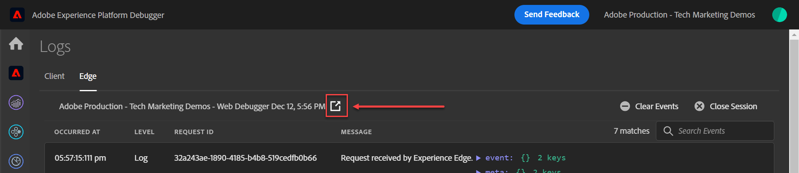
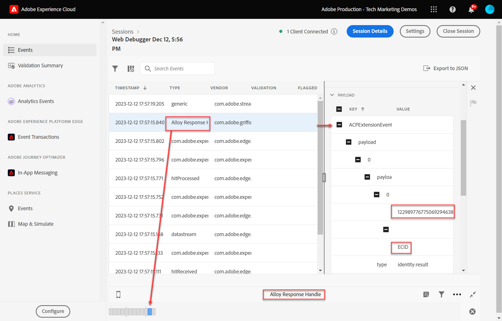

# Validate Web SDK implementations with Experience Platform Assurance

## Start an Assurance session

Adobe Experience Platform Assurance is a product from Adobe Experience Cloud to help you inspect, proof, simulate, and validate how you collect data or serve experiences. 

Read more about [Adobe Assurance](https://experienceleague.adobe.com/docs/experience-platform/assurance/home.html?lang=en). 

Every time you enable Edge Trace, an Assurance session is started in the background. 

To view the Assurance session,

1. With Edge Trace enabled, you can see an outgoing link icon on top. Select the icon to open Assurance. A new tab in your browser opens.

    

1. Select the row with the event called Adobe Response Handle. 
1. A menu shows up on the right. Select the `+` sign next to `[!UICONTROL ACPExtensionEvent]` 
1. Drill down by selecting `[!UICONTROL payload > 0 > payload > 0 > namespace]`. The ID shown under the last `0` corresponds to the `ECID`. You know that by the value that shows up under `namespace` matching `ECID`

    

    >[!CAUTION]
    >
    >You may see a truncated ECID value due to the width of your window. Simply select the handle bar in the interface and drag to the left to view the entire ECID. 

In future lessons, you use Assurance to validate fully processed payloads reaching an Adobe application enabled in your datastream.

With an XDM object now firing on a page, and with the knowledge of how to validate your data collection, you are ready to set up the individual Adobe applications using Platform Web SDK.