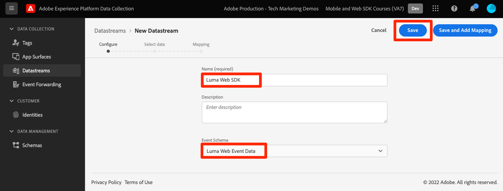
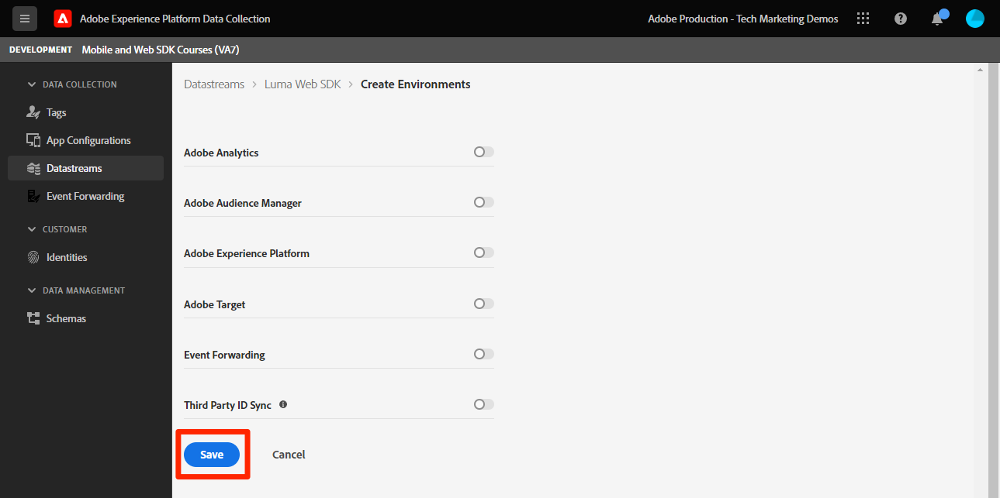
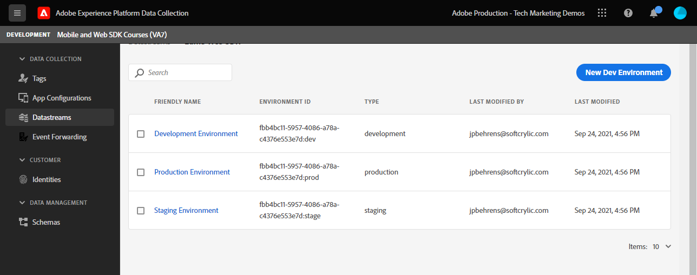
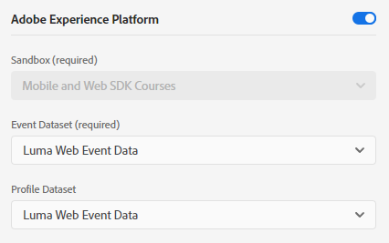

# Configure a datastream

Learn how to enable a datastream and configure Experience Cloud solutions.

Datastreams tell Adobe Experience Platform Edge Network where to send data collected by Platform Web SDK. In the datastreams configuration, you enable your Experience Cloud applications, your Experience Platform account, and event forwarding. See the [Fundamentals of Configuring a Datastream](https://experienceleague.adobe.com/docs/experience-platform/edge/fundamentals/datastreams.html?lang=en) for more detailed information.

## Learning objectives

At the end of this lesson, you will be able to:

* Create a datastream
* Enable your Experience Cloud applications
* Enable Experience Platform

## Prerequisites

Before you configure your datastream, you must have already completed the following lessons:

* [Configure permissions](configure-permissions.md)
* [Configure a schema](configure-schemas.md)
* [Configure an identity namespace](configure-identities.md)

## Create a datastream

Now you can create a datastream to tell Platform Edge Network where to send data collected by Web SDK.

**To create a datastream:**

1. Open the [Data Collection interface](https://launch.adobe.com/){target="_blank"}
1. Select the development sandbox you are using for the tutorial 

   >[!IMPORTANT]
   >
   >Make sure you are no longer in your Production sandbox

1. Go to **[!UICONTROL Datastreams]** in the left navigation
1. Select **[!UICONTROL New Datastream]** on the right hand-side of the screen.
1. Enter `Luma Web SDK` as the **[!UICONTROL Name]**. This name is referenced later when you configure the Web SDK extension in your tag property.
1. Select your `Luma Web Event Data` as the **[!UICONTROL Event Schema]** 
1. Select **[!UICONTROL Save]**

   

   >[!AVAILABILITY]
   >
   >The mapping feature will be incorporated into this tutorial at a later date.

On the next screen, you are able to add services such as Adobe applications to the datastream, however you will not add any services at this point in the tutorial. You will do so later in the lessons [Set up Experience Platform](setup-experience-platform.md), [Set up Analytics](setup-analytics.md), [Set up Audience Manager](setup-audience-manager.md), [Setup Target](setup-target.md), or [Event Forwarding](setup-event-forwarding.md).

   

   

>[!WARNING]
>
> While configuring the Adobe Experience Platform section of the datastream, it is important to know that once you select a **[!UICONTROL Sandbox]** the setting is permanent and cannot be changed. It is an intentional design-choice made to protect production datastreams, as any change to this setting has the potential to break data collection for a production use-case. 
>
>  

With the XDM schema defined, an identity namespace created, and a datastream configured, you are ready to install the Platform Web SDK extension in your tag property!

[Next: **Install Platform Web SDK extension in tags**](install-web-sdk.md)
