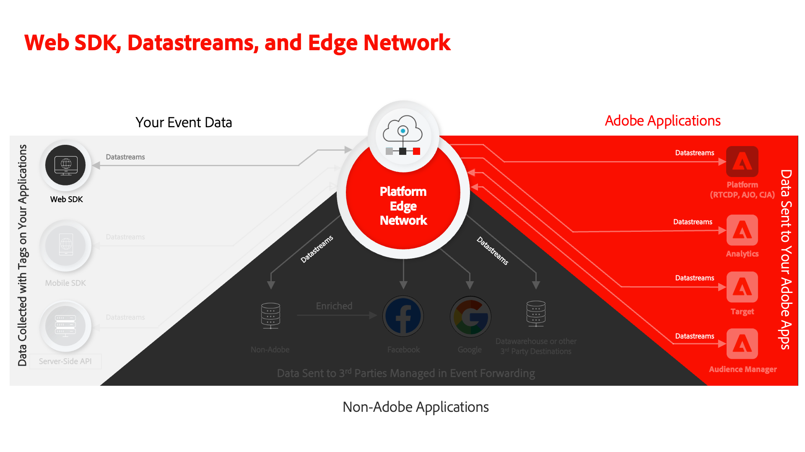
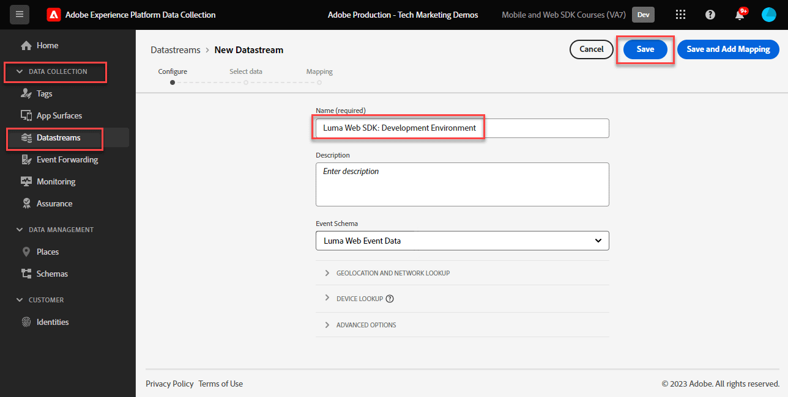

# Configure a datastream

Learn how to configure a datastream for Adobe Experience Platform Web SDK.

[Datastreams](https://experienceleague.adobe.com/en/docs/experience-platform/datastreams/overview) tell Adobe Experience Platform Edge Network where to send data collected by Platform Web SDK. In the datastreams configuration, you enable your Experience Cloud applications, your Experience Platform account, and event forwarding. 

## Learning objectives

At the end of this lesson, you will be able to:

* Create a datastream
* Get started with datastream overrides

## Prerequisites

Before you configure your datastream, you must have already completed the following lessons:

* [Configure a schema](configure-schemas.md)
* [Configure an identity namespace](configure-identities.md)

## Create a datastream

Now, you can create a datastream to tell Platform Edge Network where to send data collected by Web SDK.

**To create a datastream:**

1. Open the [Data Collection interface](https://launch.adobe.com/){target="_blank"}
1. Make sure you are in the correct sandbox 

   >[!NOTE]
   >
   >If you are the customer of a Platform-based application like Real-Time CDP or Journey Optimizer, we recommend using a development sandbox for this tutorial. If you are not, use the **[!UICONTROL Prod]** sandbox.

1. Go to **[!UICONTROL Datastreams]** in the left navigation
1. Select **[!UICONTROL New Datastream]**
1. Enter `Luma Web SDK: Development Environment` as the **[!UICONTROL Name]**. This name is referenced later when you configure the Web SDK extension in your tag property.
1. Select **[!UICONTROL Save]**

   

   >[!NOTE]
   >
   >You don't need to select a schema. A schema selection is only required if you are using the [Data Prep for Data Collection](/help/data-collection/edge/data-prep.md) feature.

On the next screen, you are able to add services such as Adobe applications to the datastream, however you will not add any services at this point. You will do so later in the lessons [Set up Experience Platform](setup-experience-platform.md), [Set up Analytics](setup-analytics.md), [Set up Audience Manager](setup-audience-manager.md), [Setup Target](setup-target.md), or [Event Forwarding](setup-event-forwarding.md).

>[!NOTE]
>
>When implementing Platform Web SDK on your own website, you should create three datastreams to map to your three tag environments (development, stage, and production). If you are using Platform Web SDK with Platform-based applications such as Adobe Real-Time Customer Data Platform or Adobe Journey Optimizer, you should be sure to create those datastreams in the appropriate Platform sandboxes.

## Override a datastream

[Datastream overrides](https://experienceleague.adobe.com/en/docs/experience-platform/datastreams/overrides) allow you to define additional configurations for your datastream and then override your default configuration under certain conditions. 

Datastream configuration override is a two-step process:

1. First, you define datastream overrides in the datastream service configuration. For example, you might define alternate Analytics report suites, Target workspaces, or Platform datasets to use as overrides.
1. Then, you send the overrides to the Edge Network either with a Web SDK send event action, or by a configuration in the Web SDK tag extension.

In the [Set up Adobe Analytics](setup-analytics.md) lesson, you override the report suite for a page using the Platform Web SDK Send Event Action.

You are now ready to install the Platform Web SDK extension in your tag property!

[Next: **Install Platform Web SDK extension in tags**](install-web-sdk.md)

>[!NOTE]
>
>Thank you for investing your time in learning about Adobe Experience Platform Web SDK. If you have questions, want to share general feedback, or have suggestions on future content, please share them on this [Experience League Community discussion post](https://experienceleaguecommunities.adobe.com/t5/adobe-experience-platform-data/tutorial-discussion-implement-adobe-experience-cloud-with-web/td-p/444996)
