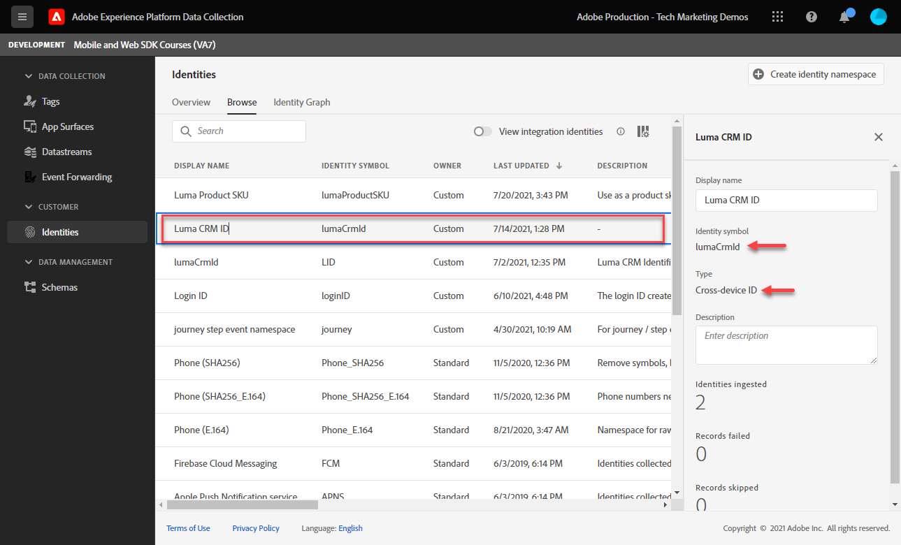

# Configure an identity namespace

Learn how to configure identity namespaces to use with Adobe Experience Platform Web SDK. 

The [Adobe Experience Cloud Identity Service](https://experienceleague.adobe.com/en/docs/id-service/using/home) sets a common visitor ID (the ECID) across SDK-based Adobe applications to power Experience Cloud capabilities such as audience-sharing between applications. You can also send your own customer IDs to the Service to enable cross-device targeting and integrations with other systems, such as your Customer Relationship Management (CRM) system.

The [Adobe Experience Platform Identity Service](https://experienceleague.adobe.com/en/docs/experience-platform/identity/home) (yes, there are two!) uses the ECIDs and customer IDs to generate identity graphs, allowing you to merge attributes and behaviors into Real-Time Customer Profiles.

>[!NOTE]
>
>A custom identity namespace is _not required_ to implement Adobe Analytics, Adobe Target, or Adobe Audience Manager with Web SDK (authenticated identities can be passed in the `data` object instead of the `xdm` object as you will see later). Identity namespaces are required for Platform-native applications like Journey Optimizer, Real-Time Customer Data Platform, Customer Journey Analytics. While you may decide not to use an identity namespace in your own implementation, you are expected to do so as part of this tutorial.

>[!NOTE]
>
> For demonstration purposes, the exercises in this lesson have you capture the identity details of a fictional customer logged into the [Luma Demo Site](https://luma.enablementadobe.com/content/luma/us/en.html) using the credentials, **user: `test@test.com` / password: test**. 

## Learning objectives

At the end of this lesson, you will be able to:

* Understand identity namespaces
* Create a custom identity namespace to capture an internal CRM Id

## Prerequisites

You must have already completed the previous lessons:

* [Configure Schemas](configure-schemas.md)

>[!IMPORTANT]
>
>The [Experience Cloud ID Extension](https://exchange.adobe.com/apps/ec/100160/adobe-experience-cloud-id-launch-extension) is not needed when implementing Adobe Experience Platform Web SDK, as the Web SDK JavaScript library contains the Visitor ID service functionality.
>
> If your website is already using the Experience Cloud ID Service on your website&mdash;either through Visitor API or the Experience Cloud ID Service tag extension&mdash;and you would like to continue using it while migrating to Adobe Experience Platform Web SDK, you must use the latest version of Visitor API or the Experience Cloud ID Service tag extension. See [ID Migration](https://experienceleague.adobe.com/en/docs/experience-platform/edge/identity/overview) for more information.

## Create an identity namespace

In this exercise, you create an identity namespace for Luma's custom identity field, `lumaCrmId`. Identity namespaces play a critical role in building real-time customer profiles, as two matching values in the same namespace allow two data sources to form an identity graph.

Before you begin the exercises, watch this short video to learn more about identity in Adobe Experience Platform:

>[!VIDEO](https://video.tv.adobe.com/v/27841?learn=on&enablevpops)

Now, create a namespace for the Luma CRM ID:

1. Open the [Data Collection interface](https://experience.adobe.com/data-collection/){target="_blank"}
1. Select the sandbox that you are using for the tutorial

   >[!NOTE]
   >
   >If you are the customer of a Platform-based application like Real-Time CDP or Journey Optimizer, we recommend using a development sandbox for this tutorial. If you are not, use the **[!UICONTROL Prod]** sandbox.
   
1. Select **[!UICONTROL Identities]** in the left navigation
1. Select **[!UICONTROL Browse]**

   A list of identity namespaces appears in the main interface of the page, showing their names, identity symbols, last updated date, and whether they are standard or custom namespaces. The right rail contains information on [!UICONTROL Identity graph strength].

1. Select **[!UICONTROL Create identity namespace]**

   

1. Provide details as follows and select **[!UICONTROL Create]**.
   
   | Field         |  Value    |  
   |---------------|-----------|
   | Display name  | Luma CRM ID   | 
   | Identity symbol| lumaCrmId    |  
   | Type           | Individual cross-device ID |  

   

   The Identity namespace populates in the **[!UICONTROL Identities]** screen.

   

>[!NOTE]
>
> In the [Create Identities](create-identities.md) lesson, you will learn how to use this namespace when sending identities to Platform Edge Network. 

Now that identities are in place, the datastream can be configured.

[Next: **Configure a datastream**](configure-datastream.md)

>[!NOTE]
>
>Thank you for investing your time in learning about Adobe Experience Platform Web SDK. If you have questions, want to share general feedback, or have suggestions on future content, please share them on this [Experience League Community discussion post](https://experienceleaguecommunities.adobe.com/t5/adobe-experience-platform-data/tutorial-discussion-implement-adobe-experience-cloud-with-web/td-p/444996)
