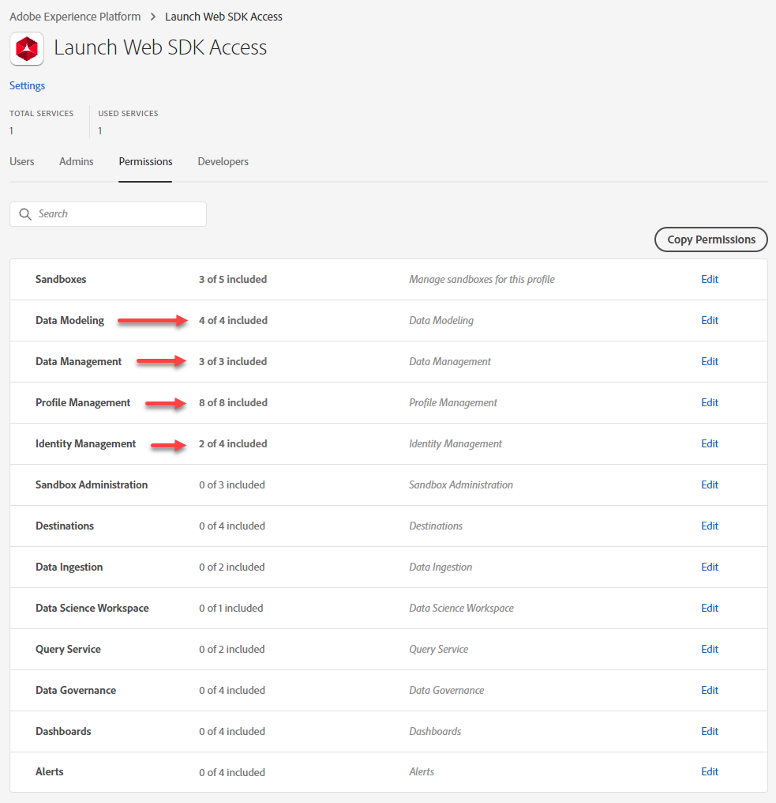
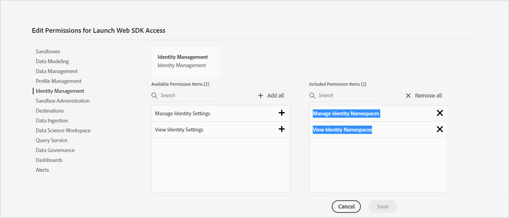

# Configure permissions for the tutorial

Learn how to request access to Experience Platform Web SDK and configure the permission required to complete this tutorial. To implement Platform Web SDK using tags in the Data Collection interface, you must:

* [Complete this form to request access to Data Collection](http://adobe.ly/websdkaccess) and the new features required to power Experience Platform Web SDK.
* Have permission to **[!UICONTROL Develop]**, **[!UICONTROL Edit]**, **[!UICONTROL Approve]**, **[!UICONTROL Publish]**, **[!UICONTROL Manage Extensions]**, and **[!UICONTROL Manage Environments]** tag properties. For more information tags permissions, see [the documentation](https://experienceleague.adobe.com/docs/experience-platform/tags/admin/user-permissions.html).
* If you will be completing the optional event forwarding lesson, have a product license which includes edge forwarding and permission item **[!UICONTROL Platforms]** > **[!UICONTROL Edge]**

* Have at least the following permission items in Adobe Experience Platform. These features are provisioned when you [request access to Data Collection](http://adobe.ly/websdkaccess)). One provisioned, assign access control in the [Admin Console](https://adminconsole.adobe.com):

  * Access to the **default production** and at **least one development** **[!UICONTROL sandbox]**
  * Access to all permission items for **[!UICONTROL Data Modeling]**, **[!UICONTROL Data Management]**, and **[!UICONTROL Profile Management]**:
   
  * Access to **[!UICONTROL Manage Identity Namespaces]** and **[!UICONTROL View Identity Namespaces]** under **[!UICONTROL Identity Management]**:
  
    

   For more information on Platform access control, see [the documentation](https://experienceleague.adobe.com/docs/experience-platform/access-control/home.html).  

* For the optional Adobe Analytics lesson, you must have [admin access to Report Suite Settings, Processing Rules, and Analysis Workspace](https://experienceleague.adobe.com/docs/analytics/admin/admin-console/home.html)
* For the optional Adobe Target lesson, you must have [Editor or Approver](https://experienceleague.adobe.com/docs/target/using/administer/manage-users/enterprise/properties-overview.html#section_8C425E43E5DD4111BBFC734A2B7ABC80) access 
* For the optional Audience Manager lesson, you must have access to create, read, and write traits, segments, and destinations. For more information, refer to the tutorial on [Audience Manager's Role-Based Access Control](https://experienceleague.adobe.com/docs/audience-manager-learn/tutorials/setup-and-admin/user-management/setting-permissions-with-role-based-access-control.html?lang=en).

Now you are ready to start the initial configuration steps.

[Next: **Configure an XDM schema**](configure-schemas.md)