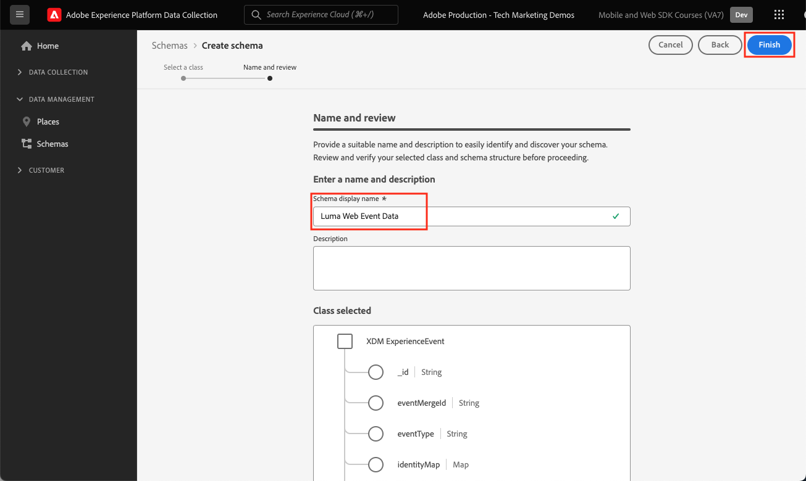
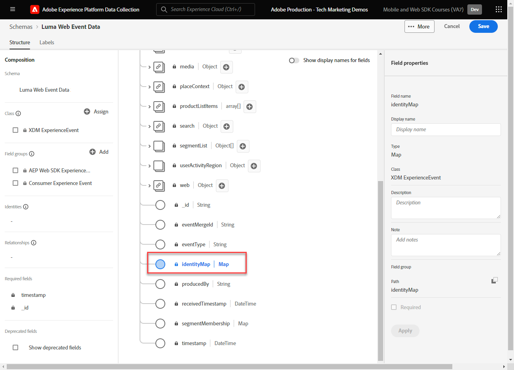
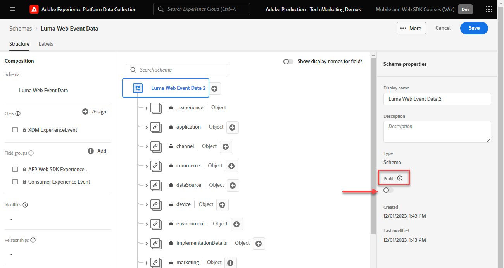

# Create an XDM schema for web data

Learn how to create an XDM schema for web data in the Adobe Experience Platform Data Collection interface.

Experience Data Model (XDM) schemas are the building blocks, principles, and best practices for collecting data in Adobe Experience Platform.

Platform Web SDK uses your schema to standardize your web event data, send it to the Platform Edge Network, and ultimately forward the data to any Experience Cloud applications configured in the datastream. This step is critical as it defines a standard data model required for ingesting customer experience data into Experience Platform and enables downstream services and applications built on these standards. 

>[!NOTE]
>
>An XDM schema is _not required_ to implement Adobe Analytics, Adobe Target, or Adobe Audience Manager with Web SDK (data can be passed in the `data` object instead of the `xdm` object as you will see later). An XDM schema is required for the most performant implementations of Platform-native applications like Journey Optimizer, Real-Time Customer Data Platform, Customer Journey Analytics. While you may decide not to use an XDM schema in your own implementation, you are expected to do so as part of this tutorial.

## Why model the data?

Businesses have their own language for communicating about their domain. Car dealerships deal with makes, models, and cylinders. Airlines deal with flight numbers, class of service, and seating assignments. Some of these terms are unique to a specific company, some are shared among an industry vertical, and some are shared by almost all businesses. For terms that are shared among an industry vertical or even broader, you can start doing powerful things with your data when you name and structure these terms in a common way.

For example, many businesses deal with orders. What if, collectively, these businesses decided to model an order in a similar way? For example, what if the data model consisted of an object with a `priceTotal` property that represented the total price of the order? What if that object also had properties named `currencyCode` and `purchaseOrderNumber`? Maybe the order object contains a property named `payments` that would be an array of payment objects. Each object would represent a payment for the order. For example, perhaps a customer paid for part of the order with a gift card and the rest using a credit card. You can start to construct a model that looks something like this:

```json
{
  "order": {
    "priceTotal": 89.50,
    "currencyCode": "EUR",
    "purchaseOrderNumber": "JWN20192388410012",
    "payments": [
      {
        "paymentType": "gift_card",
        "paymentAmount": 50
      },
      {
        "paymentType": "credit_card",
        "paymentAmount": 39.50
      }
    ]
  }
}
```

If all businesses dealing with orders decided to model their order data in a consistent way for terms that are common in the industry, magical things could start to happen. Information could more fluidly be exchanged inside and outside your organization instead of constantly interpreting and translating the data (props and evars, anyone?). Machine learning could more easily understand what your data _means_ and provide actionable insights. User interfaces for surfacing relevant data could become more intuitive. Your data could be seamlessly integrated with partners and vendors who are following the same modeling.

This is the goal of Adobe's [Experience Data Model](https://business.adobe.com/products/experience-platform/experience-data-model.html). XDM provides prescriptive modeling for data that is common in the industry, while also allowing you to extend the model for your specific needs. Adobe Experience Platform is built around XDM and, as such, data sent into Experience Platform needs to be in XDM. Rather than thinking about where and how you can transform your current data models into XDM before sending the data to Experience Platform, consider more pervasively adopting XDM across your organization so that translation rarely needs to occur.


>[!NOTE]
>
> For demonstration purposes, the exercises in this lesson build an example schema to capture content viewed and products purchased by customers in the [Luma Demo Site](https://luma.enablementadobe.com/content/luma/us/en.html). While you can use these steps to create a different schema for your own purposes, it is recommended that you first follow along with creating the example schema to learn the capabilities of the schema editor.

To learn more about XDM schemas, watch the playlist [Model Your Customer Experience Data with XDM](https://experienceleague.adobe.com/en/playlists/experience-platform-model-your-customer-experience-data-with-xdm) or see the [XDM System overview](https://experienceleague.adobe.com/en/docs/experience-platform/xdm/home).

## Learning objectives

At the end of this lesson, you will be able to:

* Create an XDM schema from within the Data Collection interface
* Add field groups to your XDM schema
* Create XDM schemas for web event data using best practices

## Prerequisites

All necessary provisioning and user permissions for Data Collection and Adobe Experience Platform described on the [overview](overview.md) page.

## Create an XDM schema

XDM schemas are the standard way to describe data in Experience Platform, allowing all data that conforms to the schemas to be reused across an organization without conflicts, or even shared between multiple organizations. To learn more, see the [basics of Schema composition](https://experienceleague.adobe.com/en/docs/experience-platform/xdm/schema/composition). 

In this exercise, you will create an XDM schema using the recommended baseline field groups for capturing web event data on the [Luma Demo Site](https://luma.enablementadobe.com/content/luma/us/en.html){target="_blank"}:

1. Open the [Data Collection interface](https://experience.adobe.com/data-collection/){target="_blank"}
1. Ensure you are in the correct sandbox. Locate the sandbox in the upper right corner

   >[!NOTE]
   >
   >If you are the customer of a Platform-based application like Real-Time CDP or Journey Optimizer, we recommend using a development sandbox for this tutorial. If you are not, use the **[!UICONTROL Prod]** sandbox.
   
1. Go to **[!UICONTROL Schemas]** in the left navigation
1. Select the **[!UICONTROL Create Schema]** button on the top right

    
1. Select **[!UICONTROL Experience Event]** in the following screen
1. Select **[!UICONTROL Next]**

    

1. Enter the name for your schema under **[!UICONTROL Schema display name]** field, in this case `Luma Web Event Data`

    >[!TIP]
    >
    >A common naming convention for XDM schemas is to name the schema after the source of the data.


1. Select Finish

    

## Add field groups

As noted earlier, XDM is the core framework that standardizes customer experience data by providing common structures and definitions for use in downstream Adobe Experience Platform services. By adhering to XDM standards, _all customer experience data_ can be incorporated into a common representation. This approach allows you to gain valuable insights from customer actions, define customer audiences through segments, and express customer attributes for personalization purposes using data from multiple sources. See [Best practices for data modeling](https://experienceleague.adobe.com/en/docs/experience-platform/xdm/schema/best-practices) for more information.

When possible, it is recommended to use existing field groups and adhere to a product-agnostic model and naming conventions. For any data specific to your organization that does not fit into the pre-defined field groups above, you can create a custom field group. See [Creating a schema using the Schema Editor](https://experienceleague.adobe.com/en/docs/experience-platform/xdm/tutorials/create-schema-ui#create) for more detailed steps on custom schemas.

>[!TIP]
> 
>In this exercise, you add the recommended pre-defined field groups for web data collection: _**[!UICONTROL AEP Web SDK ExperienceEvent]**_ and _**[!UICONTROL Consumer Experience Event]**_.
>


1. In the **[!UICONTROL Field groups]** section, select **[!UICONTROL Add]**

    

1. Search for [!UICONTROL `AEP Web SDK ExperienceEvent`]
1. Check the box
1. Search for [!UICONTROL `Consumer Experience Event`]
1. Check the box
1. Select **[!UICONTROL Add field groups]** 

    

With both field groups, notice that you have access to the most commonly used key-value pairs required for data collection on the web. The [!UICONTROL display name] of each field appears to marketers in the segment builder interface of Platform-based applications and you can change the display name of standard fields to suit your needs. You can also remove fields you don't want. When you click on either field group name, the interface highlights what key-value pair groupings belong to it. In below example, you see what fields belong to **[!UICONTROL Consumer Experience Event]**.


This lesson is just a starting point. When building your own web events schema, you must explore and document your business requirements. This process is similar to creating a [Business Requirements Document](https://experienceleague.adobe.com/en/docs/analytics-learn/tutorials/implementation/implementation-basics/creating-a-business-requirements-document) and [Solution Design Reference](https://experienceleague.adobe.com/en/docs/analytics-learn/tutorials/implementation/implementation-basics/creating-and-maintaining-an-sdr) for an Adobe Analytics implementation, but should include requirements for _all downstream data recipients_ such as Platform, Target, and event forwarding destinations.


### The identityMap object

There is a special field used to identify web users called `[!UICONTROL identityMap]`.



It is a must-have object for any web-related data collection, as it houses the Experience Cloud ID required for identifying users on the web. It is also the key to setting internal customer IDs for authenticated users. `[!UICONTROL identityMap]` is discussed more in the [Configure Identities](configure-identities.md) lesson. It is automatically included in all schemas using the **[!UICONTROL XDM ExperienceEvent]** class.


>[!IMPORTANT]
>
> It is possible to enable **[!UICONTROL Profile]** for a schema before saving your schema. **Do not** enable it at this point. Once a schema is enabled for Profile, it cannot be disabled or deleted without resetting the entire sandbox. Fields cannot be removed from schemas at this point either, although it is possible to [Deprecate Fields in the UI](https://experienceleague.adobe.com/en/docs/experience-platform/xdm/tutorials/field-deprecation-ui#deprecate). These implications are important to keep in mind later on when you are working with your own data in your Production environment. 
>
>
>This setting is discussed more during the [Setup Experience Platform](setup-experience-platform.md) lesson.
>

To complete this lesson, select **[!UICONTROL Save]** on the top right.


Now, you are able to reference this schema when you add the Web SDK extension to your tag property. 

>[!NOTE]
>
>Thank you for investing your time in learning about Adobe Experience Platform Web SDK. If you have questions, want to share general feedback, or have suggestions on future content, please share them on this [Experience League Community discussion post](https://experienceleaguecommunities.adobe.com/t5/adobe-experience-platform-data/tutorial-discussion-implement-adobe-experience-cloud-with-web/td-p/444996)
