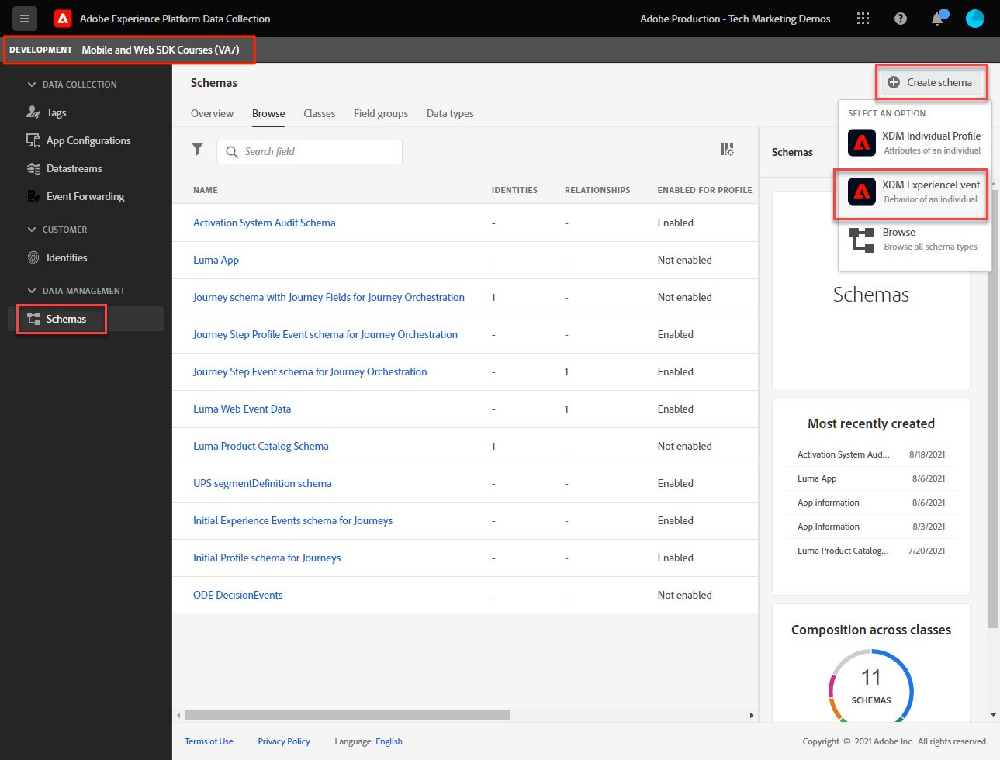
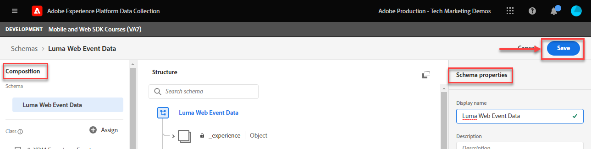

# Create an XDM schema for web data

Learn how to create an XDM schema for web data in the Data Collection interface.

Experience Data Model (XDM) schemas are the building blocks, principles, and best practices for composing schemas in Adobe Experience Platform.

Platform Web SDK uses your schema to standardize your web event data, send it to the Platform Edge Network, and ultimately forward the data to any Experience Cloud applications configured in the datastream. This step is critical as it defines a standard data model required for ingesting customer experience data into Experience Platform and enables downstream services and applications built on these standards. 

>[!NOTE]
>
> For demonstration purposes, the exercises in this lesson build an example schema to capture content viewed and products purchased by customers in the [Luma Demo Site](https://luma.enablementadobe.com/content/luma/us/en.html). While you can use these steps to create a different schema for your own purposes, it is recommended that you first follow along with creating the example schema to learn the capabilities of the schema editor.

To learn more about XDM schemas,  take the course "[Model Your Customer Experience Data with XDM](https://experienceleague.adobe.com/?recommended=ExperiencePlatform-D-1-2021.1.xdm)" or see the [XDM System overview](https://experienceleague.adobe.com/docs/experience-platform/xdm/home.html?lang=en).

## Learning objectives

At the end of this lesson, you will be able to:

* Create an XDM schema from within the Data Collection interface
* Add field groups to your XDM schema
* Create XDM schemas for web event data using best practices

## Prerequisites

All necessary provisioning and user permissions for Data Collection and Adobe Experience Platform described in the [Configure Permissions](configure-permissions.md) lesson.

## Create an XDM schema

XDM schemas are the standard way to describe data in Experience Platform, allowing all data that conforms to the schemas to be reused across an organization without conflicts, or even shared between multiple organizations. To learn more, see the [basics of Schema composition](https://experienceleague.adobe.com/docs/experience-platform/xdm/schema/composition.html?lang=en). 

In this exercise, you will create an XDM schema using the recommended baseline field groups for capturing web event data on the [Luma Demo Site](https://luma.enablementadobe.com/content/luma/us/en.html){target="_blank"}:

1. Open the [Data Collection interface](https://launch.adobe.com/){target="_blank"}
1. Make sure the you are in the correct sandbox 

   >[!NOTE]
   >
   >If you are the customer of a Platform-based application like Real-time CDP, we recommend using a development sandbox for this tutorial.
   
1. Go to **[!UICONTROL Schemas]** in the left navigation
1. Select the **[!UICONTROL Create Schema]** button on the top right
1. From the dropdown menu, select **[!UICONTROL XDM ExperienceEvent]**

## Add field groups

As noted earlier, XDM is the core framework that standardizes customer experience data by providing common structures and definitions for use in downstream Adobe Experience Platform services. By adhering to XDM standards, _all customer experience data_ can be incorporated into a common representation. This approach allows you to gain valuable insights from customer actions, define customer audiences through segments, and express customer attributes for personalization purposes using data from multiple sources. See [Best practices for data modeling](https://experienceleague.adobe.com/docs/experience-platform/xdm/schema/best-practices.html?lang=en) for more information.

When possible, it is recommended to use existing field groups and adhere to a product-agnostic model and naming conventions. For any data specific to your organization that does not fit into the pre-defined field groups above, you can create a custom field group. See [Creating a schema using the Schema Editor](https://experienceleague.adobe.com/docs/experience-platform/xdm/tutorials/create-schema-ui.html?lang=en#create) for more detailed steps on custom schemas.

>[!TIP]
> 
>In this exercise, you add the recommended pre-defined field groups for web data collection: _**[!UICONTROL AEP Web SDK ExperienceEvent Mixin]**_, and _**[!UICONTROL Consumer Experience Event]**_.

1. Keep **[!UICONTROL Use existing field group]** radio button selected
1. Search for [!UICONTROL `AEP Web SDK ExperienceEvent Mixin`]
1. Check the box
1. Search for [!UICONTROL `Consumer Experience Event`]
1. Check the box
1. Select **[!UICONTROL Add field groups]** 

    

With the field groups selected, you are ready to name your schema. A common naming convention for XDM schemas is to name the schema after the source of the data:

1. In the **[!UICONTROL Composition**] panel, select the `Untitled schema name` 
1. In the **[!UICONTROL Schema properties]** panel, enter the **[!UICONTROL Display Name]** `Luma Web Event Data`
1. Select **[!UICONTROL Save]**

With both field groups, notice that you have access to the most commonly used key-value pairs required for data collection on the web. When you click on either field group name, the interface highlights what key-value pair groupings belong to it. In below example, you see what groups belong to **[!UICONTROL Consumer Experience Event]**.

This lesson is just a starting point. When building your own web events schema, you must explore and document your business requirements. This process is similar to creating a [Business Requirements Document](https://experienceleague.adobe.com/docs/analytics-learn/tutorials/implementation/implementation-basics/creating-a-business-requirements-document.html) and [Solution Design Reference](https://experienceleague.adobe.com/docs/analytics-learn/tutorials/implementation/implementation-basics/creating-and-maintaining-an-sdr.html) for an Adobe Analytics implementation, but should include requirements for _all downstream data recipients_ such as Platform, Target, and event forwarding destinations.

### The identityMap object

There is a special set of data required to identify web users called `[!UICONTROL identityMap]`.

It is a must-have object for any web-related data collection, as it houses the Experience Cloud ID required for identifying users on the web. It is also the key to setting internal customer IDs for authenticated users. `[!UICONTROL identityMap]` is discussed more in the [Configure Identities](configure-identities.md) lesson. It is automatically included in all schemas using the **[!UICONTROL XDM ExperienceEvent]** class.

>[!IMPORTANT]
>
> It is possible to enable **[!UICONTROL Profile]** for a schema before saving your schema. **Do not** enable it at this point. Once a schema is enabled for Profile, it cannot be disabled or deleted. Also, fields cannot be removed from the schema after this point. These implications are important to keep in mind later on when you are working with your own data in your Production environment. 
>
>This setting is discussed more during the [Setup Experience Platform](setup-experience-platform.md) lesson.
>

Now you are able to reference this schema when you add the Web SDK extension your tag property. 

[Next: **Configure an identity namespace**](configure-identities.md)

>[!NOTE]
>
>Thank you for investing your time in learning about Adobe Experience Platform Web SDK. If you have questions, want to share general feedback, or have suggestions on future content, please share them on this [Experience League Community discussion post](https://experienceleaguecommunities.adobe.com/t5/adobe-experience-platform-launch/tutorial-discussion-implement-adobe-experience-cloud-with-web/td-p/444996)
