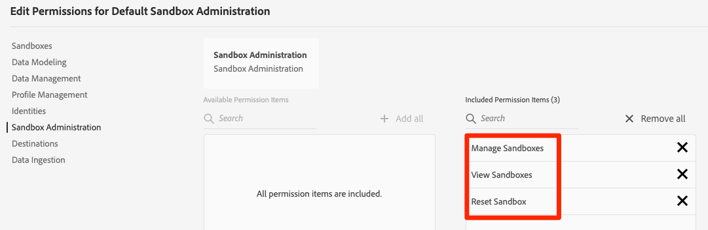

# Adobe Experience Platform: Hands-on Technical Exercise: Environment Access

## Overview

The sandbox feature of Adobe Experience Platform allows you to isolate data into virtual environments. Experience Platform has two types of sandboxes, a single production and multiple non-production (or development) sandboxes. Non-production sandboxes allow you to test features, run experiments, and make custom configurations without impacting your production sandbox. In this exercise, you will create a non-production sandbox so that you can complete the rest of the tutorial without impacting your production environment.

Non-production sandboxes have a reset feature that removes all customer-created resources from the sandbox.  After you are done with this tutorial, you can safely delete the sandbox, if you wish. 

Moving forward for this and future exercises, your non-production sandbox will just be referred to as either a **[!UICONTROL development sandbox]** or just a **[!UICONTROL sandbox]**.

## Prerequisites

To complete this exercise you must have:

1. Sandbox Administration access in the [Admin Console](https://adminconsole.adobe.com/). Your user must be in a group that includes **[!UICONTROL Manage Sandboxes]**, **[!UICONTROL View Sandboxes]**, and **[!UICONTROL Reset Sandbox]** permission items
   
1. Admin privileges to give yourself access to the sandbox

## Create a new sandbox

To create a new sandbox in the UI, click **[!UICONTROL Sandboxes]** in the left-nav, then click **[!UICONTROL Create Sandbox]**. 

>[!NOTE] If you do not see the **[!UICONTROL Sandboxes]** option in the left navigation, make sure that you have been given the Sandbox Administration access as described above in the Prerequisites section.

The _[!UICONTROL Create Sandbox]_ dialog appears, prompting you to provide a name and title for the sandbox. The sandbox **[!UICONTROL Name]** is an all-lowercase identifier for use in API calls, and should therefore be unique and concise. The **[!UICONTROL Name]** is meant to be human-readable and should be descriptive enough to be easily identifiable. 

When finished, click **[!UICONTROL Create]**.

>[!NOTE] Since you are restricted to creating non-production sandbox types only, the **type** option is locked at "Non-Production" and cannot be manipulated.

Once you have finished creating the sandbox, refresh the page and the new sandbox appears in the _Sandboxes_ dashboard with a status of "Creating". New sandboxes take approximately 15 minutes to be provisioned by the system, after which their status changes to "Active".

## Provide Yourself Access to Experience Platform and Launch

In this section you will provide yourself access to the product contexts that you'll need to complete the next several sets of exercises. 

1. Locate the email you received informing you that you have administrative rights to a WWFO vLab ### Experience Cloud Organization
 
   >[!NOTE] ### is a 3-digit ID for one of the Platform-enabled Experience Cloud Orgs that you were assigned for these exercises. 

1. Click on the **[!UICONTROL Get Started]** button or just navigate to [adminconsole.adobe.com](https://adminconsole.adobe.com) and login. Make sure you are in the Admin console for the WWFO vLab ### you were assigned (dropdown in the upper right corner)
1. Locate the **[!UICONTROL Adobe Experience Platform]** card and click on **[!UICONTROL Assign Users]** button:

   

1. On the next screen, enter your personal Adobe ID in the search box and select it when it appears.
1. In the **[!UICONTROL Search or select profiles]** dropdown appears, select the **[!UICONTROL Default Production All Access,]** and **[!UICONTROL Sandbox Administrators]** profiles:

   

1. Click **[!UICONTROL Save]** to save the user. You'll be redirected back to the Overview page. You should then receive an email indicating that you've received access to Adobe Experience Platform
1. While on the overview page, click into the `Adobe Experience Platform Launch – Adobe Internal – vlab###` tile to begin the process of giving yourself access to Launch for this Experience Cloud Org
   
   >[!NOTE] In later exercises you'll be deploying the AEP Web SDK Library for real-time data collection from a site via a Launch property. For now, you're just granting yourself access to Launch while you're in the admin console.

1. Click into the only product profile available to you. Next, click the **[!UICONTROL Add User]** button and select yourself as a user. Once added, you'll be redirected back to the product profile page.
1. Click on the **[!UICONTROL Permissions]** tab. If you can see that the permission look like this…:

   
…please move on to the next step. If they do NOT look like the above screenshot, please perform the following actions:

    1. Click into the **[!UICONTROL Property Rights]** permission group
    2. Click the **[!UICONTROL +Add All]** button to move all 5 of the permissions to the **[!UICONTROL included]** column
    3. In the left rail, click on the **[!UICONTROL Company Rights]** link and then add the **[!UICONTROL Manage Properties]** item to the **[!UICONTROL included]** list
    4. Click **[!UICONTROL Save]** and you should see that your permissions look like the screenshot shown earlier in this step

        >[!NOTE] Since these are shared instances, these permissions will have been (or will need to be) configured by the first person of those sharing this organization to reach this point. 

1. Now that you've granted yourself the requisite permissions, open a new tab and navigate to wwfovlab###.experiencecloud.adobe.com. Log in if necessary.
1. If you’re in the correct Experience Cloud Org, you should have access to **[!UICONTROL Experience Platform]**, **[!UICONTROL Launch]**, **[!UICONTROL Admin Tool]**, **[!UICONTROL Admin console]**, and a few other Adobe Services:

   

1. Click the **[!UICONTROL Launch]** icon followed by the blue **[!UICONTROL Go to Launch]** button
1. On the **[!UICONTROL Launch]** landing page, ensure that the **[!UICONTROL Add New Property]** button is active. Do NOT create a new property at this time. This is just a check to make sure you have the right permissions. If the Add New Property button is not active, return to the tab housing your Admin Console and review the previous steps in this section related to Launch permissions. Perform any steps you may have missed then revisit this page. Once you can log into Launch and the Add New Property button is active, you can move on.
1. Click on the **[!UICONTROL Solution Switcher]** and select **[!UICONTROL Experience Platform.]** You'll be redirected to platform.adobe.com. You should now see the Experience Platform Home screen.

   

    >[!TIP] Whenever you switch products, it's always a good idea to make sure you're in the correct Experience Cloud Organization.
    
    >[!NOTE] You could also navigate directly to platform.adobe.com or return to the Experience Cloud Overview page and clicked on the Experience Platform link there.
        
1. Notice in the upper left corner of your screen is a dropdown indicating that you are in the production environment for Platform:

   

If you click on that dropdown, you'll notice that you have no other options for changing the environment. Since a production environment is not where you want to learn and practice Platform skills, the next section will walk you through creating a sandbox environment as well as giving yourself permission to that sandbox. For now, though, just being on this screen is enough validation that you've giving yourself access to Platform. 
 
   >[!TIP] Stay on this screen, quickly move to the next section, and perform the steps needed to request a sandbox as the wait time to provision a sandbox once you request it is about 20 minutes. 
   
   >[!NOTE] Even if you were the last person of your group of users assigned to this org to reach this point, you still won't see any sandbox environments. The dropdown only shows you environments that you have access to. 

## Create a Sandbox for Development

In this section, you're going to create your own Experience Platform Sandbox environment. 

1. If necessary, log into platform.adobe.com and ensure you are in your assigned WWFO vLab### organization.
2. Click on **[!UICONTROL ADMINISTRATION]** > **[!UICONTROL Sandboxes]** in the left menu:

   

3. In the subsequent Sandboxes screen, click on **[!UICONTROL Create sandbox]**:

   

4. Give the new sandbox a **[!UICONTROL Name]** and **[!UICONTROL Title]**. Notice that the name field is more like an ID since it has very specific requirements. It's also what'll be used in any API calls that you'd make to programmatically configure a sandbox. The title is what you'll see as the friendly name. As far as naming requirements go for this exercise, be sure to include your ldap somewhere in both the name and title. This will help with troubleshooting and environment cleanup later on. It would also be appropriate (though not required) to mention that this is a development environment for Luma. A good example is something like this:

   

   >[!NOTE] You may see different sandbox names throughout this and other exercise documents in the screenshots. That's okay. Take note of what you named your sandbox and you'll be able to follow the instructions.

5. Once you've named and titled your sandbox, click the **[!UICONTROL Create]** button. 
6. Sandbox creation can take a up to 20 minutes. You can monitor the status (along with Sandboxes created by others) by clicking the **[!UICONTROL Browse]** tab:

   

7. Refresh the page after some time and you should see your newly created Sandbox STATE as **[!UICONTROL Active]** with a green dot.

   

8. Click back on the environment dropdown and you'll notice that even though you just created a sandbox, it is not there for you to see. The Sandbox Administrators permission you gave yourself earlier only allows you _create_ sandboxes, not access them. To do that, you're going to need to return to the Admin Console and give yourself access as outlined in the next section.

## Grant Yourself Access to Your Development Sandbox

To give yourself access to your newly created sandbox, please perform the following steps:

1. If not already, sign into your Experience Cloud Org and access the Adobe Admin Console.
2. Click the **[!UICONTROL Products]** tab at the top, making sure the **Adobe Experience Platform** product is selected. You should see the available product profiles listed. Click on **[!UICONTROL New Profile]**:

   

   >[!NOTE] You will see a profile for each person you share this org with and who has completed these exercises already. If you are the first, you'll see only the default profiles that you already gave yourself permission to.

3. On the next screen, enter appropriate **[!UICONTROL Profile Name]** and **[!UICONTROL Description]**. Again, it doesn't matter what you call it so long as it *contains your ldap*. Click **[!UICONTROL Next]** when ready:

   

4. On the Services screen, leave the available services enabled but take a moment to note what these services are as you'll be using some of them in later exercises (and so you know where and how to enable them for customers). Click **[!UICONTROL Done]**:

   

5. In the **[!UICONTROL Configure profile]** screen, find the Sandbox that you just created (and ONLY your sandbox) in the list and click on the **[!UICONTROL +]** sign next to it in order to add it to the profile. 

   

6. Going down the list of profile options in the left rail, use the **[!UICONTROL + Add All]** option in each to add all of the available profile options to your profile. Do this for all profile options *EXCEPT* for Sandbox Administration. As you do so, take note of what you are enabling. Many of them will be new terms or things you've only heard about, but you will be using almost all of them in the coming exercises:

   

   >[!NOTE] We're not having you add Sandbox Administration items because we need to keep everyone's sandbox as independent as possible. This will prevent things like accidentally deleting, viewing, or modifying anyone else's sandbox.

7. Once all the options for all of the profiles, except for the Sandbox administration items, have been added to your profile, click **[!UICONTROL Save.]** The profile will then be saved, and you will be redirected to the profile screen. Assuming you gave yourself all the correct permissions, your profile should look similar to this:

   

8. Click on the **[!UICONTROL Users]** tab and click the **[!UICONTROL Add User]** button. 

   

9. On the next screen, add your user to the profile then click **[!UICONTROL Save]**:

   

10. With your user added to your newly created profile, return to the Experience Platform interface. If you are still logged in from previous steps, log out of all tabs (including Admin Console) and then log back into Experience Platform so that your new profile settings can take effect. 
11. As always, ensure you are in the proper organization in the upper right corner. 
12. Click on the Sandbox selection dropdown. You should be able to see the sandbox you just created:

    

    If you haven’t’ already done so, select your new sandbox.

    >[!NOTE] Even after your sandbox has been created, it can take a few additional minutes for the new permissions to take effect and your sandbox environment to appear in the dropdown. If you're not seeing the sandbox in the dropdown, now would be a great time to take a small break and try again in a few minutes.

13. The resulting page should look very similar to the production sandbox. Take a moment to notice how all of the items in the left rail correspond to both the services you enabled when you created in the profile AND the profile configurations that you added:

    

14. Once you have a sandbox created and have verified that you have access to it and all of the services, tools, and configurations, you've completed this exercise and given yourself access to Adobe Experience Platform!
