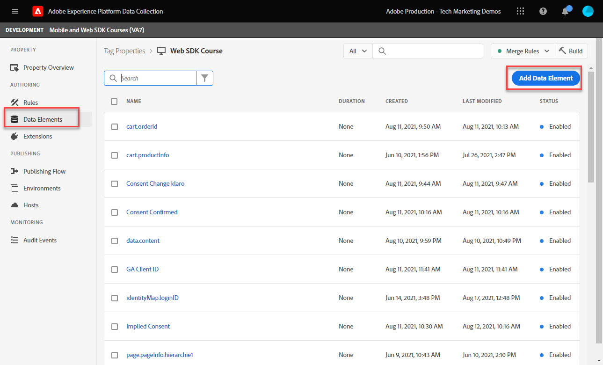
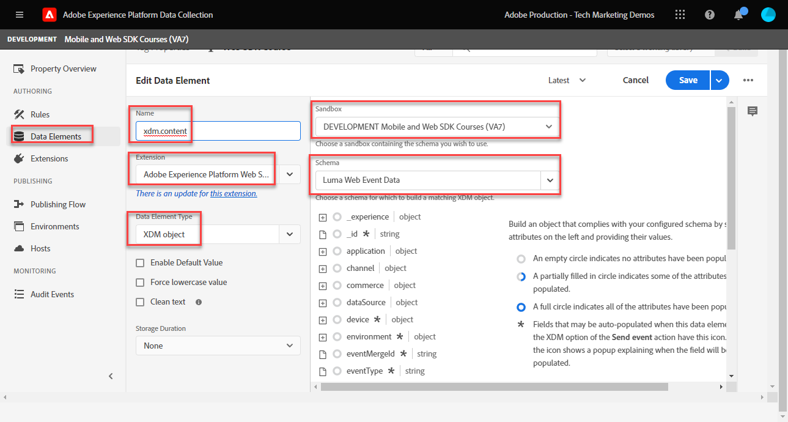
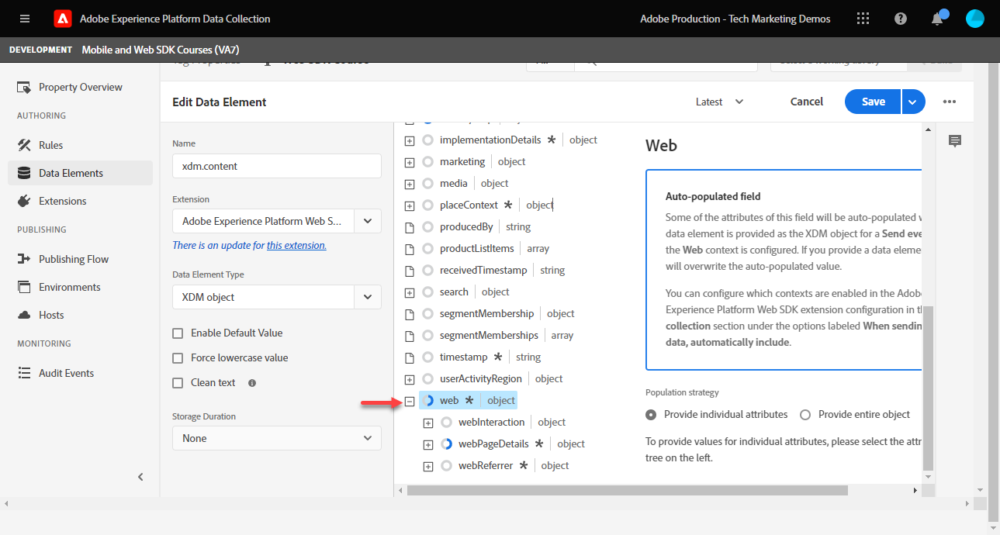

# Create data elements

Learn how to create the essential data elements needed to capture data with Experience Platform Web SDK. Capture both content and identity data on the [Luma demo site](https://luma.enablementadobe.com/content/luma/us/en.html). Learn how to use the XDM schema you created earlier for collecting data using Platform Web SDK through a new data element type called XDM Object. 

>[!NOTE]
>
> For demonstration purposes, the exercises in this lesson build upon the example used during [Configure a schema](configure-schemas.md) step; creating example XDM objects that capture content viewed and identities of users on the [Luma demo site](https://luma.enablementadobe.com/content/luma/us/en.html). 

>[!IMPORTANT]
>
>The data for this lesson comes from the `[!UICONTROL digitalData]` data layer on the Luma site. To view the data layer, open your developer console and type in `[!UICONTROL digitalData]` to see the full data layer available.


Regardless of Platform Web SDK, you must continue to create data elements inside your tag property that map to data collection variables from your website, such as a data layer, HTML attribute, or others. Once you create those data elements, you must map them to the XDM schema you created during the [configure schemas](configure-schemas.md) lesson. To do this, Platform Web SDK extension makes available a new data element type called XDM object. Therefore, creating data elements consists of two actions: 

1. Mapping website variables to data elements, and 
1. Mapping those data elements to an XDM object

For step 1, you continue to map your data layer to data elements the way you currently do, using any of the Core tag extension's data element types. For step 2, Platform Web SDK extension creates a set of new data element types not previously available: 

* Event merge ID
* Identity map
* XDM object

This lesson focuses on XDM object and identity map data element types. You will create XDM objects to capture Luma visitors' activity and authentication status. 

## Learning objectives

At the end of this lesson, you are able to:

* Create data elements to capture content and user login ID data
* Create an identity map data element
* Map data elements to an XDM object data element


## Prerequisites 

You have an understanding of what a data layer is, gotten familiar with the [Luma demo site](https://luma.enablementadobe.com/content/luma/us/en.html){target="_blank"} data layer, and know how to reference data elements in tags. You must have completed the following previous steps in the tutorial

* [Configure permissions](configure-permissions.md)
* [Configure an XDM schema](configure-schemas.md)
* [Configure an identity namespace](configure-identities.md)
* [Configure a datastream](configure-datastream.md)
* [Web SDK extension installed in the tag property](install-web-sdk.md)

>[!IMPORTANT]
>
>The [Experience Cloud ID Service extension](https://exchange.adobe.com/experiencecloud.details.100160.adobe-experience-cloud-id-launch-extension.html) is not needed when implementing Adobe Experience Platform Web SDK, as the ID Service functionality is built into Platform Web SDK.

## Create data elements to capture the data layer

Before you begin creating the XDM object, create the following set of data elements mapping to the [Luma demo site](https://luma.enablementadobe.com/content/luma/us/en.html){target="_blank"} data layer:

1. Go to **[!UICONTROL Data Elements]** and select **[!UICONTROL Add Data Element]** (or **[!UICONTROL Create New Data Element]** if there are no existing data elements in the tag property)

    

1. Name the data element `page.pageInfo.pageName`
1. Use the **[!UICONTROL JavaScript Variable]** **[!UICONTROL Data Element type]** to point to a value in Luma's data layer: `digitalData.page.pageInfo.pageName`

1. Check the boxes for **[!UICONTROL Force lowercase value]** and **[!UICONTROL Clean text]** to standardize the case and remove extraneous spaces

1. Leave `None` as the **[!UICONTROL Storage Duration]** setting since this value is different on every page

1. Select **[!UICONTROL Save]**

    

Follow the same steps to create these four additional data elements:

* **`page.pageInfo.server`**  mapped to 
`digitalData.page.pageInfo.server`

* **`page.pageInfo.hierarchie1`**  mapped to 
`digitalData.page.pageInfo.hierarchie1`

* **`user.profile.attributes.username`**  mapped to 
`digitalData.user.0.profile.0.attributes.username`

* **`user.profile.attributes.loggedIn`** mapped to
`digitalData.user.0.profile.0.attributes.loggedIn`

* **`cart.orderId`** mapped to `digitalData.cart.orderId` (you will use this during the [Setup Analytics](setup-analytics.md) lesson)


>[!CAUTION]
>
>The [!UICONTROL JavaScript variable] data element type treats array references as dots instead of brackets, so referencing the username data element as `digitalData.user[0].profile[0].attributes.username` **will not work**.

## Create Identity Map Data Element

Next you can create the Identity Map data element:

1. Go to **[!UICONTROL Data Elements]** and select **[!UICONTROL Add Data Element]**

1. **[!UICONTROL Name]** the Data Element `identityMap.loginID`

1. As the **[!UICONTROL Extension]**, select `Adobe Experience Platform Web SDK`

1. As the **[!UICONTROL Data Element Type]**, select `Identity map`

1. This prompts a screen area to the right within the **[!UICONTROL Data Collection interface]** for you to configure the identity:
   
   

1. As the  **[!UICONTROL Namespace]**, select the `Luma CRM Id` namespace that you previously created in the [Configure Identities](configure-identities.md) lesson.

    >[!NOTE]
    >
    >    If you don't see your `Luma CRM Id` namespace, verify that you also created it in your default production sandbox. Only namespaces created in the default production sandbox currently display in the namespace dropdown.

1. After the **[!UICONTROL Namespace]** is selected, an ID must be set. Select the `user.profile.attributes.username` data element created earlier in this lesson, which captures an ID when users are logged into the Luma site. 

 <!--  >[!TIP]
   >
   >You can verify the **[!UICONTROL Luma CRM ID]** is collected in a data element on the web property by going to the [Luma Demo site](https://luma.enablementadobe.com/content/luma/us/en.html), logging in, [switching the tag environment](validate-with-debugger.md#use-the-experience-platform-debugger-to-map-to-your-tag-property) to your own, and typing `_satellite.getVar("user.profile.attributes.username")` in the web browser developer console.
   >
   >   
-->

1. As the **[!UICONTROL Authenticated state]**, select **[!UICONTROL Authenticated]**
1. Select **[!UICONTROL Primary]**

1. Select **[!UICONTROL Save]**
   
    

>[!TIP]
>
> Adobe recommends sending identities which represent a person, such as `Luma CRM Id`, as the [!UICONTROL primary] identity.
>
> If the identity map contains the person identifier (e.g. `Luma CRM Id`), then the person identifier will become the [!UICONTROL primary] identity. Otherwise, `ECID` becomes the [!UICONTROL primary] identity.


<!--
1. Once the data element is configured in **[!UICONTROL Data Collection interface]**, it can be tested on the Luma web property like any other Data Element. Enter the following script in the browser developer console
   
   
   ```
   _satellite.getVar('identityMap.loginID')
   ```  

   
   
   >[!NOTE]
   >
   >ECID identifier will NOT populate in the Data Element, as this is configured already with Platform Web SDK.   
-->

## Map data elements to XDM objects

All the data elements you create must be mapped to an XDM object. This object should conform to the XDM schema you created during the [Configure a schema](configure-schemas.md) lesson. 

There are different ways to map data elements to XDM object fields. You can map individual data elements to individual XDM fields or map data elements to entire XDM objects as long as your data element matches the exact key-value pair schema present in the XDM object. In this lesson, you capture will capture content data by mapping to individual fields. You will learn how to [map a data element to an entire XDM object](setup-analytics.md#Map-an-entire-array-to-an-XDM-Object) in the [Setup Analytics](setup-analytics.md) lesson. 

Create an XDM object to capture content data:

1. In the left navigation, select **[!UICONTROL Data Elements]**
1. Select **[!UICONTROL Add Data Element]**
1. **[!UICONTROL Name]** the data element **`xdm.content`**
1. As the **[!UICONTROL Extension]** select `Adobe Experience Platform Web SDK`
1. As the **[!UICONTROL Data Element Type]** select `XDM object`
1. Select the Platform **[!UICONTROL Sandbox]** in which you created the XDM schema in during the [Configure an XDM Schema](configure-schemas.md) lesson, in this example `DEVELOPMENT Mobile and Web SDK Courses`
1. As the **[!UICONTROL Schema]**, select your `Luma Web Event Data` schema:

    

    >[!NOTE]
    >
    >The sandbox corresponds to the Experience Platform sandbox in which you created the schema. There can be multiple sandboxes available in your Experience Platform instance, so make sure to select the right one. Always work in development first, then production.

1. Scroll down until you reach the **`web`** object
1. Select to open it

    


1. Map the following web XDM variables to data elements

    * **`web.webPageDetials.name`** to `%page.pageInfo.pageName%`
    * **`web.webPageDetials.server`** to `%page.pageInfo.server%`
    * **`web.webPageDetials.siteSection`** to `%page.pageInfo.hierarchie1%`

    

1. Next, find the `identityMap` object in the schema and select it
 
1. Map to the `identityMap.loginID` data element

1. Select **[!UICONTROL Save]**

   


At the end of these steps, you should have the following data elements created:

|CORE Extension Data Elements | Platform Web SDK Data Elements|
-----------------------------|-------------------------------
| `cart.orderId` | `identityMap.loginID` |
| `page.pageInfo.hierarchie1` | `xdm.content` |
| `page.pageInfo.pageName` | |
| `page.pageInfo.server` | |
| `user.profile.attributes.loggedIn` | |
| `user.profile.attributes.username` | |

With these data elements in place, you are ready to start sending data to Platform Edge Network via the XDM object by creating a rule in tags.

[Next: **Create a rule in tags**](create-tag-rule.md)

>[!NOTE]
>
>Thank you for investing your time in learning about Adobe Experience Platform Web SDK. If you have questions, want to share general feedback, or have suggestions on future content, share them on this [Experience League Community discussion post](https://experienceleaguecommunities.adobe.com/t5/adobe-experience-platform-launch/tutorial-discussion-implement-adobe-experience-cloud-with-web/td-p/444996)
