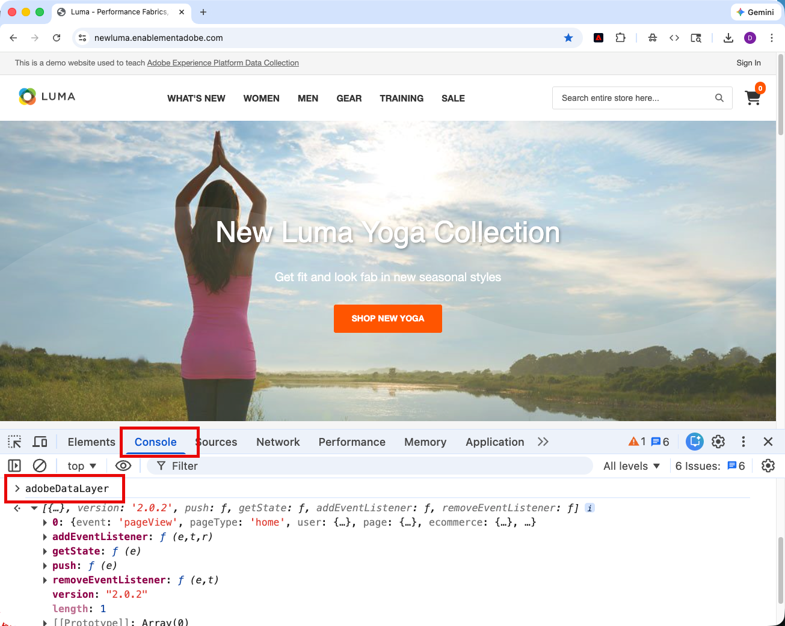

# Create data elements

Learn how to create data elements in tags for content, commerce, and identity data on the [Luma demo website](https://luma.enablementadobe.com). Then populate fields in your XDM schema. 


## Learning objectives

At the end of this lesson, you are able to:

* Understand different approaches to mapping a data layer to XDM
* Create data elements to capture data
* Map data elements to an XDM object


## Prerequisites 

You have an understanding of what a data layer is and have completed the previous lessons in the tutorial:

* [Configure an XDM schema](configure-schemas.md)
* [Configure an identity namespace](configure-identities.md)
* [Configure a datastream](configure-datastream.md)
* [Web SDK extension installed in the tag property](install-web-sdk.md)


>[!IMPORTANT]
>
>The data for this lesson comes from the `[!UICONTROL adobeDataLayer]` data layer on the [Luma site](https://luma.enablementadobe.com). To view the data layer, open your developer console and type in `[!UICONTROL adobeDataLayer]` to see the full data layer available.


## Data layer approaches

There are multiple ways to map data from your data layer to XDM using the tags functionality of Adobe Experience Platform. Below are a few pros and cons of three different approaches. It is possible to combine approaches, if desired:

1. Implement XDM in the data layer
1. Map to XDM in tags
1. Map to XDM in the datastream

>[!NOTE]
>
>The examples in this tutorial follow the Map to XDM in tags approach.


### Implement XDM in the data layer

In this approach, web developers implement a fully-defined XDM object as the structure for the data layer. Then you simply map the entire data layer to an XDM object in tags. If your implementation does not use a tag manager, this approach may be ideal because you can send data to XDM directly from your application using the [XDM sendEvent command](https://experienceleague.adobe.com/en/docs/experience-platform/edge/fundamentals/tracking-events#sending-xdm-data). If you do use tags, you can create a custom code data element capturing the entire data layer as a pass-through JSON object to the XDM. Then, you map the pass-through JSON to the XDM object field in the Send Event Action. 

Below is an example of how the data layer would look like using the Adobe Client Data Layer format:

+++XDM in Data Layer example

```JSON
window.adobeDataLayer.push({
"eventType": "web.webPageDetails.pageViews",
"web":{
         "webInteraction":{
            "linkClicks":{
               "id":"",
               "value":""
            },
            "URL":"",
            "name":"",
            "region":"",
            "type":""
         },
         "webPageDetails":{
            "pageViews":{
               "id":"",
               "value":"1"
            },
            "URL":"https://luma.enablementadobe.com/",
            "isErrorPage":"",
            "isHomePage":"",
            "name":"luma:home",
            "server":"enablementadobe.com",
            "siteSection":"home",
            "viewName":""
         },
         "webReferrer":{
            "URL":"",
            "type":""
         }
      }
});
```

+++

Pros

* Eliminates additional steps remap to data layer variables to XDM
* It may be quicker to deploy if your web development team also owns the tagging of digital behavior

Cons

* Complete reliance on development team and dev cycle for updating what data goes to XDM
* Limited flexibility as XDM receives the exact payload from the data layer 
* Cannot use built-in tags features, such as scraping, persistence, features for quick deployments
* Harder to use the data layer for third-party pixels (but you might want to move these pixels to [event forwarding](setup-event-forwarding.md)!)
* No ability to transform the data between the data layer and XDM

### Map to XDM in tags 

This approach involves mapping individual data layer variables to data elements in tags and eventually to XDM. This is the traditional approach to implementation using a tag management system. 

#### Pros

* The most flexible approach as you can control individual variables and transform data before it gets to XDM
* Can use Adobe tags triggers and scraping functionality to pass data to XDM
* Can map data elements to third-party pixels client-side

#### Cons

* Takes time to reconstruct the data layer as tags data elements


>[!IMPORTANT]
>
>As noted earlier, the examples in this tutorial follow the Map to XDM in tags approach.

### Map to XDM in the datastream

This approach uses functionality built-into the datastream configuration called [Data Prep for Data Collection](https://experienceleague.adobe.com/en/docs/experience-platform/datastreams/data-prep) and skips mapping data layer variables to XDM in tags. 

#### Pros

* Flexible mapping of individual variables to XDM in a point-and-click UI
* Ability to [compute new values](https://experienceleague.adobe.com/en/docs/experience-platform/data-prep/functions) or [transform data types](https://experienceleague.adobe.com/en/docs/experience-platform/data-prep/data-handling) from a data layer before it goes to XDM 

#### Cons

* Cannot use data layer variables as data elements for client-side third-party pixels, but can use them with event forwarding
* Cannot use the scraping functionality in tags
* Maintenance complexity increases if mapping the data layer both in tags and in datastream 


>[!TIP] 
>
> Google Data Layer
> 
> If your organization already uses Google Analytics and has the traditional Google dataLayer object on your website, you can use the [Google Data Layer extension](https://experienceleague.adobe.com/en/docs/experience-platform/tags/extensions/client/google-data-layer/overview) in tags. This allows you to deploy Adobe technology quicker without having to request support from your IT team. Mapping the Google data layer to XDM would follow the same steps as above.


## Create data elements to capture the data layer

Before you populate XDM fields, first capture the data points you need as tags data elements:

1. Go to **[!UICONTROL Data Elements]** and select **[!UICONTROL Add Data Element]** (or **[!UICONTROL Create New Data Element]** if there are no existing data elements in the tag property)

    

1. Name the data element `Page Name`
1. Use the **[!UICONTROL JavaScript Variable]** **[!UICONTROL Data Element type]** to point to the value in Luma's data layer: `adobeDataLayer.0.page.name`

1. Check the boxes for **[!UICONTROL Force lowercase value]** and **[!UICONTROL Clean text]** to standardize the case and remove extraneous spaces

1. Leave `None` as the **[!UICONTROL Storage Duration]** setting since this value is different on every page

1. Select **[!UICONTROL Save]**

    

Create these additional data elements by following the same steps:

* **`User Id`**  mapped to 
`adobeDataLayer.0.user.id`

* **`User Logged In`** mapped to
`adobeDataLayer.0.user.loggedIn`

* **`Ecommerce Product Id`** mapped to `adobeDataLayer.0.ecommerce.detail.products.0.id`
* **`Ecommerce Product Name`** mapped to `adobeDataLayer.0.ecommerce.detail.products.0.name`
* **`Ecommerce Purchase Id`** mapped to `adobeDataLayer.0.ecommerce.purchase.actionField.id` 
* **`Ecommerce Product Category`** using the **[!UICONTROL Custom Code]** **[!UICONTROL Data Element type]** and the following custom code:

   ```javascript
   return adobeDataLayer[0].ecommerce.detail.products[0].category+":"+adobeDataLayer[0].ecommerce.detail.products[0].subcategory;
   ```

* **`Ecommerce Cart Products`** using the following custom code:

   ```javascript
   const cartProducts = adobeDataLayer
   .flatMap(evt => Array.isArray(evt?.ecommerce?.cart?.items) ? evt.ecommerce.cart.items : [])
   .filter(item => item && item.id && item.name && item.brand)
   .map(({ id, name, brand }) => ({ id, name, brand }));

   return cartProducts;
   ```

* **`Ecommerce Purchase Products`** using the following custom code:

   ```javascript
   const purchaseEvent = adobeDataLayer.find(e => e.event === "purchase");

   const currencyCode = purchaseEvent?.ecommerce?.currencyCode ?? "USD";

   const purchasedProducts = (purchaseEvent?.ecommerce?.purchase?.products || []).map(p => {
      const unitPrice = parseFloat(String(p.price).replace(/[^0-9.-]/g, "")) || 0;
      const qty = Number(p.quantity) || 0;

      return {
      SKU: p.id,                       // id -> SKU
      name: p.name,                    // name -> name
      quantity: qty,                   // quantity -> quantity
      priceTotal: unitPrice * qty,     // price -> priceTotal (unit price × quantity)
      currencyCode                     // "USD" -> currencyCode (from ecommerce.currencyCode)
      };
   });

   return(purchasedProducts);
   ```


>[!CAUTION]
>
>The [!UICONTROL JavaScript variable] data element type treats array references as dots instead of brackets, so referencing the username data element as `adobeDataLayer[0].page.name` **will not work**.

## Create Variable data elements for XDM and data objects

The data elements you just created will be used to build an XDM object (for Platform applications) and a data object (for Analytics, Target, and Audience Manager). These objects have their own special data elements called **[!UICONTROL Variable]** data elements which are very easy to create. 

To create the Variable data element for XDM, you tie it to the schema you created in the [Configure a schema](configure-schemas.md) lesson:

1. Select **[!UICONTROL Add Data element]**
1. Name your Data Element `XDM Variable`. It is recommended you prefix with "XDM" the Data Elements specific to XDM to better organize your tag property
1. Select the **[!UICONTROL Adobe Experience Platform Web SDK]** as the **[!UICONTROL Extension]**
1. Select the **[!UICONTROL Variable]** as the **[!UICONTROL Data Element Type]**
1. Select **[!UICONTROL XDM]** as the **[!UICONTROL property]**
1. Select the **[!UICONTROL Sandbox]** in which you created the schema
1. Select the appropriate **[!UICONTROL Schema]**, in this case `Luma Web Event Data`
1. Select **[!UICONTROL Save]**

    

Next, create the Variable data element for your data object:

1. Select **[!UICONTROL Add Data element]**
1. Name your Data Element `Data Variable`. 
1. Select the **[!UICONTROL Adobe Experience Platform Web SDK]** as the **[!UICONTROL Extension]**
1. Select the **[!UICONTROL Variable]** as the **[!UICONTROL Data Element Type]**
1. Select **[!UICONTROL data]** as the **[!UICONTROL property]**
1. Select the Experience Cloud solutions you wish to implement as part of this tutorial
1. Select **[!UICONTROL Save]**

    


At the end of these steps, you should have the following data elements created:

|Core Extension Data Elements | Platform Web SDK Extension Data Elements|
| ----------------------------- | ------------------------------- |
| `Ecommerce Cart Products` | `Data Variable` |
| `Ecommerce Product Category` | `XDM Variable` |
| `Ecommerce Product Id` | |
| `Ecommerce Product Name` | |
| `Ecommerce Purchase Id` | |
| `Ecommerce Purchase Products` | |
| `Page Name` | |
| `User Id` | |
| `User Logged In` | |

With these data elements in place, you are ready to start sending data to Platform Edge Network with a tags rule. But first, learn about collecting identities with Web SDK. 

>[!NOTE]
>
>Thank you for investing your time in learning about Adobe Experience Platform Web SDK. If you have questions, want to share general feedback, or have suggestions on future content, please share them on this [Experience League Community discussion post](https://experienceleaguecommunities.adobe.com/adobe-experience-platform-18/tutorial-discussion-implement-adobe-experience-cloud-with-web-sdk-tutorial-248848)
