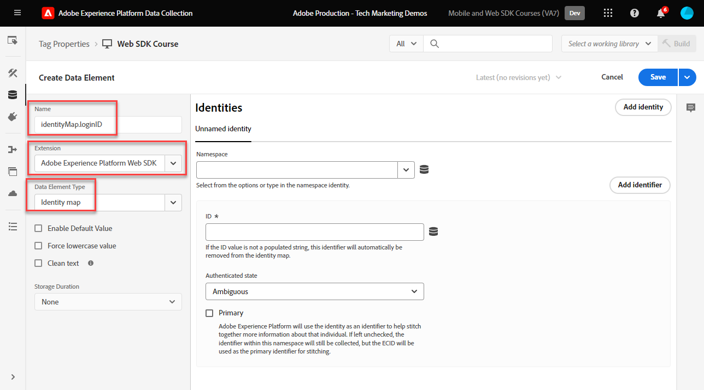
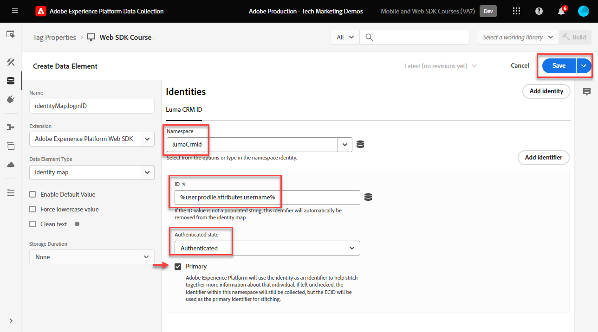
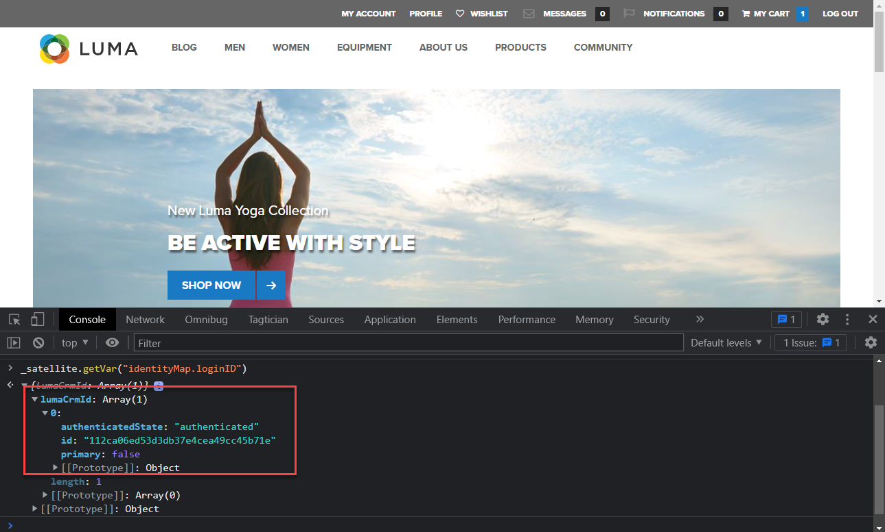

# Create identities

Learn how to capture identities with Adobe Experience Platform Web SDK. Capture both unauthenticated and authenticated identity data on the [Luma demo site](https://luma.enablementadobe.com/content/luma/us/en.html). Learn how to use the data elements you created earlier for collecting authenticated data with a Platform Web SDK data element type called Identity map. 

This lesson focuses on the Identity map data element available with the Adobe Experience Platform Web SDK tags extension. You map data elements containing an authenticated user ID and authentication status to XDM. 

## Learning objectives

At the end of this lesson, you are able to:

* Understand the relationship between Experience Cloud ID (ECID) and First Party Device ID (FPID)
* Understand the difference between unauthenticated vs authenticated IDs
* Create an identity map data element

## Prerequisites 

You have an understanding of what a data layer is, gotten familiar with the [Luma demo site](https://luma.enablementadobe.com/content/luma/us/en.html){target="_blank"} data layer, and know how to reference data elements in tags. You must have completed the previous lessons in the tutorial:

* [Configure an XDM schema](configure-schemas.md)
* [Configure an identity namespace](configure-identities.md)
* [Configure a datastream](configure-datastream.md)
* [Web SDK extension installed in the tag property](install-web-sdk.md)
* [Create data elements](create-data-elements.md)


## Experience Cloud ID

The [Experience Cloud ID (ECID)](https://experienceleague.adobe.com/en/docs/experience-platform/identity/ecid) is a shared identity namespace used across Adobe Experience Platform and Adobe Experience Cloud applications. ECID provides the foundation for customer identity and is the default identity for digital properties. This makes ECID the ideal identifier for tracking unauthenticated user behavior because it is always present

<!-- FYI I commented this out because it was breaking the build - Jack
>[!TIP]
>
> When you use the Experience Platform Web SDK to set up Adobe applications on your digital properties, the ECID is generated at the Adobe Edge server level. As such, ECID is not viewable on the client-side network request payload. You can view the ECID by seeing the Preview tab of the network request, or by using the [Adobe Experience Platform Debugger Edge Trace](set-up-analytics.md#experience-cloud-id-validation).
>
-->

Read more about how [ECIDs are tracked using Platform Web SDK](https://experienceleague.adobe.com/en/docs/experience-platform/edge/identity/overview).

ECIDs are set using a combination of first-party cookies and Platform Edge Network. By default, the first-party cookies are set client-side by the Web SDK. To account for browser restrictions on cookie lifespans, you can opt to set your own first-party cookies server-side instead. These are referred to as first-party device IDs (FPIDs).

>[!IMPORTANT]
>
>The [Experience Cloud ID Service extension](https://exchange.adobe.com/experiencecloud.details.100160.adobe-experience-cloud-id-launch-extension.html) is not needed when implementing Adobe Experience Platform Web SDK, as the ID Service functionality is built into Platform Web SDK.

## First Party Device ID (FPID)

FPIDs are first-party cookies _you set using your own web servers_ which Adobe then uses to create the ECID, instead of using the first-party cookie set by the Web SDK. While browser support may vary, first-party cookies tend to be more durable when they are set by a server that leverages a DNS A record (for IPv4) or AAAA record (for IPv6), as opposed to when they are set by a DNS CNAME or JavaScript code.

Once an FPID cookie is set, its value can be fetched and sent to Adobe as event data is collected. Collected FPIDs are used as seeds to generate ECIDs on Platform Edge Network, which continue to be the default identifiers in Adobe Experience Cloud applications. 

While FPIDs are not used in this tutorial, you are encouraged to use FPIDs in your own Web SDK implementation. Read more about [First-party device IDs in the Platform Web SDK](https://experienceleague.adobe.com/en/docs/experience-platform/edge/identity/first-party-device-ids)

>[!CAUTION]
>
> FPID is an alternative way of generating the ECID by using a cookie set by your web servers. It is not used for identifying authenticated users.

## Authenticated Id

As noted above, all visitors to your digital properties are assigned an ECID by Adobe when using Platform Web SDK. This makes ECID the default identity for tracking unauthenticated digital behavior. 

You can also send an authenticated user ID so that Platform can create [Identity Graphs](https://experienceleague.adobe.com/en/docs/platform-learn/tutorials/identities/understanding-identity-and-identity-graphs) and Target can set its [Third Party Id](https://experienceleague.adobe.com/en/docs/target/using/audiences/visitor-profiles/3rd-party-id). This is done by using the [!UICONTROL Identity Map] data element type.

To create the [!UICONTROL Identity Map] data element:

1. Go to **[!UICONTROL Data Elements]** and select **[!UICONTROL Add Data Element]**

1. **[!UICONTROL Name]** the Data Element `identityMap.loginID`

1. As the **[!UICONTROL Extension]**, select `Adobe Experience Platform Web SDK`

1. As the **[!UICONTROL Data Element Type]**, select `Identity map`

1. This prompts a screen area to the right within the **[!UICONTROL Data Collection interface]** for you to configure the identity:
   
   

1. As the  **[!UICONTROL Namespace]**, select the `lumaCrmId` namespace that you previously created in the [Configure Identities](configure-identities.md) lesson. If it does not appear in the dropdown, type it in.

1. After the **[!UICONTROL Namespace]** is selected, an ID must be set. Select the `user.profile.attributes.username` data element created earlier in the [Create data elements](create-data-elements.md#create-data-elements-to-capture-the-data-layer) lesson, which captures an ID when users are logged into the Luma site. 

    <!--  >[!TIP]
    >
    >You can verify the **[!UICONTROL Luma CRM ID]** is collected in a data element on the web property by going to the [Luma Demo site](https://luma.enablementadobe.com/content/luma/us/en.html), logging in, [switching the tag environment](validate-with-debugger.md#use-the-experience-platform-debugger-to-map-to-your-tag-property) to your own, and typing `_satellite.getVar("user.profile.attributes.username")` in the web browser developer console.
    >
    >   
    -->

1. As the **[!UICONTROL Authenticated state]**, select **[!UICONTROL Authenticated]**
1. Select **[!UICONTROL Primary]**

1. Select **[!UICONTROL Save]**
   
    

>[!TIP]
>
> Adobe recommends sending identities which represent a person, such as `Luma CRM Id`, as the [!UICONTROL primary] identity.
>
> If the identity map contains the person identifier (e.g. `Luma CRM Id`), then the person identifier will become the [!UICONTROL primary] identity. Otherwise, `ECID` becomes the [!UICONTROL primary] identity.


<!--
1. Once the data element is configured in **[!UICONTROL Data Collection interface]**, it can be tested on the Luma web property like any other Data Element. Enter the following script in the browser developer console
   
   
   ```
   _satellite.getVar('identityMap.loginID')
   ```  

   
   
   >[!NOTE]
   >
   >ECID identifier will NOT populate in the Data Element, as this is configured already with Platform Web SDK.   
-->

At the end of these steps, you should have the following data elements created:

|Core Extension Data Elements | Platform Web SDK Extension Data Elements|
-----------------------------|-------------------------------
| `cart.orderId` | `identityMap.loginID` |
| `cart.productInfo` |`xdm.variable.content`|
| `cart.productInfo.purchase`| |
| `page.pageInfo.hierarchie1` | |
| `page.pageInfo.pageName` | |
| `page.pageInfo.server` | |
| `product.category`| | 
| `product.productInfo.sku`| | 
| `product.productInfo.title`| |
| `user.profile.attributes.loggedIn` | |
| `user.profile.attributes.username` | |

With these data elements in place, you are ready to start sending data to Platform Edge Network by creating a rule in tags.

[Next: **Create a rule in tags**](create-tag-rule.md)

>[!NOTE]
>
>Thank you for investing your time in learning about Adobe Experience Platform Web SDK. If you have questions, want to share general feedback, or have suggestions on future content, please share them on this [Experience League Community discussion post](https://experienceleaguecommunities.adobe.com/t5/adobe-experience-platform-launch/tutorial-discussion-implement-adobe-experience-cloud-with-web/td-p/444996)
