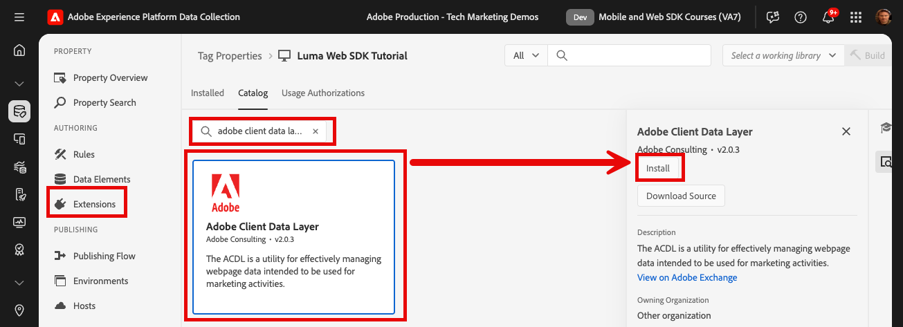
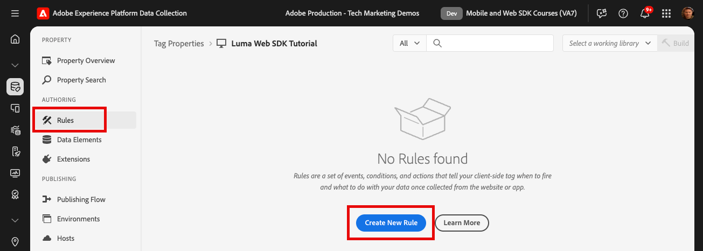
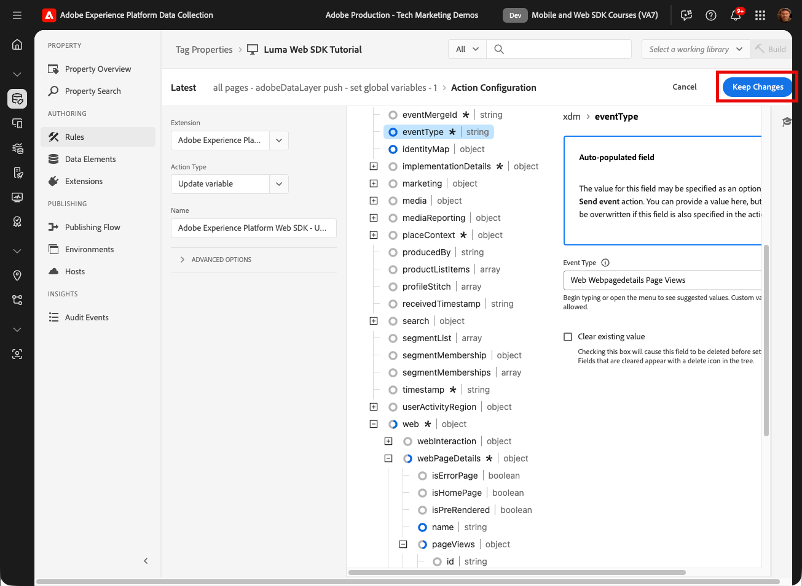
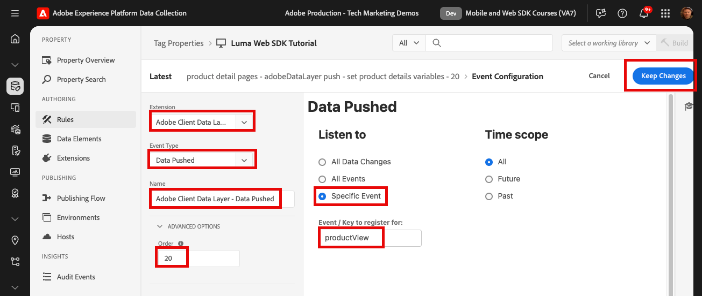
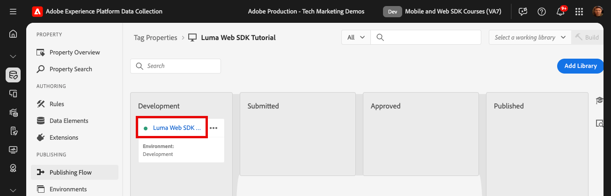

# Create tag rules

Learn how to send events to the Adobe Experience Platform Edge Network with your XDM object using tag rules. A tag rule is a combination of events, conditions, and actions that tells the tag property to do something. With Platform Web SDK, rules are used to send events to Platform Edge Network with the right data.
 

## Learning objectives

At the end of this lesson, you are able to:

* Use a naming convention for managing rules within tags
* Send an event with XDM fields using Update Variable and Send Event actions
* Stack multiple sets of XDM fields across multiple rules
* Map individual or entire array data elements to the XDM object
* Publish a tag rule to a development library

## Prerequisites

You are familiar with Data Collection tags and the [Luma demo site](https://newluma.enablementadobe.com) and have completed the previous lessons in the tutorial:

* [Configure an XDM schema](configure-schemas.md)
* [Configure an identity namespace](configure-identities.md)
* [Configure a datastream](configure-datastream.md)
* [Install Web SDK extension](install-web-sdk.md)
* [Create data elements](create-data-elements.md)
* [Create identities](create-identities.md)

## Naming Conventions

To manage rules in tags, it is recommended to follow a standard naming convention. This tutorial uses a five-part naming convention:

* [**location**] - [**event**] - [**purpose**] - [**order**]

where;

1. **location** is the page or pages on the site where the rule fires
1. **event** is the trigger for the rule
1. **purpose** is the main action performed by the rule
1. **order** is the order in which the rule should fire in relation to other rules
<!-- minor update --> 

## Add Adobe Client Data Layer extension

The Luma website uses an event-driven data layer called the Adobe Client Data Layer (ACDL). Whenever an event occurs it is pushed into the `adobeDataLayer` array. We will use these events to construct our rules, although many out-of-the-box options. 

1. Go to **[!UICONTROL Extensions]**
1. Filter to **[!UICONTROL Adobe Client Data Layer]**
1. Select **[!UICONTROL Install]**

    

1. Leave the default settings
1. Select **[!UICONTROL Save]**

## Create tag rules

In tags, rules are used to execute actions (fire calls) under various conditions. The Platform Web SDK tags extension includes two actions that are used in rules:

* **[!UICONTROL Update variable]** maps data elements to your XDM or data variables
* **[!UICONTROL Send Event]** sends the data to Experience Platform Edge Network

In the rest of this lesson we:

1. Use the **[!UICONTROL Update variable]** action to define a "global configuration" of XDM fields.

1. Use the **[!UICONTROL Update variable]** action that override our "global configuration" and contribute additional XDM fields under certain conditions (for example, adding product details on product pages).

1. Use the **[!UICONTROL Send Event]** action to send all the data we want to Adobe Experience Platform Edge Network.

All of these rules will be sequenced properly using the "[!UICONTROL order]" option.

This video gives an overview of the process:

>[!VIDEO](https://video.tv.adobe.com/v/3427710/?learn=on&enablevpops)

### Global configuration fields

To create a tag rule for the global XDM fields:

1. Open the tag property that you are using for this tutorial

1. Go to **[!UICONTROL Rules]** in the left navigation

1. Select the **[!UICONTROL Create New Rule]** button

    
    
1. Name the rule `all pages - adobeDataLayer push - set global variables - 1`

1. In the **[!UICONTROL Events]** section, select **[!UICONTROL Add]**

    

1. Use the **[!UICONTROL Adobe Client Data Layer]** extension and select **[!UICONTROL Data Pushed]** as the **[!UICONTROL Event Type]** 

1. Select **[!UICONTROL Advanced]** dropdown and enter `1` as the **[!UICONTROL Order]**

    >[!NOTE]
    >
    > The lower the order number, the earlier it executes. Therefore, we give our "global configuration" a low order number.

1. Listen to **[!UICONTROL All Events]** 
1. Select **[!UICONTROL Keep Changes]** to return to the main rule screen
    

1. In the **[!UICONTROL Actions]** section, select **[!UICONTROL Add]**

1. As the **[!UICONTROL Extension]**, select **[!UICONTROL Adobe Experience Platform Web SDK]** 

1. As the **[!UICONTROL Action Type]**, select **[!UICONTROL Update variable]** 

1. As the **[!UICONTROL Data element]**, select the `xdm.variable.content` you created in the [Create data elements](create-data-elements.md) lesson

    

1. Now, specify the XDM fields by mapping them to appropriate values:

    | XDM Field | Map to |
    |---|---|
    | `eventType` | `Web Webpagedetails Page Views` (begin typing to see the suggested values)|
    | `identityMap` | `Identity Map` data element |
    | `web.webPageDetails.name` | `Page Name` data element |
    | `web.webPageDetails.pageViews.value` | `1` |

    >[!TIP]
    >
    > XDM fields will not be included in the network request if the data element is null. Therefore, when the user is not authenticated and the `Identity Map` data element is null, the `identityMap` object will not be sent. This is why we can define it in our "global configuration". 

    >[!TIP]
    >
    > While neither `eventType` set to `web.webpagedetails.pageViews` nor `web.webPageDetails.pageViews.value` are required for Adobe Analytics to process a beacon as a page view, it is useful to have a standard way to indicate a page view for other downstream applications.

1. When you are done, your `XDM Variable` will look something like this. Note how the populated and partially populated fields are indicated with the blue circles:
     
1. Select **[!UICONTROL Keep Changes]** and then **[!UICONTROL Save]** the rule in the next screen to complete the rule

### Product page fields

Now, start to use **[!UICONTROL Update variable]** in additional, sequenced rules to enrich the XDM object before sending it to [!UICONTROL Platform Edge Network]. 

>[!TIP]
>
>Rule order determines which rule runs first when an event is triggered. If two rules have the same event type, the one with the lowest number runs first.
> 

Start by tracking product views on the product detail page of Luma:

1. Select **[!UICONTROL Add Rule]**
1. Name it  [!UICONTROL `product detail pages - adobeDataLayer push - set product details variables - 20`]
1. Select the  under Event to add a new trigger
1. Under **[!UICONTROL Extension]**, select **[!UICONTROL Adobe Client Data Layer]**
1. Under **[!UICONTROL Event Type]**, select **[!UICONTROL Data Pushed]**
1. Select to open **[!UICONTROL Advanced Options]**, type in `20`. This order value ensures the rule runs _after_ the global variables rule.
1. Listen to a **[!UICONTROL Specific Event]**
1. Enter `productView` as the **[!UICONTROL Event / Key to register for]**
1. Select **[!UICONTROL Keep changes]**

    

1. Under **[!UICONTROL Actions]** select **[!UICONTROL Add]**
1. Select **[!UICONTROL Adobe Experience Platform Web SDK]** extension
1. Select **[!UICONTROL Action Type]** as **[!UICONTROL Update variable]**
1. Select `XDM Variable` as the **[!UICONTROL Data element]**  
1. Map these XDM fields to appropriate values:

    | XDM Field | Map to |
    |---|---|
    | `eventType` | `Commerce Product Views` (begin typing to see the suggested values)|
    | `commerce.productViews.value` | `1` |
    | `productListItems.name` | `Ecommerce Product Name` (Select **[!UICONTROL Provide individual items]** and **[!UICONTROL Add Item]** first ) |
    | `productListItems.sku` | `Ecommerce Product Id` |

1. Select **[!UICONTROL Keep Changes]**

1. Select **[!UICONTROL Save]** to save the rule

    >[!NOTE]
    >
    >Because this rule has a higher order, it will overwrite the `eventType` set in the "global configuration" rule. `eventType` can only contain one value and we recommend setting it with the most valuable event.

    >[!TIP]
    >
    >Setting commerce.productViews.value=1 in XDM automatically maps to the `prodView` event in Analytics

### Shopping cart fields

You can map entire array to an XDM object, provided the array matches the format of the XDM schema. The custom code data element `Ecommerce Cart Products` you created earlier loops through the `adobeDataLayer.ecommerce.cart.items` data layer object on the Luma website and translates it into the required format of the `productListItems` object of the XDM schema.

To illustrate, see the comparison below of the Luma site data layer (left) to the translated data element (right): 

Compare the data element to the `productListItems` structure (hint, it should match).

>[!IMPORTANT]
>
>Note how numeric variables are translated, with string values in the data layer such as `price` and `qty` reformatted to numbers in the data element. These format requirements are important for data integrity in Platform and are determined during the [configure schemas](configure-schemas.md) step. In the example, **[!UICONTROL quantity]** uses the **[!UICONTROL Integer]** data type.
> 

Now, let's map our array to the XDM object:

1. Create a new rule named `cart page - adobeDataLayer push - set cart variables - 20`
1. Select the  under Event to add a new trigger
1. Under **[!UICONTROL Extension]**, select **[!UICONTROL Adobe Client Data Layer]**
1. Under **[!UICONTROL Event Type]**, select **[!UICONTROL Data Pushed]**
1. Select to open **[!UICONTROL Advanced Options]**, type in `20`. This order value ensures the rule runs _after_ the global variables rule.
1. Listen to a **[!UICONTROL Specific Event]**
1. Enter `cartView` as the **[!UICONTROL Event / Key to register for]**
1. Select **[!UICONTROL Keep Changes]**

    

1. Under **[!UICONTROL Actions]** select **[!UICONTROL Add]**
1. Select **[!UICONTROL Adobe Experience Platform Web SDK]** extension
1. Select **[!UICONTROL Action Type]** as **[!UICONTROL Update variable]**
1. Select `XDM Variable` as the **[!UICONTROL Data element]**  
1. Map these XDM fields to appropriate values:

    | XDM Field | Map to |
    |---|---|
    | `eventType` | `Commerce Product List (Cart) Views` (begin typing to see the suggested values)|
    | `commerce.productListViews.value` | `1` |
    | `productListItems.name` | `Ecommerce Product Name` (Select **[!UICONTROL Provide individual items]** and **[!UICONTROL Add Item]** first ) |
    | `productListItems.sku` | `Ecommerce Product Id` |

    >[!TIP]
    >
    >Setting commerce.productListViews.value=1 in XDM automatically maps to the `scView` event in Analytics

1. Select `eventType` and set to `commerce.productListViews`
    
1. Scroll down to and select **[!UICONTROL productListItems]** array

1. Select **[!UICONTROL Provide entire array]**

1. Map to **`cart.productInfo`** data element

1. Select **[!UICONTROL Keep Changes]**

1. Select **[!UICONTROL Save]** to save the rule

Create two other rules for checkout and purchase following the same pattern with the below differences:

**Rule name**: `ecommerce  - library loaded - set checkout variables - 20`

1. **[!UICONTROL Condition]**: /content/luma/us/en/user/checkout.html
1. Set `eventType` to `commerce.checkouts`
1. Set `commerce.checkout.value` to `1`

    >[!TIP]
    >
    >This is equivalent to setting `scCheckout` event in Analytics 

**Rule name**: `ecommerce - library loaded - set purchase variables -  20`

1. **[!UICONTROL Condition]**: /content/luma/us/en/user/checkout/order/thank-you.html
1. Set `eventType` to `commerce.purchases`
1. Set `commerce.purchases.value` to `1`

    >[!TIP]
    >
    >This is equivalent to setting `purchase` event in Analytics 

1. Set `commerce.order.purchaseID` to the `cart.orderId` data element
1. Set `commerce.order.currencyCode` to the hardcoded value `USD`

    

    >[!TIP]
    >
    >This is equivalent to setting `s.purchaseID` and `s.currencyCode` variables in Analytics 

1. Scroll down to and select **[!UICONTROL productListItems]** array
1. Select **[!UICONTROL Provide entire array]**
1. Map to **`cart.productInfo.purchase`** data element
1. Select **[!UICONTROL Keep Changes]**
1. Select **[!UICONTROL Save]**

When you are done, you should see the following rules created.

### Send event rule

Now that you have set the variables, you can create the rule to send the complete XDM object to Platform Edge Network with the **[!UICONTROL Send event]** action.

1. On the right, select **[!UICONTROL Add Rule]** to create another rule

1. Name the rule `all pages - library loaded - send event - 50`

1. In the **[!UICONTROL Events]** section, select **[!UICONTROL Add]**

1. Use the **[!UICONTROL Core Extension]** and select `Library Loaded (Page Top)` as the **[!UICONTROL Event Type]** 

1. Select **[!UICONTROL Advanced]** dropdown and enter `50` in **[!UICONTROL Order]**. This will ensure this rule fires after all of the other rules you have configured (which had `1` or `20` as their [!UICONTROL Order]).

1. Select **[!UICONTROL Keep Changes]** to return to the main rule screen
    

1. In the **[!UICONTROL Actions]** section, select **[!UICONTROL Add]**

1. As the **[!UICONTROL Extension]**, select **[!UICONTROL Adobe Experience Platform Web SDK]** 

1. As the  **[!UICONTROL Action Type]**, select **[!UICONTROL Send event]** 

1. As the **[!UICONTROL XDM]**, select the `xdm.variable.content` data element created in the previous lesson

1. Select **[!UICONTROL Keep Changes]** to return to the main rule screen

    
1. Select **[!UICONTROL Save]** to save the rule    

       

## Publish the rules in a library

Next, publish the rule to your development environment so you can verify it works.

To create a library:

1. Go to **[!UICONTROL Publishing Flow]** in the left navigation

1. Select **[!UICONTROL Add Library]**

    
1. For the **[!UICONTROL Name]**, enter `Luma Web SDK Tutorial`
1. For the **[!UICONTROL Environment]**, select `Development`
1. Select  **[!UICONTROL Add All Changed Resources]** 

    >[!NOTE]
    >
    >    You should see all the tag components created in previous lessons. The Core extension contains the base JavaScript required by all web tag properties.

1. Select **[!UICONTROL Save & Build for Development]**

    

The library may take a few minutes to build and when it is complete it displays a green dot to the left of the library name:

   

As you can see on the [!UICONTROL Publishing Flow] screen, there is a lot more to the publishing process, which is beyond the scope of this tutorial. This tutorial just uses a single library in your Development environment.

Now, you are ready to validate the data in the request using the Adobe Experience Platform Debugger.

>[!NOTE]
>
>Thank you for investing your time in learning about Adobe Experience Platform Web SDK. If you have questions, want to share general feedback, or have suggestions on future content, please share them on this [Experience League Community discussion post](https://experienceleaguecommunities.adobe.com/t5/adobe-experience-platform-data/tutorial-discussion-implement-adobe-experience-cloud-with-web/td-p/444996)
