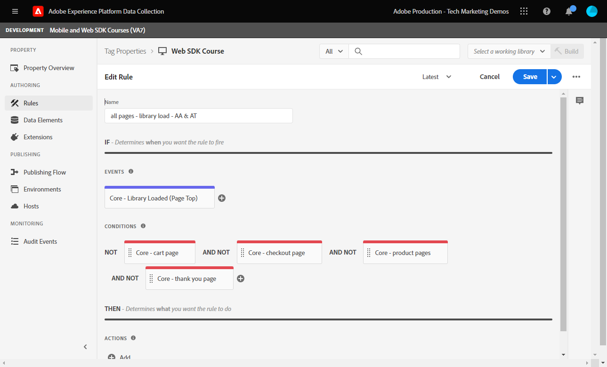

# Create a tag rule

Learn how to send an event to the Platform Edge Network with your XDM object using a tag rule. A tag rule is a combination of events, conditions, and actions that tells the tag property to do something.

>[!NOTE]
>
> For demonstration purposes, the exercises in this lesson build upon the example used during the [Create data elements](create-data-elements.md) step; sending an XDM event action to capture content and identities from users on the [Luma demo site](https://luma.enablementadobe.com/content/luma/us/en.html).

 
## Learning objectives

At the end of this lesson, you will be able to:

* Use a naming convention for managing rules within tags
* Create a tag rule to send an XDM event
* Publish a tag rule to a development library

## Prerequisites

You are familiar with Data Collection tags and the [Luma demo site](https://luma.enablementadobe.com/content/luma/us/en.html), and you must have completed the following previous lessons in the tutorial:

* [Configure permissions](configure-permissions.md)
* [Configure an XDM schema](configure-schemas.md)
* [Configure an identity namespace](configure-identities.md)
* [Configure a datastream](configure-datastream.md)
* [Web SDK extension installed in the tag property](install-web-sdk.md)
* [Create data elements](create-data-elements.md)

## Naming Conventions

To better manage rules in tags, it is recommended to follow a standard naming convention. This tutorial uses a three-part naming convention:

* [location] - [event] - [tool]

where;

1. location is the page or pages on the site where the rule fires
1. event is the trigger that fires the beacon
1. tool is the specific application or applications used in the action step for that rule

## Create tag rule

In tags, rules are used to execute actions (fire calls) under various conditions. You will use this fist rule to send the XDM object to the Edge Network using Web SDK's !UICONTROL Send Event]** action. Later in this tutorial, you will send different versions of the XDM object based on the type of page the visitor is on. For that reason, you will use rule conditions to exclude those other types of pages.

 To create a tag rule:

1. Open the tag property you are using for this tutorial
1. Go to **[!UICONTROL Rules]** in the left navigation
1. Select the **[!UICONTROL Create New Rule]** button
    
1. Name the rule `all pages - library load - AA & AT`

    >[!NOTE]
    >
    > This rule is used in a specific way by Adobe Analytics and Target in a future lesson, which is why `AA & AT` is used at the end of the name.

1. In the **[!UICONTROL Events]** section, select **[!UICONTROL Add]**
       
1. Use the **[!UICONTROL Core Extension]** and select `Library Loaded (Page Top)` as the **[!UICONTROL Event Type]**. 

    This setting means that the rule fires whenever the tag library loads on a page.
1. Select **[!UICONTROL Keep Changes]** to return to the main rule screen
        
1. In the **[!UICONTROL Conditions]** section, select the **[!UICONTROL Add]** button
        
1. Select **[!UICONTROL Logic Type]** `Exception`, **[!UICONTROL Extension]** `Core`, and **[!UICONTROL Condition Type]** `Path Without Query String`
1. Enter the URL path `/content/luma/us/en/user/cart.html` in the **[!UICONTROL path equals]** field, and **[!UICONTROL name]** it `Core - cart page`
1. Select **[!UICONTROL Keep Changes]**
       
1. Add three more exceptions for the following URL paths

    * **`Core - checkout page`** for `/content/luma/us/en/user/checkout.html`
    * **`Core - thank you page`** for `/content/luma/us/en/user/checkout/order/thank-you.html`
    * **`Core - product page`** for `/products/` with the Regex switch turned ON

     

1. In the **[!UICONTROL Actions]** section, select **[!UICONTROL Add]**
1. Select **[!UICONTROL Adobe Experience Platform Web SDK]** as the **[!UICONTROL Extension]**
1. Select **[!UICONTROL Send Event]** as the **[!UICONTROL Action Type]**
1. Select **[!UICONTROL web.webpagedetails.pageViews]** as the **[!UICONTROL Type]**.

    >[!WARNING]
    >
    > This dropdown populates the **`xdm.eventType`** variable in the XDM object. While you are also able to type free-form labels in this field, it is highly recommended you **do not** as it will have averse effects with Platform. 

1. As the **[!UICONTROL XDM data]**, select the `xdm.content` data element created in the previous lesson
1. Select **[!UICONTROL Keep Changes]** to return to the main rule screen

    
1. Select **[!UICONTROL Save]** to save the rule    

       

## Publish the rule in a library

Next, publish the rule to your development environment so we can verify that it works.

To create a library:

1. Go to **[!UICONTROL Publishing Flow]** in the left navigation
1. Select **[!UICONTROL Add Library]**

    
1. For the **[!UICONTROL Name]**, enter `Luma Web SDK Tutorial`
1. For the **[!UICONTROL Environment]**, select `Development`
1. Select  **[!UICONTROL Add All Changed Resources]** 

    >[!NOTE]
    >
    >    In addition to the Adobe Experience Platform Web SDK extension and the `all pages - library load - AA & AT` rule, you will see the tag components created in previous lessons. The Core extension contains the base JavaScript required by all web tag properties.

1. Select **[!UICONTROL Save & Build for Development]**

    

The library may take a few minutes to build and when it is complete it displays a green dot to the left of the library name:

   

As you can see on the [!UICONTROL Publishing Flow] screen, there is a lot more to the publishing process which is beyond the scope of this tutorial. This tutorial just uses a single library in your Development environment.

Now you are ready to validate the data in the request using the Adobe Experience Platform Debugger.

[Next **Validate with Debugger**](validate-with-debugger.md)

>[!NOTE]
>
>Thank you for investing your time in learning about Adobe Experience Platform Web SDK. If you have questions, want to share general feedback, or have suggestions on future content, please share them on this [Experience League Community discussion post](https://experienceleaguecommunities.adobe.com/t5/adobe-experience-platform-launch/tutorial-discussion-implement-adobe-experience-cloud-with-web/td-p/444996)
