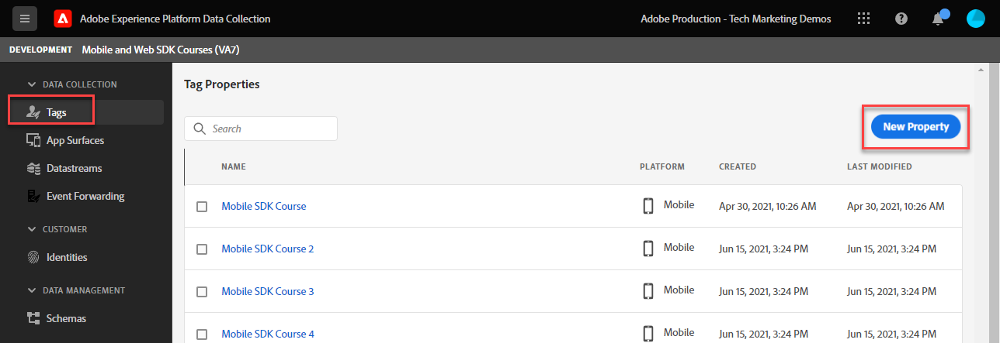
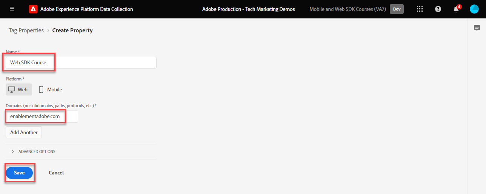
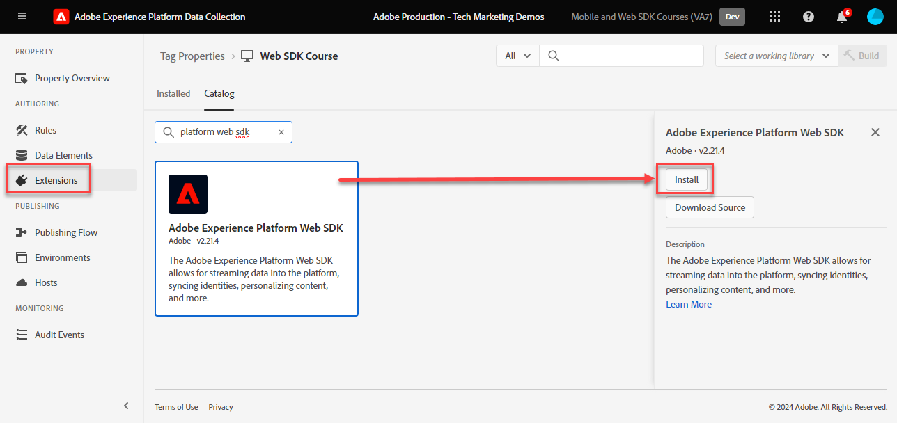
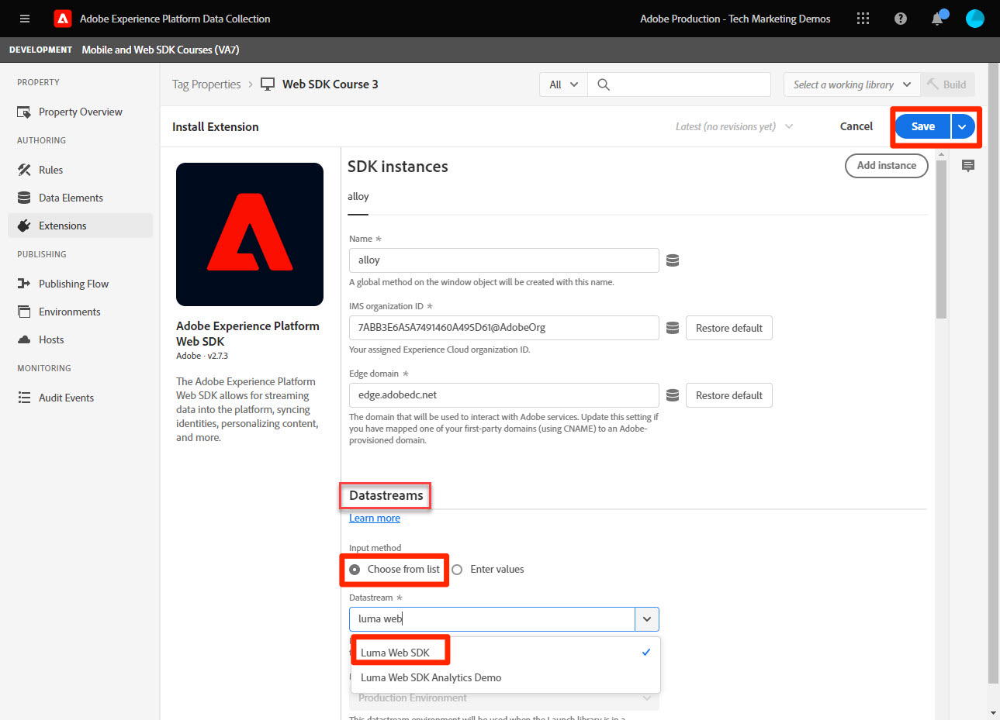

# Install Adobe Experience Platform Web SDK tag extension

Learn how to install and configure the Adobe Experience Platform Web SDK tag extension. The easiest way to implement Web SDK is using Adobe's tag manager, tags (formerly known as Launch). The Platform Web SDK tag extension is the _only tag extension_ required to send data to _all Adobe Experience Cloud applications_, including [Analytics](setup-analytics.md), [Target](setup-target.md), [Audience Manager](setup-audience-manager.md), Real-Time Customer Data Platform, and [Journey Optimizer](setup-web-channel.md)!

## Learning objectives

At the end of this lesson, you will be able to:

* Create a tag property in the Data Collection interface
* Install the Platform Web SDK tag extension
* Map your previously created datastream to the extension

## Prerequisites

You must have completed the previous lessons in this tutorial:

* [Configure a datastream](configure-datastream.md)

### Add a tag property

First you must have a tag property. A property is a container for all the JavaScript, rules, and other features required to collect details from a web page and send it to various locations.

Create a new tag property for the tutorial:

1. Open the [Data Collection interface](https://launch.adobe.com/){target="_blank"}
1. Select **[!UICONTROL Tags]** in the left navigation
1. Select the **[!UICONTROL New Property]** button
    
1. As the **[!UICONTROL Name]**, enter `Web SDK Course` (add your name to the end, if multiple people from your company are taking this tutorial)
1. As the **[!UICONTROL Domains]**, enter `enablementadobe.com` (explained later)
1. Select **[!UICONTROL Save]**
    

## Add the Web SDK extension

With your XDM schema, datastream, and tag property now created, you are ready to install the Platform Web SDK extension:

1. Open your new tag property
1. Go to **[!UICONTROL Extensions]** > **[!UICONTROL Catalog]**
1. Search for `Adobe Experience Platform Web SDK`
1. Select **[!UICONTROL Install]**

    

## Link the extension to your datastream 

Leave most of the default settings and update them later, as needed. The only thing that you must do now is link the extension to your datastream:

1. Under **[!UICONTROL Datastreams]**, select the **[!UICONTROL Choose from list]** input method
1. Select the datastream that you created earlier, `Luma Web SDK`
1. Select **[!UICONTROL Save]**

    >[!NOTE]
    >
    > If you cannot find your datastream, go to the [Configure a datastream](configure-datastream.md) lesson and follow the steps to create one

    

For more information on each section of the extension, see [Configure the Adobe Experience Platform Web SDK extension](https://experienceleague.adobe.com/en/docs/experience-platform/tags/extensions/client/web-sdk/web-sdk-extension-configuration).

>[!NOTE]
>
>While you did not configure a CNAME in the [!UICONTROL Edge domain] setting in this lesson, Adobe recommends you use a CNAME when you implement Platform Web SDK on your own website. While a CNAME implementation does not provide any benefits in terms of cookie lifetime, there may be some other benefits. These benefits include ad blockers and less-common browsers preventing data from being sent to domains that they classify as trackers. In these cases, using a CNAME can prevent your data collection from being disrupted for users employing these tools.

>[!NOTE]
>
>During this tutorial, you configure just one datastream and associate it with all tag environments (development, stage, and production). When you implement Platform Web SDK on your own website, you should configure a separate datastream for each environment and map them accordingly in the extension configuration. 

Now that you have installed Platform Web SDK and associated it with the datastream, you are ready to start collecting data.

[Next: **Create data elements**](create-data-elements.md)

>[!NOTE]
>
>Thank you for investing your time in learning about Adobe Experience Platform Web SDK. If you have questions, want to share general feedback, or have suggestions on future content, please share them on this [Experience League Community discussion post](https://experienceleaguecommunities.adobe.com/t5/adobe-experience-platform-data/tutorial-discussion-implement-adobe-experience-cloud-with-web/td-p/444996)
