# Adobe Experience Platform Web SDK Tutorial

## Terms, definitions and usage

* **Adobe Experience Platform** – can also be referred to as Platform, but should not be referred to as the Platform

* **Adobe Experience Platform Edge Network** – Can also be referred to as the Edge Network, but should not be referred to as Experience Edge

* **Adobe Experience Platform Web SDK**– Can also be referred to as AEP Web SDK, this is the Launch extension most customers will use to deploy and configure Alloy.js on their sites.

* **Alloy.js** – The JavaScript library customers can deploy to interact with the Adobe Experience Platform Edge Network. When using the Launch extension to deploy this library, you should use its proper name of Adobe Experience Platform Web SDK. 

## Introduction to Platform

### Platform Login

>[!IMPORTANT] If you don’t have access to the Experience Edge Early Access (EEEA) organization, please contact Mitch Rice.

Once you receive the emails indicating you have access to EEEA organization, you can navigate to Platform by going to [https://platform.adobe.com/](https://platform.adobe.com/) or by clicking the 9 dots menu, select the Experience Edge Early Access Organization and then click the Experience Platform logo on the right side.

   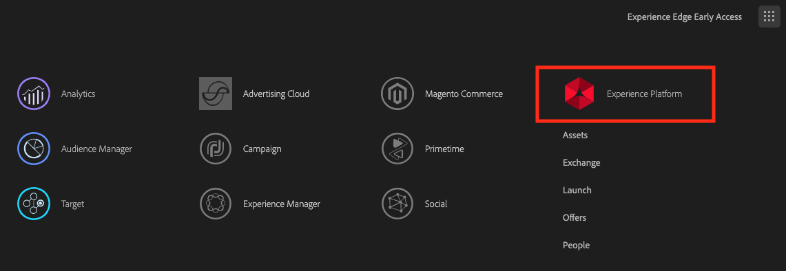

### Introduction to XDM, Datasets, Schemas and Mixins

#### Introduction to XDM

Data storage in Platform is changing from what we’re used to in Analytics, Audience Manager and Target. Data will be stored in Schemas, similar to database schemas, and in a format called XDM. Watch the video below to learn more:

>[!VIDEO](https://video.tv.adobe.com/v/27105?quality=12&learn=on)

#### Introduction to Datasets

All data that is successfully ingested into Adobe Experience Platform is persisted within the Data Lake as datasets. A dataset is a storage and management construct for a collection of data, typically a table, that contains a schema (columns) and fields (rows). Datasets also contain metadata that describes various aspects of the data they store.

#### Introduction to Schemas

Schemas determine how data is stored in Platform. For AA, AT, and AAM, the way we’ve looked at data has been flat, free-form, and flexible; perhaps a little too flexible. Schemas provide rules to ensure data is captured in a more relational, structured way. Structuring data we send to the Adobe solutions will simplify the way Adobe products integrate with each other. Integrations what were once difficult to setup and required a great deal of planning become simpler as XDM data structures are utilized. For example, for a commerce site, there’s a mixin called Product List Items. When properly populated, this mixin can populate shopping cart activity for Analytics customers. When properly implemented, this mixin can also be used to drive Target Recommendations with no additional implementation.

One additional benefit for us as consultants, when standard XDM mixins are utilized, we won’t be required to learn how data is structured for each client we work with, data should be structured the similarly for all of our clients who use standard schemas. Watch this video on creating a Schema:

>[!VIDEO](https://video.tv.adobe.com/v/27012?quality=12&learn=on)

#### Introduction to Mixins

For now we’ll be using default mixins. In the future, mixins will likely mirror current Analytics solutions like Internal Search, Content Measurement or Lead Tracking: 
Watch this video on creating a mixin:

>[!VIDEO](https://video.tv.adobe.com/v/27013?quality=12&learn=on)

### Create a Schema

1. In the Platform interface, click **[!UICONTROL Schemas]** in the menu on the left
2. Click **[!UICONTROL Create Schema]** in the Upper right corner of the screen
3. Give your schema a name you’ll remember. Probably something with your name in it. 
4. Assign your schema a class: XDM Experience Event
5. Create a schema with the following mixins, make sure the schemas you choose have Adobe listed as the owner, not customer (screenshot below):

   * ExperienceEvent Implementation Details
   * ExperienceEvent Environment Details
   * ExperienceEvent Web Details

      >[!NOTE] Be sure to select the Adobe owned version of the mixin:

   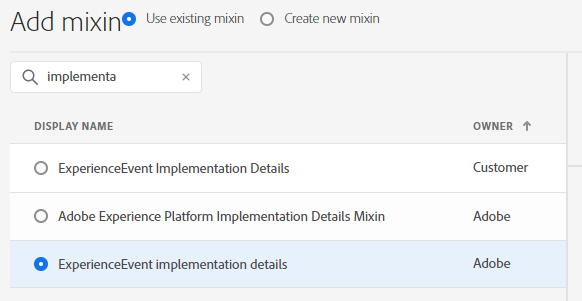

   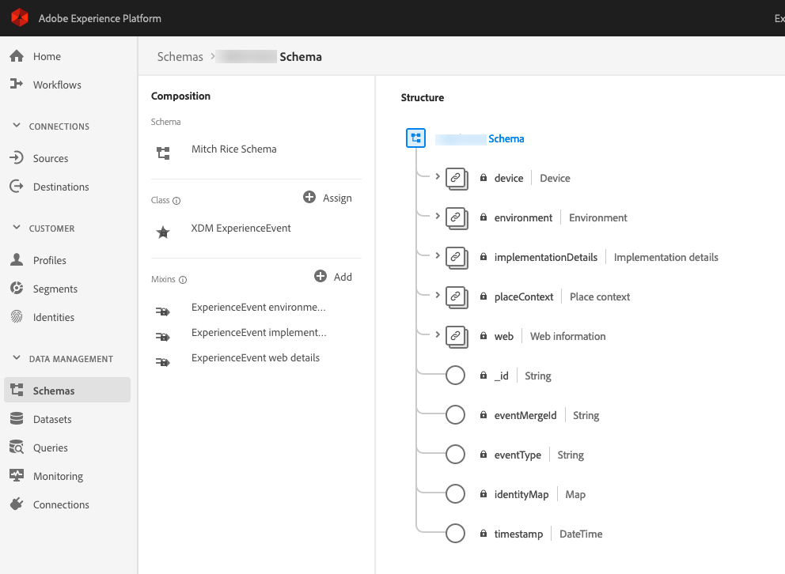

6. Save your schema

### Build A Dataset 

1. Select **[!UICONTROL Datasets]** from the menu on the left
2. Click the **[!UICONTROL Create Dataset]** button in the upper right-hand corner
3. Click **[!UICONTROL Create Dataset from Schema]**
4. Select the Schema you created in the previous step > Click **[!UICONTROL Next]**
5. Give your Dataset a Name and Brief Description – again, your name is probably helpful in creating something you’ll remember. > Click **[!UICONTROL Finish]**

   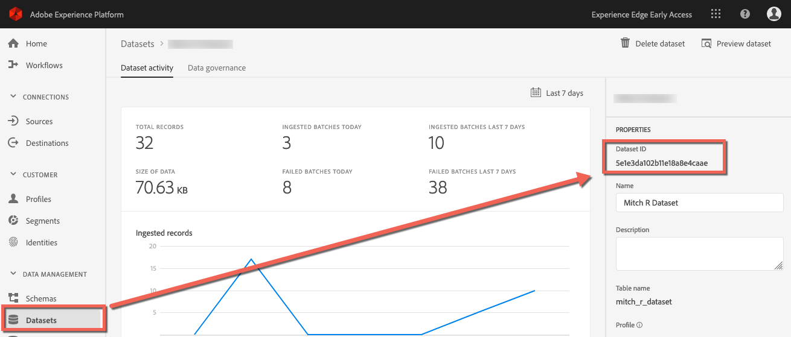

### Create a Launch configuration for your Property

Next we’re going to create an Edge Configuration. This configuration will generate a Configuration ID. This ID will be added to the AEP Web SDK configuration in Launch and will be used to route data appropriately when it hits the Experience Edge.

1. Navigate to [https://launch.adobe.com](https://launch-demo.adobe.com). Launch properties have to be provisioned to work in this environment, so this interface will only work when the Experience Edge Early Access organization is selected. 
2. Select the **[!UICONTROL Edge Configuration]** icon from the left-hand rail

    

   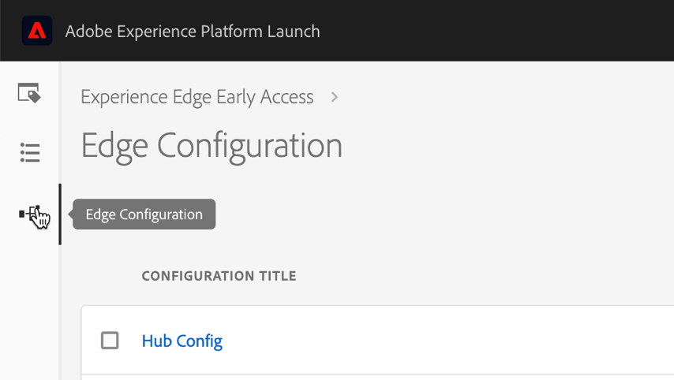

3. Click the **[!UICONTROL New Edge Configuration]** button in the upper-right hand corner
4. Give your Configuration a Name and Description (optional) and click **[!UICONTROL Save]**

    

   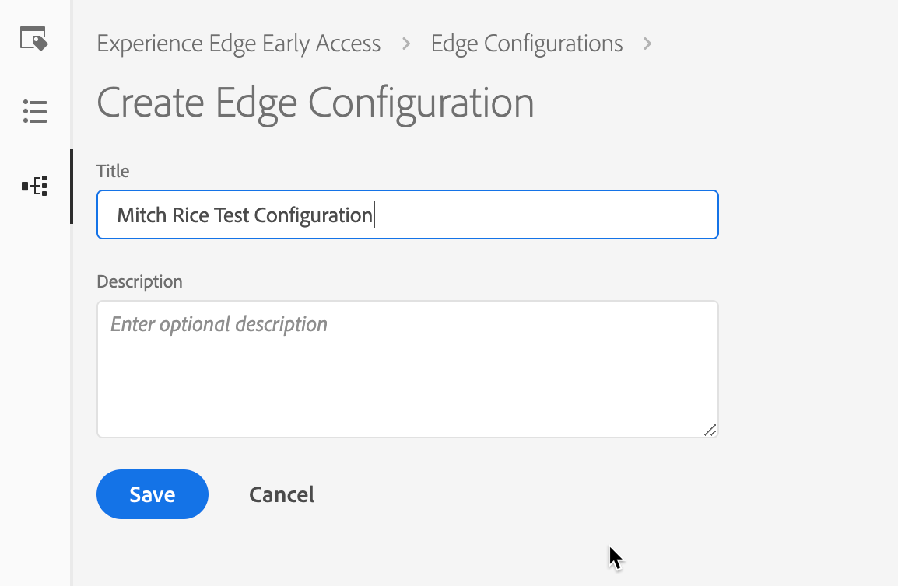

5. Click the toggle switch to turn enable the **[!UICONTROL Experience Edge Platform]** section of the configuration:

    

   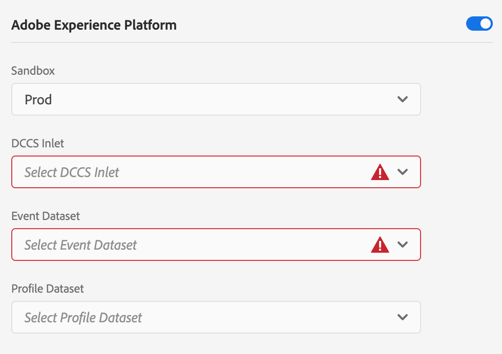

    1. For Sandbox, select Prod

    1. For **[!UICONTROL DCCS Inlet]**, select experience-edge-konductor

    1. For **[!UICONTROL Event Dataset]**, select the dataset you created in the previous step

    1. **[!UICONTROL Profile Dataset]** is optional and will not be needed for these assignments

6. Click the toggle switch to turn enable the **[!UICONTROL Target]** section of the configuration. Add `experienceedgeearlya` to the **[!UICONTROL Client Code Field]**

    

   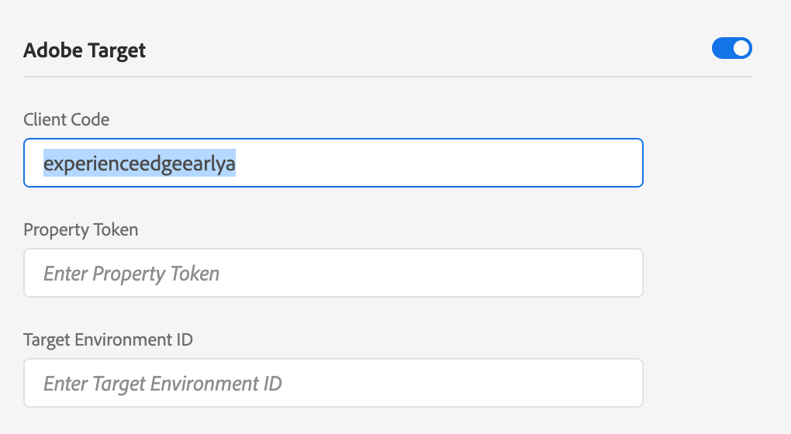

   >[!NOTE] While you can use your own instance of Launch while you’re testing, you must use the EEEA instances of Analytics, Target and Audience Manager. The configuration ID generated previously is specific to the organization where it was generated.

7. Click the toggle switch to turn enable the **[!UICONTROL Audience Manager]** section of the configuration. Click the Check Mark to enable **[!UICONTROL Cookie Destinations]**. If you’re familiar with and would like to Test URL Destinations as well, feel free to enable and test those as well.

    

   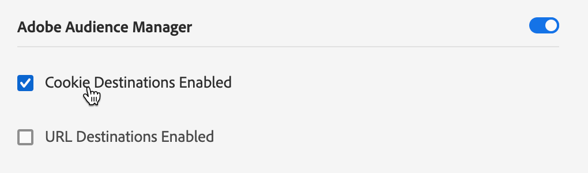

8. If you would like to test Adobe Analytics functionality, open a new window or tab and navigate to Analytics in the Experience Edge Early Access organization. Create a report suite (again, I would recommend creating a report suite and report suite ID with your name in it). Once you have the report suite created, copy the report suite ID and head back over to your Edge Configuration tab. 
9. Click the toggle switch to enable the **[!UICONTROL Analytics]** section of the configuration. Add your newly create Report Suite ID to the Report Suite ID field. 

   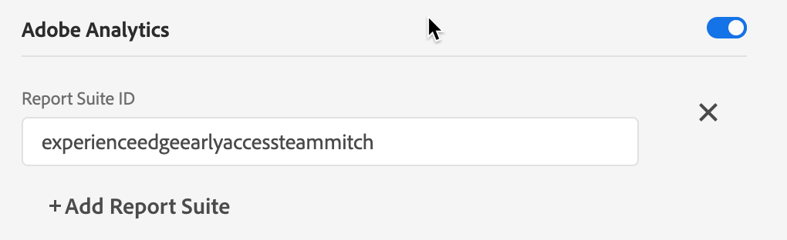

10. When you’re done, click the **[!UICONTROL Save]** button at the bottom of the page.
11. Once Saved, click the name of your configuration, you’ll see three environments with three different configuration IDs (actually, the IDs aren’t very different, they just have different suffixes dev, stage, and prod). Right now, these configurations for each of the environments are the same, however, you can go back into any one of the configurations and customize them as needed. *Copy the dev configuration ID*, we’ll use it in the next assignment to configure the AEP Web SDK extension.

## Use AEP Web SDK

### Install the AEP Web SDK

In either your own Launch instance or the Experience Edge Early Access Organization Launch instance, we’ll be creating a new Property and installing the **[!UICONTROL AEP Web SDK]** Extension 

1. Create new Launch Property:

   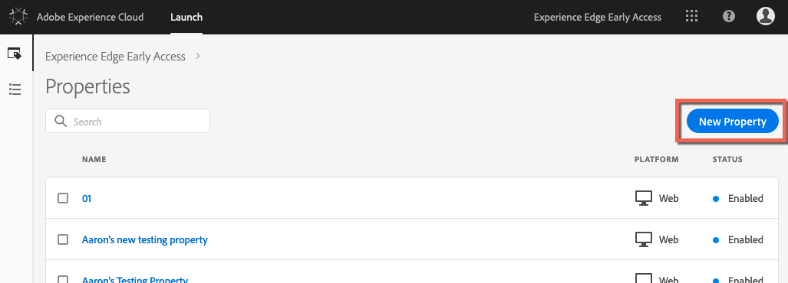

2. Install AEP Web SDK in Adobe Launch:

    

   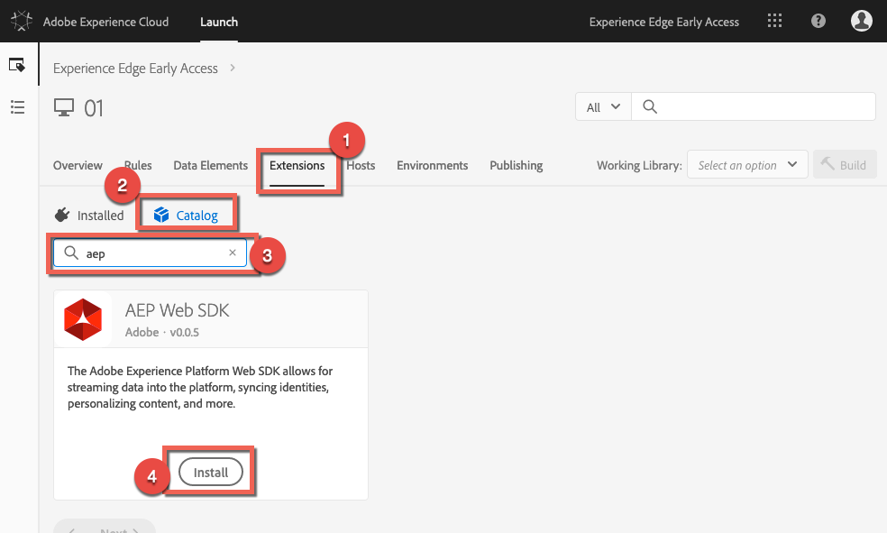

Next, we’ll configure the Web SDK. You’ll need the Configuration ID you created in the previous assignment 

1. All fields with the exception of Config ID will be populated be default:

   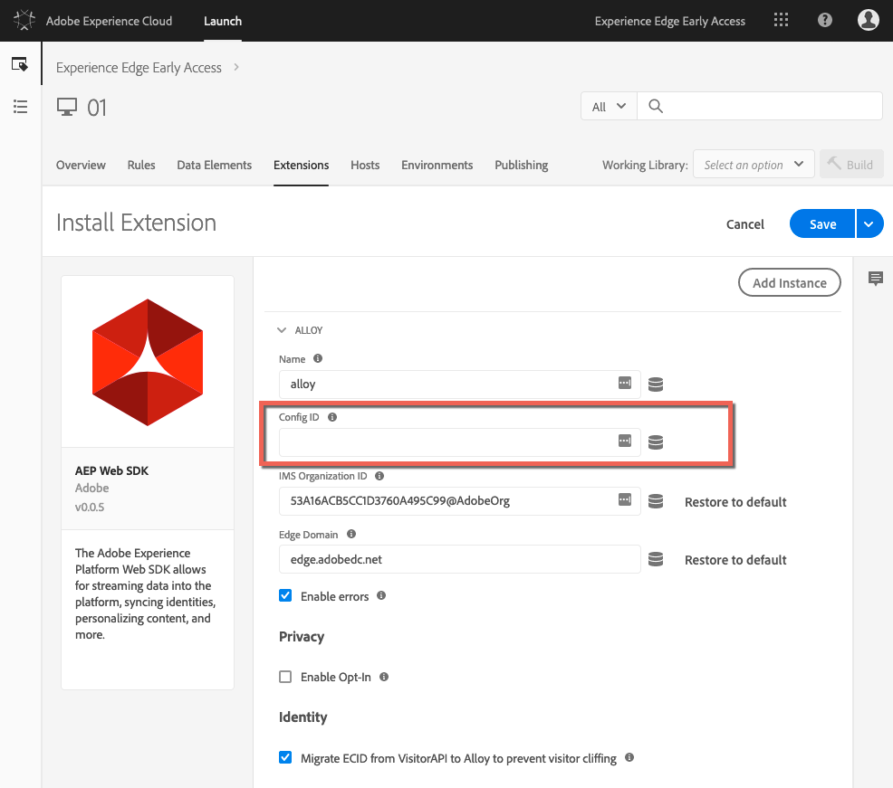

1. Use the following options to configure the AEP Web SDK:

   1. **[!UICONTROL Name]**: Stick with alloy for now 

   1. **[!UICONTROL Config ID]**: Configuration ID from previous assignment

   1. **[!UICONTROL IMS Organization ID]**: 53A16ACB5CC1D3760A495C99@AdobeOrg 

   1. **[!UICONTROL Edge Domain]**: edge.adobedc.net 

1. For the rest of the options, use the default settings.

### Create Rules using the AEP Web SDK

1. Create a Rule, to get started give it a name:

    

   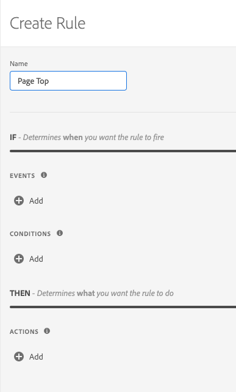

2. Configure your Event. Set your rule to fire when the Library is Loaded (Page Top):

   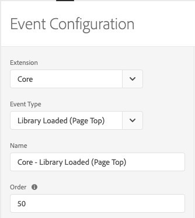
 

3. Configure your Action. If you have a data layer object, you should pass it with this call. In order for this call to fire at page top, you must also select the check box that says _Occurs at the start of a view_

   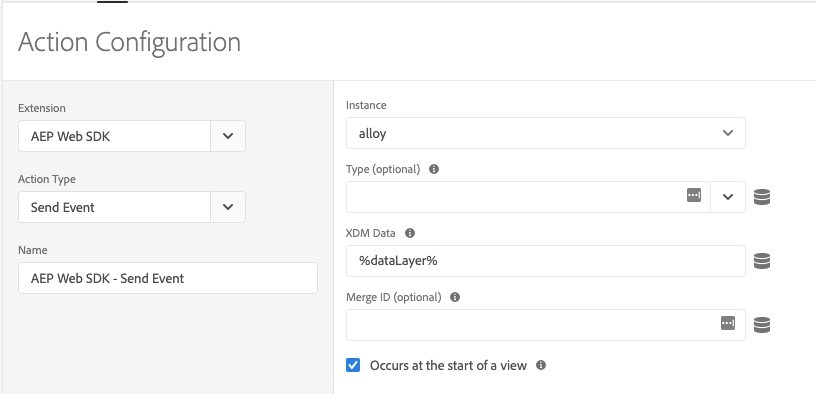

4. Save that rule and create another. The next rule we setup will be the data collection call. It will send data to Analytics. In your event configuration, instead of choosing Page Top, choose Page Bottom.  Pass your data layer object again and make sure _Occurs at the start of a view_ is unchecked. Save and Publish this rule along with the rule you created. 
5. Now, let’s check the browser console to ensure both the _interact_ and _collect_ calls are present. The calls in the Network Console can be found by searching using the words interact, collect or the adobedc.net.

    

   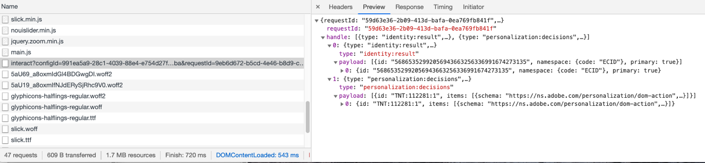

    You should now be able to see a call with the word _collect_ in your console that contains your data layer object. As you expand the events>xdm portion of the request, you’ll be able to see the data layer alongside key value pairs collected by default by the alloy.js library.

    

   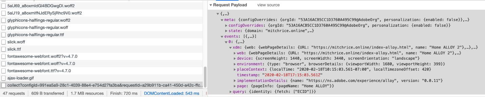

The differentiator for when the interact and collect calls are fired depends on whether the _Occurs at the start of a view_ checkbox is checked in your Launch Rule. Generally, most clients will want to fire a call at the top of the page for Visitor ID Service, Target and Audience Manager and they’ll fire another at the bottom for data to be sent to Analytics. There is XDM contained in both the interact call and the collect call. The XDM present in both calls will send data to Analytics, Target and Audience Manager. If the customer’s data layer is fully built when the interact call is fired, there is no need to fire the collect call. If wish to fire both an interact and a collect call, the XDM data contained in both calls will be sent to Analytics as separate requests and double counting will occur. In scenarios when both the interact call and the collect call are required; the product team has created a new feature called the Event Merge ID to prevent data from being double counted. When the Event Merge ID is included in both the interact and collect calls, the data is merged and treated as a single request in Analytics. 

**Below is an example of how a data layer on the page, will be converted to XDM in the interact and collect calls.**

**Data Layer on Page:**

   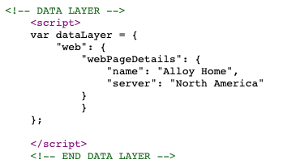

**Data Layer after it has been combined with values collected by default by Alloy.js in the Chrome Debugger:**

   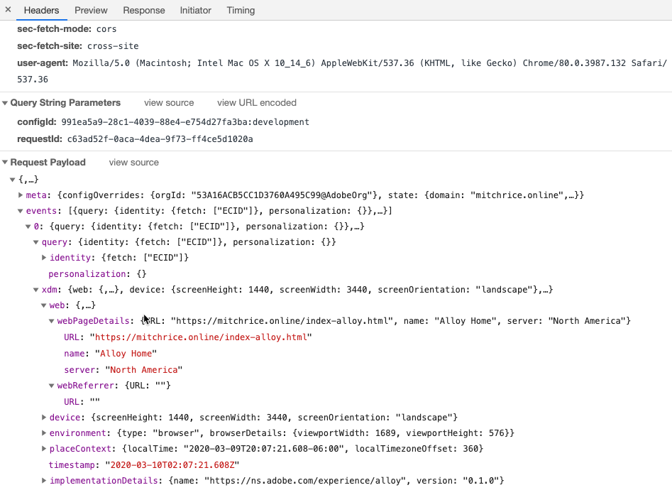

**Schema as configured in Platform:**

   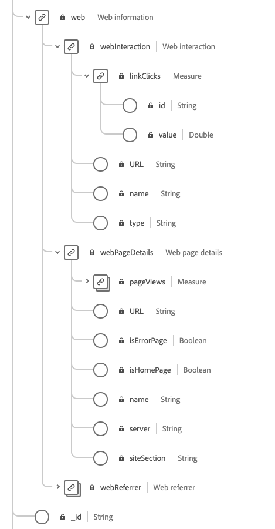

As you can see, the structure of the data is nested in the same manner on the page as it has been configured in the Schema. If your data is not nested in a similar manner, it will be rejected by Platform. 

### Use the Data Layer to XDM Mapper

The product team has created a Data Layer to XDM mapper in Launch. This mapper allows data layer data to be sent to Platform without the strict requirement that the structure of the data layer match the structure of the Schema. This tool will be key in allowing customers with existing data layers migrate to the AEP Web SDK. 

To use the Data Layer to XDM mapper:

1. Select **[!UICONTROL Data Elements]** in the Launch property, then select the **[!UICONTROL Add Data Element]** button.

   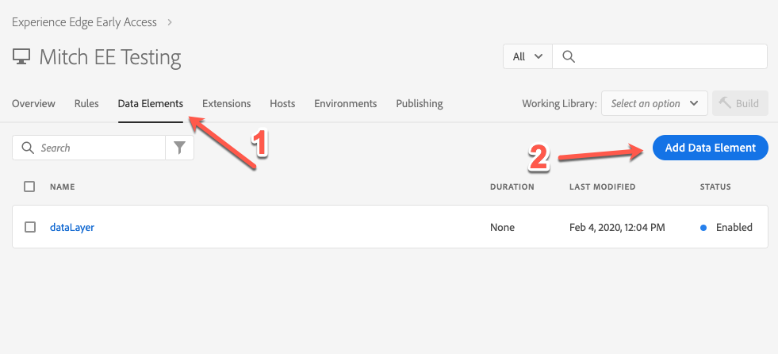

2. Under Extension, select **[!UICONTROL AEP Web SDK]**, then select **[!UICONTROL XDM Object]** as the data type. Selecting those two values will load the Schema you configured previously. Now may now select individual elements from the schema and map them to values from your data layer.

    

   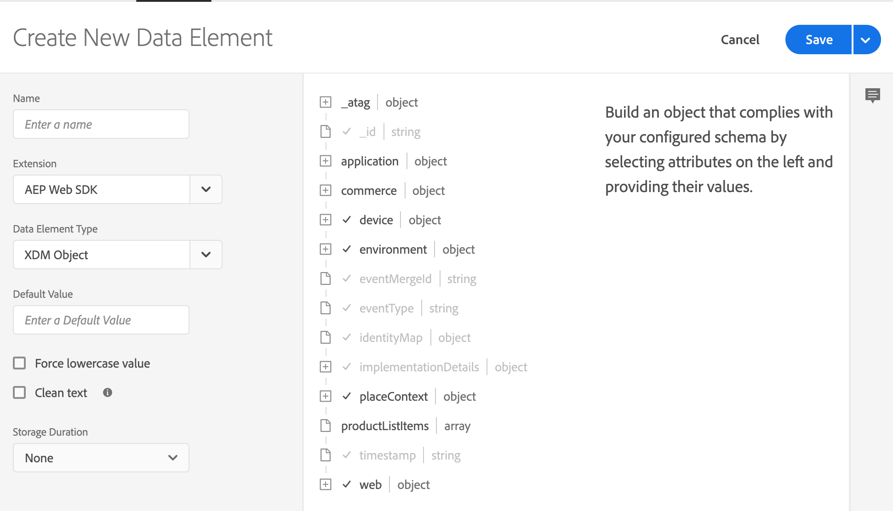

   >[!NOTE] If your configuration ID contains the :dev, :stage, or :prod suffix, the Schema will not load. If you would like to test this functionality, you need to remove the suffix. Otherwise, the functionality will be fixed at release on or around May 13.  

## Validate Data in Platform

### Validate Data in Platform

With your site currently sending hits to the Edge Network and onto Platform, you should now be able to see it as it populates. 

1. Navigate to the Experience Edge Early Access platform Instance

    

   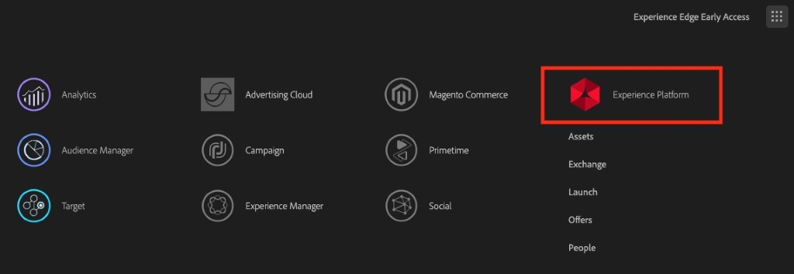

2. Click Datasets in the left-hand menu and navigate to the dataset created earlier

In the lower part of the screen, you’ll the status of the most recent calls sent to Adobe Experience Platform. New batches are ingested every 15 minutes. If you don’t see your most recently sent data, make sure you’re checking at one of the quarter-hourly intervals. If your data is failing, you can also click on the batch ID to see the failure reason. The most frequent reason for data failure is that data is not mapped correctly to the Schema structure.

   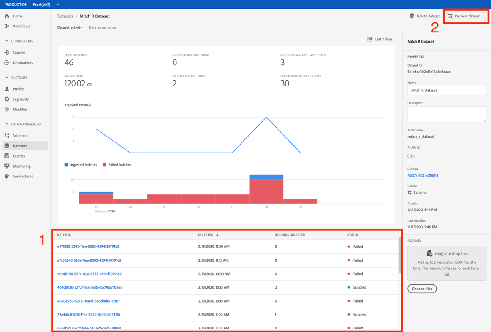

Click Preview Dataset to view data that has been sent to Platform. Here you should see your data in its raw format, similar to what you would see in a data feed or Analytics debug log.

   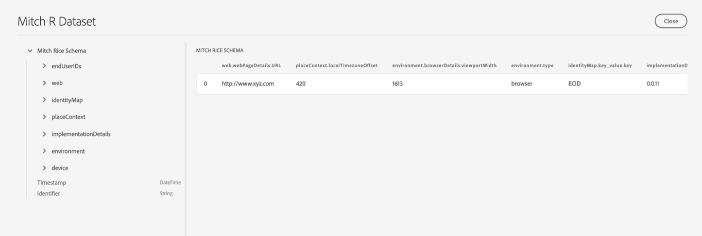

You can narrow down the visible data by selecting individual elements in the left-hand rail. 

### Use the Platform Query Service

Next we’re going to use the query service to demonstrate how SQL can be used to generate reports using the raw data contained in Platform. The query service is especially powerful when datasets collected using AEP Web SDK sit next to data imported from other sources. 

1. Navigate to the Query Service using the Queries link in the left-hand rail (1)

    

   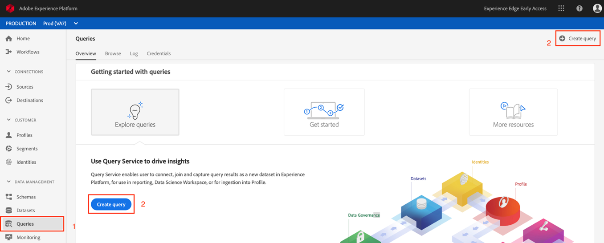

2. Next click Create Query (2). You’ll be taken to the SQL query browser, create a query similar to the one below:

    

   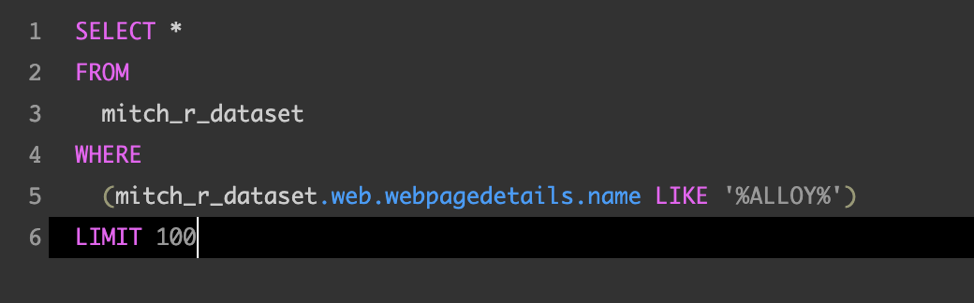

You’ll want to be sure your dataset is selected instead of mine (mitch_r_dataset) and that your query contains a value that is in your dataset. In this case, I am matching web.webpagedetails.name to a wildcard search string of ALLOY. The percent signs act as wildcard values in the search. 

Notice when the query service returns values, values are concatenated at the top value, so all of the web values look like this: `("(https://mitchrice.online/index-alloy.html,Home ALLOY 2)","()")` – this follows the format of URL, name, referrer.

The query service allows customers to save queries like this to create subsets of data which can be used for a variety of purposes. 

## Send data to Analytics using the AEP Web SDK

In this section, we’ll be mapping XDM data captured by the AEP Web SDK to Analytics variables using processing rules. 

Raw XDM data captured using the AEP Web SDK is automatically forwarded to Analytics. If data is also being forwarded to Platform, it must pass validation against the schema that has been created. However, if the customer has not yet purchased Platform licensing, no validation will occur.

>[!IMPORTANT] It is important when helping customers migrate to the AEP Web SDK that they are aware that XDM validation against a schema will be required in the future. It is better to develop XDM-compatible implementations during the solution design phase rather than doing so after the customer has implemented.

### Map XDM values to Analytics variables using Processing Rules

Any values outlined in the [following link](https://git.corp.adobe.com/analytics-data-collection/anedge/blob/1c874f5d5ab9b84e95aa35c16361428bde991495/XDM_Translator.md) are automatically mapped by the XDM Translator as data flows from the Edge Network to Analytics. Values outside of those outlined in that document need to be mapped manually. Those values will populate drops-downs in the Processing rules interface and can be used to map to Adobe Analytics variables

1. Navigate to the Processing Rules interface by clicking Admin > Report Suites. 
2. Select your report suite on the following page, the click Edit Settings > Processing Rules
3. Map XDM values to Analytics Variables. All XDM values will be flattened and prefixed with a.x.XDMValue

    

   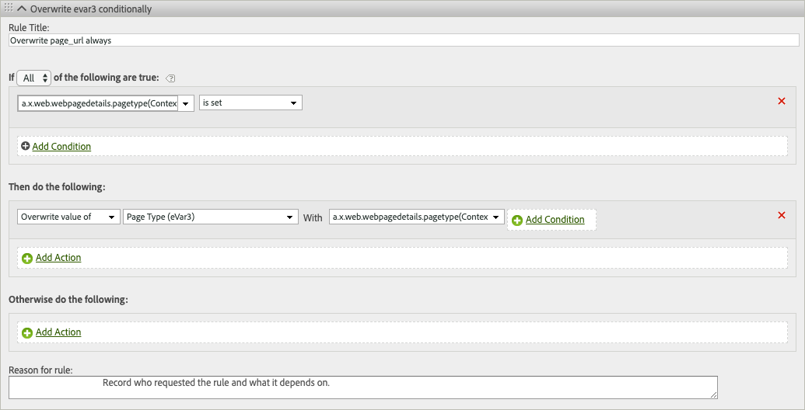

## Use Audience Manager with the AEP Web SDK

 

In this section, we’ll be working within the AAM instance connected to the Experience Edge Early Access account. 

When building traits and segments, Adobe recommends creating a new data source to capture onsite data – data sources are the fundamental tool used to organize data within AAM. 

 

### Create a Data Source

   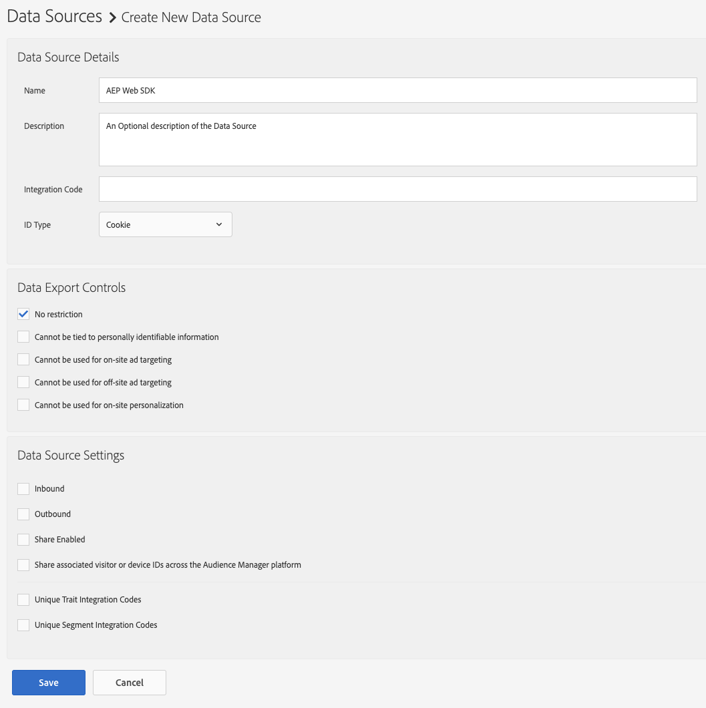

1. In Audience Manager, navigate to Audience Data > Data Sources. Click **[!UICONTROL Add New]**
2. Provide a name for the Data Source (Required)
3. Include a **[!UICONTROL Description]** of the Data Source (Optional)
4. If desired provide an **[!UICONTROL Integration Code]**, they are optional and typically only used with the Adobe Experience Platform Identity Service or Profile Merge Rules
5. Choose an ID type of **[!UICONTROL Cookie]** (Optional)
6. Under **[!UICONTROL Data Export Controls]**, leave **[!UICONTROL No restriction]** selected
7. Under **[!UICONTROL Data Source Settings]**, no boxes need to be selected
8. Click **[!UICONTROL Save]**

### Create a Trait 

 

1. In Audience Manager, navigate to Audience Data > Traits. Click **[!UICONTROL Add New]**. Select **[!UICONTROL Rule-based]** in the drop-down. 
2. Give your trait a **[!UICONTROL Name]** you’ll remember. Provide a **[!UICONTROL Description]** if you’d like. Select `Adobe Consulting Data Source (ID: 582527)` as the Data Source. Event type should be **[!UICONTROL User Trait]**. The integration code is not used here – leave blank. Select a folder on the right where your trait will be stored and found later when creating a segment. I selected **[!UICONTROL Experience Edge]** 
3. Near the bottom of the page, define your trait under the Trait Expression header to match a key-value-pair that fires on the page hit. I chose to match the page name in my XDM to the name I used for my homepage. So, web.`webPageDetails.name == “Alloy Home`. Click **[!UICONTROL Save]** 

    

   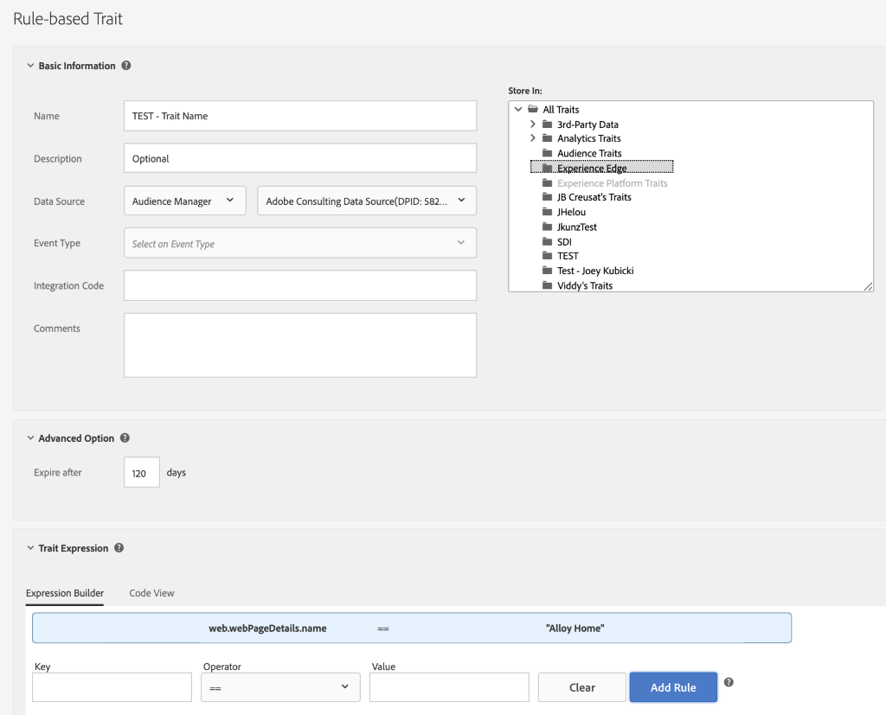
 

 

### Create a Segment

 

1. Navigate to Audience Data > Segments 
2. Give your segment a **[!UICONTROL Name]** you’ll remember. Provide a **[!UICONTROL Description]** if you’d like. Add an **[!UICONTROL Integration Code]**, which in this case is a random set of numbers. Select **[!UICONTROL Audience Manager]** and `Experience Edge Early Access Audiences` as the Data Source.  
3. Expand the Traits drop-down and search for the trait you created and click **[!UICONTROL Add Trait]**. Click **[!UICONTROL Save]** at the bottom of the page.

   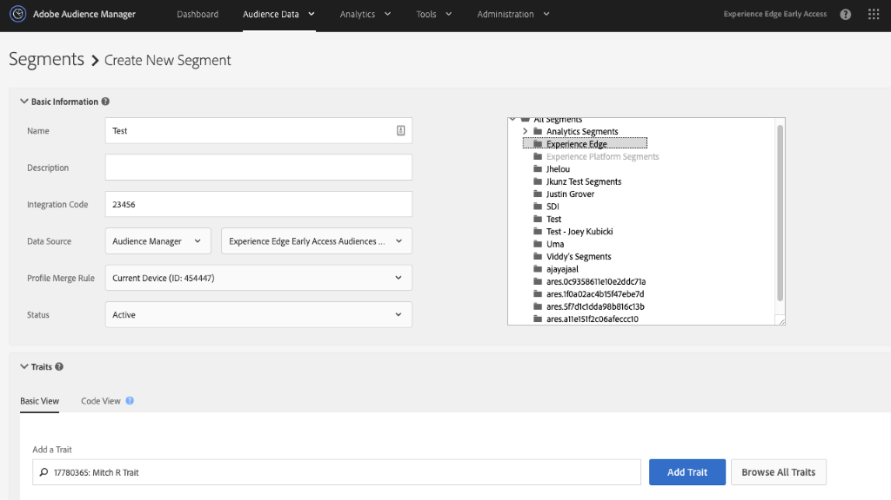
 

 

### Create a Cookie Destination 

 

1. Give your Destination a name you’ll remember. Provide a description if you’d like. Under Type, choose Cookie. Click **[!UICONTROL Save]** at the bottom of the page. If you choose Cookie, a cookie will be set when the user qualifies for the segment. I will show the process to set up a cookie destination.  

   >[!NOTE] Ignore the Data Export Labels section. 

2. Provide a **[!UICONTROL Cookie Name]** and **[!UICONTROL Cookie Domain]**; the cookie name can be anything, the cookie domain should be the domain of your test site. For the Publish Data To selection, choose **[!UICONTROL Only Selected Domains]** and add the domain you’re using for your test site. If you select All of our domains, your cookie may sync for tests not related to yours. For Data Format, select **[!UICONTROL Single Key]** and provide a key. Click **[!UICONTROL Save]** before continuing to map your segment to this new cookie destination.

   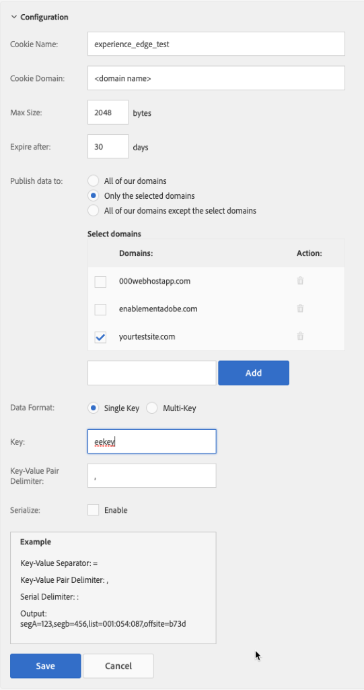

3. After you click save, the Segment mappings portion of the page will change from being grayed out. Search for the segment you created in the previous section.  

   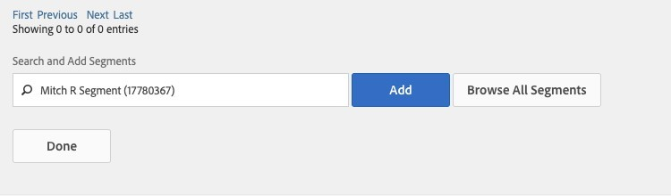
 
4. When you have found your segment, click **[!UICONTROL Done]** 

   An Edit Mapping popup will appear asking you provide a value for your cookie - this value will identify the segment that a browser cookie qualifies for. Enter a unique value to correspond with your key, such as the segment ID or segment name. In my case I added `eevalue`.  

   

5. Click Save and wait 1-3 hours for your changes to sync to the AAM servers.  

### Test to Ensure the Cookie is Set 

1. After waiting for the content to sync to the AAM servers, clear your browser cookies on your demo domain. Navigate to the page that sends the trait that will allow you to qualify for your segment. In the _interact_ call, you will see expand the **handle** portion of the call. You will see a section that says **activation:push**. Your cookie information should be contained within that portion of the response: 

   
 

2. If you check the cookies set on the domain, you’ll notice the cookie has also been set: 

   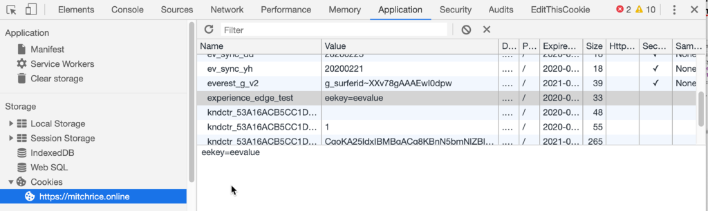

## Use Target with the AEP Web SDK

### Create a Basic A/B Testing using the AEP Web SDK and Target

1. Navigate to the appropriate Target instance in your demo sandbox
2. Create a new Target activity using the VEC. 
3. If not already highlighted, click Activities (1) near the upper left-hand corner, then click Create Activity (2)

   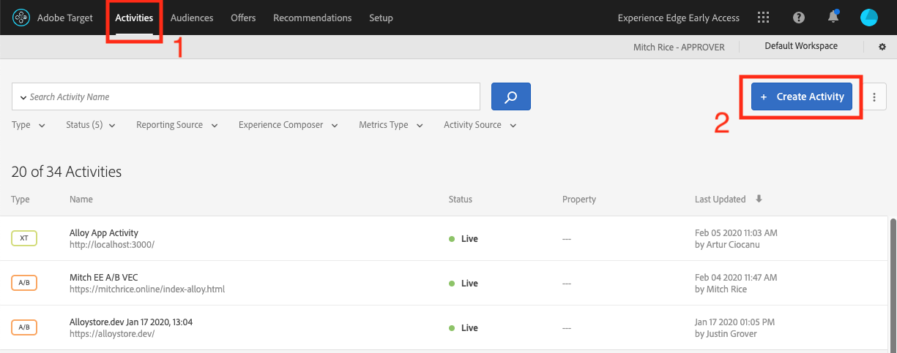
 

4. Select A/B Test when you click on Create Activity

    

   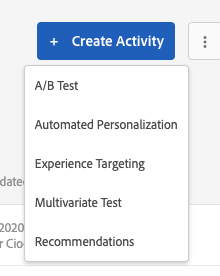

5. Select the Visual Experience Composer and Provide a URL at the bottom of the page. Ensure the URL you provide can support secure connections: 

    

   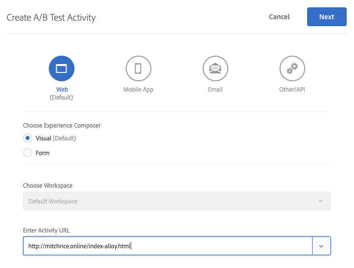

6. If your page does not load, you may need to allow insecure content in your browser. In Chrome, you can do it by performing the following steps:
   
   1. Click the padlock in the left side of the URL bar. Then click Site Settings. 

      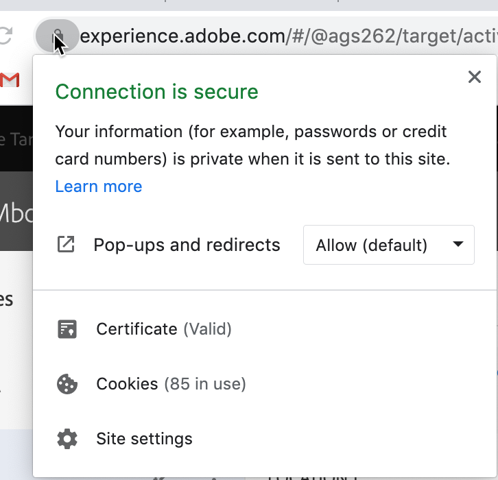

   2. Scroll to the bottom of the settings page and change the Insecure content value to Allow:

      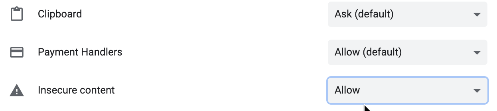

   3. If you don’t already have it installed, you also need to install the Adobe Target VEC Helper Extension for Chrome. It can be found [here](https://chrome.google.com/webstore/detail/adobe-target-vec-helper/ggjpideecfnbipkacplkhhaflkdjagak)

   4. Once installed, you may also need to toggle the extension on:

      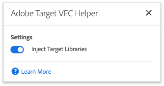

7. Navigate to a portion of the site and make a minor change. In this case, I’ll be changing some text:

   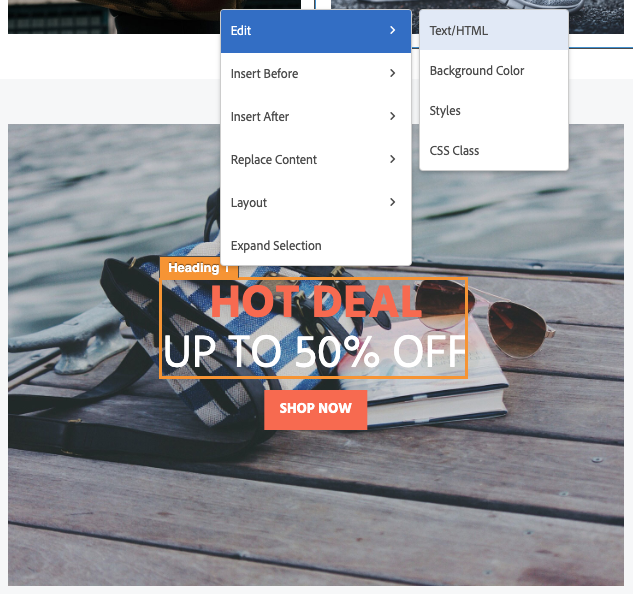

   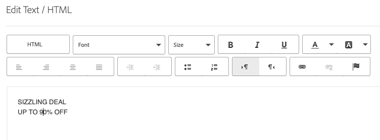

    

   

8. Once you’ve completed your changes, ensure they are reflected in the experience and click the **[!UICONTROL Next]** button in the upper right-hand corner.
9. Set your activity to point all users to Activity B and click **[!UICONTROL Next]** again 

   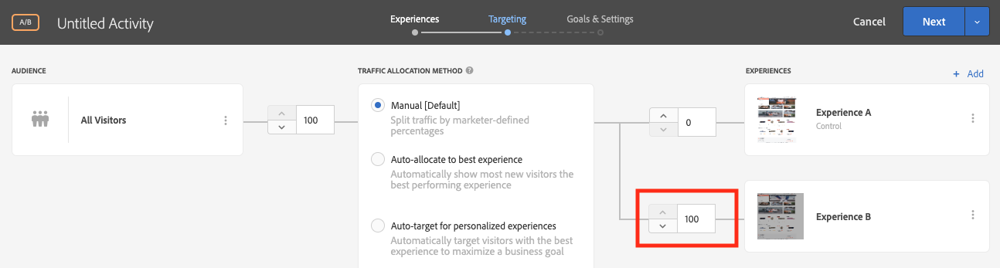

10. Set a Primary goal of Engagement and Page Views

    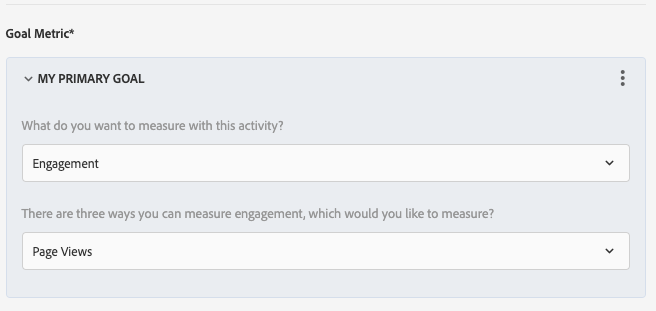

11. Click **[!UICONTROL Save & Close.]** You’ll be asked to give your activity a name. Click **[!UICONTROL Save & Close]** again
12. Activate your activity by clicking the Inactive button in the upper right-hand corner and selecting **[!UICONTROL Activate]**.

    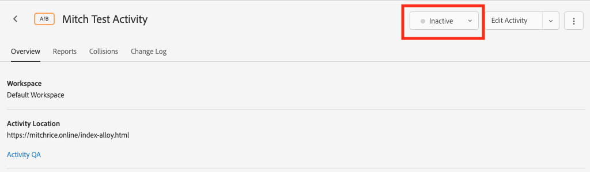

13. Navigate to your page, ensure the changes you made in your activity are reflected You should also be able to see the Target content returned in the _interact_ call. 

    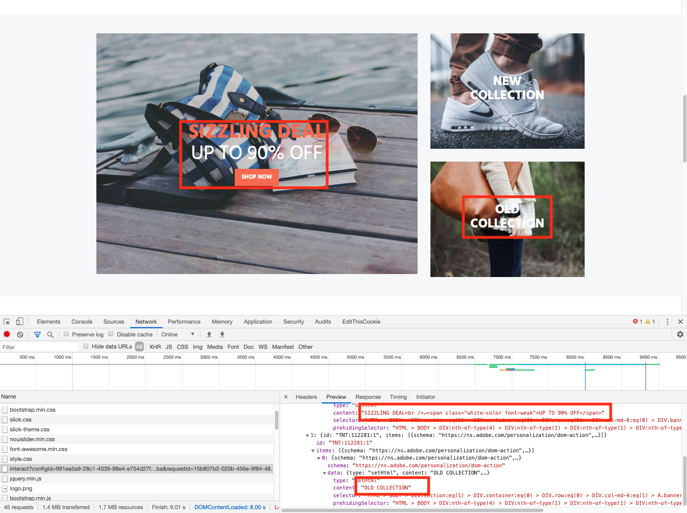

