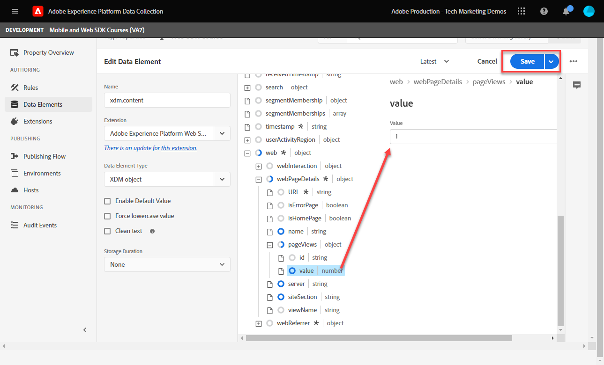
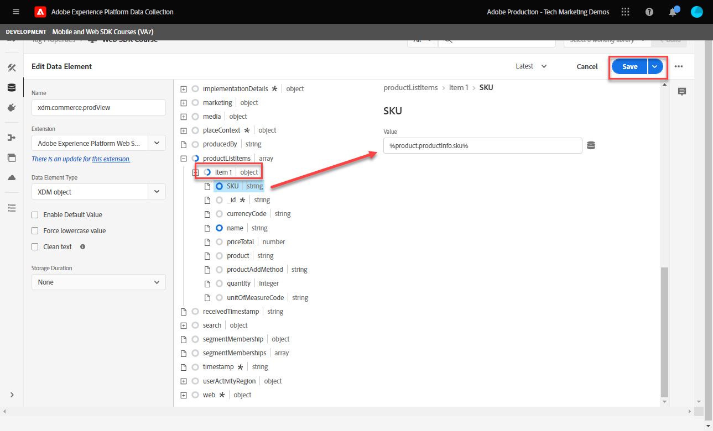

# Set up Adobe Analytics with Platform Web SDK

Learn how to set up Adobe Analytics using [Experience Platform Web SDK](https://experienceleague.adobe.com/docs/platform-learn/data-collection/web-sdk/overview.html), create tag rules to send data to Adobe Analytics, and validate that Analytics is capturing data as expected.

[Adobe Analytics](https://experienceleague.adobe.com/docs/analytics.html) is an industry-leading application that empowers you to understand your customers as people and steer your business with customer intelligence.

## Learning objectives

At the end of this lesson, you will be able to:

* Configure an XDM schema for Adobe Analytics and understand the difference between auto-mapped and manually mapped XDM variables for Analytics
* Configure a datastream to enable Adobe Analytics
* Map individual or entire array data elements to the XDM object
* Capture page views in Adobe Analytics with the XDM object
* Capture e-commerce data with the XDM object for the Adobe Analytics product string
* Validate Adobe Analytics variables are set with the XDM object using Experience Platform Debugger
* Use Adobe Analytics processing rules to set custom variables
* Validate data is captured by Adobe Analytics using Real-Time Reports

## Prerequisites

You are familiar with tags, Adobe Analytics, and the [Luma demo site](https://luma.enablementadobe.com/content/luma/us/en.html){target="_blank"} login and shopping functionality. 

You need at least one test/dev report suite ID. If you don’t have a test/dev report suite that you can use for this tutorial, [please create one](https://experienceleague.adobe.com/docs/analytics/admin/manage-report-suites/new-report-suite/t-create-a-report-suite.html).

You must have completed all the steps from the previous sections in the tutorial:

* Initial Configuration 
  * [Configure permissions](configure-permissions.md)
  * [Configure an XDM schema](configure-schemas.md)
  * [Configure an identity namespace](configure-identities.md)
  * [Configure a datastream](configure-datastream.md)
* Tags Configuration
  * [Install Web SDK extension](install-web-sdk.md)
  * [Create data elements](create-data-elements.md)
  * [Create a tag rule](create-tag-rule.md)
  * [Validate with Adobe Experience Platform debugger](validate-with-debugger.md)

## XDM schemas and Analytics' variables

Congratulations! You already configured a schema compatible with Adobe Analytics in the [Configure a schema](configure-schemas.md) lesson!

Implementing Platform Web SDK should be as product-agnostic as possible. For Adobe Analytics, mapping eVars, props, and events doesn't occur during schema creation, nor during the tag rules configuration as it has been done traditionally. Instead, every XDM key-value pair becomes a Context Data Variable that maps to an Analytics variable in one of two ways: 

1. Automatically mapped variables using reserved XDM fields
1. Manually mapped variables using Analytics Processing Rules

To understand what XDM variables are auto-mapped to Adobe Analytics, please see [Variables automatically mapped in Analytics](https://experienceleague.adobe.com/docs/experience-platform/edge/data-collection/adobe-analytics/automatically-mapped-vars.html?lang=en). Any variable that is not auto-mapped must be manually mapped. 

The schema created in the [Configure a schema](configure-schemas.md) lesson contains a few auto-mapped to Analytics variables, as outlined in this table:

|XDM to Analytics auto-mapped variables|Adobe Analytics variable|
|-------|---------|
|`identitymap.ecid.[0].id`| mid|
|`web.webPageDetails.pageViews.value`|a page view s.t() call|
|`web.webPageDetails.name`|s.pageName|
|`web.webPageDetails.server`|s.server|
|`web.webPageDetails.siteSection`|s.channel|
|`commerce.productViews.value`|prodView|
|`commerce.productListViews.value`|scView|
|`commerce.checkouts.value`|scCheckout|
|`commerce.purchases.value`|purchase|
|`commerce.order.currencyCode`|s.currencyCode|
|`commerce.order.purchaseID`|s.purchaseID|
|`productListItems[].name`|s.products=;product name;;;;|
|`productListItems[].quantity`|s.products=;;product quantity;;;|
|`productListItems[].priceTotal`|s.product=;;;product price;;|

>[!NOTE]
>
>The individual sections of the Analytics product string are set through different XDM variables under the `productListItems` object. 


## Configure the datastream

Platform Web SDK sends data from your website to Platform Edge Network. Your datastream then tells Platform Edge Network where to forward that data, in this case, which of your Adobe Analytics report suites.

1. Go to [Data Collection](https://experience.adobe.com/#/data-collection){target="blank"} interface
1. On the left navigation, select **[!UICONTROL Datastreams]** 
1. Select the previously created `Luma Web SDK` datastream

    

1. Select **[!UICONTROL Add Service]**
     
1. Select **[!UICONTROL Adobe Analytics]** as the **[!UICONTROL Service]**
1. Enter the  **[!UICONTROL Report Suite ID]** of your development report suite
1. Select **[!UICONTROL Save]**

    

    >[!TIP]
    >
    >Adding more report suites by selecting **[!UICONTROL Add Report Suite]** is equivalent to multi-suite tagging.

>[!WARNING]
>
>In this tutorial, you only configure the development Adobe Analytics report suite. When you create datastreams for your own website, you would create additional datastreams and report suites for your staging and production environments.


## Create additional data elements

Next, capture additional data from the Luma data layer and send it to the Platform Edge Network. While the lesson focuses on common Adobe Analytics requirements, all data captured can easily be sent to other destinations based on your datastream configuration. For example, if you completed the Adobe Experience Platform lesson, the additional data you capture in this lesson is also sent to Platform.

### Create e-commerce data elements

During the Create data elements lesson, you [created JavaScript data elements](create-data-elements.md#create-data-elements-to-capture-the-data-layer) that captured content and identity details. Now you will create additional data elements to capture e-commerce data. Because the [Luma demo site](https://luma.enablementadobe.com/content/luma/us/en.html){target="_blank"} uses different data layer structures for product detail pages and products in the cart, you must create data elements for each scenario. Use the provided code snippets below:

1. Open the tag property you are using for the tutorial
1. Go to **[!UICONTROL Data Elements]**
1. Select **[!UICONTROL Add Data Element]**
1. Name it **`product.productInfo.sku`**
1. Use the **[!UICONTROL Custom Code]** **[!UICONTROL Data Element Type]**
1. Leave check boxes for **[!UICONTROL Force lowercase value]** and **[!UICONTROL Clean text]** unchecked
1. Leave `None` as the **[!UICONTROL Storage Duration]** setting since this value is different on every page
1. Select **[!UICONTROL Open Editor]**

    

1. Copy-and-paste the following code

    ```javascript
    var cart = digitalData.product;
    var cartItem;
    cart.forEach(function(item){
    cartItem = item.productInfo.sku;
    });
    return cartItem;
    ```

1. Select **[!UICONTROL Save]** to save the custom code

    

1. Select **[!UICONTROL Save]** to save the data element

Follow the same steps to create these additional data elements:

* **`product.productInfo.title`**

    ```javascript
    var cart = digitalData.product;
    var cartItem;
    cart.forEach(function(item){
    cartItem = item.productInfo.title;
    });
    return cartItem;
    ```

* **`cart.productInfo`**

    ```javascript
    var cartItem = [];
    cart.forEach(function(item, index, array){
    var qty = parseInt(item.qty);
    var price = parseInt(item.price);
    cartItem.push({
    "SKU": item.sku,
    "name":item.title,
    "quantity":qty,
    "priceTotal":price
    });
    });
    return cartItem;
    ```

After adding these data elements and having  created the previous ones in the [Create Data Elements](create-data-elements.md) lesson, you should have the following data elements:

|Data Elements |
-----------------------------|
|`cart.orderId`|
|`cart.productInfo`|
|`identityMap.loginID`|
|`page.pageInfo.hierarchie1`|
|`page.pageInfo.pageName`|
|`page.pageInfo.server`|
|`product.productInfo.sku`|
|`product.productInfo.title`|
|`user.profile.attributes.loggedIn`|
|`user.profile.attributes.username`|
|`xdm.content`|

>[!IMPORTANT]
>
>In this tutorial, you will create a different XDM object for each event. That means you must remap variables that would be considered to be "globally" available on every hit, such as page name and identityMap. However, you may [Merge Objects](https://experienceleague.adobe.com/docs/experience-platform/tags/extensions/adobe/core/overview.html#merged-objects) or use [Mapping Tables](https://exchange.adobe.com/experiencecloud.details.103136.mapping-table.html) to manage your XDM objects more efficiently in a real-life situation. For this lesson, the global variables are considered as:
>
>* **[!UICONTROL identityMap]** to capture the authenticated ID as per the [Create Identity Map Data Element](create-data-elements.md#create-identity-map-data-element) exercise in the [Create Data Elements](create-data-elements.md) lesson.
>* **[!UICONTROL web]** object to capture content as per the [content XDM object](create-data-elements.md#map-content-data-elements-to-XDM-Schema-individually) exercise in the [Create Data Elements](create-data-elements.md) lesson on every data element above. 

### Increment page views

In the Create Data Elements lesson, you [created an `xdm.content` data element](create-data-elements.md#map-content-data-elements-to-xdm-schema-individually) to capture content dimensions. Since you are now sending data to Adobe Analytics, you must also map an extra XDM field to indicate that a beacon should be processed as an Analytics' page view.

1. Open your `xdm.content` data element
1. Scroll down and select to open until `web.webPageDetails`
1. Select to open the **[!UICONTROL pageViews]** object
1. Set **[!UICONTROL value]** to `1`
1. Select [!UICONTROL **Save**]

    

>[!TIP]
>
>This field is equivalent to sending an **`s.t()`** page view beacon for Analytics using `AppMeasurement.js`. For a link click beacon, set the `webInteraction.linkClicks.value` to `1`


### Set the product string

Before you map to the product string, it is important to understand there are two main objects within the XDM schema that are used for capturing e-commerce data which have special relationships with Adobe Analytics:

1. The `commerce` object sets Analytics events such as `prodView`, `scView`, and `purchase`
1. The `productListItems` object sets Analytics dimensions such as `productID`.

See [Collect Commerce and Products Data](https://experienceleague.adobe.com/docs/experience-platform/edge/data-collection/collect-commerce-data.html?lang=en) for more details.

It is also important to understand that you can **[!UICONTROL provide individual attributes]** to individual XDM fields or **[!UICONTROL provide an entire array]** to an XDM object.


### Map individual attributes to an XDM object

You can map to individual variables to capture data on the product details page of the Luma Demo site:

1. Create an **[!UICONTROL XDM object]** **[!UICONTROL Data Element Type]** named **`xdm.commerce.prodView`**
1. Select the same Platform development sandbox and XDM schema used in previous lessons
1. Open the **[!UICONTROL commerce]** object
1. Open the **[!UICONTROL productViews]** object and set **[!UICONTROL value]** to `1`

    

    >[!TIP]
    >
    >This step is equivalent to setting `prodView` event in Analytics


1. Scroll down to and select `productListItems` array
1. Select **[!UICONTROL Provide individual items]**
1. Select **[!UICONTROL Add Item]**
    
    

    >[!CAUTION]
    >
    >The **`productListItems`** is an `array` data type so it expects data to come in as a collection of elements. Because of the Luma demo site's data layer structure and because it's only possible to view one product at a time on the Luma site, you will add items individually. When implementing on your own website, depending on your data layer structure, you may be able to provide an entire array.

1. Select to open **[!UICONTROL Item 1]** 
1. Map the following XDM variables to data elements

    * **`productListItems.item1.SKU`** to `%product.productInfo.sku%`
    * **`productListItems.item1.name`** to `%product.productInfo.title%`

    

    >[!IMPORTANT]
    >
    >Before you save this XDM object, make sure you set the "global" variables and page view incrementer as well:
    >

1. Select **[!UICONTROL Save]**

### Map an entire array to an XDM object

As noted earlier, the Luma Demo site uses a different data layer structure for products in the cart. The custom code data element `cart.productInfo` data element you created earlier loops through the `digitalData.cart.cartEntries` data layer object and translates it into the required XDM object schema required. The new format **must exactly match** the schema defined by the `productListItems` object of the XDM schema.

To illustrate, see the comparison below of the Luma site data layer (left) to the translated data element (right): 


Compare the data element to the `productListItems` structure (hint, it should match).

>[!IMPORTANT]
>
>Note how numeric variables are translated, with string values in the data layer such as `price` and `qty` reformatted to numbers in the data element. These format requirements are important for data integrity in Platform and are determined during the [configure schemas](configure-schemas.md) step. In the example, **[!UICONTROL quantity]** uses the **[!UICONTROL Integer]** data type.
> 

Now back to mapping the XDM object to an entire array. Create an XDM object data element to capture products on the cart page:

1. Create an **[!UICONTROL XDM object]** **[!UICONTROL Data Element Type]** named **`xdm.commerce.cartView`**
1. Select the same Platform sandbox and XDM schema you are using for this tutorial
1. Open the **[!UICONTROL commerce]** object
1. Open the **[!UICONTROL productListViews]** object and set `value` to `1`

    >[!TIP]
    >
    >This step is equivalent to setting `scView` event in Analytics 
    
1. Scroll down to and select **[!UICONTROL productListItems]** array
1. Select **[!UICONTROL Provide entire array]**
1. Map to **`cart.productInfo`** data element

    

    >[!IMPORTANT]
    >
    >Before you save this XDM object, make sure you set the "global" variables and page view incrementer as well:
    >

1. Select **[!UICONTROL Save]**

Create another **[!UICONTROL XDM object]**  **[!UICONTROL Data Element Type]** for checkouts called `xdm.commerce.checkout`. This time set the **[!UICONTROL commerce.checkouts.value]** to `1`, map **[!UICONTROL productListItems]** to **`cart.productInfo`** like you just did, and add the "global" variables and page view counter.

>[!TIP]
>
>This step is equivalent to setting `scCheckout` event in Analytics 


There are additional steps for capturing the `purchase` event:

1. Create another  **[!UICONTROL XDM object]**  **[!UICONTROL Data Element Type]** for purchases called `xdm.commerce.purchase`
1. Open **[!UICONTROL commerce]** object
1. Open the **[!UICONTROL order]** object
1. Map **[!UICONTROL purchaseID]** to the `cart.orderId` data element
1. Set **[!UICONTROL currencyCode]** to the hardcoded value `USD`

    

    >[!TIP]
    >
    >This is equivalent to setting `s.purcahseID` and `s.currencyCode` variables in Analytics 

1. Select to open the `purchases` object and set `value` to `1`
    >[!TIP]
    >
    >This is equivalent to setting `purchase` event in Analytics 

    >[!IMPORTANT]
    >
    >Before you save this XDM object, make sure you set the "global" variables and page view incrementer as well:
    >

1. Select **[!UICONTROL Save]**

At the end of these steps, you should have the following five XDM object data elements created:

|XDM object data elements | 
-----------------------------|
|`xdm.commerce.cartView` |
|`xdm.commerce.checkout` |
|`xdm.commerce.prodView` |
|`xdm.commerce.purchase` |
|`xdm.content` |


## Create additional rules for Platform Web SDK

With the multiple XDM object data elements created, you are ready to set the beacons using rules. In this exercise, you create individual rules per e-commerce event and use conditions so the rules fire on the right pages. Let's start with a Product View event.

1. From the left navigation, select **[!UICONTROL Rules]** and then select **[!UICONTROL Add Rule]**
1. Name it  [!UICONTROL `product view - library load - AA`]
1. Under **[!UICONTROL Events]**, select **[!UICONTROL Library Loaded (Page Top)]**
1. Under **[!UICONTROL Conditions]**, select to **[!UICONTROL Add]**
    
    

1. Leave **[!UICONTROL Logic Type]** as **[!UICONTROL Regular]**
1. Leave **[!UICONTROL Extensions]** as **[!UICONTROL Core]**
1. Select **[!UICONTROL Condition Type]** as **[!UICONTROL Path Without Query String]**
1. On the right, enable the **[!UICONTROL Regex]** toggle
1. Under **[!UICONTROL path equals]** set `/products/`. For the Luma demo site, it ensures the rule only triggers on product pages
1. Select **[!UICONTROL Keep Changes]**

    

1. Under **[!UICONTROL Actions]** select **[!UICONTROL Add]**
1. Select **[!UICONTROL Adobe Experience Platform Web SDK]** extension
1. Select **[!UICONTROL Action Type]** as **[!UICONTROL Send event]**
1. The **[!UICONTROL Type]** field has a drop-down list of values to choose from. Select `[!UICONTROL commerce.productViews]`

    >[!TIP]
    >
    >The value selected here has no effect on how data is mapped to Analytics, however it is recommended to thoughtfully apply this variable, as it is used in Adobe Experience Platform's segment builder interface. The value selected is available to use in the `[!UICONTROL c.a.x.eventtype]` context data variable downstream.

1. Under **[!UICONTROL XDM Data]**, select the `[!UICONTROL xdm.commerce.prodView]` XDM object data element
1. Select **[!UICONTROL Keep Changes]**

    

1. Your rule should look similar to the below. Select **[!UICONTROL Save]**

    


Repeat the same for all other e-commerce events using the following parameters:

**Rule name**: cart view - library load - AA

* **[!UICONTROL Event Type]**: Library Loaded (Page Top)
* **[!UICONTROL Condition]**: /content/luma/us/en/user/cart.html
* **Type value under Web SDK - Send Action**: commerce.productListViews
* **XDM data for Web SDK - Send Action:** `%xdm.commerce.cartView%`

**Rule name**: checkout - library load - AA

* **[!UICONTROL Event Type]**: Library Loaded (Page Top)
* **[!UICONTROL Condition]** /content/luma/us/en/user/checkout.html
* **Type for Web SDK - Send Action**: commerce.checkouts
* **XDM data for Web SDK - Send Action:** `%xdm.commerce.checkout%`

**Rule name**: purchase - library load - AA

* **[!UICONTROL Event Type]**: Library Loaded (Page Top)
* **[!UICONTROL Condition]** /content/luma/us/en/user/checkout/order/thank-you.html
* **Type for Web SDK - Send Action**: commerce.purchases
* **XDM data for Web SDK - Send Action:** `%xdm.commerce.purchase%`

When you are done, you should see the following rules created.


## Build your Development environment

Add your new data elements and rules to your `Luma Web SDK Tutorial` tag library and rebuild your development environment. 


## Validate Adobe Analytics for Platform Web SDK

In the [Debugger](validate-with-debugger.md) lesson, you learned how to inspect the client-side XDM object beacon with the Platform Debugger and browser developer console, which is similar to how you debug an `AppMeasurement.js` Analytics implementation. To validate Analytics is capturing data properly through Platform Web SDK, you must go two steps further to:

1. Validate how data is processed by the XDM object on the Platform Edge Network, using Experience Platform Debugger's Edge Trace feature
1. Validate how data is processed by Analytics using Processing Rules and Real-Time reports.

### Use Edge Trace

Learn how to validate that Adobe Analytics is capturing the ECID, page views, the product string, and e-commerce events with the Edge Trace feature of the Experience Platform Debugger.

### Experience Cloud ID validation

1. Go to the [Luma demo site](https://luma.enablementadobe.com/content/luma/us/en.html){target="_blank"} and use the Experience Platform Debugger to [switch the tag property on the site to your own development property](validate-with-debugger.md#use-the-experience-platform-debugger-to-map-to-your-tags-property)

    >[!WARNING]
    >
    >Before you keep going, make sure you are logged into the Luma site.  If you are not logged in, the Luma site does not allow you to checkout.
    >
    > 1. On Luma, select the login button on the top right, and use credentials **u: test@adobe.com p: test** to authenticate
    >
    > 1. You will be automatically redirected to the [Didi Sport Watch product page](https://luma.enablementadobe.com/content/luma/us/en/products/gear/watches/didi-sport-watch.html#24-WG02) on the next page load   

1. To enable the Edge Trace, go to Experience Platform Debugger, in the left navigation select **[!UICONTROL Logs]**, then select the **[!UICONTROL Edge]** tab, and select **[!UICONTROL Connect]**

    

1. It will be empty for now

        

1. Refresh the [Didi Sport Watch product page](https://luma.enablementadobe.com/content/luma/us/en/products/gear/watches/didi-sport-watch.html#24-WG02) and check Experience Platform Debugger again, you should see data come through. The row starting with **[!UICONTROL Analytics Automatic Mapping RSIDs]** is the Adobe Analytics beacon
1. Select to open both the `[!UICONTROL mappedQueryParams]` dropdown and the second dropdown to view Analytics variables

        

    >[!TIP]
    >
    >The second dropdown corresponds to the Analytics report suite ID you are sending data to. It should match your own report suite, not the one in the screenshot.

1. Scroll down to find `[!UICONTROL c.a.x.identitymap.ecid.[0].id]`. It is a Context Data Variable that captures ECID
1. Keep scrolling down until you see the Analytics `[!UICONTROL mid]` variable. Both IDs match with your device's Experience Cloud ID.

        

    >[!NOTE]
    >
    >Since you are logged in, take a moment to validate the authenticated ID `112ca06ed53d3db37e4cea49cc45b71e` for the user **test@adobe.com** is captured as well in the `[!UICONTROL c.a.x.identitymap.lumacrmid.[0].id]`


### Content page views

You use the same beacon to validate content page views are captured by Analytics. 

1. Look for `[!UICONTROL c.a.x.web.webpagedetails.pageviews.value]=1`. It tells you an `s.t()` page view beacon is being sent to Analytics
1. Scroll down to see the `[!UICONTROL gn]` variable. It is the Analytics dynamic syntax for the `[!UICONTROL s.pageName]` variable. It captures the page name from the data layer.

      

### Product string and e-commerce events

Since you are already on a product page, this exercise continues to use the same Edge Trace to validate product data is captured by Analytics. Both the product string and e-commerce events are automatically mapped XDM variables to Analytics. As long as you have mapped to the proper `productListItem` XDM variable while [configuring an XDM schema for Adobe Analytics](setup-analytics.md#configure-an-xdm-schema-for-adobe-analytics), the Platform Edge Network takes care of mapping the data to the proper analytics variables. 

1. First validate that the `Product String` is set
1. Look for `[!UICONTROL c.a.x.productlistitems.][0].[!UICONTROL name]`. The variable captures the data element value you mapped to the `productListItems.item1.name` earlier in this lesson
1. Scroll down to see the `[!UICONTROL pl]` variable. It is the dynamic syntax of the Analytics product string variable
1. Both values match to the product name available in the data layer

        

The Edge Trace treats `commerce` events slightly differently than `productList` dimensions. You do not see a Context Data Variable mapped the same way you see the product name mapped to `[!UICONTROL c.a.x.productlistitem.[0].name]` above. Instead, the Edge Trace shows  the final event auto-mapping in the Analytics `event` variable. Platform Edge Network maps it accordingly as long as you map to the proper XDM `commerce` variable while [configuring the schema for Adobe Analytics](setup-analytics.md#configure-an-xdm-schema-for-adobe-analytics); in this case the `commerce.productViews.value=1`. 

1. Back on the Experience Platform Debugger window, scroll down to the `[!UICONTROL event]` variable, it is set to `[!UICONTROL prodView]`

     

Validate the rest of e-commerce events and product strings are set for Analytics.

1. Add [Didi Sport Watch](https://luma.enablementadobe.com/content/luma/us/en/products/gear/watches/didi-sport-watch.html#24-WG02) to cart
1. Go to the [Cart Page](https://luma.enablementadobe.com/content/luma/us/en/user/cart.html), check Edge Trace for `[!UICONTROL events: "scView"]` and the product string

     

1. Proceed to checkout, check Edge Trace for `[!UICONTROL events: "scCheckout"]` and the product string

     

1. Fill out just the **First Name** and **Last Name** fields on the shipping form and select **Continue**. On the next page, select **Place Order**
1. On confirmation page, check Edge Trace for

    * Purchase event being set `[!UICONTROL events: "purchase"]`
    * Currency Code variable being set `[!UICONTROL cc: "USD"]`
    * Purchase ID being set in `[!UICONTROL pi]`
    * Product string `[!UICONTROL pl]` setting the product name, quantity, and price

       

## Processing Rules and Real-Time reports

Now that you validated the Analytics beacons with Edge Trace, you can also validate the data is processed by Analytics using the Real-Time reports. Before you check the real-time reports, you must configure Processing rules for Analytics `props` as needed.

### Processing Rules for custom Analytics mappings

In this exercise, you map one XDM variable to a prop so you can view in Real-Time reports. Follow these same steps for any custom mapping you must do for any `eVar`, `prop`, `event`, or variable accessible via Processing Rules.

1. In the Analytics UI, go to [!UICONTROL Admin] > [!UICONTROL Admin Tools] > [!UICONTROL Report Suites ]
1. Select the dev/test report suite you are using for the tutorial > [!UICONTROL Edit Settings] > [!UICONTROL General] > [!UICONTROL Processing Rules]

       

1. Create a rule to **[!UICONTROL Overwrite value of]** `[!UICONTROL Product SKU (prop1)]` to `a.x.productlistitems.0.sku`. Remember to add your note why you are creating the rule and name your rule title. Select **[!UICONTROL Save]**

       

    >[!IMPORTANT]
    >
    >The first time you map to a processing rule the UI does not show you the context data variables from the XDM object. To fix that select any value, Save, and come back to edit. All XDM variables should now appear.

1. Go to [!UICONTROL Edit Settings] >  [!UICONTROL Real-Time]. Configure all three with the following parameters shown below so that you can validate content page views, product views, and purchases
    
       

1. Repeat the validation steps and you should see that Real-Time reports populate data accordingly. 

    **Page Views**
       

    **Product Views**
       

    **Purchases**
       

1. In the Workspace UI, create a table to view the full e-commerce flow of the product you purchased

       

To learn more about mapping XDM fields to Analytics variables, see the video [Map Web SDK variables into Adobe Analytics](https://experienceleague.adobe.com/docs/analytics-learn/tutorials/analysis-use-cases/internal-site-search/map-web-sdk-variables-into-adobe-analytics.html).

Congratulations! This is the end of the lesson and now you are ready to implement Adobe Analytics with Platform Web SDK for your own website.

[Next: **Add Adobe Audience Manager**](setup-audience-manager.md)

>[!NOTE]
>
>Thank you for investing your time in learning about Adobe Experience Platform Web SDK. If you have questions, want to share general feedback, or have suggestions on future content, please share them on this [Experience League Community discussion post](https://experienceleaguecommunities.adobe.com/t5/adobe-experience-platform-launch/tutorial-discussion-implement-adobe-experience-cloud-with-web/td-p/444996)
