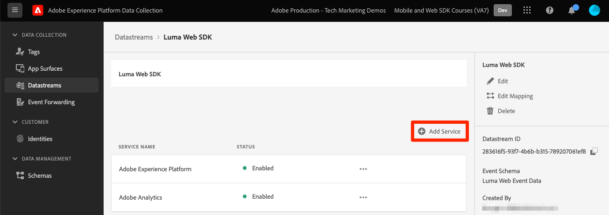
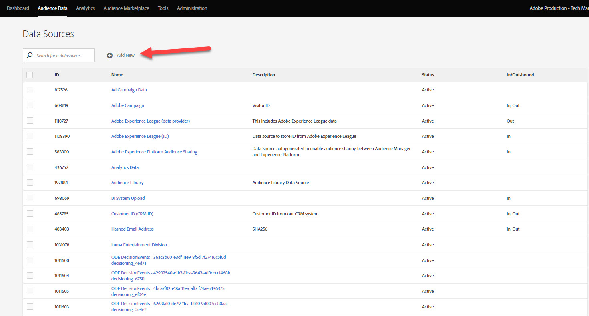
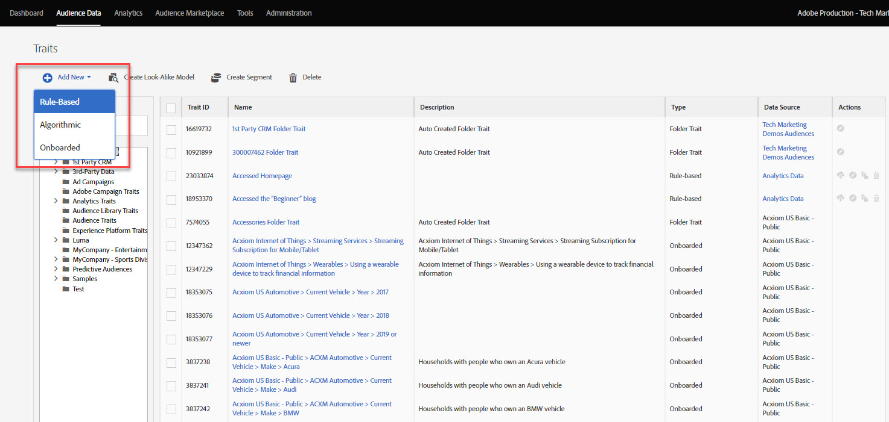
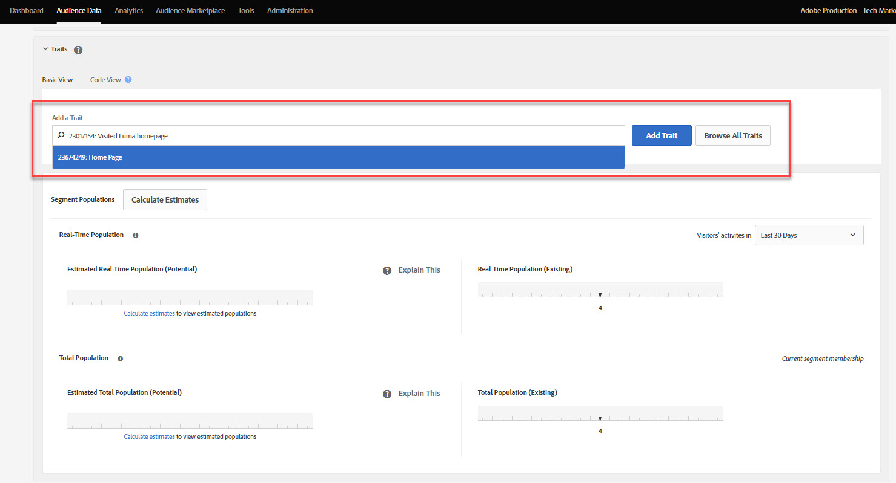
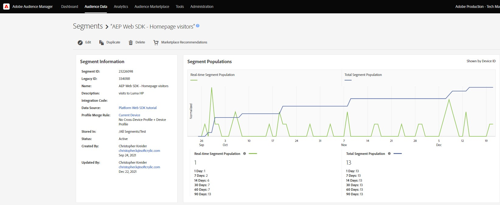
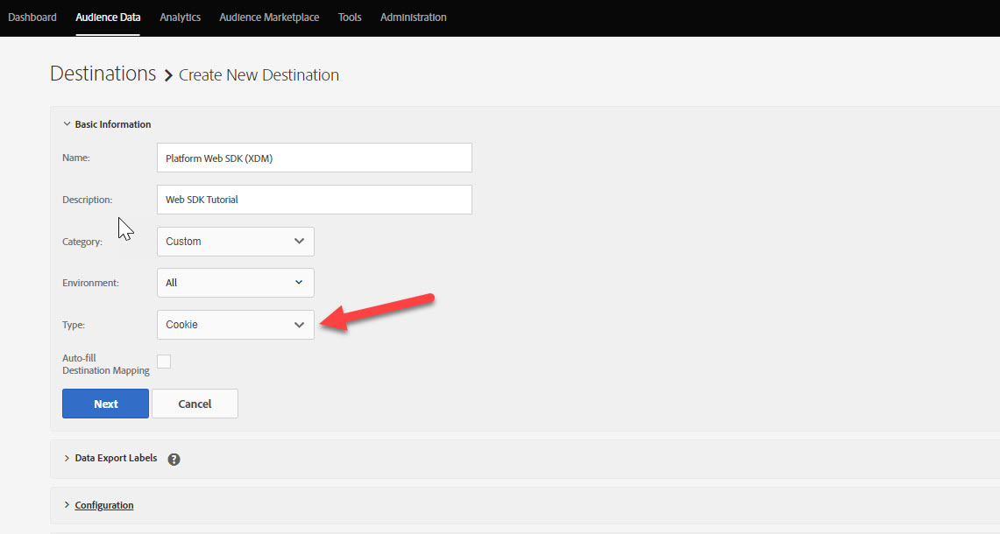
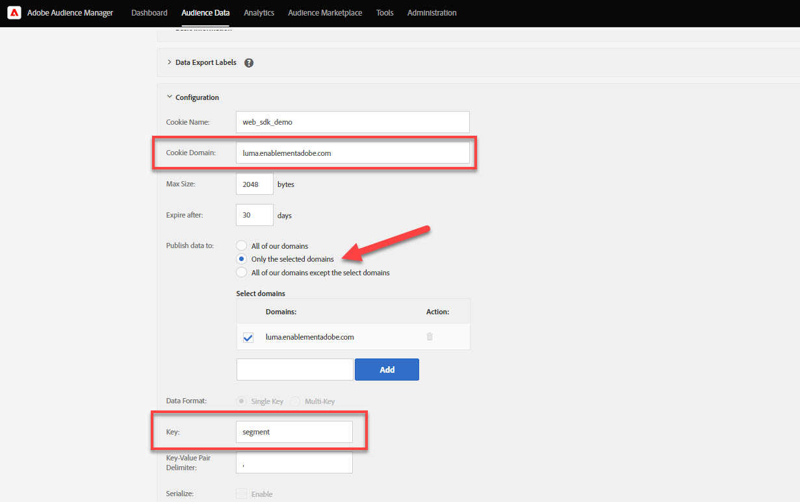
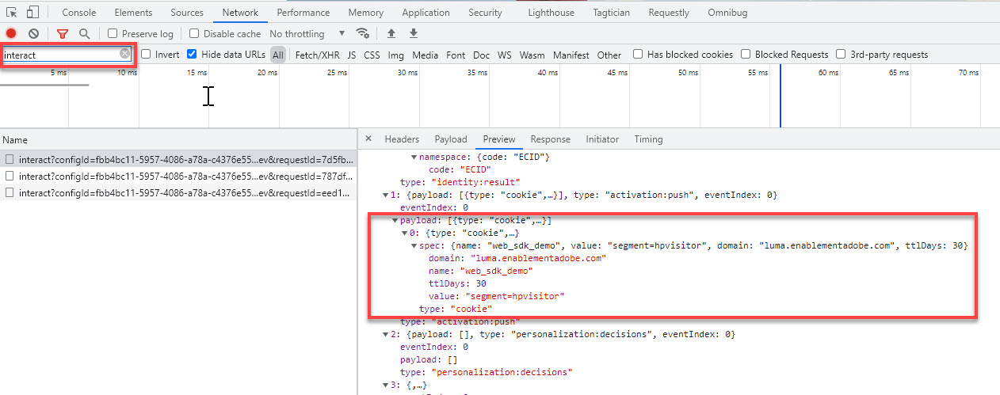
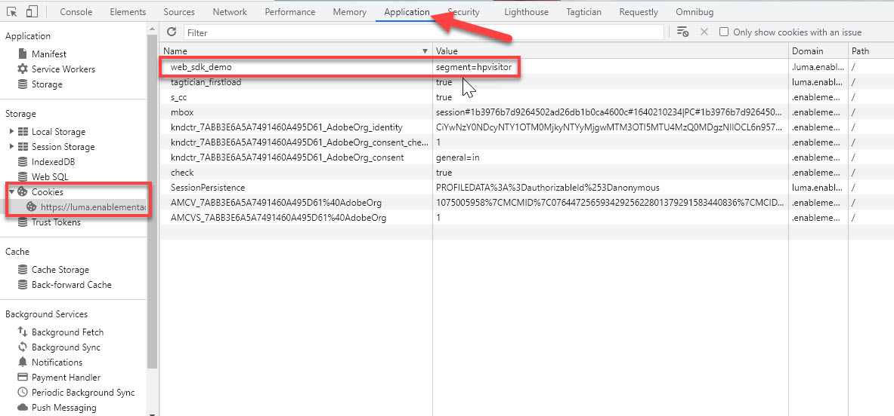
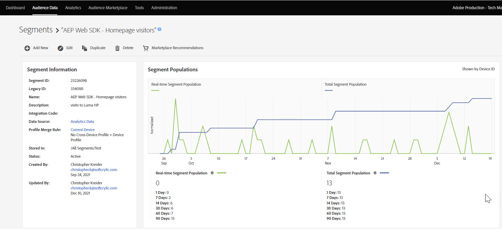

# Set up Audience Manager with Platform Web SDK

Learn how to set up Adobe Audience Manager using the Platform Web SDK and validate the implementation using a cookie destination. 

[Adobe Audience Manager](https://experienceleague.adobe.com/docs/audience-manager.html) is the Adobe Experience Cloud solution that provides everything required to collect commercially relevant information about site visitors, create marketable segments, and serve targeted advertising and content to the right audience.

## Learning objectives

At the end of this lesson, you will be able to:

* Configure a datastream to enable Audience Manager
* Enable a cookie destination in Audience Manager
* Validate the Audience Manager implementation by confirming audience qualification with Adobe Experience Platform Debugger

## Prerequisites

To complete this lesson, you must first:

* Complete the earlier lessons in the Initial Configuration and Tags Configuration sections of this tutorial.
* Have access to Adobe Audience Manager and the appropriate permissions to create, read, and write traits, segments, and destinations. For more information, please review [Audience Manager's Role-Based Access Control](https://experienceleague.adobe.com/docs/audience-manager-learn/tutorials/setup-and-admin/user-management/setting-permissions-with-role-based-access-control.html?lang=en).

## Configure the datastream

The Audience Manager implementation using the Platform Web SDK differs from the implementation using [server-side forwarding (SSF)](https://experienceleague.adobe.com/docs/analytics/admin/admin-tools/server-side-forwarding/ssf.html). Server-side forwarding passes Adobe Analytics request data to Audience Manager. A Platform Web SDK implementation passes XDM data sent to Platform Edge Network to Audience Manager. Audience Manager is enabled in the datastream:

1. Go to [Data Collection](https://experience.adobe.com/#/data-collection){target="blank"} interface
1. On the left navigation, select **[!UICONTROL Datastreams]** 
1. Select the previously created `Luma Web SDK` datastream

    

1. Select **[!UICONTROL Add Service]**
     
1. Select **[!UICONTROL Adobe Audience Manager]** as the **[!UICONTROL Service]**
1. Confirm that **[!UICONTROL Cookie Destinations Enabled]** and **[!UICONTROL URL Destinations Enabled]** are selected
1. Select **[!UICONTROL Save]**
    

## Create a data source

Next, create a [Data Source](https://experienceleague.adobe.com/docs/audience-manager/user-guide/features/data-sources/datasources-list-and-settings.html?lang=en), a fundamental tool for organizing data within Audience Manager:

1. Go to the [Audience Manager](https://experience.adobe.com/#/audience-manager/) interface
1. Select **[!UICONTROL Audience Data]** from the top navigation
1. Select the **[!UICONTROL Data Sources]** from the drop-down menu
1. Select the **[!UICONTROL Add New]** button from the top of the Data Sources page

   

1. Give the Data Source a friendly name and description. For initial setup, you can name this`Platform Web SDK tutorial`. 
1. Set **[!UICONTROL ID Type]** to **[!UICONTROL Cookie]**
1. In the **[!UICONTROL Data Export Controls]** section, select **[!UICONTROL No Restriction]**

   

1. **[!UICONTROL Save]** the Data Source

## Create a trait

After the Data Source is saved, set up a [trait](https://experienceleague.adobe.com/docs/audience-manager/user-guide/features/traits/traits-overview.html?lang=en). Traits are a combination of one or more signals in Audience Manager. Create a trait for homepage visitors.

>[!NOTE]
>
>All XDM data is sent to Audience Manager if it is enabled in the datastream, however the data is not automatically mapped to signals. Create explicit traits for the XDM data you want to use in Audience Manager. This behavior differs from server-side forwarding where all data arrives as signals that you can see in the Unused Signals report.
>

1. Select **[!UICONTROL Audience Data]** >  **[!UICONTROL Traits]**
1. Select **[!UICONTROL Add New]** >  **[!UICONTROL Rule-Based]** trait
1. Give your trait a friendly name and description, `Luma homepage view`
1. Select the **[!UICONTROL Data Source]** you created in the previous section.

   

1. **[!UICONTROL Select a Folder]** in which to save your trait in the pane to the right. You may want to create a folder by **selecting the + icon** next to an existing parent folder. You can name this new folder `Platform Web SDK tutorial`.
1. Expand the **[!UICONTROL Trait Expression]** caret and select **[!UICONTROL Expression Builder]** You must provide a key value pair that signifies a homepage visit.
1. Open the [Luma homepage](https://luma.enablementadobe.com/content/luma/us/en.html) (mapped to your tag property) and the **Platform Web SDK Debugger** and refresh the page.
1. Look at the Network Requests and the event details for the Platform Web SDK to find the key and name value for the homepage.
   
1. Return to the Expression Builder in the Audience Manager UI and enter the key as **`web.webPageDetails.name`** and the value of **`content:luma:us:en`**. This step ensures that you fire a trait whenever you load the homepage. 
1. **[!UICONTROL Save]** the trait.

## Create a segment

The next step is to create a **segment**, and assign your newly defined trait to this segment.

1. Select **[!UICONTROL Audience Data]** in the top navigation and select **[!UICONTROL Segments]**
1. Select **[!UICONTROL Add New]** in the top left of the page to open the segment builder
1. Give your segment a friendly name and description, such as `Platform Web SDK - Homepage visitors`
1. **[!UICONTROL Select a Folder]** where your segment will be saved in the pane to the right. You may want to create a folder by **selecting the + icon** next to an existing parent folder. You can name this new folder `Platform Web SDK tutorial`.
1. Add an integration code, which in this case is a random set of numbers. 1. In the **[!UICONTROL Data Source]** section, select **[!UICONTROL Audience Manager]** and the data source you created earlier
1. Expand the **[!UICONTROL Traits]** section and search for the trait you created
1. Select **[!UICONTROL Add Trait]**. 
1. Select **[!UICONTROL Save]** at the bottom of the page

   

   

## Create a destination

Next, create a **Cookie-based destination** using the **Destination Builder**. The Destination Builder lets you create and manage cookie, URL, and server-to-server destinations. 

1. Open the Destination Builder by selecting **[!UICONTROL Destinations]** within the **Audience Data** menu in the top navigation
1. Select **[!UICONTROL Create Destination]**
1. Enter a name and description, `Platform Web SDK tutorial`
1. As the **[!UICONTROL Category]**, select **[!UICONTROL Custom]**
1. As the **[!UICONTROL Type]**, select **[!UICONTROL Cookie]**

   

1. Open the **[!UICONTROL Configuration]** section to enter the details about your cookie destination
1. Give your cookie a friendly name, `platform_web_sdk_tutorial`
1. As the **[!UICONTROL Cookie Domain]**, add the domain of the site where you are planning for the integration, for the tutorial input the Luma domain, `luma.enablementadobe.com`
1. As the **[!UICONTROL Publish data to]** option, select **[!UICONTROL Only the Selected domains]**
1. Select your domain if not already added
1. As the **[!UICONTROL Data Format]**, select **[!UICONTROL Single Key]** and give your cookie a key. For this tutorial use `segment` as the key value. 
1. Finally, select **[!UICONTROL Save]** to save the destination configuration details. 

   

<!--
   

   
-->

1. In the **[!UICONTROL Segment Mappings]** section, use the **[!UICONTROL Search and Add Segments]** feature to search for your previously created `Platform Web SDK - Homepage visitors` and select **[!UICONTROL Add]**. 

1. Once you add your segment, a pop-up opens where you must provide an expected value for your cookie. For this exercise, enter the value "hpvisitor".

1. Select **[!UICONTROL Save]**

1. Select **[!UICONTROL Done]**
   
 
 The segment-mapping period requires a few hours to be activated. Once completed, you can refresh the Audience Manager interface and see that the **Mapped Segments** list updated.

## Validate the segment

A few hours after the initial creation of the segment, you can validate that it is working properly.

First, confirm that you can qualify for the segment

1. Open the [Luma demo site homepage](https://luma.enablementadobe.com/content/luma/us/en.html) with it mapped to your tag property to qualify for your newly created segment.
1. Open your browser's **developer tools**  > **Network** tab
1. Filter to the Platform Web SDK request using `interact` as the text filter
1. Select a call and open the **Preview** tab to view the response details
1. Expand the **payload** to view the expected cookie details, as previously configured in Audience Manager. In this example, you will see the expected cookie name `platform_web_sdk_tutorial`. 

   

1. Open the **Application** tab, and open **Cookies** from the **Storage** menu. 
1. Select the **`https://luma.enablementadobe.com`** domain and confirm that your cookie is written appropriately in the list

   

Finally, you should open the segment in the Audience Manager interface and ensure that the **Segment Populations** has incremented:

Now that you have completed this lesson, you should be able to see how the Platform Web SDK passes data to Audience Manager and can set a segment-specific first-party cookie with a cookie destination.

[Next: **Set up Adobe Target**](setup-target.md)

>[!NOTE]
>
>Thank you for investing your time in learning about Adobe Experience Platform Web SDK. If you have questions, want to share general feedback, or have suggestions on future content, please share them on this [Experience League Community discussion post](https://experienceleaguecommunities.adobe.com/t5/adobe-experience-platform-launch/tutorial-discussion-implement-adobe-experience-cloud-with-web/td-p/444996)
