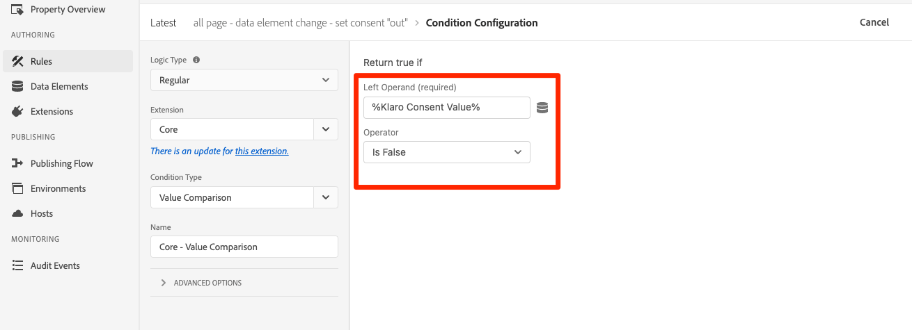
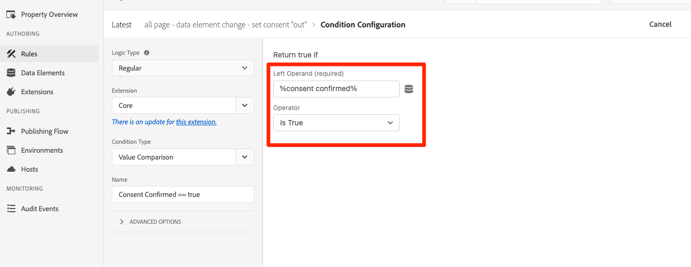
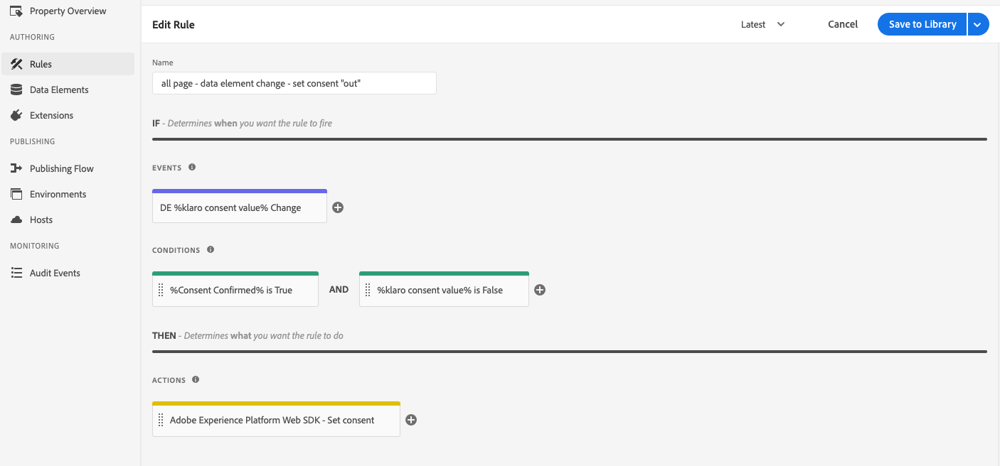
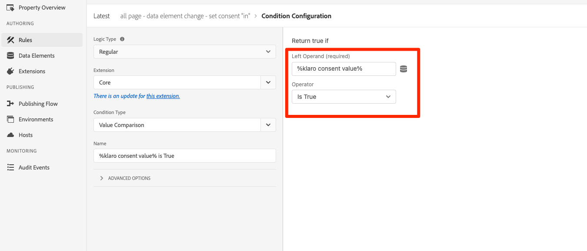
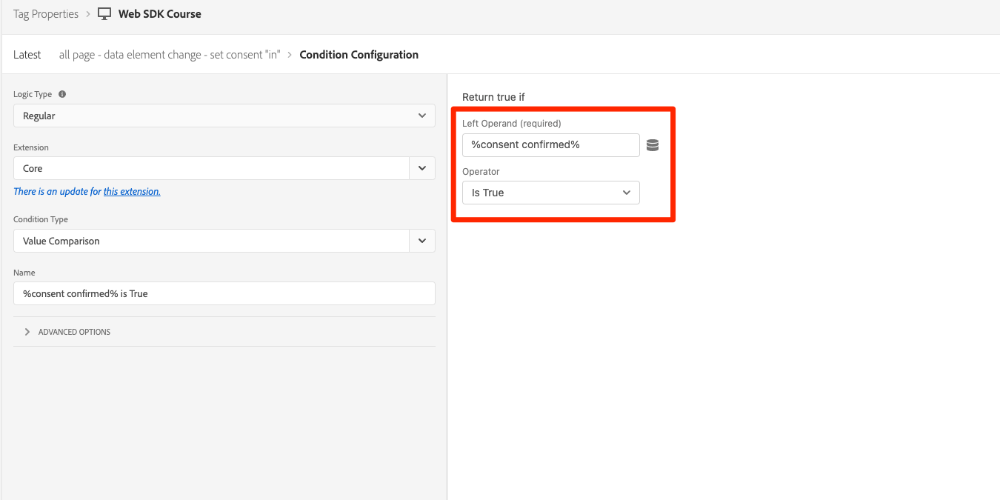
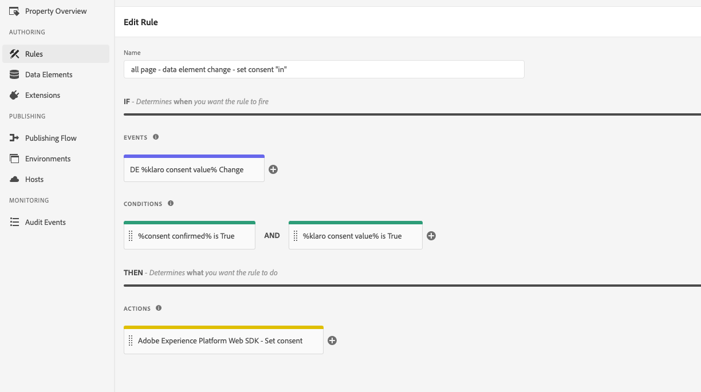

# Set up consent with Platform Web SDK

Learn how to configure the privacy settings of the Experience Platform Web SDK tag extension. Set consent based on the user's interaction with a banner from a Consent Management Platform (CMP). 

>[!NOTE]
> 
>For demonstration purposes, this tutorial uses [Klaro](https://heyklaro.com/) as a CMP. You are welcome to follow along using Klaro or the CMP you use with your website.


## Learning objectives

At the end of this lesson, you are able to:

* Load a CMP using tags
* Configure privacy settings in Experience Platform Web SDK tag extension 
* Set consent for Experience Platform Web SDK based on the user's action

## Prerequisites

You should be familiar with tags and the steps to create rules, data elements, build libraries to environments, and switch tag libraries using the Experience Platform Debugger.

Before you begin configuring the privacy settings and creating the rules for setting consent, make sure you have injected your consent management platform script on the website and is working properly. A CMP can be loaded either directly in the source code with the help of site developers or loaded through tags itself. This lesson demonstrates the latter approach.
>[!NOTE]
> 
>1. A Consent Management Platform (or CMP) is used by organizations to legally document and manage a user’s consent choices before collecting, sharing, or selling user data from online sources such as websites and apps. 
>
>2. The recommended approach for injecting a CMP is directly through source code before the tag manager script. 

### Configure Klaro

Before you jump into the tag configurations, learn more about the consent management platform used in this tutorial Klaro.

1.  Visit [Klaro](https://heyklaro.com/) and set up an account.
1.  Go to Privacy Manager and create an instance according to the instructions.
1.  Use the integration code to inject in the TMS.
1.  You can skip the scanning part if you are using a dummy website or localhost. Otherwise, Klaro automatically scans all the cookies of the provided website and categorizes them as per the general standard. However, you can recategorize them as per your need. For example, if you want to put Adobe's cookies under strictly needed category rather than functional or performance. 
1.  One important configuration you should be aware of is "Service Default State". If turned on, the default consent value would be ```true```, otherwise ```false```. This configuration comes handy when you want to decide what the default consent state (before user's consent) is going to be for your web application. For example:
    * For CCPA, the default consent is commonly set to ```true```. You are going to reference this scenario as **Implied opt-in** throughout this tutorial
    * For GDPR, the default consent is commonly set to ```false```. You are going to reference this scenario as **Implied opt-out** throughout this tutorial.

    This consent value can be verified by returning the JavaScript object ```klaro.getManager().consents``` on the browser console.

    >[!NOTE]
    > 
    >Generally, the above mentioned steps are done and taken care by the team or individual who is responsible for handling the CMP such as OneTrust or TrustArc. 

## Inject a CMP

Now, once you are done with the Klaro's configurations, you must create a tag rule with the following configurations:

* [!UICONTROL Name]: `all pages - library load - Klaro`
* [!UICONTROL Event]: [!UICONTROL Library Loaded (Page Top)] with [!UICONTROL Advanced Options] > [!UICONTROL Order] set to 1 
* [!UICONTROL Action]: [!UICONTROL Custom Code], [!UICONTROL Language]: HTML to load the CMP script.


The custom code block should look similar to the below:


Now save and build this rule to your development library, validate the consent banner is showing up by switching the tag library from Luma site to your own. You should see a CMP banner on the website as below. And to check the current user's consent permission you can use following snippet on the browser's console.

``` javaScript
klaro.getManager().consents 
```


To get into the debug mode, use the following checkbox in the Adobe Experience Platform debugger.


Also, you might have to clear your cookies and local storage multiple times while going through this tutorial since the user's consent value gets stored there. You can simply do that as below:

 

## Consent Scenarios

Privacy acts such as GDPR, CCPA, and others play a vital role in how you architect the consent implementation. In this lesson, you explore how a user might interact with the consent banner under two most prominent privacy acts.


### Scenario 1: Implied Opt-in

Implied opt-in means all users visiting the website would be treated as opted-in by default, which means the business does not need to obtain the consent (or the “opt-in”) of a person before collecting their data. However, they can opt out by rejecting the cookies through the consent banner. This use-case is similar to CCPA.

In this exercise, you learn how to configure and implement consent for such a scenario:

1. In the **[!UICONTROL Privacy]** section within Experience Platform Web SDK tag extension, set the **[!UICONTROL Default consent]** to **[!UICONTROL In]**


    

    >[!NOTE]
    > 
    >For a dynamic solution, select the "Provide a data element" option and pass a data element that returns the value of ```klaro.getManager().consents```
    >
    >This option is used if the CMP is injected in the source code *before* the tag embed code so that the default consent is available before Experience Platform Web SDK extension starts to load. In our example, we cannot use this option as the CMP is loaded with tags and not before the embed code.


2. Save and build this change to your tag library 
3. Load your tag environment on the Luma Demo site
4. Enable tags debugging while on the Luma site and reload the page. In your browser's developer console, you should see that defaultConsent is equal to **[!UICONTROL In]**
5. With this configuration, Experience Platform Web SDK extension continues to make network requests, unless a user decides to reject the cookies and opt-out.

     

    
   
Now, in case a user decides to opt out (reject the tracking cookies), you must change the consent and set it to **[!UICONTROL Out]**. You can do this by following the below steps:

1. Create a custom code data element to store the consent value of the user. Let's call it `klaro consent value`. Use the below snippet to create a custom code type data element:
    
    ```javascript
    return klaro.getManager().consents["aep web sdk"]
    ```

    


1. Create another custom code type data element, say `consent confirmed` with the following snippet, which will return ```true``` only after a user confirms consent.:

    
    ```javascript
    return klaro.getManager().confirmed
    ```

    

1. Now, create a rule that triggers either on click of the "I Decline" button or on change of the `klaro consent value` data element. Name this rule as: `all page - data element change - set consent "out"`

1. Add below two conditions in the rule:
    * Rule fires only when a user has declined the cookies. For this, create a condition to check the value of data element `klaro consent value` is `false`

        

    * Rule fires only when this was a user's manual selection; not to confuse with default consent value. Create a condition in the rule as data element `consent confirmed` is `true`.

        

1. Now, add an Experience Platform Web SDK type action to set the consent as "out" as below.

    

1. After all these steps, your rule now should look like this:

    

Now, when a user opts-out, the rule configured in the above fashion would fire and sets the Web SDK consent as **[!UICONTROL Out]**. 

Validate by going to the Luma Demo site, reject cookies, and confirm that no Web SDK request fires. 

### Scenario 2: Implied Opt-out


Implied opt-out means that the users would be treated as opted-out by default and cookies would not set. Web SDK requests would not fire unless users decide to manually opt in by accepting the cookies through the consent banner. You might have to deal with such a use-case in European Union region where GDPR applies.

Here is how you can set up the configuration for an implied opt-out scenario like this:

1. In **[!UICONTROL Privacy]** section of Experience Platform Web SDK extension, set default consent to **[!UICONTROL Out]** or "Pending" as required.

    

1. With this configuration, Experience Platform Web SDK would ensure that no request fires unless the consent permission changes to **[!UICONTROL In]**. That could happen as a result of a user manually accepting the cookies by opting in.

1. Enable tags console-logging while on the Luma site and reload the page. You see defaultConsent is equal to **[!UICONTROL Out]**

     
   
In case a user decides to opt in (accept the tracking cookies), you must change the consent and set it to **[!UICONTROL In]**. Here is how you can do it by creating a rule as following:

1. Create a rule that triggers either on click of the "That's ok" button or on the data element change i.e. **%klaro consent value%**. Name this rule as: **all page - data element change - set consent "in"**
1. Add below two conditions in the rule:
    * Rule fires only when a user has accepted the cookies and permission has changed. For this, create a condition to check the value of data element **%klaro consent value%** is `true`

        

    * Rule fires only when this was a user's manual selection; not to confuse with default consent value. Create a condition in the rule as data element **%consent confirmed%** is `true`.

        

1. Add an action using the Experience Platform Web SDK [!UICONTROL Extension], **[!UICONTROL Action Type]** of **[!UICONTROL Set consent]**, **[!UICONTROL General consent]** as **[!UICONTROL In]**. 

    

    One thing to note here is that this Set consent action is going to be the first request that goes out and establishes identity. Because of this, it may be important to sync identities on the first request itself. The identity map can be added to Set consent action by passing an identity type data element.

1.  Now, your rule should look like this:

    

Once you have this rule in place, events collection would begin when a user opts-in.


For more information on consent in Web SDK, see [Web SDK Consent Support](https://experienceleague.adobe.com/docs/experience-platform/edge/consent/supporting-consent.html?lang=en)


For more information on each section of the extension, see [Web SDK extension for Adobe Experience Platform Launch Overview](https://experienceleague.adobe.com/docs/core-services/interface/administration/ec-cookies/cookies-first-party.html?lang=en)

[Next: **Set up Event Forwarding**](setup-event-forwarding.md)
