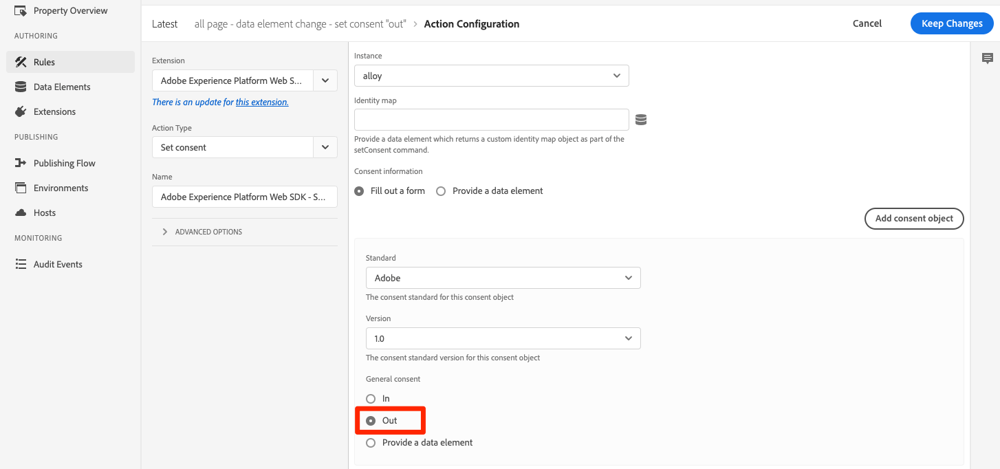

# Set up consent with Platform Web SDK

Learn how to configure the privacy settings of the Experience Platform Web SDK tag extension. Set consent based on the visitor's interaction with a banner from a Consent Management Platform (CMP). 

>[!NOTE]
> 
>For demonstration purposes, this tutorial uses [Klaro](https://heyklaro.com/) as a CMP. You are welcome to follow along using Klaro or the CMP you use with your website.


## Learning objectives

At the end of this lesson, you are able to:

* Load a CMP using tags
* Configure privacy settings in Experience Platform Web SDK tag extension 
* Set consent for Experience Platform Web SDK based on the visitor's action

## Prerequisites

You should be familiar with tags and the steps to create rules, data elements, build libraries to environments, and switch tag libraries using the Experience Platform Debugger.

Before you begin configuring the privacy settings and creating the rules for setting consent, make sure you have injected your consent management platform script on the website and is working properly. A CMP can be loaded either directly in the source code with the help of site developers or loaded through tags itself. This lesson demonstrates the latter approach.
>[!NOTE]
> 
>1. A Consent Management Platform (or CMP) is used by organizations to legally document and manage a visitor’s consent choices before collecting, sharing, or selling visitor data from online sources such as websites and apps. 
>
>2. The recommended approach for injecting a CMP is directly through source code before the tag manager script. 

### Configure Klaro

Before you jump into the tag configurations, learn more about the consent management platform used in this tutorial Klaro.

1.  Visit [Klaro](https://heyklaro.com/) and set up an account.
1.  Go to **Privacy Manager** and create an instance according to the instructions.
1.  Use the **Integration Code** to inject Klaro into your tag property (instructions are in the next exercise).
1.  Skip the **Scanning** section, as it will detect the tag property which is hardcoded on the Luma demo website and not the one you have built for this tutorial.
1.  Add a service called `aep web sdk` and toggle on the **Service Default State**. When turned on, the default consent value is `true`, otherwise it is `false`. This configuration is handy when you want to decide what the default consent state (before visitor's consent) is going to be for your web application. For example:
    * For CCPA, the default consent is commonly set to `true`. You are going to reference this scenario as **Implied opt-in** throughout this tutorial
    * For GDPR, the default consent is commonly set to `false`. You are going to reference this scenario as **Implied opt-out** throughout this tutorial.

<!--
    This consent value can be verified by returning the JavaScript object ```klaro.getManager().consents``` in the browser's developer console.
-->
    >[!NOTE]
    > 
    >Generally, the above mentioned steps are done and taken care by the team or individual who is responsible for handling the CMP such as OneTrust or TrustArc. 

## Inject a CMP

>[!WARNING]
>
>The best practice to implement a Consent Management Platform is typically to load the CMP _before_ loading your tag manager. To facilitate this tutorial, you will load the CMP _with_ the tag manager. This lesson is designed to show you how to use the consent features in Platform Web SDK and its tag extension and is not intended to be a lesson on how to configure Klaro or any other CMP.


Now, once you are done with the Klaro's configurations, create a tag rule with the following configurations:

* [!UICONTROL Name]: `all pages - library load - Klaro`
* [!UICONTROL Event]: [!UICONTROL Library Loaded (Page Top)] with [!UICONTROL Advanced Options] > [!UICONTROL Order] set to 1 
* [!UICONTROL Action]: [!UICONTROL Custom Code], [!UICONTROL Language]: HTML to load the CMP script.


The custom code block should look similar to the below:


Now save and build this rule to your development library, validate the consent banner is showing up by switching the tag library from Luma site to your own. You should see a CMP banner on the website as below. And to check the current visitor's consent permission you can use following snippet on the browser's console.

``` javaScript
klaro.getManager().consents 
```


To get into the debug mode, use the following checkbox in the Adobe Experience Platform debugger.


Also, you might have to clear your cookies and local storage multiple times while going through this tutorial since the visitor's consent value gets stored there. You can simply do that as below:

 

## Consent Scenarios

Privacy acts such as GDPR, CCPA, and others play a vital role in how you architect the consent implementation. In this lesson, you explore how a visitor might interact with the consent banner under two most prominent privacy acts.


### Scenario 1: Implied Opt-in

Implied opt-in means the business does not need to obtain the visitor's consent (or the “opt-in”) before collecting their data, and hence all visitors to the website are treated as opted-in by default. However, the visitor can opt out by rejecting the cookies through the consent banner. This use-case is similar to CCPA.

Now you will configure and implement consent for this scenario:

1. In the **[!UICONTROL Privacy]** section of the Experience Platform Web SDK tag extension, make sure the  **[!UICONTROL Default consent]** is set to **[!UICONTROL In]** :


    

    >[!NOTE]
    > 
    >For a dynamic solution, select the "Provide a data element" option and pass a data element that returns the value of ```klaro.getManager().consents```
    >
    >This option is used if the CMP is injected in the source code *before* the tag embed code so that the default consent is available before Experience Platform Web SDK extension starts to load. In our example, we cannot use this option as the CMP is loaded with tags and not before tags.


2. Save and build this change to your tag library 
3. Load your tag library on the Luma Demo site
4. Enable tags debugging while on the Luma site and reload the page. In your browser's developer console, you should see that defaultConsent is equal to **[!UICONTROL In]**
5. With this configuration, Experience Platform Web SDK extension continues to make network requests, unless a visitor decides to reject the cookies and opt-out:

     

    
   
If a visitor decides to opt out (reject the tracking cookies), you must change the consent to **[!UICONTROL Out]**. Change the consent setting by following these steps:

<!--
1. Create a data element to store the consent value of the visitor. Let's call it `klaro consent value`. Use the code snippet to create a custom code type data element:
    
    ```javascript
    return klaro.getManager().consents["aep web sdk"]
    ```

    


1. Create another custom code data element, `consent confirmed`, with the following snippet which returns ```true``` only after a visitor confirms consent:

    
    ```javascript
    return klaro.getManager().confirmed
    ```

    
-->

1. Create a rule that triggers when the visitor clicks **I decline**.  Name this rule as: `all pages - click consent banner - set consent "out"`

1. As the **[!UICONTROL Event]**, use **[!UICONTROL Click]** on **[!UICONTROL Elements matching the CSS selector]** `#klaro .cn-decline`

    

1. Now, use the Experience Platform Web SDK, [!UICONTROL Set consent] [!UICONTROL action type] to set the consent as "out":

    

1. Select **[!UICONTROL Save to Library and Build]**:

    

Now, when a visitor opts-out, the rule configured in the above fashion would fire and sets the Web SDK consent as **[!UICONTROL Out]**. 

Validate by going to the Luma Demo site, reject cookies, and confirm that no Web SDK request fires after opting out. 

### Scenario 2: Implied Opt-out


Implied opt-out means that the visitors should be treated as opted-out by default and cookies should not be set. Web SDK requests should not fire unless visitors decide to manually opt in by accepting the cookies through the consent banner. You might have to deal with such a use-case in the European Union region where GDPR applies.

Here is how you can set up the configuration for an implied opt-out scenario:

1. In Klaro, toggle off the **Service Default State** in your `aep web sdk` service and save the updated configuration.

1. In **[!UICONTROL Privacy]** section of Experience Platform Web SDK extension, set default consent to **[!UICONTROL Out]** or **[!UICONTROL Pending]** as required.

    

1. **Save** the updated configuration to your tag library and rebuild it.
    
    With this configuration, Experience Platform Web SDK ensures that no request fires unless the consent permission changes to **[!UICONTROL In]**. That could happen as a result of a visitor manually accepting the cookies by opting in.

1. In the Debugger, make sure the Luma site is mapped to your tag property and that the tags console-logging is on.
1. Use your browser's developer console to **Clear site data** in **Application** > **Storage**
 
1. Reload the Luma site and you should see that `defaultConsent` is set to **[!UICONTROL Out]** and no Web SDK requests have been made

     
   
In case a visitor decides to opt in (accept the tracking cookies), you must change the consent and set it to **[!UICONTROL In]**. Here is how you can do this with a rule:

1. Create a rule that triggers when the visitor clicks **That's ok**.  Name this rule as: `all pages - click consent banner - set consent "in"`

1. As the **[!UICONTROL Event]**, use **[!UICONTROL Click]** on **[!UICONTROL Elements matching the CSS selector]** `#klaro .cm-btn-success`

    

1. Add an action using the Experience Platform Web SDK [!UICONTROL Extension], **[!UICONTROL Action Type]** of **[!UICONTROL Set consent]**, **[!UICONTROL General consent]** as **[!UICONTROL In]**. 

    

    One thing to note here is that this [!UICONTROL Set consent] action is going to be the first request that goes out and establishes identity. Because of this, it may be important to sync identities on the first request itself. The identity map can be added to [!UICONTROL Set consent] action by passing an identity type data element.

1.  Select **[!UICONTROL Save to Library and Build]**:

    

1. **[!UICONTROL Save]** the rule to your library and rebuild it.

Once you have this rule in place, events collection should begin when a visitor opts-in.


For more information on consent in Web SDK, see [Supporting customer consent preferences](https://experienceleague.adobe.com/docs/experience-platform/edge/consent/supporting-consent.html?lang=en).


For more information on the [!UICONTROL Set consent] action, see [Set consent](https://experienceleague.adobe.com/docs/experience-platform/edge/extension/action-types.html?lang=en#set-consent).

[Next: **Set up Event Forwarding**](setup-event-forwarding.md)
