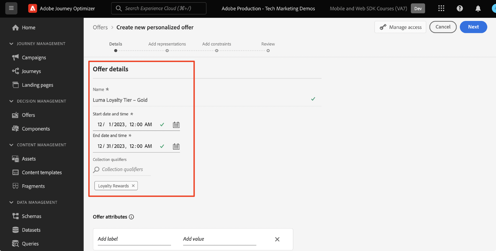

# Set up Decision Management with Platform Web SDK

Learn how to implement Decision Management using Platform Web SDK. This guide covers the foundational Decision Management prerequisites, detailed steps for configuration, and a deep dive into a use case centered on loyalty status.

By following this tutorial, Journey Optimizer users are equipped to effectively apply offer decisioning features, enhancing the personalization and relevance of their customer interactions.


  

## Learning Objectives

At the end of this lesson, you are able to:

* Grasp the core concepts of Decision Management within the Adobe Journey Optimizer and its integration with the Adobe Experience Platform Web SDK.

* Learn the step-by-step process to configure the Web SDK for Offer Decisioning, ensuring seamless integration with Journey Optimizer.

* Explore a detailed use case centered on loyalty status offers, gaining insights into creating and managing offers, decisions, and placements effectively.

* Acquaint yourself with essential terms and their implications within the Decision Management framework.

* Understand the significance of decision rules, collection qualifiers, and fallback offers in delivering the right offer to the right user.

* Delve into advanced topics like simulations and custom event data collection, empowering you to test, validate, and enhance your offer delivery mechanisms.

## Prerequisites

To complete the lessons in this section, you must first:

* Ensure that your organization has access to Adobe Journey Optimizer Ultimate (Journey Optimizer and Offer Decisioning) or Adobe Experience Platform and the Offer Decisioning application service add-on.

* Complete all lessons for initial configuration of the Platform Web SDK.

* Enable your organization for Edge Decisioning.

* Understand how to configure a placement, and instantiate placement and activity IDs within your Decision Scope JSON.

## Limitations

Take note of the following limitation:

* Event-based offers are currently not supported in Adobe Journey Optimizer. If you create a decision rule based on an event, you are not able to apply it in an offer.

## Grant access to Decision Management

To grant access to the Decision Management functionality, you must create a **Product profile** and assign the corresponding permissions to your users. [Learn more on managing Journey Optimizer users and permissions in this section](https://experienceleague.adobe.com/en/docs/journey-optimizer/using/access-control/privacy/high-low-permissions#decisions-permissions).

## Configure the datastream

Offer Decisioning must be enabled in the **datastream** configuration before any Decision Management activities can be delivered by Platform Web SDK.

To configure Offer Decisioning in the datastream:

1. Go to the [Data Collection](https://experience.adobe.com/#/data-collection) interface.

1. On the left navigation, select **Datastreams**.

1. Select the previously created Luma Web SDK datastream.
   
   

1. Select **Edit** within the **Adobe Experience Platform Service**.
   
   

1. Check the **Offer Decisioning** box.

   

1. Select **Save**.

This ensures that inbound events for Journey Optimizer are correctly handled by the **Adobe Experience Platform Edge**.

## Configure the SDK for Decision Management

Decision Management requires additional SDK steps, depending on your Web SDK implementation type. There are two available options for configuring the SDK for Decision Management.

* SDK standalone installation
  1. Configure the `sendEvent` action with your `decisionScopes`.

      ```javascript
      alloy("sendEvent", {
         ...
         "decisionScopes": [
            "[DECISION SCOPE 1]",
            "[DECISION SCOPE 2]"
         ]
      })
      ```
   
* SDK Tags installation
  1. Go to Data Collection interface.
  
  1. On the left navigation, select **Tags**.

      

  1. Select the **Tag Property**.
      
  1. Create your **Rules**.
      * Add a Platform Web SDK **Send Event action** and add the relevant `decisionScopes` to that action's configuration.

  1. Create and publish a **Library** containing all the relevant **Rules**, **Data Elements**, and **Extensions** you have configured.

## Terminology

First, you should understand the terminology used in the Decision Management interface.

* **Capping**: A constraint dictating how often an offer appears. Two types:
  * Total caps: Maximum times an offer can be shown across the target audience.
  * Profile Cap: Times an offer can be shown to a particular user.
* **Collections**: Subsets of offers grouped by specific conditions set by a marketer, for example, offer category.
* **Decision**: Logic that dictates the choice of an offer.
* **Decision Rule**: Constraints on offers to find out a user's eligibility.
* **Eligible Offer**: An offer that matches the pre-set constraints and can be shown to a user.
* **Decision Management**: The system of crafting and distributing personalized offers using business logic and decision rules.
* **Fallback Offers**: The default offer shown when a user doesn't qualify for any offers in a collection.
* **Offer**: A marketing message with potential eligibility rules determining its viewers.
* **Offer Library**: A central repository managing offers, decisions, and associated rules.
* **Personalized Offers**: Custom marketing messages tailored based on eligibility constraints.
* **Placements**: The setting or scenario where an offer is displayed to a user.
* **Priority**: Ranking metric for offers considering various constraints like eligibility and capping.
* **Representations**: Channel-specific information, for example, location or language, guiding the display of an offer.

## Use Case Overview – Loyalty Rewards

In this lesson, you implement a sample Loyalty Rewards use case to understand Decision Management using the Web SDK.

This use case enables you to better understand how Journey Optimizer can help deliver the best offer to your customers, utilizing the centralized offer library and the offer decision engine.

>[!NOTE]
>
> As this tutorial is aimed at implementers, it's worth noting that this lesson involves substantial interface work in Journey Optimizer. While such interface tasks are typically handled by marketers, it can be beneficial for implementers to gain insight into the process, even if they are not responsible for decision management campaign creation in the long run.

## Components

Before starting to create the offers, you must define several prerequisite components.

### Create a Placement for Loyalty Offers

**Placements** are containers that are used to showcase the offers. In this example, you create a placement at the top of the Luma site.

The list of placements is accessible in the **Components** menu. Filters are available to help you retrieve placements according to a specific channel or content.
  
   

To create the placement, follow these steps:

1. Click **Create placement**.
   
   

1. Define the placement's properties:
   * **Name**: The name of the placement. Let's call the example placement *'Homepage Banner'*.
   * **Channel type**: The channel for which the placement is used. Let's use *'Web'* since the offers are displayed on the Luma website.
   * **Content type**: The type of content that the placement is allowed to display: Text, HTML, Image Link, or JSON. You can use *'HTML'* for the offer.
   * **Description**: A description of the placement (optional).

   

1. Click **Save**.
1. Once the placement is created, it displays in the placements list.
1. Select the row containing your new placement and take note of the Placement ID, as this may be necessary for configuration within your Decision Scope.

   

### Decision Rules for Loyalty Status

**Decision rules** specify the conditions under which the offers are presented. In this example, you create decision rules to serve different offers depending on a user's Loyalty status.

The list of decision rules is accessible in the **Components** menu.

To create the decision rules, follow these steps:

1. Navigate to the **Rules** tab, and click **Create rule**.

   

1. Let's name the first rule '*Gold Loyalty Status Rule*'. You can use XDM fields to define the rule. The Adobe Experience Platform **Segment Builder** is an intuitive interface that you can use to build the rule conditions.

   

1. Click **Save** to confirm the rule condition.
1. The newly saved '*Gold Loyalty Status Rule*' will display in the **Rules list**. Select it to display its properties.

   

1. Now create the remaining loyalty offer rule conditions for the use case.


### Collection Qualifiers

**Collection qualifiers** allow you to easily organize and search for offers within the offer library. In this example, you add collection qualifiers to the Loyalty Rewards offers to improve the offer organization.

The list of collection qualifiers is accessible in the **Components** menu.

To create the Loyalty Rewards collection qualifier, follow these steps:

1. Navigate to the **Collection qualifiers** tab, and click **Create collection qualifier**.

   

1. Let's name the collection qualifier '*Loyalty Rewards*'

   

1. The new collection qualifier should now display in the **Collection qualifier** tab

## Offers

Now it's time to create the Loyalty Rewards offers.

The list of offers is accessible in the **Offers** menu.

   


### Creating Offers for Different Loyalty Tiers

Start by creating personalized offers for the different Luma Loyalty Tiers.

To create the first **offer**, follow these steps:

1. Click **Create offer**, then select **Personalized offer**.

1. Let's name the first offer '*Luma Loyalty Tier – Gold*'. You must specify a start / end date and time for this offer. You should also associate the **collection qualifier** '*Loyalty Rewards*' to the offer, allowing you to better organize within the **Offer Library**. Afterwards, click **Next**.

   

1. Now you must add **representations** to define where the offer displays. Let's choose the **web channel**. Let's also choose the '*Homepage Banner*' **placement** you previously configured. The selected **placement** is HTML-type, so you can add HTML, JSON, or TEXT content directly to the editor to build the offer using the **Custom** radio button.

   

1. Edit the offer content directly with the **Expression Editor**. Remember that you can add HTML, JSON, or TEXT content to this placement. Ensure you select the correct **mode** at the bottom of the editor, depending on your content type. You can also hit **validate** to ensure there are no errors. 

   

1. Also, you can use the Expression Editor to retrieve attributes stored in Adobe Experience Platform. Let's add a profile's first name to the offer content to better personalize for the loyalty members on a 1:1 level.

   

1. Add constraints to only show the offer to profiles that qualify for the '*Gold Loyalty Status Rule*'.

   

1. Once you have finished reviewing your offer, click **Finish**. Select **Save and approve**.

Now create the rest of the offers for the various Luma Loyalty tiers

### Fallback Offers

You still want to serve an offer to non-Luma Loyalty visitors to the Luma site. To do this, you can configure a **fallback offer** for the campaign.

To create the fallback offer, follow these steps:

1. Click **Create offer**, then select **Fallback offer**.
   <!--
      
   -->
1. Let's name the fallback offer '*Non-Luma Loyalty*'. You can also associate the previously created **collection qualifier**, '*Loyalty Rewards*' to the fallback offer for ease of offer organization.
   <!--
      
   -->
1. Add the fallback offer content to the **Expression Editor**. Remember that you can add HTML, JSON or TEXT content to this placement. Ensure you select the correct **mode** at the bottom of the editor, depending on your content type. You can also hit **validate** to ensure there are no errors.
   <!--
      
   -->
1. If everything is configured correctly, hit **Finish** and then **Save and approve**.
<!--
   
-->

## Decisions

**Decisions** are containers for offers that pick the best offer available for a customer, depending on the target.

The list of decisions is available in the **Decisions** tab of the **Offers** menu.
<!--
   
-->

### Creating a Decision for Loyalty Offers

Let's create a decision for the Luma Loyalty Rewards use case.

To create the decision, follow these steps:

1. Click **Create decision**.
   <!--
      
   -->
1. Let's call the decision, '*December Luma Loyalty Offers*'. The offers should run for 1 month, so let's specify that here.
   <!--
      
   -->
1. Now you must define the **decision scopes**. First select a placement. You can use the previously created '*Homepage Banner*'.
   <!--
      
   -->
1. Next you must add **evaluation criteria** for the decision scope. Click **Add** and choose the previously created '*Loyalty Rewards*' **collection** which contains all loyalty offers to consider.
   <!--
      
   -->
1. Within the '*Loyalty Rewards*' collection, you can use the eligibility field to restrict the offer delivery to a subset of Luma visitors. However, for this use case you want every visitor to receive one of the offers. Remember, you configured a **fallback offer** for all non-loyalty visitors. Set the eligibility to 'None'.
   <!--
      
   -->
1. Also, you can use the **ranking method** field to select the best offer for each Luma visitor, if multiple offers are eligible for the user / placement combination. For this use case, you can use the **Offer priority** method, which uses the values defined in the offers to serve the best offer.
   <!--
      
   -->
1. Now add the **fallback offer** to the decision. Reminder that the fallback offer is the default offer displayed to Luma visitors if they do not fall into any of the Luma Loyalty audiences. Select  '*Non-Luma Loyalty*' from the list of available fallback offers for the '*Homepage Banner*' placement.
   <!--
      
   -->
1. Before activating the decision, let's review the decision scope, fallback offer, preview available offers, and estimate the qualified profiles. Once everything looks good, you can click **Finish** and **Save and activate**.
<!--
   
-->

## Simulations

As a best practice, you should validate the Luma Loyalty decisioning logic to ensure the correct offers are delivered to the right loyalty audiences. You can do this by using **test profiles**. It's also a good idea to test changes to offers via test profiles before pushing new offer versions to production.

To begin the testing, select the **Simulations** tab from the **Offers** menu.

### Testing Loyalty Offers

1. Select a test profile to use for the simulation. Click **Manage profile**. [To create or designate  a new test profile for offer testing, follow this guide](https://experienceleague.adobe.com/en/docs/journeys/using/building-journeys/about-journey-building/creating-test-profiles#create-test-profiles-csv).
   <!--
      
   -->
1. Add one or more test profiles to the simulation, and save your selection. For the use case testing, you should ensure you have test profiles configured for each Luma loyalty rewards audience.
   <!--
      
   -->
1. Select the decision scope to test. Select **Add decision scope**.
   <!--
      
   -->
1. Select the previously created '*Homepage Banner*' placement.
   <!--
      
   -->
1. The available decisions are displayed, select the previously created '*December Luma Loyalty Offers*' decision, and click **Add**.
   <!--
      
   -->
1. Once you select a test profile, click **View results**. The best available offer is displayed to the selected test profile for the '*December Luma Loyalty Offers*' decision.
   <!--
      
   -->
1. Select a different test profile, and click **View results**. Ideally, you should see a different simulated offer, corresponding with the test profile's loyalty tier.

## Decision Management Validation using Adobe Experience Platform Debugger

The **Adobe Experience Platform Debugger** extension, available for both Chrome and Firefox, analyzes your web pages to identify issues in the implementation of Adobe Experience Cloud solutions.

You can use the debugger on the Luma site to validate the decisioning logic in production. This is a good practice once the Loyalty Rewards use case is up and running, to ensure everything is configured correctly.

[Learn how to configure the debugger in your browser using the guide here](https://experienceleague.adobe.com/en/docs/platform-learn/data-collection/debugger/overview).

To begin validation using the debugger:

1. Navigate to the Luma web page with the offer placement.
   <!--
      
   -->
1. While on the web page, open the **Adobe Experience Platform debugger**.
   <!--
      
   -->
1. Navigate to **Summary**. Verify that the **Datastream ID** matches the **datastream** in **Adobe Data Collection** for which you enabled Offer Decisioning.
   <!--
      
   -->
1. Under **Solutions** navigate to the **Experience Platform Web SDK**.
   <!--
      
   -->
1. Within the **Configuration** tab, Toggle on **Enable Debugging**. This enables logging for the session within an **Adobe Experience Platform Assurance** session.
   <!--
      
   -->
1. You can then log in to the site with various Luma loyalty accounts, and use the debugger to validate the requests sent to the **Adobe Experience Platform Edge network**. All of these requests should be captured in **Assurance** for log tracking.
<!--
   
-->

[Next: **Implement Consent for Experience Platform Web SDK**](setup-consent.md)

>[!NOTE]
>
>Thank you for investing your time in learning about Adobe Experience Platform Web SDK. If you have questions, want to share general feedback, or have suggestions on future content, please share them on this [Experience League Community discussion post](https://experienceleaguecommunities.adobe.com/t5/adobe-experience-platform-launch/tutorial-discussion-implement-adobe-experience-cloud-with-web/td-p/444996)
