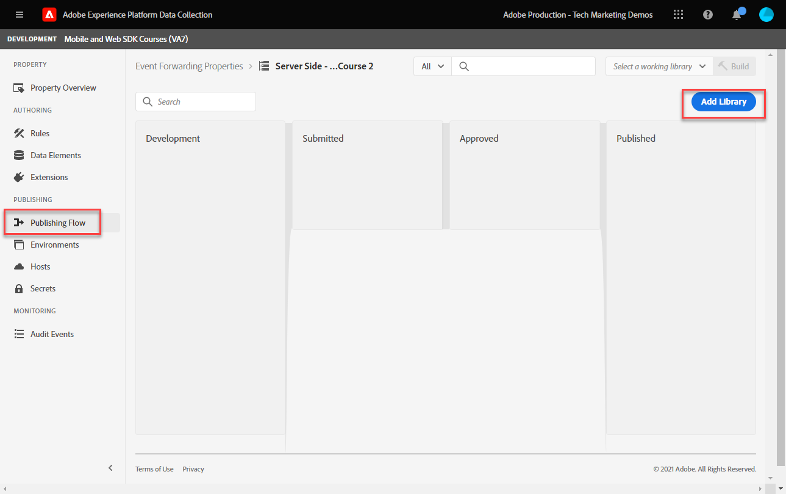
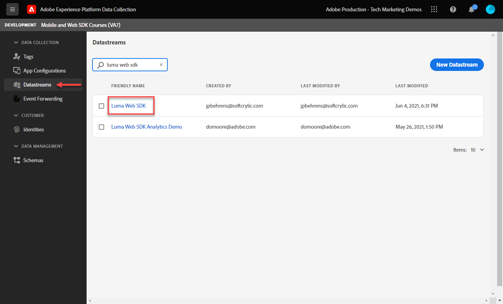
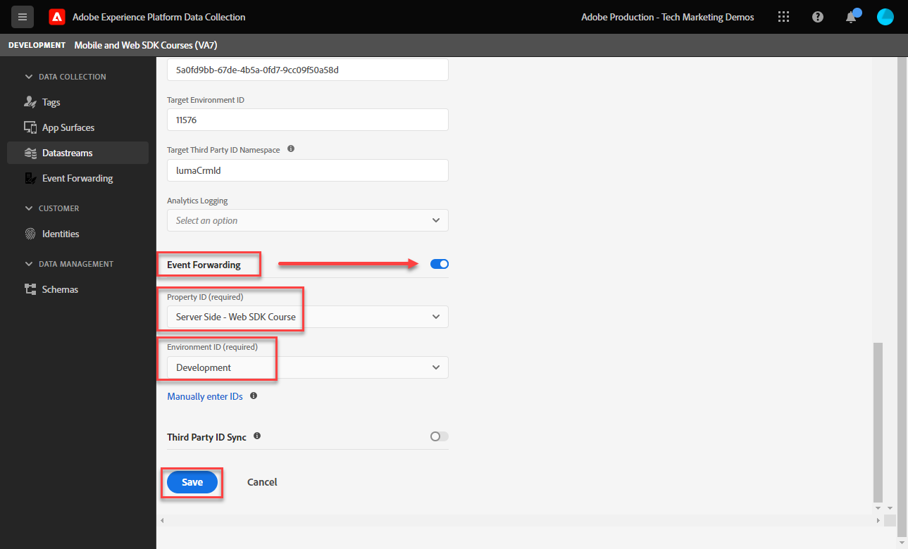
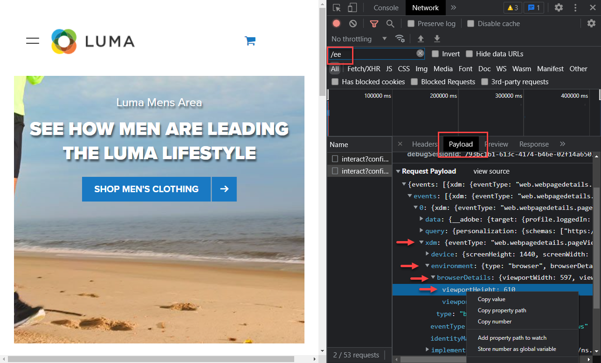
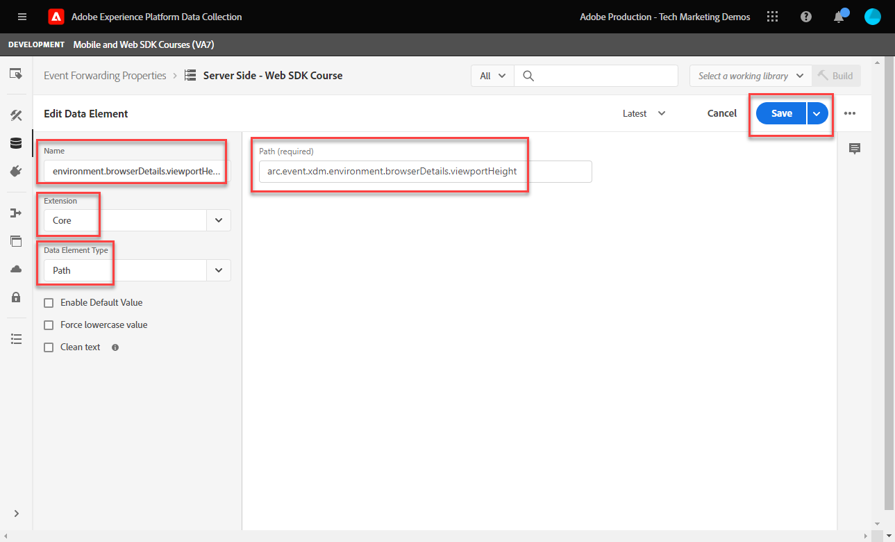
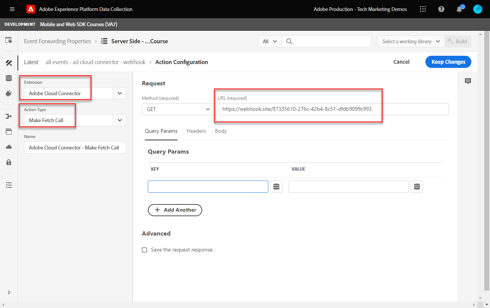
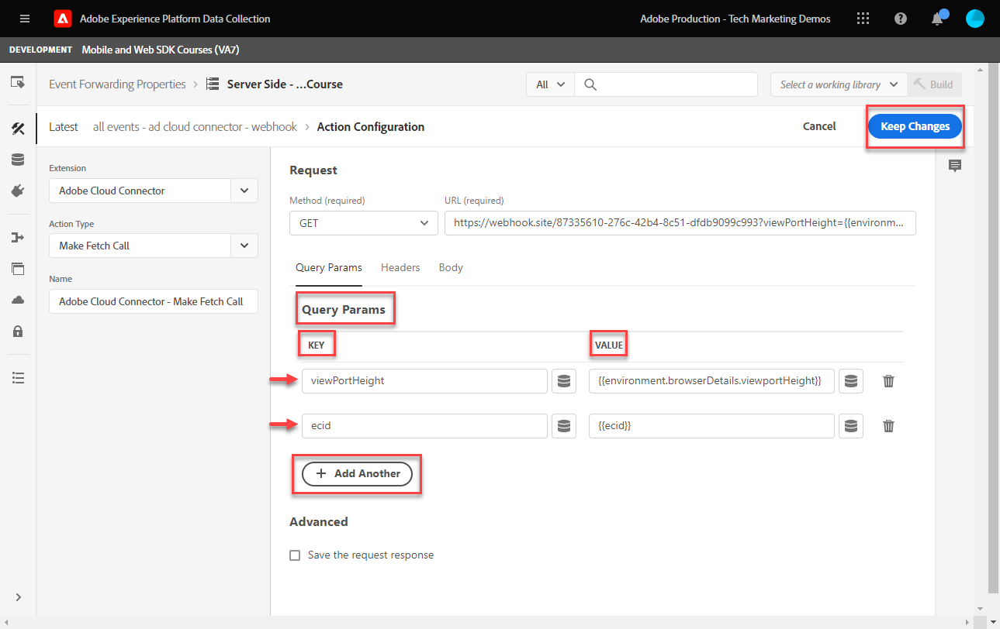
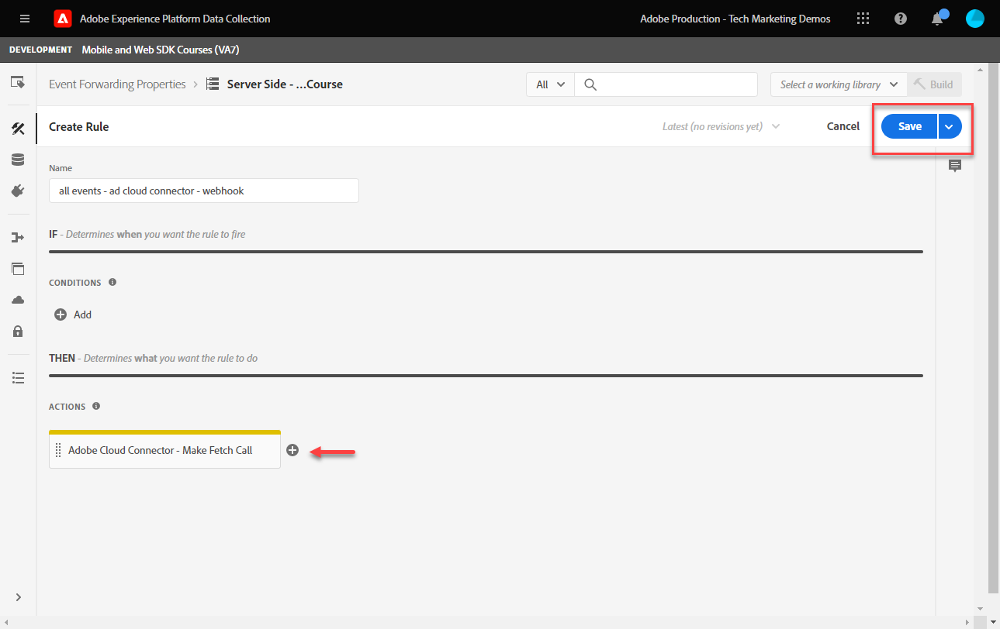
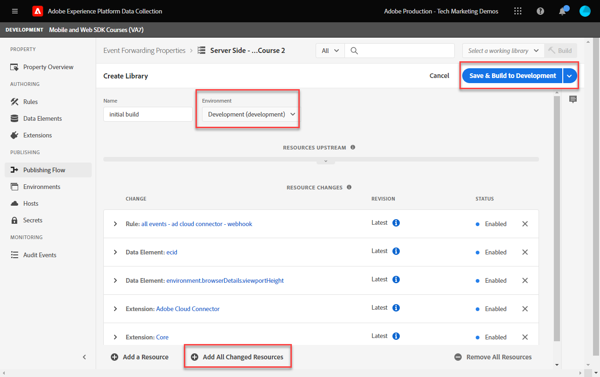
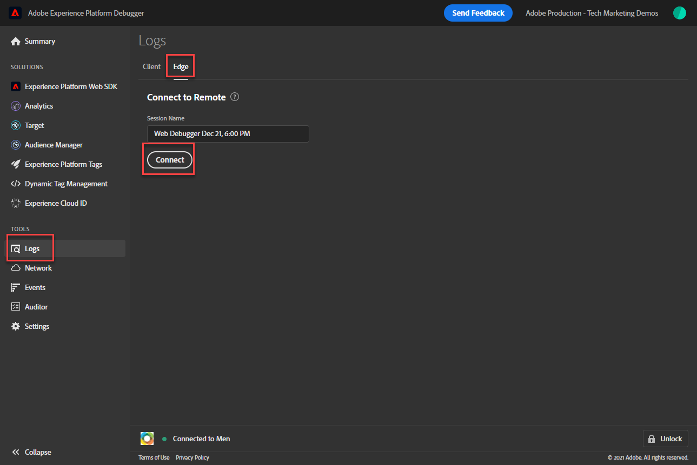

# Set up an event-forwarding property

Learn how to use event-forwarding property using Experience Platform Web SDK data.

Event forwarding is a new type of property available in Data Collection. Event forwarding gives you the ability to send data to third-party, non-Adobe vendors straight from the Adobe Experience Platform Edge Network instead of the traditional client-side browser. Find out more about the advantages of event forwarding in the [Event Forwarding overview](https://experienceleague.adobe.com/docs/experience-platform/tags/event-forwarding/overview.html?lang=en).

To use event forwarding in Adobe Experience Platform, data must be sent to Adobe Experience Platform Edge Network first using one or more of the following three options:

* [Adobe Experience Platform Web SDK](overview.md)
* [Adobe Experience Platform Mobile SDK](https://aep-sdks.gitbook.io/docs/)
<!--* [Server-to-Server API](https://experienceleague.adobe.com/docs/audience-manager/user-guide/api-and-sdk-code/dcs/dcs-apis/dcs-s2s.html?lang=en)-->

>[!NOTE]
>The Platform Web SDK and Platform Mobile SDK do not require deployment through tags, however, using tags to deploy these SDKs is recommended.

After completing the previous lessons in this tutorial, you should be sending data to Platform Edge Network using the Web SDK. Once the data is in Platform Edge Network, you can enable event forwarding and use an event-forwarding property to send data to non-Adobe solutions. 

## Learning objectives

At this end of this lesson, you will be able to:

* Create an event-forwarding property
* Link an event-forwarding property to a Platform Web SDK datastream
* Understand the differences between tag property data elements and rules and event-forwarding property data elements and rules
* Create an event-forwarding data element
* Configure an event-forwarding rule
* Validate an event-forwarding property is successfully sending data

## Prerequisites

* A software license which includes event forwarding. Event forwarding is a paid feature of Data Collection. Please contact your Adobe Account Team for more details.
* Event forwarding enabled in your Experience Cloud organization.
* User permission for event forwarding. (In [Admin Console](https://adminconsole.adobe.com/), under the Adobe Experience Platform Launch product, permission items for[!UICONTROL Platforms] > [!UICONTROL Edge] and all [!UICONTROL Property Rights]). Once granted you should see [!UICONTROL Event Forwarding] in the left navigation of the Data Collection interface:
    

* Adobe Experience Platform Web or Mobile SDK configured to send data to Edge Network. You must have completed the following lessons of this tutorial:

  * Initial Configuration 

    * [Configure permissions](configure-permissions.md)
    * [Configure an XDM schema](configure-schemas.md)
    * [Configure an identity namespace](configure-identities.md)
    * [Configure a datastream](configure-datastream.md)
        
  * Tags Configuration

    * [Install Web SDK extension](install-web-sdk.md)
    * [Create data elements](create-data-elements.md)
    * [Create a tag rule](create-tag-rule.md)
    * [Validate with Adobe Experience Platform debugger](validate-with-debugger.md)

## Create an event-forwarding property

Begin by creating an event-forwarding property:

1. Open the [Data Collection interface](https://experience.adobe.com/#/data-collection)
1. Select **[!UICONTROL Event Forwarding]** from the left navigation
1. Select **[!UICONTROL New Property]**. 
    

1. Name the property. In this case `Server-Side - Web SDK Course`

1. Select **[!UICONTROL Save]**.
    

## Configure the datastream

For event forwarding to use the data you send to the Edge network, you must link the newly created event-forwarding property to the same datastream used to send data to Adobe solutions. 

To configure Target in the datastream:

1. Go to [Data Collection](https://experience.adobe.com/#/data-collection){target="blank"} interface
1. On the left navigation, select **[!UICONTROL Datastreams]** 
1. Select the previously created `Luma Web SDK` datastream

    

1. Select **[!UICONTROL Add Service]**
     
1. Select **[!UICONTROL Event Forwarding]** as the **[!UICONTROL Service]**

1. Under the **[!UICONTROL Property ID]** dropdown, select the name you gave to your event-forwarding property, in this case `Server-Side - Web SDK Course`

1. Under the **[!UICONTROL Environment ID]** dropdown, select the tag environment you are linking the event forwarding environment to, in this case `Development`

    >[!TIP]
    >
    >    To send data to an event forwarding environment outside the Adobe org, select **[!UICONTROL Manually enter IDs]** and paste in an ID. The ID is provided when you create an event-forwarding property.

1. Select **[!UICONTROL Save]**.

    

Repeat these steps for staging and production datastreams when you are ready to promote your changes through the publishing flow.

## Forward data from the Platform Edge Network to a non-Adobe solution

In this exercise you will learn how to set up an event-forwarding data element, configure an event-forwarding rule, and validate using a third-part tool called [Webhook.site](https://webhook.site/).

>[!NOTE]
>
>A webhook is a way to integrate different systems in semi-real time. [Webhook.site](https://webhook.site/) is a third-party tool that lets you easily inspect, test and automate (with the visual Custom Actions builder, or WebhookScript) any incoming HTTP request or e-mail.

>[!IMPORTANT]
>
>You must have already created and mapped data elements to an XDM Object, as well as configured tag rules and built those changes within a library to a tag environment to proceed further. If you have not, refer to the **Tags Configuration** steps in the [prerequisites](setup-event-forwarding.md#prerequisites) section. Those steps ensure that data is sent to the Platform Edge Network, and from there you can configure an event-forwarding property to forward data to a non-Adobe solution. 

### Create an event-forwarding data element

The XDM object you previously configured using the Platform Web SDK tag extension becomes the data source for data elements in an event-forwarding property. You use the same data that you have already configured in the tag property as a data source for event-forwarding. 

>[!IMPORTANT]
>
>There is one key syntax difference when referencing XDM fields in event forwarding versus other contexts. To reference data in an event-forwarding property, the data element path must include the `arc.event` prefix:
>
> * `arc` stands for Adobe Response Context. 
> * For example: `arc.event.xdm.web.webPageDetails.URL`
>
>If this path is specified incorrectly, data is not collected. 
    
In this exercise, you will forward the browser viewport height and the Experience Cloud ID from the XDM Object to a webhook. The XDM field path is determined by the XDM schema created during the [Configure an XDM schema](configure-schemas.md) lesson. 

>[!TIP]
>
>You can also find the XDM object path by using your web browser network tools, filtering for `/ee` requests, opening the beacon [!UICONTROL **Payload**] and drilling down to the variable you are looking for. Then right-click with your mouse and select "Copy property path". Here is an example for the Browser Viewport Height:
> 

1. Go to the **[!UICONTROL Event Forwarding]** property you recently created 

1. On the left navigation, select **[!UICONTROL Data Elements]**

1. Select to **[!UICONTROL Create New Data Element]**

    

1. **[!UICONTROL Name]** the data element `environment.browserDetails.viewportHeight`

1. Under **[!UICONTROL Extension]**, leave `CORE`

1. Under **[!UICONTROL Data Element Type]**, select `Path`

1. Type-in the XDM Object path that contains the Browser Viewport Height `arc.event.xdm.environment.browserDetails.viewportHeight`

1. Select **[!UICONTROL Save]**

    

1. Create another data element

1. **[!UICONTROL Name]** it `ecid`

1. Under **[!UICONTROL Extension]**, leave `CORE`

1. Under **[!UICONTROL Data Element Type]**, select `Path`

1. Type-in the XDM object path that contains the Experience Cloud ID `arc.event.xdm.identityMap.ECID.0.id`

1. Select **[!UICONTROL Save]**

    

    >[!CAUTION]
    >
    > Make sure to include the `arc.event.` prefix in the path. Also, make sure to follow the exact case as the XDM Object field name&mdash;the ECID namespace must be in all caps.

    >[!TIP]
    >
    >When working with your own website, you can find the XDM object path with your web browser network tools, filtering for `/ee` requests, opening the beacon [!UICONTROL **Payload**] and drilling down to the variable you are looking for. Then right-click with your mouse and select "Copy property path". Here is an example for the Browser Viewport Height:
    > 

### Install Adobe Cloud Connector extension

To send data to third-party locations, you will first install the [!UICONTROL Adobe Cloud Connector] extension. 

1. Select **[!UICONTROL Extensions]** on the left navigation

1. Select the **[!UICONTROL Catalog]** tab

1. Search for the **[!UICONTROL Adobe Cloud Connector]**, select **[!UICONTROL Install]**

    

There is no extension configuration needed. With this extension, you can now forward data to a non-Adobe solution!

### Create an event-forwarding rule 

There are a few main differences between configuring rules in a tag property and a rule in an event-forwarding property:

* **[!UICONTROL Events] & [!UICONTROL Conditions]**:

  * **Tags**: All rules are triggered by an Event which must be specified in the rule, for example, `Library Loaded - Page Top`. Conditions are optional.
  * **Event forwarding**: It is assumed that every event sent to Platform Edge Network is a trigger to forward data. Therefore, there are no [!UICONTROL Events] that must be selected in event-forwarding rules. To manage which events trigger an event-forwarding rule, you must configure conditions. 

* **Data element tokenization**:

  * **Tags**: Data element names are tokenized with a `%` at the beginning and end of the data element name when used in a rule. For example, `%viewportHeight%`.

  * **Event forwarding**: Data element names are tokenized with `{{` at the beginning and `}}` at the end of the data element name when used in a rule. For example, `{{viewportHeight}}`.    

* **Sequence of rule actions**:

  * The Actions section of an event forwarding rule is always executed sequentially. Make sure the order of actions is correct when you save a rule. This execution sequence cannot be executed asynchronously like it can with tags.

<!--
  * **Tags**: Rule actions can easily be reordered using drag-and-drop functionality.
  * **Event forwarding**: Rule actions are always executed sequentially. Make sure the order of actions is correct when you save a rule.
-->

To configure a rule to forward data to your webhook, you must first obtain your personal webhook:

1. Go to [Webhook.site](https://webhook.site)

1. Find **Your unique URL**, you will use this as the URL request in your event-forwarding rule

1. Select **[!UICONTROL Copy to clipboard]**

1. Leave this window open as you will be able to validate the event forwarding data in real time being captured by Webhook

    

1. Go back **[!UICONTROL Data Collection]** > **[!UICONTROL Event Forwarding]** > **[!UICONTROL Rules]** from the left navigation

1. Select **[!UICONTROL Create New Rule]**

    

1. Name it `all events - ad cloud connector - webhook`

1. Add an Action

1. Under **[!UICONTROL Extension]**, select **[!UICONTROL Adobe Cloud Connector]**

1. Under **[!UICONTROL Action Type]**, select **[!UICONTROL Make Fetch Call]**

1. Paste your Webhook URL in the **[!UICONTROL URL]** field

    

1. Under **[Query Params]**, you will add both data elements you created earlier. 

1. On the **[!UICONTROL Key]** column type in `viewPortHeight`. On the **[!UICONTROL Value]** column, enter the `{{environment.browserDetails.viewportHeight}}` data element by either typing it in or selecting from the data element selector icon

1. Select [!UICONTROL **+ Add Another**] to add another query parameter

1. On the **[!UICONTROL Key]** column type in `ecid`. On the Value column, enter the `{{ecid}}` data element  

1. Select **[!UICONTROL Keep Changes]**

    

1. Your rule should look like below

1. Select **[!UICONTROL Save]**

    

### Create and build the library

Create a library and build all the changes to your event-forwarding development environment as you normally would in a tag property. 

>[!NOTE]
>
>If you haven't linked Staging and Production event-forwarding properties to your datastream, you will see Development environment as the only option to build a library to.

## Validate event-forwarding rule

Now you can validate your event-forwarding property using the Platform Debugger, and Webhook.site:

1. Follow the steps to [switch the tag library](validate-with-debugger.md#use-the-experience-platform-debugger-to-map-to-your-tag-property) on the [Luma Demo site](https://luma.enablementadobe.com/content/luma/us/en/men.html) to the Web SDK tag property to which you mapped your event-forwarding property in the datastream.

1. Before you reload the page, on the Experience Platform Debugger open **[!UICONTROL Logs]** from the left navigation

1. Select the **[!UICONTROL Edge]** tab, then select **[!UICONTROL Connect]** to view the Platform Edge Network requests

    

1. Reload the page

1. You will see additional requests that give you visibility into the server-side requests being sent by the Platform Edge Network to the WebHook

1. The request to focus validation on is the one showing the fully constructed URL being sent by the Edge network

    

1. Note the viewPortHeight and ecid query string parameters

    

1. They match the data seen in the XDM Object

    

1. Lastly, validate the data matches in [Webhook.site](https://webhook.site) as well by viewing your open Webhook window

    

Congratulations! You have configured event forwarding!

[Next: **Conclusion**](conclusion.md)

>[!NOTE]
>
>Thank you for investing your time in learning about Adobe Experience Platform Web SDK. If you have questions, want to share general feedback, or have suggestions on future content, please share them on this [Experience League Community discussion post](https://experienceleaguecommunities.adobe.com/t5/adobe-experience-platform-launch/tutorial-discussion-implement-adobe-experience-cloud-with-web/td-p/444996)