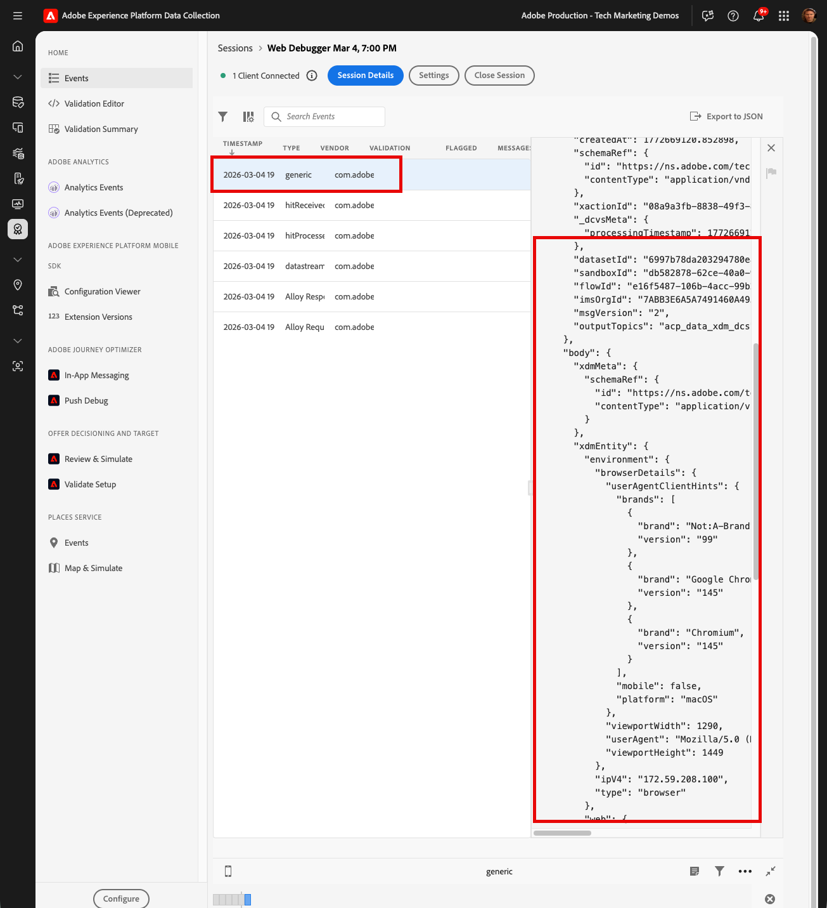

# Stream data to Experience Platform with Web SDK
 
Learn how to stream web data to Adobe Experience Platform with Platform Web SDK. 

Experience Platform is the backbone of all new Experience Cloud applications, such as Adobe Real-Time Customer Data Platform, Adobe Customer Journey Analytics, and Adobe Journey Optimizer. These applications are designed to use Platform Web SDK as their optimal method of web data collection.

Experience Platform uses the same XDM schema you created earlier to capture event data from the Luma website. When that data is sent to Platform Edge Network, the datastream configuration can forward it to Experience Platform.

## Learning objectives

At the end of this lesson, you will be able to:

* Create a dataset within Adobe Experience Platform
* Configure the datastream to send Web SDK data to Adobe Experience Platform
* Enable streaming web data for Real-Time Customer Profile
* Validate the data has landed both in the Platform dataset and in Real-Time Customer Profile
* Ingest sample loyalty program data into Platform
* Build a simple Platform audience

## Prerequisites

To complete this lesson, you must first:

* Have access to an Adobe Experience Platform application like Real-Time Customer Data Platform, Journey Optimizer, or Customer Journey Analytics
* Complete the earlier lessons in the Initial Configuration and Tags Configuration sections of this tutorial.

>[!NOTE]
>
>If you don't have any Platform applications, you can skip this lesson or read along.

## Create a dataset

All data that is successfully ingested into Adobe Experience Platform is persisted within the data lake as datasets. A [dataset](https://experienceleague.adobe.com/en/docs/experience-platform/catalog/datasets/overview) is a storage and management construct for a collection of data, typically a table that contains a schema (columns) and fields (rows). Datasets also contain metadata that describes various aspects of the data they store. 

Let's set up a dataset for your Luma web event data:

1. Go to the [Experience Platform](https://experience.adobe.com/platform/) or [Journey Optimizer](https://experience.adobe.com/journey-optimizer/) interface
1. Confirm you are in the development sandbox you are using for this tutorial
1. Open **[!UICONTROL Data Management > Datasets]** from the left navigation
1. Select **[!UICONTROL Create dataset]**

    

1. Select the **[!UICONTROL Create dataset from schema]** option

    

1. Select the `Luma Web Event Data` schema created in the [earlier lesson](configure-schemas.md) and then select **[!UICONTROL Next]**

    

1. Provide a **[!UICONTROL Name]** and optional **[!UICONTROL Description]** for the dataset. For this exercise, use `Luma Web Event Data`, then select **[!UICONTROL Finish]**

    

A dataset is now configured to start collecting data from your Platform Web SDK implementation.

## Configure the datastream

Now you can configure your [!UICONTROL datastream] to send data to [!UICONTROL Adobe Experience Platform]. The datastream is the link between your tag property, the Platform Edge Network, and the Experience Platform dataset.

1. Open the [Data Collection](https://experience.adobe.com/#/data-collection){target="blank"} interface
1. Select **[!UICONTROL Datastreams]** from the left navigation
1. Open the datastream you created in the [Configure a datastream](configure-datastream.md) lesson, `Luma Web SDK: Development Environment`

    

1. Select **[!UICONTROL Add Service]**
     
1. Select **[!UICONTROL Adobe Experience Platform]** as the **[!UICONTROL Service]**
1. Select **[!UICONTROL Enabled]**
1. Select `Luma Web Event Data` as the **[!UICONTROL Event Dataset]**

1. Select **[!UICONTROL Save]**

     

As you generate traffic on the [Luma demo website](https://luma.enablementadobe.com) mapped to your tag property, the data populates the dataset in Experience Platform!

## Validate the dataset

This step is critical to make sure that the data has landed in the dataset. There are multiple ways to validate the path of data sent to the dataset. 

* Validate using [!UICONTROL Experience Platform Debugger]
* Validate using [!UICONTROL Experience Platform Assurance]
* Validate using [!UICONTROL Preview Dataset]
* Validate using [!UICONTROL Query Service]

### Debugger

These steps are more or less the same as what you did in the [Debugger lesson](validate-with-debugger.md). However, since data will only be sent to Platform after you have enabled it in the datastream, you must generate some more sample data:

1. Open the [Luma demo website](https://luma.enablementadobe.com) and select the [!UICONTROL Experience Platform Debugger] extension icon

1. Configure the Debugger to map the tag property to *your* Development environment, as described in the [Validate with Debugger](validate-with-debugger.md) lesson

   

1. Browse the website. View some products and add some to your shopping cart

1. In the Debugger, open the "events" row to look for some of your XDM variables

You have validated that data has left the browser and sent to the datastream!

### Assurance

Since we have now enabled a service in the datastream, there is more we can see in Assurance:

1. Open your Assurance session or start a new one
1. Open the **[!UICONTROL datastream]** event
1. Here you can view the configuration of the Platform service, including the id of the datastream you created earlier in this lesson.

   

1. Open the **[!UICONTROL generic]** event belonging to the **[!UICONTROL com.adobe.streaming.validation]** vendor. This shows that the request has been sent to the dataset with the accompanying XDM data

   

You have validated that the request was received by Platform Edge Network and forwarded to the Platform dataset.

### Preview the dataset

Now, let's actually look in the dataset! A quick option is to use the **[!UICONTROL Preview dataset]** feature. Web SDK data is micro-batched to the data lake and refreshed in the Platform interface on a periodic basis. It might take 10-15 minutes to see the data that you generated.

1. In the [Experience Platform](https://experience.adobe.com/platform/) interface, select **[!UICONTROL Data Management > Datasets]** in the left-navigation to open the **[!UICONTROL Datasets]** dashboard. 

    The dashboard lists all available datasets for your organization. Details are displayed for each listed dataset, including its name, the schema the dataset adheres to, and status of the most recent ingestion run.

1. Select your `Luma Web Event Data` dataset to open its **[!UICONTROL Dataset activity]** screen. 

    

    The activity screen includes a graph visualizing the rate of messages being consumed as well as a list of successful and failed batches.
1. Since this is a new dataset, if you see even one batch with records ingested, that is a positive sign:

1. From the **[!UICONTROL Dataset activity]** screen, select **[!UICONTROL Preview dataset]** near the top-right corner of your screen to preview up to 100 rows of data. If the dataset is empty, the preview link is deactivated.

    

1. A query will run to pull 100 recent rows of data from your dataset. You can drill into individual XDM fields, such as web.webPageDetails.name:

    

### Query the data

You can run custom queries on the data as well to validate data ingestion:

1. In the [Experience Platform](https://experience.adobe.com/platform/) interface, select **[!UICONTROL Data Management > Queries]** in the left-navigation to open the **[!UICONTROL Queries]** screen.
1. Select **[!UICONTROL Create query]** 
1. First, run a query to see all of the names of the tables in the data lake. Enter `SHOW TABLES` in the query editor and click the play icon to rn the query.
1. In the results, notice how the name of the table is  `luma_web_event_data`
1. Now query the table with a simple query referencing your table (note that by default the query will be limited to 100 results): `SELECT * FROM "luma_web_event_data"`
1. After a few moments you should see sample records of your web data.

    

>[!ERROR]
>
>If you get a "Table not provisioned" error, double-check the name of your table. It could also be that the micro-batch of data has not yet landed in the data lake. Try again in 10-15 minutes.

>[!INFO]
>
>  Query service is a very powerful tool for data engineers and analysts. For more details about Adobe Experience Platform's query service, see [Explore data](https://experienceleague.adobe.com/en/docs/platform-learn/tutorials/queries/explore-data) in the Platform tutorials section.

>[!NOTE]
>
>Thank you for investing your time in learning about Adobe Experience Platform Web SDK. If you have questions, want to share general feedback, or have suggestions on future content, please share them on this [Experience League Community discussion post](https://experienceleaguecommunities.adobe.com/adobe-experience-platform-18/tutorial-discussion-implement-adobe-experience-cloud-with-web-sdk-tutorial-248848)
