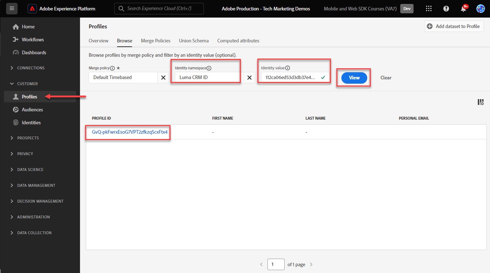

# Stream data to Experience Platform with Web SDK
 
Learn how to stream web data to Adobe Experience Platform with Platform Web SDK. 

Experience Platform is the backbone of all new Experience Cloud applications, such as Adobe Real-Time Customer Data Platform, Adobe Customer Journey Analytics, and Adobe Journey Optimizer. These applications are designed to use Platform Web SDK as their optimal method of web data collection.

Experience Platform uses the same XDM schema you created earlier to capture event data from the Luma website. When that data is sent to Platform Edge Network, the datastream configuration can forward it to Experience Platform.

## Learning objectives

At the end of this lesson, you will be able to:

* Create a dataset within Adobe Experience Platform
* Configure the datastream to send Web SDK data to Adobe Experience Platform
* Enable streaming web data for Real-Time Customer Profile
* Validate the data has landed both in the Platform dataset and in Real-Time Customer Profile
* Ingest sample loyalty program data into Platform
* Build a simple Platform audience

## Prerequisites

To complete this lesson, you must first:

* Have access to an Adobe Experience Platform application like Real-Time Customer Data Platform, Journey Optimizer, or Customer Journey Analytics
* Complete the earlier lessons in the Initial Configuration and Tags Configuration sections of this tutorial.

>[!NOTE]
>
>If you don't have any Platform applications, you can skip this lesson or read along.

## Create a dataset

All data that is successfully ingested into Adobe Experience Platform is persisted within the data lake as datasets. A [dataset](https://experienceleague.adobe.com/en/docs/experience-platform/catalog/datasets/overview) is a storage and management construct for a collection of data, typically a table that contains a schema (columns) and fields (rows). Datasets also contain metadata that describes various aspects of the data they store. 

Let's set up a dataset for your Luma web event data:

1. Go to the [Experience Platform](https://experience.adobe.com/platform/) or [Journey Optimizer](https://experience.adobe.com/journey-optimizer/) interface
1. Confirm you are in the development sandbox you are using for this tutorial
1. Open **[!UICONTROL Data Management > Datasets]** from the left navigation
1. Select **[!UICONTROL Create dataset]**

    

1. Select the **[!UICONTROL Create dataset from schema]** option

    

1. Select the `Luma Web Event Data` schema created in the [earlier lesson](configure-schemas.md) and then select **[!UICONTROL Next]**

    

1. Provide a **[!UICONTROL Name]** and optional **[!UICONTROL Description]** for the dataset. For this exercise, use `Luma Web Event Data`, then select **[!UICONTROL Finish]**

    

A dataset is now configured to start collecting data from your Platform Web SDK implementation.

## Configure the datastream

Now you can configure your [!UICONTROL datastream] to send data to [!UICONTROL Adobe Experience Platform]. The datastream is the link between your tag property, the Platform Edge Network, and the Experience Platform dataset.

1. Open the [Data Collection](https://experience.adobe.com/#/data-collection){target="blank"} interface
1. Select **[!UICONTROL Datastreams]** from the left navigation
1. Open the datastream you created in the [Configure a datastream](configure-datastream.md) lesson, `Luma Web SDK`

    

1. Select **[!UICONTROL Add Service]**
     
1. Select **[!UICONTROL Adobe Experience Platform]** as the **[!UICONTROL Service]**
1. Select `Luma Web Event Data` as the **[!UICONTROL Event Dataset]**

1. Select **[!UICONTROL Save]**. 

     

As you generate traffic on the [Luma Demo Site](https://luma.enablementadobe.com/content/luma/us/en.html) mapped to your tag property, the data populates the dataset in Experience Platform!

## Validate the dataset

This step is critical to make sure that the data has landed in the dataset. There are two aspects of validating data sent to the dataset. 

* Validate using [!UICONTROL Experience Platform Debugger]
* Validate using [!UICONTROL Preview Dataset]
* Validate using [!UICONTROL Query Service]

### Experience Platform Debugger

These steps are more or less the same as what you did in the [Debugger lesson](validate-with-debugger.md). However, since data will only be sent to Platform after you have enabled it in the datastream, you must generate some more sample data:

1. Open the [Luma demo site](https://luma.enablementadobe.com/content/luma/us/en.html) and select the [!UICONTROL Experience Platform Debugger] extension icon

1. Configure the Debugger to map the tag property to *your* Development environment, as described in the [Validate with Debugger](validate-with-debugger.md) lesson

   

1. Log into the Luma site using the credentials `test@adobe.com`/`test`

1. Return to the [Luma homepage](https://luma.enablementadobe.com/content/luma/us/en.html)

1. Within the Platform Web SDK network beacons shown by the debugger, select the "events" row to expand details in a pop-up

   

1. Search for the "identityMap" within the pop-up. Here you should see lumaCrmId with three keys of authenticatedState, id, and primary
   

Now, data should be populated in the `Luma Web Event Data` dataset and ready for 'Preview Dataset' validation.

### Preview the dataset

To confirm that the data has landed in Platform's data lake, a quick option is to use the **[!UICONTROL Preview dataset]** feature. Web SDK data is micro-batched to the data lake and refreshed in the Platform interface on a periodic basis. It might take 10-15 minutes to see the data that you generated.

1. In the [Experience Platform](https://experience.adobe.com/platform/) interface, select **[!UICONTROL Data Management > Datasets]** in the left-navigation to open the **[!UICONTROL Datasets]** dashboard. 

    The dashboard lists all available datasets for your organization. Details are displayed for each listed dataset, including its name, the schema the dataset adheres to, and status of the most recent ingestion run.

1. Select your `Luma Web Event Data` dataset to open its **[!UICONTROL Dataset activity]** screen. 

    

    The activity screen includes a graph visualizing the rate of messages being consumed as well as a list of successful and failed batches.

1. From the **[!UICONTROL Dataset activity]** screen, select **[!UICONTROL Preview dataset]** near the top-right corner of your screen to preview up to 100 rows of data. If the dataset is empty, the preview link is deactivated.

    

    In the preview window, the hierarchical view of the schema for the dataset is shown on the right.

    

### Query the data

1. In the [Experience Platform](https://experience.adobe.com/platform/) interface, select **[!UICONTROL Data Management > Queries]** in the left-navigation to open the **[!UICONTROL Queries]** screen.
1. Select **[!UICONTROL Create query]** 
1. First, run a query to see all of the names of the tables in the data lake. Enter `SHOW TABLES` in the query editor and click the play icon to rn the query.
1. In the results, notice how the name of the table is something like `luma_web_event_data`
1. Now query the table with a simple query referencing your table (note that by default the query will be limited to 100 results): `SELECT * FROM "luma_web_event_data"`
1. After a few moments you should see sample records of your web data.

>[!ERROR]
>
>If you get a "Table not provisioned" error, double-check the name of your table. It could also be that the micro-batch of data has not yet landed in the data lake. Try again in 10-15 minutes.

>[!INFO]
>
>  For more details about Adobe Experience Platform's query service, see [Explore data](https://experienceleague.adobe.com/en/docs/platform-learn/tutorials/queries/explore-data) in the Platform tutorials section.

## Enable the dataset and schema for Real-Time Customer Profile

For customers of Real-Time Customer Data Platform and Journey Optimizer, the next step is to enable the dataset and schema for Real-Time Customer Profile. Data streaming from Web SDK will be one of many data sources flowing into Platform and you want to join your web data with other data sources to build 360-degree customer profiles. To learn more about Real-Time Customer Profile, watch this short video:

>[!VIDEO](https://video.tv.adobe.com/v/27251?learn=on&captions=eng)

>[!CAUTION]
>
>When working with your own website and data, we recommend more robust validation of data before enabling it for Real-Time Customer Profile.

**To enable the dataset:**

1. Open the dataset you created, `Luma Web Event Data`

1. Select the **[!UICONTROL Profile Toggle]** to turn it on
    
    

1. Confirm you want to **[!UICONTROL Enable]** the dataset

   

**To enable the schema:**

1. Open the schema you created, `Luma Web Event Data`

1. Select the **[!UICONTROL Profile Toggle]** to turn it on
    
    

1. Select **[!UICONTROL Data for this schema will contain a primary identity in the identityMap field.]**

    >[!IMPORTANT]
    >
    >    Primary identities are required in every record sent to Real-Time Customer Profile. Typically, identity fields are labeled within the schema. When using identity maps, however, the identity fields are not visible within the schema. This dialog is to confirm that you have a primary identity in mind and that you will specify it in an identity map when sending your data. As you know, Web SDK uses an identity map with the Experience Cloud Id (ECID) as the default primary identity and an authenticated id as the primary identity when available.

1. Select **[!UICONTROL Enable]**

   

1. Select **[!UICONTROL Save]** to save the updated schema

Now the schema is also enabled for profile.

>[!IMPORTANT]
>
>    Once a schema is enabled for Profile, it cannot be disabled or deleted without resetting or deleting the entire sandbox. Also, fields cannot be removed from the schema after this point.
>
>   
> When working with your own data, we recommend you do things in the following order:
> 
> * First, ingest some data into your datasets.
> * Address any issues that arise during the data ingestion process (for example, data validation or mapping issues).
> * Enable your datasets and schemas for Profile
> * Re-ingest the data, if needed

### Validate a profile

You can look up a customer profile in the Platform interface (or Journey Optimizer interface) to confirm that the data has landed in Real-Time Customer Profile. As the name suggests, profiles populate in real-time, so there is no delay like there was with validating data in the dataset.

First you must generate more sample data. Repeat the steps from earlier in this lesson to log into the Luma website when it is mapped to your tag property. Inspect the Platform Web SDK request to make sure it sends data with the `lumaCRMId`.

1. In the [Experience Platform](https://experience.adobe.com/platform/) interface, select **[!UICONTROL Customer]** > **[!UICONTROL Profiles]** in the left-navigation

1. As the **[!UICONTROL Identity namespace]** use `lumaCRMId`
1. Copy & paste the value of the `lumaCRMId` passed in the call that you inspected in the Experience Platform Debugger, in this case `112ca06ed53d3db37e4cea49cc45b71e`.

    

1. If there is a valid value in the Profile for `lumaCRMId`, a Profile ID populates in the console:

    

1. To view the full **[!UICONTROL Customer Profile]** for each ID, select the **[!UICONTROL Profile ID]** in the main window. 

    >[!NOTE]
    >
    >Note you can select the hyperlink of the Profile ID, or if you select the row then a right menu opens where you can select the Profile ID hyperlink 
    > 

    Here you can see all the identities linked to the `lumaCRMId`, such as the `ECID`. 

    

You have now enabled Platform Web SDK for Experience Platform (And Real-Time CDP! And Journey Optimizer! And Customer Journey Analytics!).

### Create a Loyalty schema and ingest sample data

Completion of this exercise is expected for customers of Real-Time Customer Data Platform and Journey Optimizer. 

When Web SDK data is ingested into Adobe Experience Platform, it can be enriched by other data sources you have ingested into Platform. For example, when a user logs into the Luma site, an identity graph is constructed in Experience Platform and all other profile-enabled datasets can potentially be joined together to build Real-Time Customer Profiles. To see this in action, quickly create another dataset in Adobe Experience Platform with some sample loyalty data so that you can use Real-Time Customer Profiles with Real-Time Customer Data Platform and Journey Optimizer. Since you have already done similar exercises, the instructions will be brief.

Create the loyalty schema:

1. Create a new schema 
1. Choose **[!UICONTROL Individual Profile]** as the [!UICONTROL base class]
1. Name the schema `Luma Loyalty Schema`
1. Add the [!UICONTROL Loyalty Details] field group
1. Add the [!UICONTROL Demographic Details] field group
1. Select the `Person ID` field and mark it as an [!UICONTROL Identity] and [!UICONTROL Primary identity] using the `Luma CRM Id` [!UICONTROL Identity namespace].
1. Enable the schema for [!UICONTROL Profile]. If you can't find the Profile toggle, try clicking on the schema name on the top left.
1. Save the schema

   

To create the dataset and ingest the sample data:

1. Create a new dataset from the `Luma Loyalty Schema`
1. Name the dataset `Luma Loyalty Dataset`
1. Enable the dataset for [!UICONTROL Profile]
1. Download the sample file [luma-loyalty-forWeb.json](assets/luma-loyalty-forWeb.json)
1. Drag-and-drop the file into your dataset
1. Confirm that the data successfully ingested
   
    

### Create an audience

Audiences group profiles together around common traits. Build a quick audience you can use in your web campaign:

1. In the Experience Platform or Journey Optimizer interface, go to **[!UICONTROL Customer]** > **[!UICONTROL Audiences]** in the left navigation
1. Select **[!UICONTROL Create audience]**
1. Select **[!UICONTROL Build rule]**
1. Select **[!UICONTROL Create]**

   

1. Select **[!UICONTROL Attributes]**
1. Find the **[!UICONTROL Loyalty]** > **[!UICONTROL Tier]** field and drag it onto the **[!UICONTROL Attributes]** section
1. Define the audience as users whose `tier` is `gold`
1. Name the audience `Luma Loyalty Rewards – Gold Status`
1. Select **[!UICONTROL Edge]** as the **[!UICONTROL Evaluation method]**
1. Select **[!UICONTROL Save]**

   

Since this is a very simple audience, we can use the Edge evaluation method. Edge audiences evaluate on the edge, so in the same request made by the Web SDK to Platform Edge Network, we can evaluate the audience definition and confirm immediately if the user will qualify.

[Next: **Set up Adobe Analytics**](setup-analytics.md)

>[!NOTE]
>
>Thank you for investing your time in learning about Adobe Experience Platform Web SDK. If you have questions, want to share general feedback, or have suggestions on future content, please share them on this [Experience League Community discussion post](https://experienceleaguecommunities.adobe.com/t5/adobe-experience-platform-data/tutorial-discussion-implement-adobe-experience-cloud-with-web/td-p/444996)
