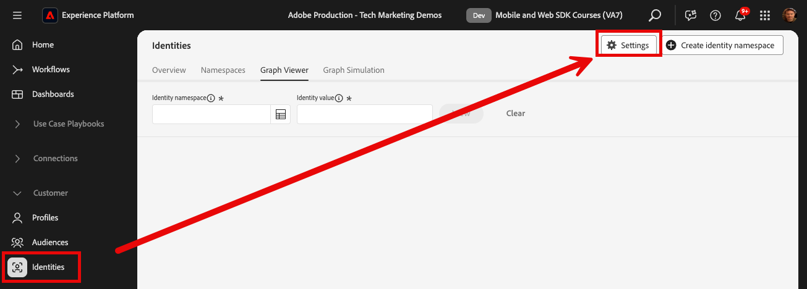
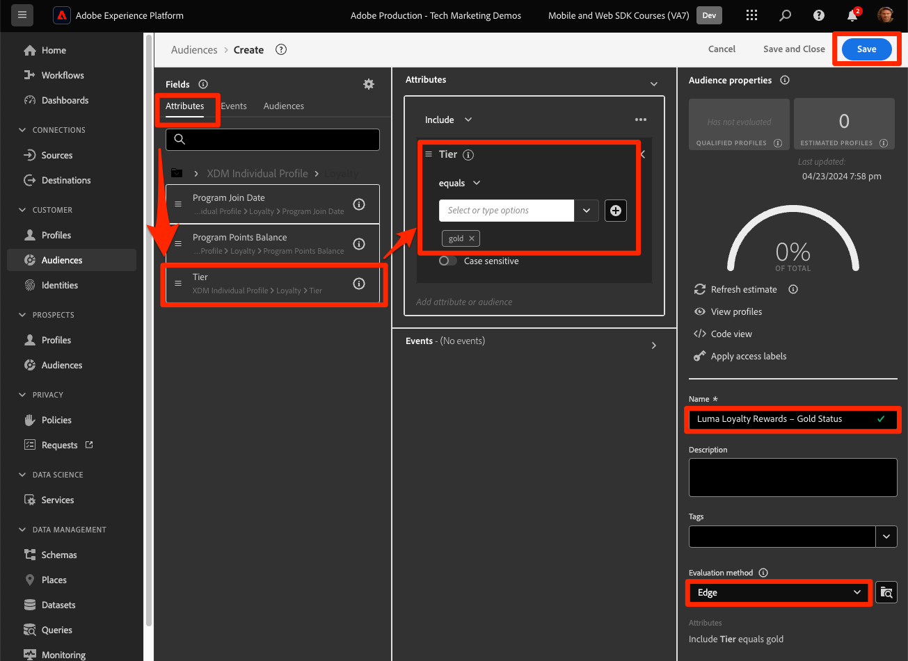

# Real-time Customer Profiles and Edge segmentation

## Enable the dataset and schema for Real-time Customer Profile

For customers of Real-Time Customer Data Platform and Journey Optimizer, the next step is to enable the dataset and schema for Real-Time Customer Profile. Data streaming from Web SDK will be one of many data sources flowing into Platform and you want to join your web data with other data sources to build 360-degree customer profiles. To learn more about Real-Time Customer Profile, watch this short video:

>[!VIDEO](https://video.tv.adobe.com/v/27251?learn=on&captions=eng)

>[!CAUTION]
>
>When working with your own website and data, we recommend more robust validation of data before enabling it for Real-Time Customer Profile.

### Enable the schema

To enable the schema for profile:

1. Open the schema you created, `Luma Web Event Data`

1. Select the **[!UICONTROL Profile Toggle]** to turn it on
    
    

1. Select **[!UICONTROL Data for this schema will contain a primary identity in the identityMap field.]**

1. Select **[!UICONTROL Enable]**

   

    >[!IMPORTANT]
    >
    >    Primary identities are required in every record sent to Real-Time Customer Profile. Each record becomes a "profile fragment" and primary identies are the keys to looking up those fragments. 
    > 
    > With some types of data, identity fields are labeled within the schema. With event data captured by Experience Platform SDKs, however, identity maps are typical, and the identity fields are not visible within the schema. 
    >
    > This dialog is to confirm that you have a primary identity in mind and that you will specify it in an identity map when sending your data, configure it with identity graph linking rules, or both. We recommend you do both. 
    >
    > As you know, our Luma  implementation uses an identity map with the the authenticated lumaCrmId as the primary identity when available, otherwise it will default to the Experience Cloud Id (ECID).

1. Select **[!UICONTROL Save]** to save the updated schema

Now the schema is enabled for profile.

### Enable the dataset

To enable the dataset:

1. Open the dataset you created, `Luma Web Event Data`

1. Select the **[!UICONTROL Profile Toggle]** to turn it on
    
    

1. Confirm you want to **[!UICONTROL Enable]** the dataset

>[!IMPORTANT]
>
>  Once a schema is enabled for Profile and data is ingested into the dataset, it cannot be disabled or deleted without resetting or deleting the entire sandbox. Also, fields which have received data cannot be removed from the schema after this point.
>
>   
> When working with your own data, we recommend you do things in the following order:
> 
> * First, ingest some data into your datasets.
> * Address any issues that arise during the data ingestion process (for example, data validation or mapping issues).
> * Enable your datasets and schemas for Profile
> * Re-ingest the data, if needed

### Validate a profile

You can look up a customer profile in the Platform interface (or Journey Optimizer interface) to confirm that the data has landed in Real-Time Customer Profile. As the name suggests, profiles populate in real-time, so there is no delay like there was with validating data in the dataset.

First you must generate more sample data into your profile-enabled dataset:

1. Open the [Luma demo website](https://luma.enablementadobe.com) and select the [!UICONTROL Experience Platform Debugger] extension icon

1. Configure the Debugger to map the tag property to *your* Development environment, as described in the [Validate with Debugger](validate-with-debugger.md) lesson

   

1. Browse the website. View some products and add some to your shopping cart.

1. Log into the Luma site using the credentials `test@test.com`/`test` (If you get a message "Invalid email or password" then create an account with those credentials)

1. Open the "events" row to look for some of your XDM variables
1. Search for the "identityMap" within the pop-up. Here you should see lumaCrmId with three keys of authenticatedState, id, and primary. Note how the lumaCrmId value for this login is `f660ab912ec121d1b1e928a0bb4bc61b`.

   

Now lets look for our profile in Experience Platform:

1. In the [Experience Platform](https://experience.adobe.com/platform/) interface, select **[!UICONTROL Customer]** > **[!UICONTROL Profiles]** in the left-navigation

1. As the **[!UICONTROL Identity namespace]** use `Luma CRM ID`
1. Copy & paste the value of the `lumaCrmId` passed in the call that you inspected in the Experience Platform Debugger, in this case `f660ab912ec121d1b1e928a0bb4bc61b`

1. If there is a valid value in the Profile for `lumaCRMId`, a Profile ID populates in the console

1. To view the full **[!UICONTROL Customer Profile]** select **[!UICONTROL View]**:

    

1. First you will see a summary of the profile. There is not much in this profile yet, but here the identities linked in the profile, the `lumaCRMId` and `ECID`:

    

1. At this point, most of the profile data available is the event data from the web activity. Select **[!UICONTROL Events]** to see the clickstream data:

    

## Avoid profile collapse

Now let's look at something you never want to see happen in your own implementation&mdash;graph collaps. 

### Understand the problem

First, we are going generate some more sample data so we can see the problem:

1. Without deleting any cookies or localStorage objects, open the [Luma demo website](https://luma.enablementadobe.com) and select the [!UICONTROL Experience Platform Debugger] extension icon

1. Configure the Debugger to map the tag property to *your* Development environment, as described in the [Validate with Debugger](validate-with-debugger.md) lesson

   

1. Hopefully you are still logged into the Luma site using the credentials `test@test.com`/`test`. If not, log back in.

1. Browse the website. View some products and add some to your shopping cart.

1. Now, sign out.

1. Now sign in again, creating an account as a different user (`spouse@test.com/test`). What we are trying to do is replicate a "shared device" scenario, where two users share the same web browser, authenticate to the same website, and share the same `ECID` value.
1. Confirm in the Debugger that you have a different lumaCrmId, `98d73957f59c67617611d56ba7e8dbaa` for `spouse@test.com/test`.

   

1. View some additional products

Now look up the profile again:

1. Search for `Luma CRM ID` equals `f660ab912ec121d1b1e928a0bb4bc61b` again
1. Note the profile is now linked to two different Luma CRM IDs

1. Select **[!UICONTROL View Identity Graph]**

   

1. The identity graph helps visualize this profile in which, because of the device sharing, two `lumaCrmId` values are joined by a common `ECID` value.

   

This can be a big problem for an Experience Platform implementation. Not only are both users' event data joined in a single profile, but other types of data ingested into Platform using these `lumaCrmId` values will get merged, too.

### Fix it with identity graph linking rules

To pre-emptively address the graph collapse issue, use the identity graph linking rules feature in Adobe Experience Platform before enabling your Web SDK implementation.

>[!WARNING]
>
> These steps are typically configured by a data architect managing the entire Platform implementation. There is a lot more to the feature than what is shown here and many complex scenarios which should be carefully simulated first.  
>
> Only complete these steps if you are completing this tutorial in a dedicated development sandbox which can be deleted after you complete this tutorial. These changes to the sandbox cannot be reversed. Please see the [identity graph linking rules tutorials](https://experienceleague.adobe.com/en/docs/platform-learn/tutorials/identities/graph-linking-rules/overview) to learn more.

To enable the identity graph linking rules:

1. From any Identites screen, open **[!UICONTROL Settings]**:

   

1. Review the warnings in the modal and select **[!UICONTROL Proceed]** 
1. Drag the `Luma CRM ID` so it is the highest priority namespace in the list
1. Check the **[!UICONTROL Unique per Graph]** setting for the `Luma CRM ID`
1. Select **[!UICONTROL Next]**
   
1. Review the modal and **[!UICONTROL Confirm]**
1. Select **[!UICONTROL Next]** to skip the simulation step

    >[!WARNING]
    >
    > Again, do not complete this workflow to enable these identity settings if you are not working in your own dedicated development sandbox.

1. Enter the sandbox name and select **[!UICONTROL Confirm]**

   

Come back to the site in 24 hours, log back in as either `test@test.com` or `spouse@test.com` and see if your profiles have been separated.

## Create an Edge-evaluated audience

Completion of this exercise is recommended for customers of Real-Time Customer Data Platform and Journey Optimizer. 

When Web SDK data is ingested into Adobe Experience Platform, it can be enriched by other data sources you have ingested into Platform. For example, when a user logs into the Luma site, an identity graph is constructed in Experience Platform and all other profile-enabled datasets can potentially be joined together to build Real-Time Customer Profiles. To see this in action, you will quickly create another dataset in Adobe Experience Platform with some sample loyalty data so that you can use Real-Time Customer Profiles with Real-Time Customer Data Platform and Journey Optimizer. You will then build an audience based on this data.

### Create a Loyalty schema and ingest sample data

Since you have already done similar exercises, the instructions will be brief.

Create the loyalty schema:

1. Create a new schema 
1. Choose **[!UICONTROL Individual Profile]** as the [!UICONTROL base class]
1. Name the schema `Luma Loyalty Schema`
1. Add the [!UICONTROL Loyalty Details] field group
1. Add the [!UICONTROL Demographic Details] field group
1. Select the `Person ID` field and mark it as an [!UICONTROL Identity] and [!UICONTROL Primary identity] using the `Luma CRM Id` [!UICONTROL Identity namespace].
1. Enable the schema for [!UICONTROL Profile]. If you can't find the Profile toggle, try clicking on the schema name on the top left.
1. Save the schema

   

To create the dataset and ingest the sample data:

1. Create a new dataset from the `Luma Loyalty Schema`
1. Name the dataset `Luma Loyalty Dataset`
1. Enable the dataset for [!UICONTROL Profile]
1. Download the sample file [luma-loyalty-forWeb.json](assets/luma-loyalty-forWeb.json)
1. Drag-and-drop the file into your dataset
1. Confirm that the data successfully ingested
   
    

### Set an Active-on-Edge Merge Policy

All audiences are created with a merge policy. Merge policies create different "views" of a profile, can contain a subset of datasets, and prescribe a priority order when different datasets contribute the same profile attributes. To be evaluated on the edge, an audience must use a merge policy with has the **[!UICONTROL Active-On-Edge Merge Policy]** setting.

>[!IMPORTANT]
>
>Only one merge policy per sandbox can have the **[!UICONTROL Active-On-Edge Merge Policy]** setting

1. Open the Experience Platform or Journey Optimizer interface and make sure you are in the development environment you are using for the tutorial.
1. Navigate to **[!UICONTROL Customer]** > **[!UICONTROL Profiles]** > **[!UICONTROL Merge Policies]** page
1. Open the **[!UICONTROL Default Merge Policy]** (probably named `Default Timebased`)
   
1. Enable the **[!UICONTROL Active-On-Edge Merge Policy]** setting
1. Select **[!UICONTROL Next]**

   
1. Keep selecting **[!UICONTROL Next]** to continue through the other steps of the workflow and select **[!UICONTROL Finish]** to save your settings
   

You are now able to create audiences which will evaluate on the Edge.

### Create an audience

Audiences group profiles together around common traits. Build a simple audience you can use in in Real-Time CDP or Journey Optimizer:

1. In the Experience Platform or Journey Optimizer interface, go to **[!UICONTROL Customer]** > **[!UICONTROL Audiences]** in the left navigation
1. Select **[!UICONTROL Create audience]**
1. Select **[!UICONTROL Build rule]**
1. Select **[!UICONTROL Create]**

   

1. Select **[!UICONTROL Attributes]**
1. Find the **[!UICONTROL Loyalty]** > **[!UICONTROL Tier]** field and drag it onto the **[!UICONTROL Attributes]** section
1. Define the audience as users whose `tier` is `gold`
1. Name the audience `Luma Loyalty Rewards – Gold Status`
1. Select **[!UICONTROL Edge]** as the **[!UICONTROL Evaluation method]**
1. Select **[!UICONTROL Save]**

   

>[!NOTE]
>
> Since we set the default merge policy as **[!UICONTROL Active-On-Edge Merge Policy]** the audience you created is automatically associated with this merge policy.

Since this is a very simple audience, we can use the Edge evaluation method. Edge audiences evaluate on the edge, so in the same request made by the Web SDK to Platform Edge Network, we can evaluate the audience definition and confirm immediately if the user will qualify.

>[!NOTE]
>
>Thank you for investing your time in learning about Adobe Experience Platform Web SDK. If you have questions, want to share general feedback, or have suggestions on future content, please share them on this [Experience League Community discussion post](https://experienceleaguecommunities.adobe.com/adobe-experience-platform-18/tutorial-discussion-implement-adobe-experience-cloud-with-web-sdk-tutorial-248848)
