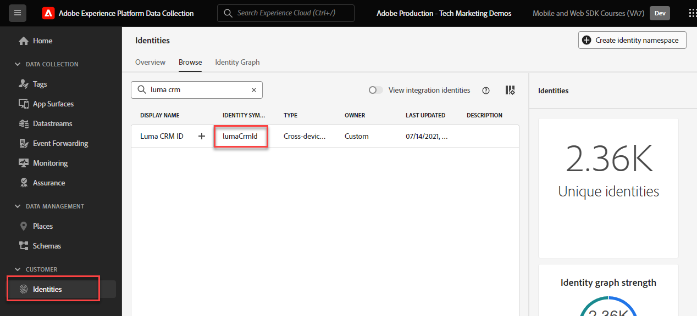
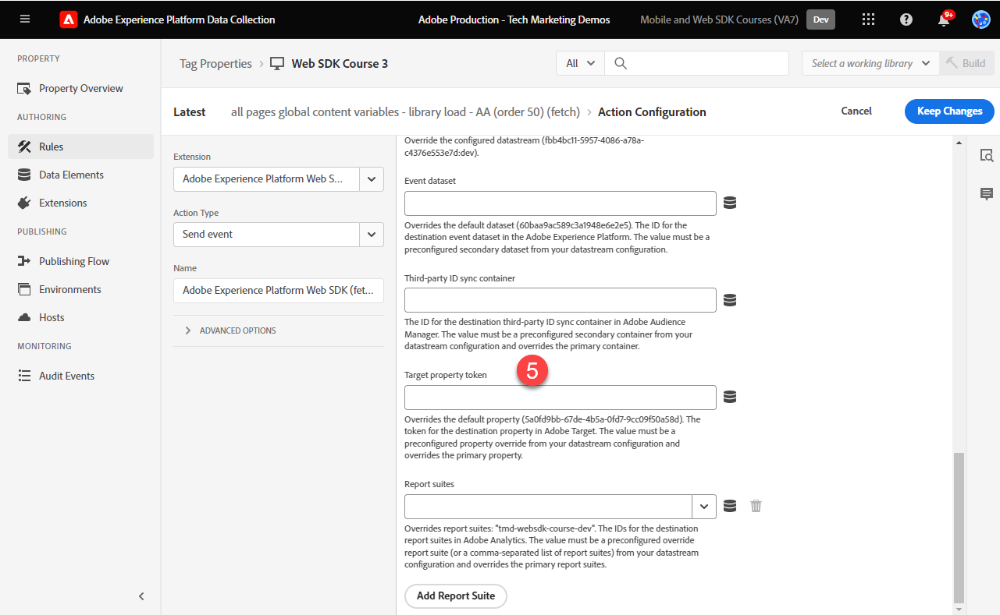

# Set up Adobe Target with Platform Web SDK

Learn how to implement Adobe Target using Adobe Experience Platform Web SDK. Learn how to deliver experiences and how to pass additional parameters to Target.

[Adobe Target](https://experienceleague.adobe.com/en/docs/target/using/target-home) is the Adobe Experience Cloud application that provides everything you need to tailor and personalize your customers' experience, so you can maximize revenue on your web and mobile sites, apps, and other digital channels.


## Learning objectives

At the end of this lesson, you will be able to do the following with a Web SDK implementation of Target:

* Add the pre-hiding snippet to prevent flicker
* Configure a datastream to enable Target functionality
* Render visual experience composer activties
* Render form composer activities
* Pass XDM data to Target and understand the mapping to Target parameters
* Pass custom data to Target such as profile and entity parameters
* Validate a Target implementation
* Separate personalization requests from analytics requests

>[!TIP]
>
>See our [Migrate Target from at.js 2.x to Platform Web SDK](/help/tutorial-migrate-target-websdk/introduction.md) tutorial for a step-by-step guide to migrate your existing at.js implementation.


## Prerequisites

To complete the lessons in this section, you must first:

* Complete all lessons for initial configuration of the Platform Web SDK, including setting up data elements and rules.
* Ensure you have an [Editor or Approver role](https://experienceleague.adobe.com/docs/target/using/administer/manage-users/enterprise/properties-overview.html#section_8C425E43E5DD4111BBFC734A2B7ABC80) in Adobe Target.
* Install the [Visual Experience Composer helper extension](https://experienceleague.adobe.com/en/docs/target/using/experiences/vec/troubleshoot-composer/vec-helper-browser-extension) if you are using the Google Chrome browser.
* Know how to set up activities in Target. If you need a refresher, the following tutorials and guides are helpful for this lesson:
  * [Use the Visual Experience Composer (VEC) Helper Extension](https://experienceleague.adobe.com/en/docs/target/using/experiences/vec/troubleshoot-composer/vec-helper-browser-extension)
  * [Use the Visual Experience Composer](https://experienceleague.adobe.com/en/docs/target-learn/tutorials/experiences/use-the-visual-experience-composer)
  * [Use the Form-Based Experience Composer](https://experienceleague.adobe.com/en/docs/target-learn/tutorials/experiences/use-the-form-based-experience-composer)
  * [Create Experience Targeting Activities](https://experienceleague.adobe.com/en/docs/target-learn/tutorials/activities/create-experience-targeting-activities)

## Add flicker handling

Before starting, determine if an extra flicker handling solution is required depending on how the tag library is loaded. 

>[!NOTE]
>
>This tutorial uses the [Luma site](https://luma.enablementadobe.com/content/luma/us/en.html) which has an asynchronous implementation of tags and flicker mitigation in place. This section is for reference to understand how the flicker mitigation works with the Platform Web SDK.


### Asynchronous implementation

When a tag library loads asynchronously, the page may finish rendering before Target has replaced default content with personalized content. This behavior can lead to what is known as "flicker" where default content briefly displays before being replaced by the personalized content specified by Target. If you want to avoid this flicker, Adobe recommends adding a special pre-hiding snippet immediately before the asynchronous tag embed code.

This snippet is already present on the Luma site, but let's take a closer look to understand what this code does:

```html
<script>
  !function(e,a,n,t){var i=e.head;if(i){
  if (a) return;
  var o=e.createElement("style");
  o.id="alloy-prehiding",o.innerText=n,i.appendChild(o),setTimeout(function(){o.parentNode&&o.parentNode.removeChild(o)},t)}}
  (document, document.location.href.indexOf("adobe_authoring_enabled") !== -1, ".personalization-container { opacity: 0 !important }", 3000);
</script>
```

The pre-hiding snippet creates a style tag in the head of the page with the CSS definition of your choosing. This style tag is removed when a response from Target is received, or the timeout is reached.

The pre-hiding behavior is controlled by two configurations at the very end of the snippet.

* `body { opacity: 0 !important }` specifies the CSS definition to use for the pre-hiding until Target loads. By default, the whole page is hidden. You can update this definition to the selectors you want to pre-hide along with how you want to hide them. You may include multiple definitions since this value is simply what is inserted into the pre-hiding style tag. If you have an easily identifiable container element wrapping the content below your navigation, you could use this setting to limit the pre-hiding to that container element.
* `3000` specifies the timeout in milliseconds for the pre-hiding. If a response from Target is not received before the timeout, the pre-hiding style tag is removed. Reaching this timeout should be rare.

>[!NOTE]
>
>The pre-hiding snippet for the Platform Web SDK is slightly different from the one used with the Target at.js library. Be sure to use the correct snippet for the Platform Web SDK since it uses a different style ID of `alloy-prehiding`. If the pre-hiding snippet for at.js is used, it may not work properly.

The pre-hiding snippet is also available within tags: 

1. Go to the **[!UICONTROL Extensions]** section of tags
1. Select **[!UICONTROL Configure]** for the Adobe Experience Platform Web SDK extension
1. Select the **[!UICONTROL Copy pre-hiding snippet to clipboard]** button

   

   >[!NOTE]
   >
   >The default pre-hiding snippet copied from the Platform Web SDK extension may include a CSS definition that does not exist on your site, such as `.personalization-container { opacity: 0 !important }`. Be sure to check and modify the pre-hiding snippet appropriately for your site.

### Synchronous implementation

Adobe recommends implementing tags asynchronously as demonstrated on the Luma site. However, if the tag library is loaded synchronously, then the pre-hiding snippet is not required. Instead, the pre-hiding style is specified in the Platform Web SDK extension settings.

The pre-hiding style for synchronous implementations can be configured as follows:

1. Go to the **[!UICONTROL Extensions]** section of tags
1. Select the **[!UICONTROL Configure]** button for the Platform Web SDK extension
1. Select the **[!UICONTROL Edit pre-hiding style]** button

   

1. Modify the CSS to include the selectors and hiding methods you would like to use, for example: `body { opacity: 0 !important }` if you would like to pre-hide the entire body of the page. 
1. Save your changes and build to a library

>[!NOTE]
>
>The pre-hiding style setting is only meant to be used for synchronous implementations. This style should be blank or commented out if you are using an asynchronous implementation of tags.

To learn more about how the Platform Web SDK can manage flicker, you can refer to the guide section: [managing flicker for personalized experiences](https://experienceleague.adobe.com/en/docs/experience-platform/edge/personalization/manage-flicker).


## Configure the datastream

Target must be enabled in the datastream configuration before any Target activities can be delivered by Platform Web SDK.

To configure Target in the datastream:

1. Go to the [Data Collection](https://experience.adobe.com/#/data-collection){target="blank"} interface
1. On the left navigation, select **[!UICONTROL Datastreams]** 
1. Select the previously created `Luma Web SDK: Development Environment` datastream

    

1. Select **[!UICONTROL Add Service]**
     
1. Select **[!UICONTROL Adobe Target]** as the **[!UICONTROL Service]**
1. Enter the optional details about your Target implementation, if desired, following the guidance below.
1. Select **[!UICONTROL Save]**

   

### Property token

Target Premium customers have the option to manage user permissions with properties. Target properties allow you to establish boundaries around where users can run Target activities. Refer to the [Enterprise Permissions](https://experienceleague.adobe.com/en/docs/target/using/administer/manage-users/enterprise/properties-overview) section of the Target documentation for details.

To setup or find property tokens, navigate to **Adobe Target** > **[!UICONTROL Administration]** > **[!UICONTROL Properties]**. The `</>` icon displays the implementation code. The `at_property` value is the property token that you would use in your datastream.


<a id="advanced-pto"></a>

Only one property token can be specified per datastream, but property token overrides allow you to specify alternative property tokens to replace the primary property token defined in the datastream. An update to the `sendEvent` action is also needed to override the datastream.


### Target environment ID

[Environments](https://experienceleague.adobe.com/en/docs/target/using/administer/environments) in Target help you manage your implementation through all stages of development. This optional setting specifies which Target environment you are going to use with each datastream.

Adobe recommends setting the Target Environment ID differently for each of your development, staging, and production datastreams to keep things simple. Alternatively, you can organize your environments in the Target interface using the [hosts](https://experienceleague.adobe.com/en/docs/target/using/administer/hosts) feature.

To setup or find Environment IDs, navigate to **Adobe Target** > **[!UICONTROL Administration]** > **[!UICONTROL Environments]**.


>[!NOTE]
>
>If no Target Environment ID is specified, then the production Target environment is assumed.

### Target third-party ID namespace

This optional setting allows you to specify which identity symbol to use for the Target Third Party ID. Target only supports profile syncing on a single identity symbol or namespace. For more information, you can refer to the [Real-Time profile syncing for mbox3rdPartyId](https://experienceleague.adobe.com/en/docs/target/using/audiences/visitor-profiles/3rd-party-id) section of the Target guide.

The Identity Symbols are found in the identities list under **Data Collection** > **[!UICONTROL Customer]** > **[!UICONTROL Identities]**. 



For the purposes of this tutorial using the Luma site, use the Identity Symbol `lumaCrmId` set up during the lesson about [Identities](configure-identities.md).


## Render visual personalization decisions

Visual personalization decisions refers to the experiences created in Adobe Target's visual experience composer. First, you should understand the terminology used in the Target and tags interfaces:

* **Activity**: A set of experiences targeted to one or more audiences. For example, a simple A/B test could be an activity with two experiences.
* **Experience**: A set of actions targeted to one or more locations, or decision scopes.
* **Decision scope**: A location where a Target experience is delivered. Decision scopes are equivalent to "mboxes" if you are familiar with using older versions of Target.
* **Personalization decision**: An action the server determines should be applied. These decisions may be based on audience criteria and Target activity prioritization.
* **Proposition**: The result of decisions made by the server which are delivered in the Platform Web SDK response. For example, swapping a banner image would be a proposition.

### Update the [!UICONTROL Send event] action

Visual personalization decisions from Target are delivered by the Platform Web SDK, if Target is enabled in the datastream. However, _they are not rendered automatically_. You must update the [!UICONTROL Send event] action to enable automatic rendering.

1. In the [Data Collection](https://experience.adobe.com/#/data-collection){target="blank"} interface, open the tag property you are using for this tutorial
1. Open the `all pages - library loaded - send event - 50` rule
1. Select the `Adobe Experience Platform Web SDK - Send event` action
1. Enable **[!UICONTROL Render visual personalization decisions]** with the checkbox

   

<!--
1. In the **[!UICONTROL Datastream configuration overrides**] the **[!UICONTROL Target Property Token]** can be overridden either as a static value or with a data element. Only property tokens defined in the [**Advanced Property Token Overrides**](#advanced-pto) section in **Datastream Configuration** will return results.
   
   
   -->
   
1. Save your changes then build to your library

The render visual personalization decisions setting makes the Platform Web SDK automatically apply any modifications that were specified using the Target Visual Experience Composer or "global mbox".

>[!NOTE]
>
>Typically, the [!UICONTROL Render visual personalization decisions] setting should only be enabled for a single Send Event action per full page load. If multiple Send Event actions have this setting enabled, then subsequent render requests are ignored.

If you prefer to render or action on these decisions yourself using custom code, you can leave the [!UICONTROL Render visual personalization decisions] setting disabled. Platform Web SDK is flexible and provides this capability to give you complete control. You can refer to the guide for more information about [manually rendering personalized content](https://experienceleague.adobe.com/en/docs/experience-platform/edge/personalization/rendering-personalization-content).


### Set up a Target activity with the Visual Experience Composer

Now that the basic implementation portion is complete, create an Experience Targeting (XT) activity in Target to validate that everything is working correctly. You may refer to the Target tutorial for [creating Experience Targeting activities](https://experienceleague.adobe.com/en/docs/target-learn/tutorials/activities/create-experience-targeting-activities) if you need assistance.

>[!NOTE]
>
>If you are using Google Chrome as your browser, the [Visual Experience Composer (VEC) helper extension](https://experienceleague.adobe.com/en/docs/target/using/experiences/vec/troubleshoot-composer/vec-helper-browser-extension) is required to load the site properly for editing in the VEC.

1. Navigate to the Adobe Target interface
1. Create an Experience Targeting (XT) activity using the Luma homepage for the activity URL

   

1. Modify the page, for example change the text on the homepage hero banner.  When finished, select **[!UICONTROL Save]** then **[!UICONTROL Next]**.

   

1. Update the event name, then select **[!UICONTROL Next]**.

   

1. Choose Adobe Analytics as the reporting source with the appropriate report suite and the Orders metric as the goal
   
   

   >[!NOTE]
   >
   >If you do not use Adobe Analytics then select Target as the reporting source and choose a different metric like **Engagement > Page Views** instead. A goal metric is required to save and preview the activity.

1. Save the activity
1. If you are comfortable with your changes, then you can activate your activity. Otherwise, if you would like to preview the experience without activating you can copy the [QA Preview URL](https://experienceleague.adobe.com/en/docs/target/using/activities/activity-qa/activity-qa).
1. Load the Luma homepage and you should see your changes applied
1. After a few hours, you should be able to see Target activity data and conversions in Adobe Analytics. Refer to the Target Guide for detailed information about [Analytics for Target (A4T) reporting](https://experienceleague.adobe.com/en/docs/target/using/integrate/a4t/reporting).


### Validate with the Debugger

If you set up an activity, you should see your content rendered on the page. However even if no activities are live, you can also look at the Send Event network call to confirm that Target is configured properly.

>[!CAUTION]
>
>If you are using Google Chrome and have the [Visual Experience Composer (VEC) helper extension](https://experienceleague.adobe.com/en/docs/target/using/experiences/vec/troubleshoot-composer/vec-helper-browser-extension) installed, make sure the **Inject Target Libraries** setting is disabled. Enabling this setting will result in extra Target requests.

1. Open the Adobe Experience Platform Debugger browser extension
1. Go to the [Luma demo site](https://luma.enablementadobe.com/content/luma/us/en.html) and use the debugger to [switch the tag property on the site to your own development property](validate-with-debugger.md#use-the-experience-platform-debugger-to-map-to-your-tags-property)
1. Reload the page
1. Select the **[!UICONTROL Network]** tool in the debugger
1. Filter by **[!UICONTROL Adobe Experience Platform Web SDK]**
1. Select the value in events row for the first call

   

1. Notice that there are keys under `query` > `personalization` and  `decisionScopes` has a value of `__view__`. This scope is the equivalent to the `target-global-mbox`. This Platform Web SDK call requested decisions from Target.

   
   
1. Close the overlay and select the event details for the second network call. This call is only present if Target returned an activity.
1. Notice that there are details about the activity and experience returned from Target. This Platform Web SDK call sends a notification that a Target activity was rendered to the user and increments an impression.

   

## Set up and render a custom decision scope

Custom decision scopes (formerly known as "mboxes") can be used to deliver HTML or JSON content in a structured fashion using the Target Form-based Experience Composer. Content delivered to one of these custom scopes is not rendered automatically by the Platform Web SDK. It can be rendered using an action in Tags.

### Add a scope to the [!UICONTROL Send event action]

Modify your page load rule to add a custom decision scope:

1. Open the `all pages - library loaded - send event - 50` rule
1. Select the `Adobe Experience Platform Web SDK - Send Event` action
1. Add one or more scopes you would like to use. For this example, use `homepage-hero`.

   

1. Save your changes and build to your library

>[!TIP]
>
>For this tutorial, you will use a single manually defined scope for demonstration purposes. If you decide to use several decision scopes that are intended for specific pages, then you should consider using a data element that returns an array of scopes conditionally depending on the page path. This approach helps keep your implementation simple and scalable.

### Process the response from Target

Now that you have configured the Platform Web SDK to request content for the `homepage-hero` scope, you must do something with the response. The Platform Web SDK tag extension provides a [!UICONTROL Send Event Complete] event which can be used to immediately trigger a new rule when a response from a [!UICONTROL Send Event] action is received.

1. Create a rule called `homepage - send event complete - render homepage-hero`.
1. Add an event to the rule. Use the **Adobe Experience Platform Web SDK** extension and the **[!UICONTROL Send event complete]** event type.
1. Add a condition to restrict the rule to the Luma homepage (path without query string equals `/content/luma/us/en.html`).
1. Add an action to the rule. Use the **Adobe Experience Platform Web SDK** extension and **Apply propositions** action type.

   

   >[!TIP]
   >
   >Give your rule events, conditions, and actions descriptive names instead of using the default names. Robust rule component names make the search results much more useful.

1. Enter `%event.propositions%` into the Propositions field as we're using the "Send event complete" event as the trigger for this rule. 
1. In the "proposition metadata" section select the **[!UICONTROL Use a form]**
1. For the **[!UICONTROL Scope]** field input `homepage-hero`
1. For the **[!UICONTROL Selector]** field input `div.heroimage`
1. For **[!UICONTROL Action Type]** select **[!UICONTROL Set HTML]**

   

1. Save your changes and build to your library
1. Load the Luma homepage a few times, which should be enough to make the new `homepage-hero` decision scope register in the Target interface.

### Set up a Target activity with the Form-based Experience Composer

Now that you have a rule to manually render a custom decision scope, you can create another Experience Targeting (XT) activity in Target. This time use the Form-Based Experience Composer.

1. Open [Adobe Target](https://experience.adobe.com/target)
1. Deactivate the activity used for the previous lesson
1. Create an Experience Targeting (XT) activity using the Form-based Experience Composer option

   

1. Select the **`homepage-hero`** location from the location dropdown and **[!UICONTROL Create HTML Offer]** from the content dropdown. If the  location is not available, you can type it in. Target periodically populates new location names after receiving requests for that location or scope.

   

1. Paste the following code in the content box. This code is a basic hero banner with a different background image:

   ```html
   <div class="we-HeroImage jumbotron" style="background-image: url('/content/luma/us/en/women/_jcr_content/root/hero_image.coreimg.jpeg');">
      <div class="container cq-dd-image">
         <div class="we-HeroImage-wrapper">
            <p class="h3">New Luma Yoga Collection</p>
            <strong class="we-HeroImage-title h1">Be active with style&nbsp;</strong>
            <p>
               <a class="btn btn-primary btn-action" href="/content/luma/us/en/products.html" role="button">Shop Now</a>
            </p>
         </div>
      </div>
   </div>
   ```

1. On the [!UICONTROL Goals & Settings] step, choose Adobe Target as the reporting source and [!UICONTROL Engagement] > [!UICONTROL Page Views] as the goal
1. Save the activity
1. If you are comfortable with your changes, then you can activate your activity. Otherwise, if you would like to preview the experience without activating you can copy the [QA Preview URL](https://experienceleague.adobe.com/en/docs/target/using/activities/activity-qa/activity-qa).
1. Load the Luma homepage and you should see your changes applied

>[!NOTE]
>
>The "Clicked on mbox" conversion goal does not work automatically. Because Platform Web SDK does not automatically render custom scopes, it does not track clicks to locations you choose to apply the content. You can create your own click tracking for each scope using the "click" `eventType` with the applicable `_experience` details using the `sendEvent` action.

### Validate with the Debugger

If you activated your activity, you should see your content render on the page. However even if no activities are live, you can also look at the [!UICONTROL Send Event] network call to confirm that Target is requesting content for your custom scopes.

1. Open the Adobe Experience Platform debugger browser extension
1. Go to the [Luma demo site](https://luma.enablementadobe.com/content/luma/us/en.html) and use the debugger to [switch the tag property on the site to your own development property](validate-with-debugger.md#use-the-experience-platform-debugger-to-map-to-your-tags-property)
1. Reload the page
1. Select the **[!UICONTROL Network]** tool in the Debugger
1. Filter by **[!UICONTROL Adobe Experience Platform Web SDK]**
1. Select the value in events row for the first call

   

1. Notice that there are keys under `query` > `personalization` and  `decisionScopes` has a value of `__view__` like before, but now there is also a `homepage-hero` scope included. This Platform Web SDK call requested decisions from Target for changes made using the VEC and the specific `homepage-hero` location.

   
   
1. Close the overlay and select the event details for the second network call. This call is only present if Target returned an activity.
1. Notice that there are details about the activity and experience returned from Target. This Platform Web SDK call sends a notification that a Target activity was rendered to the user and increments an impression.

   

## Send parameters to Target

In this section, you will pass Target-specific data and take a closer look at how XDM data is mapped to Target parameters.

### Page (mbox) parameters and XDM

All XDM fields are automatically passed to Target as [page parameters](https://experienceleague.adobe.com/en/docs/target-dev/developer/implementation/methods/page) or mbox parameters.

Some of these XDM fields will map to special objects in Target's backend. For example, `web.webPageDetails.URL` will automatically be available to build URL-based targeting conditions or as the `page.url` object when creating profile scripts.

### Special parameters and the data object

There are some data points that may be useful to Target that are not mapped from the XDM object. These special Target parameters include:

* [Profile attributes](https://experienceleague.adobe.com/en/docs/target/using/implement-target/before-implement/methods/in-page-profile-attributes) 
* [Recommendations entity attributes](https://experienceleague.adobe.com/en/docs/target/using/recommendations/entities/entity-attributes)
* [Recommendations reserved parameters](https://experienceleague.adobe.com/en/docs/target/using/recommendations/plan-implement#pass-behavioral)
* Category values for [category affinity](https://experienceleague.adobe.com/en/docs/target/using/audiences/visitor-profiles/category-affinity)

These parameters must be sent in the `data` object instead of in the `xdm` object. Additionally, page (or mbox) parameters can also be included in the `data` object.

To populate the data object, create the following data element, reusing data elements created in the [Create data elements](create-data-elements.md) lesson:

* **`data.content`** using the following custom code: 

   ```javascript
   var data = {
      __adobe: {
         target: {
            "entity.id": _satellite.getVar("product.productInfo.sku"),
            "entity.name": _satellite.getVar("product.productInfo.title"),
            "profile.loggedIn": _satellite.getVar("user.profile.attributes.loggedIn"),
            "user.categoryId": _satellite.getVar("product.category")
         }
      }
   }
   return data;
   ```


### Update the page load rule

Passing additional data for Target outside of the XDM object requires updating any applicable rules. For this example, the only modification you must make is to include the new **data.content** data element to the generic page load rule and product page view rule. 

1. Open the `all pages - library loaded - send event - 50` rule
1. Select the `Adobe Experience Platform Web SDK - Send event` action
1. Add the `data.content` data element to the Data field

   

1. Save your changes and build to your library
1. Repeat steps 1 through 4 for the **ecommerce - library loaded - set product details variables - 20** rule

>[!NOTE]
>
>The example above uses a `data` object that is not completely populated on all page types. Tags handles this situation appropriately and omits keys that have an undefined value. For example, `entity.id` and `entity.name` would not be passed on any pages aside from product details.

   
## Splitting Personalization and Analytics requests

The data layer on the Luma site is completely defined before the tags embed code. This allows us to use a single call to both fetch personalized content (e.g. from Adobe Target) and send analytics data (e.g. to Adobe Analytics). 

On many websites, however, the data layer cannot be loaded early enough or quickly enough to use a single call for both applications. In those situations, you can use two [!UICONTROL Send event] actions on a single page load and use the first for personalization and the second for analytics. Breaking up the events this way allows the personalization event to fire as early as possible, while waiting for the data layer to load completely before sending the Analytics event. This is similar to many pre-Web SDK implementations, where Adobe Target would fire the `target-global-mbox` at the top of the page and Adobe Analytics would fire the `s.t()` call at the bottom of the page

To create the personalization-on-top request:

1. Open the `all pages - library loaded - send event - 50` rule
1. Open the **Send event** action
1. Select **[!UICONTROL Use guided events]** and then select **[!UICONTROL Request personalization]**
1. This locks the **Type** as **[!UICONTROL Decisioning Proposition Fetch]**

   

To create the analytics-on-bottom request:

1. Create a new rule called `all pages - page bottom - send event - 50`
1. Add an event to the rule. Use the **Core** extension and the **[!UICONTROL Page Bottom]** event type
1. Add an action to the rule. Use the **Adobe Experience Platform Web SDK** extension and **Send event** action type
1. Select **[!UICONTROL Use guided events]** and then select **[!UICONTROL Collect analytics]**
1. This locks the **[!UICONTROL Include pending display notifications]** checkbox selected so the queued display notification from the decisioning request will be sent.

 

   >[!TIP]
   >
   >If the event you're fetching a Decisioning Proposition for doesn't have an Adobe Analytics event following it use the **Guided event style** **[!UICONTROL Unguided - show all fields]**. You'll need to select all the options manually, but it unlocks the option to **[!UICONTROL automatically send a display notification]** along with your fetch request.


### Validate with the Debugger

Now that the rules are updated, you can validate if the data is being passed correctly using the Adobe Debugger.

1. Navigate to the [Luma demo site](https://luma.enablementadobe.com/content/luma/us/en.html) and login with the email `test@adobe.com` and password `test`
1. Navigate to a product details page
1. Open the Adobe Experience Platform debugger browser extension and [switch the tag property to your own development property](validate-with-debugger.md#use-the-experience-platform-debugger-to-map-to-your-tags-property)
1. Reload the page
1. Select the **Network** tool in the Debugger and filter by **Adobe Experience Platform Web SDK**
1. Select the value in events row for the first call
1. Notice that there are keys under `data` > `__adobe` > `target` and they are populated with information about the product, category, and login state.

   

### Validate in the Target interface

Next, look in the Target interface to confirm that data was received and is available to use in audiences and activities. XDM data is automatically mapped to custom Target parameters. You can validate that XDM data was received by Target and is available by creating an audience.

1. Open [Adobe Target](https://experience.adobe.com/target)
1. Navigate to the **[!UICONTROL Audiences]** section
1. Create an audience and choose the **[!UICONTROL Custom]** attribute type
1. Search the **[!UICONTROL Parameter]** field for `web`. The dropdown menu should populate with all the XDM fields related to the web page details.

   

Next, validate that the login state profile attribute was successfully passed.

1. Choose the **[!UICONTROL Visitor Profile]** attribute type
2. Search for `loggedIn`. If the attribute is available in the dropdown menu then the attribute was passed correctly to Target. New attributes may take several minutes to become available in the Target UI.

   

If you have Target Premium, you can also validate that the entity data was passed correctly and the product data was written to the Recommendations product catalog.

1. Navigate to the **[!UICONTROL Recommendations]** section
1. Select **[!UICONTROL Catalog Search]** in the left side navigation
1. Search for the product SKU or product name you visited earlier on the Luma site. The product should show up in the product catalog. New products may take several minutes to become searchable in the Recommendations product catalog.
   
   

### Validate with Assurance

Additionally, you can use Assurance where appropriate to confirm Target decisioning requests are getting the correct data and that any server side transformations are occuring correctly. You can also confirm campaign and experience information is contained in the Adobe Analytics calls even when the Target decisioning and Adobe Analytics calls are sent seperately.

1. Open [Assurance](https://experience.adobe.com/assurance)
1. Start a new assurance sesison, input the **[!UICONTROL session name]** and input the **[!UICONTROL base url]** for your site or any other page you're testing
1. Click **[!UICONTROL Next]**

   

1. Select your connection method, in this case we'll use **[!UICONTROL copy link]**
1. Copy the link an paste it into a new browser tab
1. Click **[!UICONTROL Done]**
   
   

1. Once your Assurance session launches you'll see events populating in the events tab
1. Filter by "tnta"
1. Select the most recent call and expand the messages to make sure it's populating correclty and note the "tnta" values

   

1. Next keep the "tnta" filter  and select the analytics.mapping event thats occurs after the target event we just viewed.
1. Examine the "context.mappedQueryParams.\<yourSchemaName\>" value to confirm it containts a "tnta" attribute with a concatenated string that matches the "tnta" values found in the preceding target event.

   

This confirms that the A4T information that was queued for later transmission when we made the target decisiong call was sent properly when the analytics tracking call fired later on the page.

Now that you have completed this lesson you should have a working implementation of Adobe Target using the Platform Web SDK.

[Next: **Set up Journey Optimizer web channel**](setup-web-channel.md)

>[!NOTE]
>
>Thank you for investing your time in learning about Adobe Experience Platform Web SDK. If you have questions, want to share general feedback, or have suggestions on future content, please share them on this [Experience League Community discussion post](https://experienceleaguecommunities.adobe.com/t5/adobe-experience-platform-launch/tutorial-discussion-implement-adobe-experience-cloud-with-web/td-p/444996)
