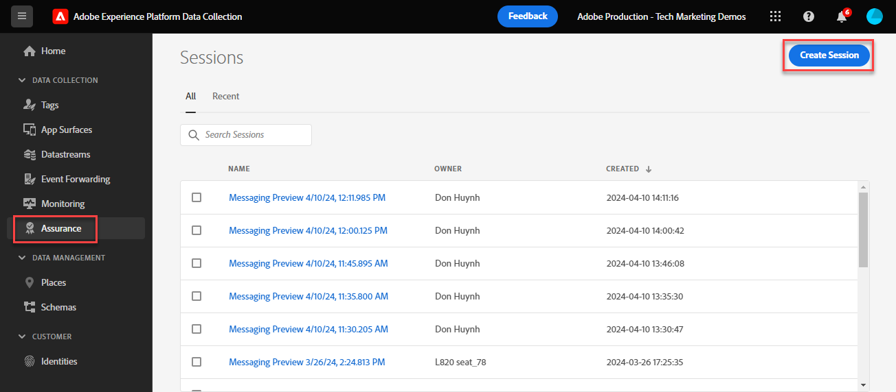
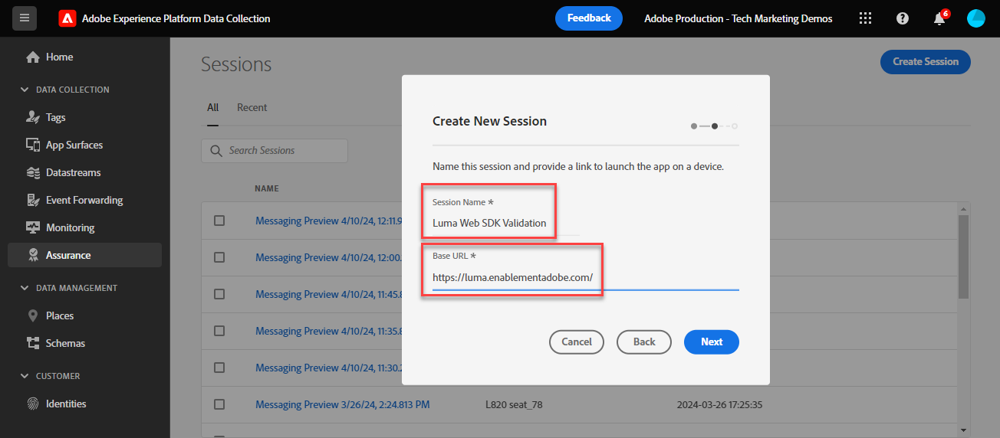
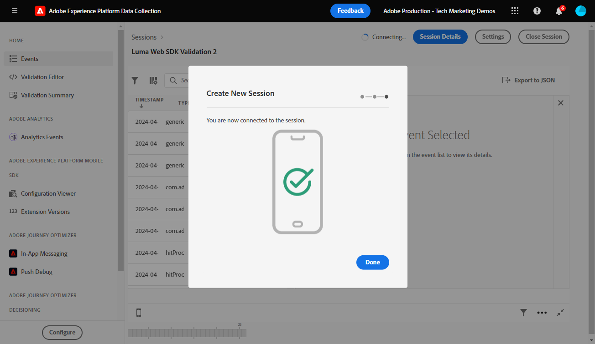

# Validate Web SDK implementations with Experience Platform Assurance

Adobe Experience Platform Assurance is a feature to help you inspect, proof, simulate, and validate how you collect data or serve experiences. Read more about [Adobe Assurance](https://experienceleague.adobe.com/en/docs/experience-platform/assurance/home). 

## Learning objectives

At the end of this lesson, you will be able to:

* Start an Assurance session
* View requests sent to and from Platform Edge Network

## Prerequisites

You are familiar with Data Collection tags and the [Luma demo site](https://luma.enablementadobe.com/content/luma/us/en.html){target="_blank"} and have completed the previous lessons in the tutorial:

* [Configure an XDM schema](configure-schemas.md)
* [Configure an identity namespace](configure-identities.md)
* [Configure a datastream](configure-datastream.md)
* [Web SDK extension installed in the tag property](install-web-sdk.md)
* [Create data elements](create-data-elements.md)
* [Create identities](create-identities.md)
* [Create a tag rule](create-tag-rule.md)
* [Validate with Debugger](validate-with-debugger.md)

## Start and view an Assurance session

There are several ways to start an Assurance session.

### Start an Assurance Session in the Debugger

Every time you enable Edge Trace in Adobe Experience Platform Debugger, an Assurance session is started in the background. 

Reviewing how we did this in the Debugger lesson:

1. Go to the [Luma demo site](https://luma.enablementadobe.com/content/luma/us/en.html) and use the debugger to [switch the tag property on the site to your own development property](validate-with-debugger.md#use-the-experience-platform-debugger-to-map-to-your-tags-property)
1. In the left navigation of **[!UICONTROL Experience Platform Debugger]** select **[!UICONTROL Logs]**
1. Select the **[!UICONTROL Edge]** tab, and select **[!UICONTROL Connect]**

    
1. With Edge Trace enabled, you can see an outgoing link icon on top. Select the icon to open Assurance. 

    

1. A new browser tab opens with the Assurance interface.

### Start an Assurance session from the Assurance interface

1. Open the [Data Collection interface](https://experience.adobe.com/#/data-collection/home){target="_blank"}
1. Select Assurance in the left navigation
1. Select Create Session
    
1. Select Start
1. Give the session a name, for example, `Luma Web SDK validation`
1. As the **[!UICONTROL Base URL]** enter `https://luma.enablementadobe.com/`
    
1. On the next screen, select **[!UICONTROL Copy Link]**
1. Select the icon to copy the link to your clipboard
1. Paste the URL in your browser, which will open the Luma Website with a special URL parameter `adb_validation_sessionid` and start the session
1. In the Assurance interface, you should see a message indicating you have successfully connected to the session and you should see events captured in the Assurance interface.
    

## Validate the current state of your Web SDK implementation

There is limited information to view at this stage of your implementation. One value we can see is the your Experience Cloud Id (ECID) which is generated on Platform Edge Network:

1. Select the row with the event called Adobe Response Handle. 
1. A menu shows up on the right. Select the `+` sign next to `[!UICONTROL ACPExtensionEvent]` 
1. Drill down by selecting `[!UICONTROL payload > 0 > payload > 0 > namespace]`. The ID shown under the last `0` corresponds to the `ECID`. You know that by the value that shows up under `namespace` matching `ECID`

    

    >[!CAUTION]
    >
    >You may see a truncated ECID value due to the width of your window. Simply select the handle bar in the interface and drag to the left to view the entire ECID. 

In future lessons, you use Assurance to validate fully processed payloads reaching an Adobe application enabled in your datastream.

With an XDM object now firing on a page, and with the knowledge of how to validate your data collection, you are ready to set up Experience Platform and the individual Adobe applications using Platform Web SDK.

[Next: **Set up Experience Platform**](setup-experience-platform.md)

>[!NOTE]
>
>Thank you for investing your time in learning about Adobe Experience Platform Web SDK. If you have questions, want to share general feedback, or have suggestions on future content, please share them on this [Experience League Community discussion post](https://experienceleaguecommunities.adobe.com/t5/adobe-experience-platform-launch/tutorial-discussion-implement-adobe-experience-cloud-with-web/td-p/444996)
