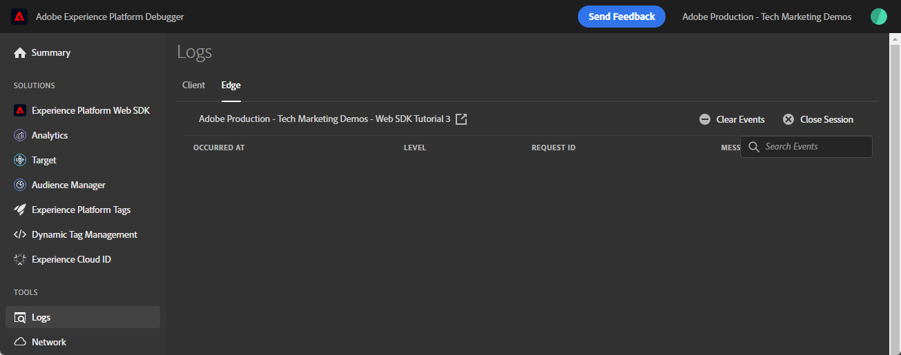

# Validate Web SDK implementations with Experience Platform Assurance

[Adobe Experience Platform Assurance](https://experienceleague.adobe.com/en/docs/experience-platform/assurance/home) is a feature to help you inspect, proof, simulate, and validate how you collect data or serve experiences.

As you learned in the [Configure a datastream](configure-datastream.md) lesson, Platform Web SDK first sends data from your digital property to Platform Edge Network. Then, Platform Edge Network makes forwards the data to the services enabled in your datastream. You can validate the requests coming in and out of Platform Edge Network by using Assurance. 

## Learning objectives

At the end of this lesson, you will be able to:

* Start an Assurance session
* View requests sent to and from Platform Edge Network

## Prerequisites

You are familiar with Data Collection tags and the [Luma demo website](https://luma.enablementadobe.com){target="_blank"} and have completed the previous lessons in the tutorial:

* [Configure an XDM schema](configure-schemas.md)
* [Configure an identity namespace](configure-identities.md)
* [Configure a datastream](configure-datastream.md)
* [Web SDK extension installed in the tag property](install-web-sdk.md)
* [Create data elements](create-data-elements.md)
* [Capture identities](create-identities.md)
* [Create a tag rule](create-tag-rule.md)
* [Validate with Debugger](validate-with-debugger.md)

## Start and view an Assurance session

There are several ways to start an Assurance session.

### Enable Edge Trace in the Debugger

To enable Edge Trace:

1. Go to the [Luma demo website](https://luma.enablementadobe.com) and use the debugger to [switch the tag property on the site to your own development property](validate-with-debugger.md#use-the-experience-platform-debugger-to-map-to-your-tags-property)
1. Make sure you are signed into the Debugger with your Org name showing. If your username is showing instead, sign out and try signing back in.
1. In the left navigation of **[!UICONTROL Experience Platform Debugger]** select **[!UICONTROL Logs]**
1. Select the **[!UICONTROL Edge]** tab, and select **[!UICONTROL Connect]**

    

1. It is empty for now

        

1. Refresh the [Luma home page](https://luma.enablementadobe.com/) and check **[!UICONTROL Experience Platform Debugger]** again, to see data come into Platform Edge Network. In future lessons, you will be able to see outgoing requests as you enable services in your datastream. 

    

    Every time you enable Edge Trace in Adobe Experience Platform Debugger, an Assurance session is started in the background. While you can review the information here, you will likely find the Assurance interface much more useful.

1. With Edge Trace enabled, you can see an outgoing link icon on top. Select the icon to open Assurance. 

    

1. A new browser tab opens with the Assurance interface.

### Start an Assurance session from the Assurance interface

1. Open the [Data Collection interface](https://experience.adobe.com/#/data-collection/home){target="_blank"}
1. Select Assurance in the left navigation
1. Select Create Session
    
1. Use the **[!UICONTROL Deep link connect]** option
1. Select **[!UICONTROL Start]**
1. Give the session a name, for example, `Luma Web SDK validation`
1. As the **[!UICONTROL Base URL]** enter `https://luma.enablementadobe.com/`
    
1. On the next screen, select **[!UICONTROL Copy Link]**
1. Select the icon to copy the link to your clipboard
1. Paste the URL in your browser, which will open the Luma Website with a special URL parameter `adb_validation_sessionid` and start the session
1. In the Assurance interface, you should see a message indicating you have successfully connected to the session and you should see events captured in the Assurance interface.
    

## Validate the current state of your Web SDK implementation

There is limited information to view at this stage of your implementation since we haven't enabled any services in the datastream yet.

### View incoming requests from Web SDK with `Alloy Request`

We can view the incoming hit from Web SDK as it is received by the edge:

1. Select the `Alloy Request` row
1. Look in  Raw Event (or expand nodes in the [!UICONTROL Payload] > `ACPExtensionEventData`)  until you find your XDM object with familiar variables:

    

### View the response in `Alloy Response Handle`

As you know, the Experience Cloud Id (ECID) is visible in the Web SDK response after it is generated on Platform Edge Network. Let's look for it in the response as viewed in Assurance:

1. Filter and select the row with the event called `Alloy Response Handle`. 
1. A menu shows up on the right. Select the `+` sign next to `[!UICONTROL ACPExtensionEventData]` 
1. Drill down by selecting `[!UICONTROL payload > 0 > payload > 0 > namespace]`. The ID shown under the last `0` corresponds to the `ECID`. You know that by the value that shows up under `namespace` matching `ECID`

    

    >[!CAUTION]
    >
    >You may see a truncated ECID value due to the width of your window. Simply select the handle bar in the interface and drag to the left to view the entire ECID. 

In future lessons, you use Assurance to validate fully processed payloads reaching an Adobe application enabled in your datastream.

With an XDM object now firing on a page, and with the knowledge of how to validate your data collection, you are ready to set up Experience Platform and the individual Adobe applications using Platform Web SDK.

>[!NOTE]
>
>Thank you for investing your time in learning about Adobe Experience Platform Web SDK. If you have questions, want to share general feedback, or have suggestions on future content, please share them on this [Experience League Community discussion post](https://experienceleaguecommunities.adobe.com/adobe-experience-platform-18/tutorial-discussion-implement-adobe-experience-cloud-with-web-sdk-tutorial-248848)
