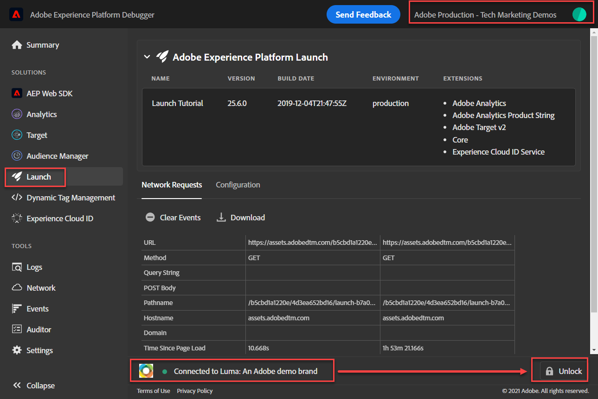
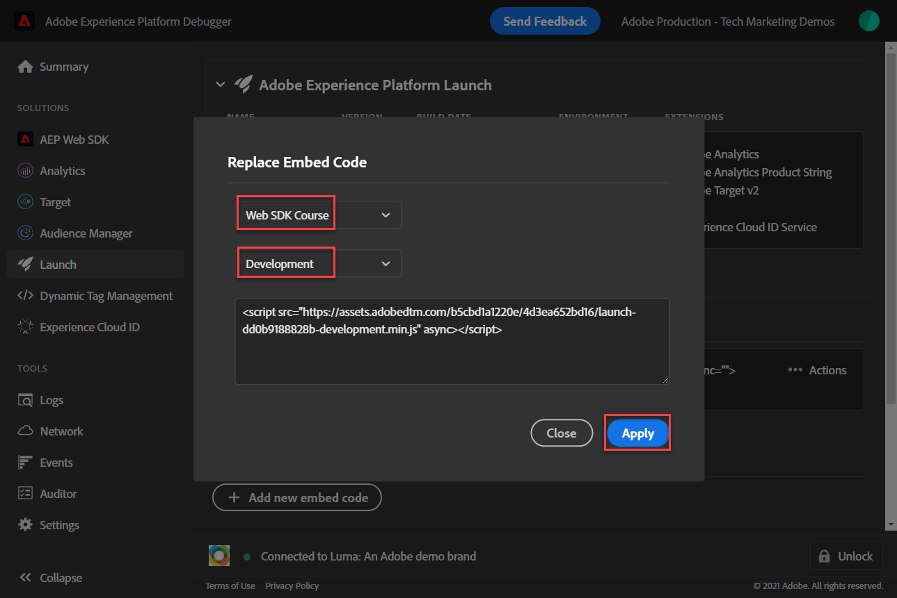
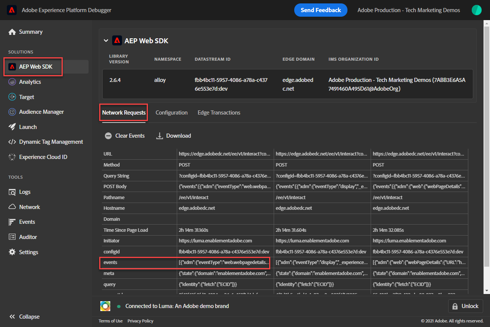
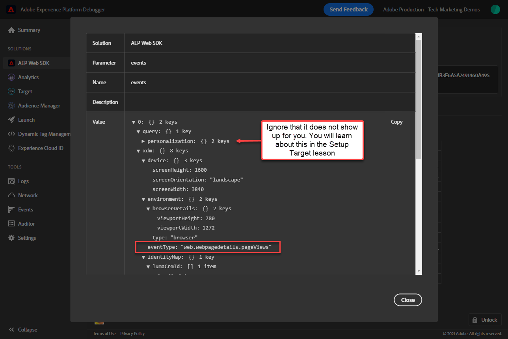
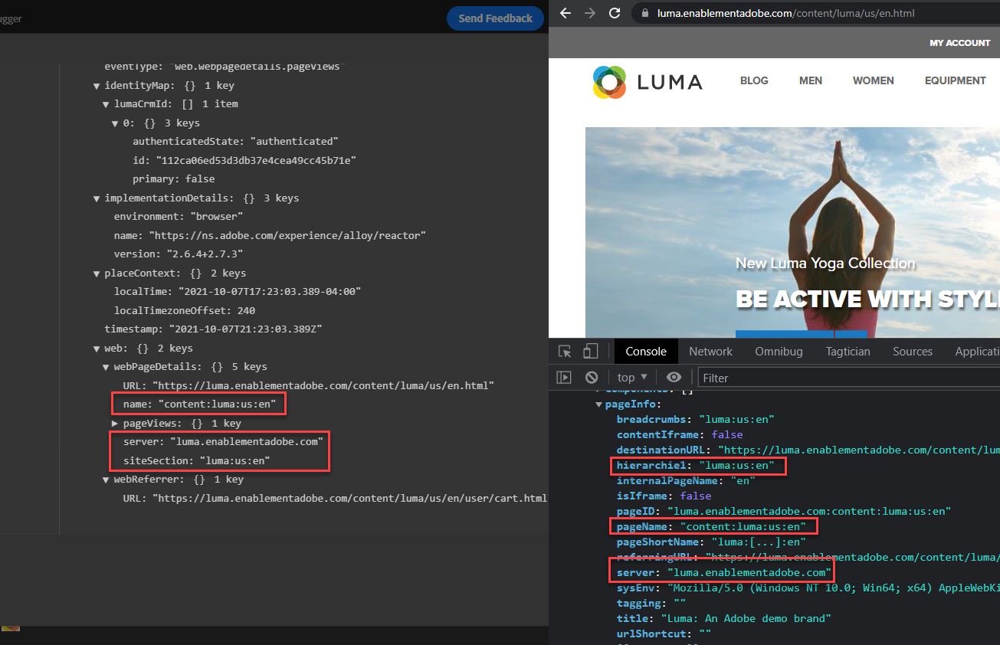
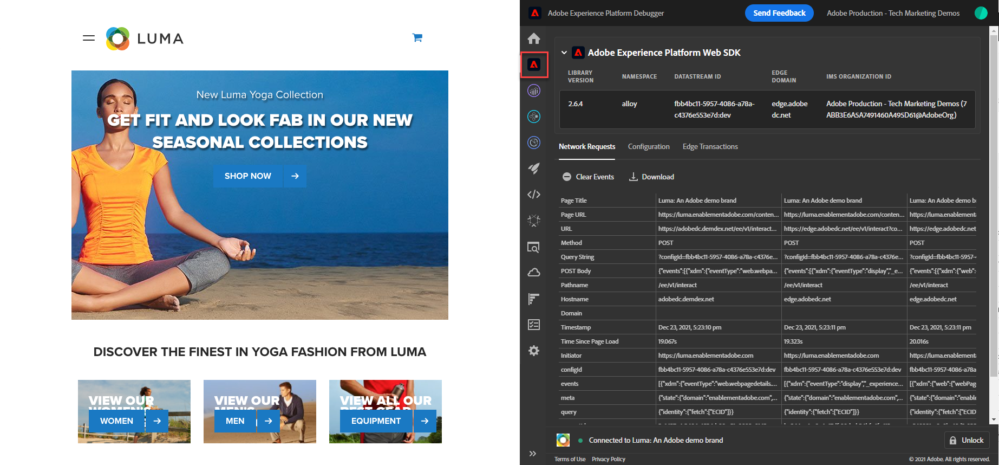
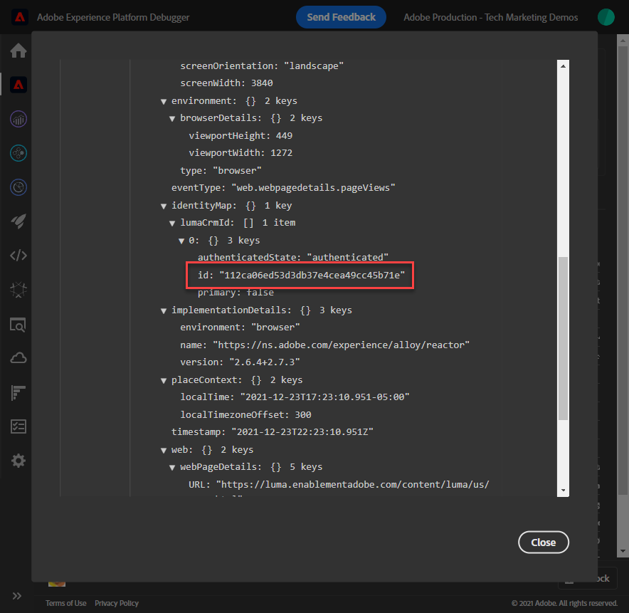
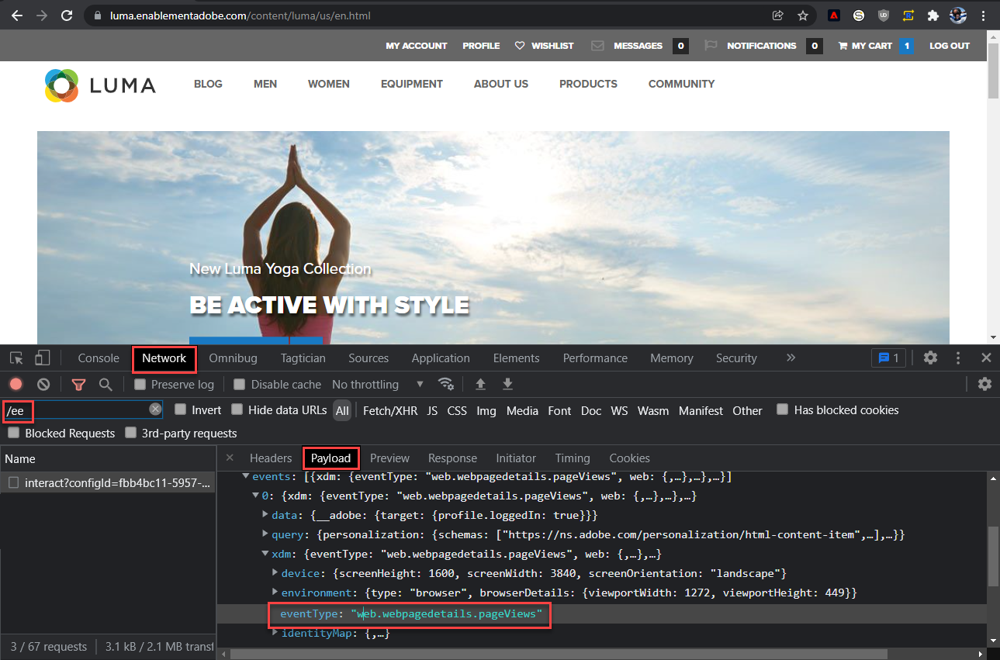
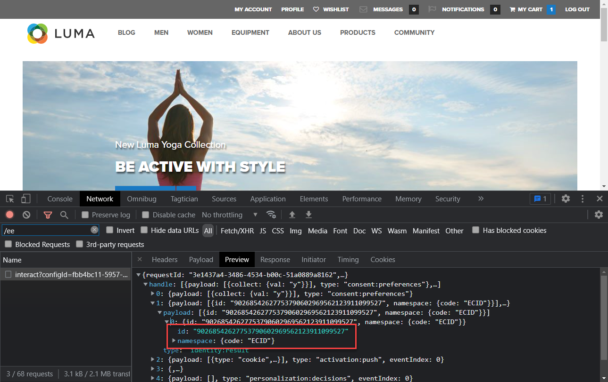

# Validate Web SDK implementations with Experience Platform Debugger

Learn how to validate your Platform Web SDK implementation with Adobe Experience Platform Debugger.

The Experience Platform Debugger is an extension available for Chrome and Firefox browsers which helps you see the Adobe technology implemented in your web pages. Download the version for your preferred browser:

* [Firefox extension](https://addons.mozilla.org/en-US/firefox/addon/adobe-experience-platform-dbg/)
* [Chrome extension](https://chrome.google.com/webstore/detail/adobe-experience-platform/bfnnokhpnncpkdmbokanobigaccjkpob)

If you have never used the debugger before&mdash;and this one is different from the older Adobe Experience Cloud Debugger&mdash;you might want to watch this five-minute overview video:

>[!VIDEO](https://video.tv.adobe.com/v/32156?quality=12&learn=on)

In this lesson, you will use the [Adobe Experience Cloud Debugger extension](https://chrome.google.com/webstore/detail/adobe-experience-cloud-de/ocdmogmohccmeicdhlhhgepeaijenapj) to replace the tag property hardcoded on the [Luma demo site](https://luma.enablementadobe.com/content/luma/us/en.html) with your own property.

This technique is called environment switching and will be helpful later, when you work with tags on your own website. You are able to load your production website in your browser, but with your *development* tags environment. This ability enables you to confidently make and validate tags changes independently from your regular code releases. After all, this separation of marketing tag releases from your regular code releases is one of the main reasons customers use tags in the first place!

## Learning objectives

At the end of this lesson, you will be able to use the debugger to:

* Load an alternate tag library
* Validate the XDM object is capturing and sending data as expected Edge Network

## Prerequisites

You are familiar with Data Collection tags and the [Luma demo site](https://luma.enablementadobe.com/content/luma/us/en.html){target="_blank"} and have completed the following previous lessons in the tutorial:

* [Configure permissions](configure-permissions.md)
* [Configure an XDM schema](configure-schemas.md)
* [Configure an identity namespace](configure-identities.md)
* [Configure a datastream](configure-datastream.md)
* [Web SDK extension installed in the tag property](install-web-sdk.md)
* [Create data elements](create-data-elements.md)
* [Create a tag rule](create-tag-rule.md)

## Load alternate tag libraries with Debugger

This tutorial uses a publicly hosted version of the [Luma demo website](https://luma.enablementadobe.com/content/luma/us/en.html). Open the homepage and bookmark it.

   

The Experience Platform Debugger has a cool feature that allows you to replace an existing tag library with a different one. This technique is useful for validation and allows us to skip many implementation steps in this tutorial.

1. Make sure you have the Luma site open and select the Experience Platform Debugger extension icon
1. The Debugger will open and show some details of the hardcoded implementation, which is unrelated to this tutorial (you may need to reload the Luma site after opening the Debugger)
1. Confirm that the Debugger is "**[!UICONTROL Connected to Luma]**" as pictured below and then select the "**[!UICONTROL lock]**" icon to lock the Debugger to the Luma site.
1. Select the **[!UICONTROL Sign In]** button and sign into Adobe Experience Cloud using your Adobe Id.
1. Now go to **[!UICONTROL Experience Platform Tags]** in the left navigation

    

1. Select the **[!UICONTROL Configuration]** tab
1. To the right of where it shows you the **[!UICONTROL Page Embed Codes]**, open the **[!UICONTROL Actions]** dropdown, and select **[!UICONTROL Replace]**

    

1. Since you are authenticated, the Debugger is going to pull in your available tag properties and environments. Select your `Web SDK Course` property
1. Select your `Development` environment
1. Select the **[!UICONTROL Apply]** button

    

1. The Luma website will now reload _with your tag property_.

    

As you continue the tutorial, you will use this technique of mapping the Luma site to your own tag property to validate your Platform Web SDK implementation. When you start using tags on your production website, you can use this same technique to validate changes.

## Validate your implementation in Experience Platform Debugger

You can use the Debugger to validate your Platform Web SDK implementation and view the data sent to Platform Edge Network:

1. Go to **[!UICONTROL Summary]** in the left navigation, to see the details of your tag property

    

1. Now go to **[!UICONTROL Experience Platform Web SDK]** in the left navigation to see the **[!UICONTROL Network Requests]**
1. Open the **[!UICONTROL events]** row (don't worry if this screenshot shows more requests than yours, it includes requests from future lessons and you can ignore for now)

    

1. Note how we can see the `web.webpagedetails.pageView` event type we specified in our [!UICONTROL Send Event] action, and other, out-of-the-box variables adhering to the `AEP Web SDK ExperienceEvent Mixin` format

       
    
1. Scroll down to the `web` object, select to open it and inspect the `webPageDetails.name`, `webPageDetails.server`, and `webPageDetails.siteSection`. They should match the corresponding digitalData data layer variables on the homepage

    

You can also validate the Identity Map details:

1. Log into the Luma site using the credentials `test@adobe.com`/`test`

1. Return to the [Luma homepage](https://luma.enablementadobe.com/content/luma/us/en.html)

1. Open the **[!UICONTROL Experience Platform Web SDK]** section in the left navigation 

   

1. Select the **[!UICONTROL events]** row to open details in a pop-up

   

1. Search for the **identityMap** within the pop-up. Here you should see `lumaCrmId` with three keys of authenticatedState, id, and primary:
    

## Validate with browser dev tools

These types of request details are also visible in the browser's web developer tools **Network** tab (assuming the website is loading your tag library). 

1. Open the browser's web developer tools **Network** tab and reload the page. Filter for calls with `/ee` to locate the call, select it, and then look in the **Headers** tab, and **Payload** tab

    

1. Go to the **Response** tab and note how the ECID value is included in the response. Copy this value as you will use it to validate the profile information in the next exercise

       

    >[!NOTE]
    >
    >    You may not see the same amount of payload requests as in the screenshot above. This disparity is because future lessons for [setting up Target](setup-target.md) were completed at the time of the screenshot being taken. You can ignore this difference for now.

With an XDM object now firing on a page, and with the knowledge of how to validate your data collection, you are ready to set up the individual Adobe applications using Platform Web SDK.

[Next: **Set up Experience Platform**](setup-experience-platform.md)

>[!NOTE]
>
>Thank you for investing your time in learning about Adobe Experience Platform Web SDK. If you have questions, want to share general feedback, or have suggestions on future content, please share them on this [Experience League Community discussion post](https://experienceleaguecommunities.adobe.com/t5/adobe-experience-platform-launch/tutorial-discussion-implement-adobe-experience-cloud-with-web/td-p/444996)
