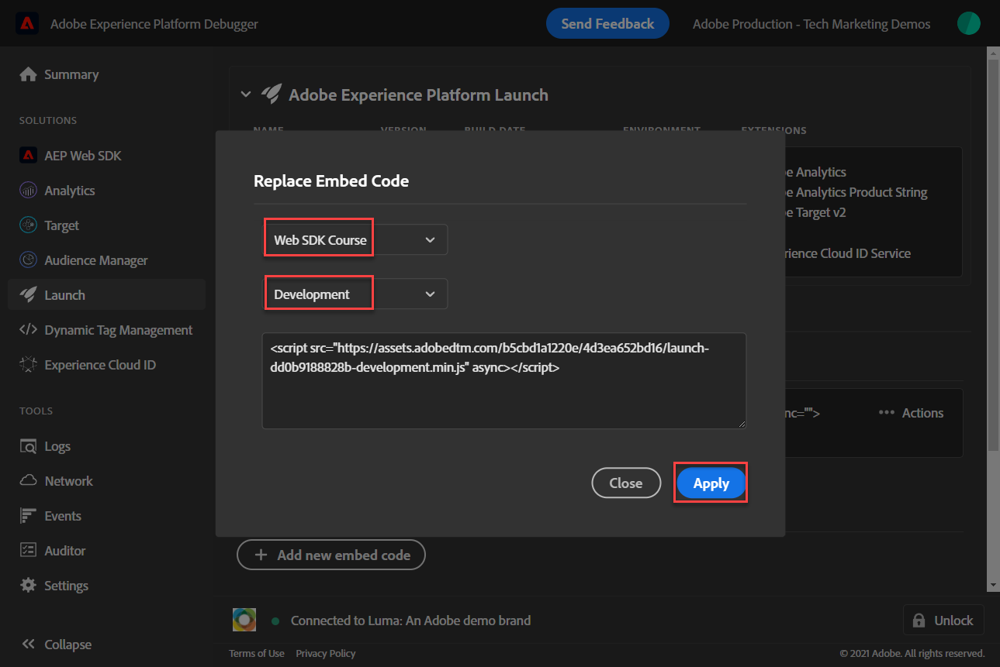
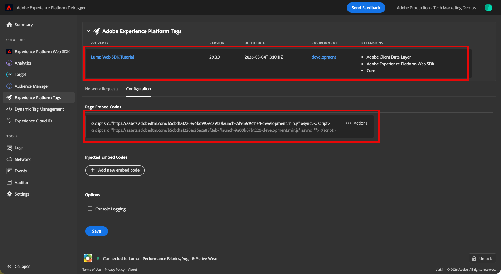
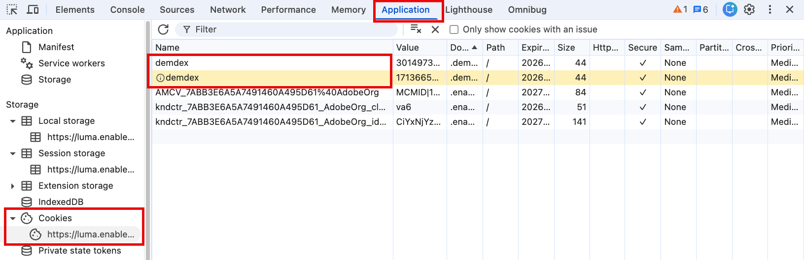

# Validate Web SDK implementations with Experience Platform Debugger

Learn how to validate your Adobe Experience Platform Web SDK implementation with Adobe Experience Platform Debugger.

Experience Platform Debugger is a [Chrome extension](https://chromewebstore.google.com/detail/adobe-experience-platform/bfnnokhpnncpkdmbokanobigaccjkpob) which helps you see the Adobe technology implemented in your web pages. Experience Platform Debugger and your browser's developer console are the best ways to validate and debug the browser-side aspects of your Web SDK implementation. Adobe Experience Platform Assurance, covered in the next lesson, provides the best view of the data as it travels into and out of the Platform Edge Network.

If you have never used the Debugger before, you might want to watch this five-minute overview video:

>[!VIDEO](https://video.tv.adobe.com/v/32156?learn=on&enablevpops)

In this lesson, you use the [Adobe Experience Platform Debugger extension](https://chromewebstore.google.com/detail/adobe-experience-platform/bfnnokhpnncpkdmbokanobigaccjkpob) to replace the tag property hardcoded on the [Luma demo site](https://luma.enablementadobe.com) with your own property.

This technique is called environment switching and will be helpful later, when you work with tags on your own website. It allows you to to load your production website in your browser, but with your *development* tags library. This ability enables you to confidently make and validate tags changes independently from your regular code releases. After all, this separation of marketing tag releases from your regular code releases is one of the main reasons customers use tags in the first place!

## Learning objectives

At the end of this lesson, you will be able to use the debugger to:

* Load an alternate tag library
* Validate the client-side XDM event is capturing and sending data as expected to Platform Edge Network
* Enable Edge Trace to view server-side requests sent by Platform Edge Network

## Prerequisites

You are familiar with Data Collection tags and the [Luma demo site](https://luma.enablementadobe.com/){target="_blank"} and have completed the previous lessons in the tutorial:

* [Configure an XDM schema](configure-schemas.md)
* [Configure an identity namespace](configure-identities.md)
* [Configure a datastream](configure-datastream.md)
* [Web SDK extension installed in the tag property](install-web-sdk.md)
* [Create data elements](create-data-elements.md)
* [Capture identities](create-identities.md)
* [Create tag rules](create-tag-rule.md)

## Load alternate tag libraries with Debugger

The Experience Platform Debugger has a cool feature that allows you to replace an existing tag library with a different one. This technique is useful for validation and allows us to skip many implementation steps in this tutorial.

1. Make sure you have the [Luma demo website](https://luma.enablementadobe.com){target="_blank"} open and select the Experience Platform Debugger extension icon
1. The Debugger will open and show some details of the hardcoded implementation (you may need to reload the Luma site after opening the Debugger)
1. Confirm that the Debugger is "**[!UICONTROL Connected to Luma]**" as pictured below and then select the "**[!UICONTROL lock]**" icon to lock the Debugger to the Luma site.
1. Select the **[!UICONTROL Sign In]** button, sign into Adobe Experience Cloud using your Adobe Id, and select your Organization.

    >[!TIP]
    >
    > If the debugger displays your username instead of your Org name after signing in, sign out and try again.

    

1. Now, go to **[!UICONTROL Experience Platform Tags]** in the left navigation
1. Select the **[!UICONTROL Configuration]** tab
1. To the right of where it shows you the **[!UICONTROL Page Embed Codes]**, open the **[!UICONTROL Actions]** dropdown, and select **[!UICONTROL Replace]**

    

1. Since you are authenticated, the Debugger is going to pull in your available tag properties and environments. Select your property
1. Select your `Development` environment
    

    >[!TIP]
    >
    > If you are unable to select your property and environment using the dropdowns, instead go to [!UICONTROL Tags] > [!UICONTROL Environments] > [!UICONTROL Development] > [!UICONTROL Install] and select the icon to copy the embed code and paste it into the Debugger:
    > 

1. Select the **[!UICONTROL Apply]** button

1. The Luma website will now reload _with your own tag property_.

    

As you continue the tutorial, you use this technique of mapping the Luma site to your own tag property to validate your Platform Web SDK implementation. When using tags on your own website, you can use this same technique to validate development tag libraries on your production website.

## Validate with Debugger

### Validate network requests and XDM

You can use the Debugger to validate client-side beacons triggered from your Platform Web SDK implementation to view the data sent to Platform Edge Network:

1. Go to **[!UICONTROL Summary]** in the left navigation, to see the details of your tag property

    

1. Now, go to **[!UICONTROL Experience Platform Web SDK]** in the left navigation to see the **[!UICONTROL Network Requests]**
1. Open the **[!UICONTROL events]** row

    

1. Note how you can see the `web.webPageDetails.pageView` event type you specified in your [!UICONTROL Update variable] action, and other, out-of-the-box variables adhering to the `AEP Web SDK ExperienceEvent` field group

       
    
1. Scroll down to the `web` object, select to open it and inspect the `webPageDetails.name`. They should match the corresponding `adobeDataLayer` data layer variables on the homepage

>[!TIP]
>
> To view and compare the `adobeDataLayer` data layer on the homepage:
>
> 1. While on the Luma homepage, open the browser developer tools. In the case of Chrome, select button `F12` on your keyboard
> 1. Select the **[!UICONTROL Console]** tab
> 1. Enter `adobeDataLayer` and select `Enter` on your keyboard to bring up the data layer values

Validate the the events and variables set on the product pages, cart page, and order confirmation page.

### Validate Identity Map

You can also validate the Identity Map details:

1. Select **[!DNL Sign In]** on the [Luma website](https://luma.enablementadobe.com/){target=_blank}. Select **[!DNL Create Account]** and create an account using the credentials `test@test.com`/`test`

1. Use the **[!UICONTROL Jump to most recent]** shortcut in the Debugger to quickly go to the most recent Web SDK event (it's the last column). Select the **[!UICONTROL events]** row to open the details modal.

1. Search for the **identityMap** within the modal. Here you should see `lumaCrmId` with three keys of authenticatedState, id, and primary designation:
    

## Validate with browser developer tools

Many web developers may prefer viewing implementation in their browser's developer tools. This is especially important as not all browsers support the Debugger extension. Also, because of the flexible framework, there are additional implementation details you can inspect such as cookies and response details.

### Validate network requests

Web SDK request details are also visible in the browser's web developer tools **Network** tab (assuming the website is loading your tag library). 

1. Open the browser's web developer tools **Network** tab and reload the page. Filter for calls with `/ee` to locate the call, select it, and then look in the **Headers** tab, and **Payload** tab

    

1. Go to the **Preview** tab and note how the ECID value is included in the network response.

       

    >[!NOTE]
    >
    > The ECID value is visible in the network response. It is not included in the `identityMap` portion of the network request, nor is it stored in this format in a cookie.

### Web SDK cookies

While we're in the developer tools, lets take a look at some of the cookies Web SDK sets in the browser. Open Application > Cookies > https://luma.enablementadobe.com

You should see several cookies set by Web SDK:

* kndctr_[IMS_ORGID]_AdobeOrg_identity: this stores data related to the ECID
* kndctr_[IMS_ORGID]_AdobeOrg_cluster: this stores the data center location used so subsequent network calls get routed to the same Edge servers
* AMCV_[IMS_ORGID]%40AdobeOrg: this is the legacy AMCV cookie used by pre-Web SDK Experience Cloud libraries and it is set because we left the default **[!UICONTROL Migrate ECID to VisitorAPI to the web SDK]** setting selected in the Adobe Experience Platform Web SDK tags extension. This setting is important to have enabled as you migrate your pages from older libraries to Web SDK, but can be disabled after all of your pages have been migrated for a certain amount of time.

If you clear these cookies and reload the page, you might notice some additional third party cookies set on the `.demdex.net` domain. These are set because we left the default **[!UICONTROL Use third party-cookies]**: **[!UICONTROL Enabled]** setting in the Adobe Experience Platform Web SDK tags extension. If your browser doesn't allow third-party cookies, they will be removed when you reload the page.

### Luma local storage

The Luma demo website uses strictly client-side technologies such as HTML, CSS, and JavaScript. There are no backend storage mechanisms, other than the Experience Cloud implementation used by the default state of the website. Information like username details are just stored locally in your browser using localStorage. So, if you delete this information or use an incognitor window, you will notice that you might need to recreate a test user account that you created previously.

Next, learn how to validate these network requests when they are received and transmitted from Platform Edge Network using Adobe Experience Platform Assurance!

>[!NOTE]
>
>Thank you for investing your time in learning about Adobe Experience Platform Web SDK. If you have questions, want to share general feedback, or have suggestions on future content, please share them on this [Experience League Community discussion post](https://experienceleaguecommunities.adobe.com/adobe-experience-platform-18/tutorial-discussion-implement-adobe-experience-cloud-with-web-sdk-tutorial-248848)
