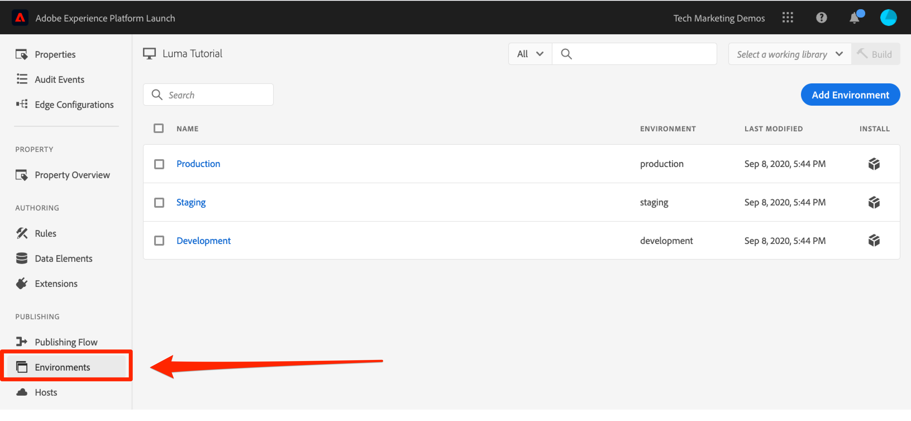
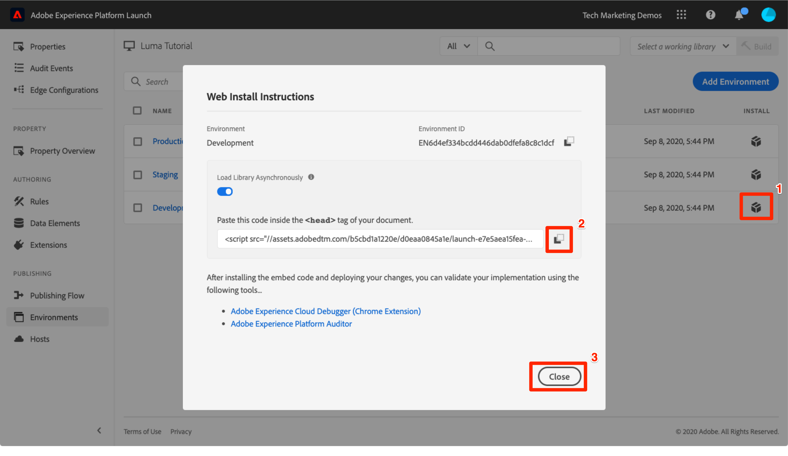

# Add the embed code

In this lesson, you will implement the asynchronous embed code of your tag property's Development environment. Along the way, you will learn about two main concepts of tags&mdash;Environments and Embed Codes.

>[!NOTE]
>
>Adobe Experience Platform Launch is being integrated into Adobe Experience Platform as a suite of data collection technologies. Several terminology changes have rolled out in the interface which you should be aware of while using this content:
>
> * Platform Launch (Client Side) is now **[[!DNL tags]](https://experienceleague.adobe.com/docs/experience-platform/tags/home.html)** 
> * Platform Launch Server Side is now **[[!DNL event forwarding]](https://experienceleague.adobe.com/docs/experience-platform/tags/event-forwarding/overview.html)** 
> * Edge configurations  are now **[[!DNL datastreams]](https://experienceleague.adobe.com/docs/experience-platform/edge/fundamentals/datastreams.html)**

## Learning Objectives

At the end of this lesson, you will be able to:

* Obtain the embed code for your tag property
* Understand the difference between a Development, Staging, and Production environment
* Add a tag embed code to an html document
* Explain the optimal location of the tag embed code in relation to other code in the `<head>` of an html document

## Copy the Embed Code

The embed code is a `<script>` tag that you put on your webpages to load and execute the logic you build in tags. If you load the library asynchronously, the browser continues to load the page, retrieves the tag library, and executes it in parallel. In this case, there is only one embed code, which you put in the `<head>`. (When tags is deployed synchronously, there are two embed codes, one which you put in the `<head>` and another which you put before the `</body>`).

From the property Overview screen, click **[!UICONTROL Environments]** in the left navigation to go to the environments page. Note that Development, Staging, and Production environments have been pre-created for you.



Development, Staging, and Production environments correspond to the typical environments in the code development and release process. Code is first written by a developer in a Development environment. When they have completed their work, they send it to a Staging environment for QA and other teams to review. Once the QA and other teams are satisfied, the code is then published to the Production environment, which is the public-facing environment  which your visitors experience when they come to your website.

Tags permits additional Development environments, which is useful in large organizations in which multiple developers are working on different projects at the same time.

These are the only environments we need to complete the tutorial. Environments allow you to have different working versions of your tags libraries hosted at different URLs, so you can safely add new features and make them available to the right users (e.g. developers, QA engineers, the public, etc.) at the right time.

Now let's copy the embed code:

1. In the **[!UICONTROL Development]** row, click the Install icon  to open the modal.

1. Note that tags will default to the asynchronous embed codes

1. Click the Copy icon  to copy the embed code to your clipboard.

1. Click **[!UICONTROL Close]** to close the modal.

   

## Implement the Embed Code in the `<head>` of the Sample HTML Page

The embed code should be implemented in the `<head>` element of all HTML pages that will share the property. You might have one or several template files which control the `<head>` globally across the site, making it a straightforward process to add tags.

If you haven't already, download [the sample html page](https://www.enablementadobe.com/multi/web/basic-sample.html) (right-click on this link and click "Save Link As") and open it in a code editor. [Brackets](https://brackets.io/) is a free, open source editor if you need one.

Replace the existing embed code on or around line 34 with with the one on your clipboard and save the page. Now open the page in a web browser. If you are loading the page using the `file://` protocol, you will need to add "https:" at the beginning of the embed code URL in your code editor). Lines 33-36 of your sample page might look something like this:

```html
    <!--Tags Header Embed Code: REPLACE LINE 39 WITH THE EMBED CODE FROM YOUR OWN DEVELOPMENT ENVIRONMENT-->
    <script src="https://assets.adobedtm.com/launch-ENa21cfed3f06f4ddf9690de8077b39e81-development.min.js" async></script>
    <!--/Tags Header Embed Code-->
```

Open your web browser's developer tools and go to the Network tab. At this point you should see a 404 error for the tag environment URL:


The 404 error is expected because you haven't yet built a library in this Tags environment. You will do that in the next lesson. If you see a "failed" message instead of a 404 error, you probably forgot to add the `https://` protocol in the embed code. Again, you only need to specify the `https://` protocol if you are loading the sample page using the `file://` protocol. Make that change and reload the page until the 404 error appears.

## Tags Implementation Best Practices

Let's take a moment to review some of the Tags implementation best practices which are demonstrated in the sample page:

* **Data Layer**:

  * We *strongly* recommend creating a data layer on your site containing all of the attributes needed to populate variables in Analytics, Target, and other marketing solutions. This sample page only contains a very simple data layer, but a real data layer might contain many more details about the page, the visitor, their shopping cart details, etc. For more info on data layers, please see [Customer Experience Digital Data Layer 1.0](https://www.w3.org/2013/12/ceddl-201312.pdf)

  * Define your data layer before the tag embed code, in order to maximize what you can do with Experience Cloud solutions.

* **JavaScript helper libraries**: If you already have a library like JQuery implemented in the `<head>` of your pages, load it before tags in order to leverage its syntax in tags and Target

* **HTML5 doctype**: The HTML5 doctype is required by Target

* **preconnect and dns-prefetch**: Use preconnect and dns-prefetch to improve the page load time. See also: [https://w3c.github.io/resource-hints/](https://w3c.github.io/resource-hints/)

* **pre-hiding snippet for asynchronous Target implementations**: You will learn more about this in the Target lesson, but when Target is deployed via asynchronous tag embed codes, you should hardcode a pre-hiding snippet on your pages before the tag embed codes in order to manage content flicker

Here is a summary what these best practices look like in the suggested order. Note that there are some placeholders for account specific details:  

```html
<!doctype html>
<html lang="en">
<head>
    <title>Basic Demo</title>
    <!--Preconnect and DNS-Prefetch to improve page load time. REPLACE "techmarketingdemos" WITH YOUR OWN AAM PARTNER ID, TARGET CLIENT CODE, AND ANALYTICS TRACKING SERVER-->
    <link rel="preconnect" href="//dpm.demdex.net">
    <link rel="preconnect" href="//fast.techmarketingdemos.demdex.net">
    <link rel="preconnect" href="//techmarketingdemos.demdex.net">
    <link rel="preconnect" href="//cm.everesttech.net">
    <link rel="preconnect" href="//techmarketingdemos.tt.omtrdc.net">
    <link rel="preconnect" href="//techmarketingdemos.sc.omtrdc.net">
    <link rel="dns-prefetch" href="//dpm.demdex.net">
    <link rel="dns-prefetch" href="//fast.techmarketingdemos.demdex.net">
    <link rel="dns-prefetch" href="//techmarketingdemos.demdex.net">
    <link rel="dns-prefetch" href="//cm.everesttech.net">
    <link rel="dns-prefetch" href="//techmarketingdemos.tt.omtrdc.net">
    <link rel="dns-prefetch" href="//techmarketingdemos.sc.omtrdc.net">
    <!--/Preconnect and DNS-Prefetch-->
    <!--Data Layer to enable rich data collection and targeting-->
    <script>
    var digitalData = {
        "page": {
            "pageInfo" : {
                "pageName": "Home"
                }
            }
    };
    </script>
    <!--/Data Layer-->
    <!--jQuery or other helper libraries-->
    <script src="https://code.jquery.com/jquery-3.3.1.min.js"></script>
    <!--/jQuery-->
    <!--prehiding snippet for Adobe Target with asynchronous tags deployment-->
    <script>
        (function(g,b,d,f){(function(a,c,d){if(a){var e=b.createElement("style");e.id=c;e.innerHTML=d;a.appendChild(e)}})(b.getElementsByTagName("head")[0],"at-body-style",d);setTimeout(function(){var a=b.getElementsByTagName("head")[0];if(a){var c=b.getElementById("at-body-style");c&&a.removeChild(c)}},f)})(window,document,"body {opacity: 0 !important}",3E3);
    </script>
    <!--/prehiding snippet for Adobe Target with asynchronous tags deployment-->
    <!--Tags Header Embed Code: REPLACE LINE 39 WITH THE INSTALL CODE FROM YOUR OWN DEVELOPMENT ENVIRONMENT-->
    <script src="//assets.adobedtm.com/launch-EN93497c30fdf0424eb678d5f4ffac66dc.min.js" async></script>
    <!--/Tags Header Embed Code-->
</head>
<body>
    <h1>Tags Basic Demo</h1>
    <p>This is a very simple page to demonstrate basic concepts of tags</p>
</body>
</html>
```

Now you know how to add the tag embed code to your site!

[Next "Add a data element, a rule and a library" >](add-data-elements-rules.md)
