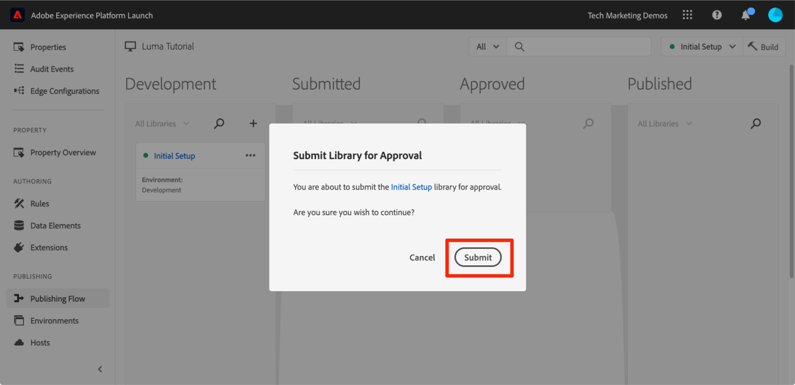

# Publish your tags property

Now that you have implemented some key solutions of the Adobe Experience Cloud in your Development environment, it's time to learn the publishing workflow.

>[!NOTE]
>
>Adobe Experience Platform Launch is being integrated into Adobe Experience Platform as a suite of data collection technologies. Several terminology changes have rolled out in the interface which you should be aware of while using this content:
>
> * Platform Launch (Client Side) is now **[[!DNL tags]](https://experienceleague.adobe.com/docs/experience-platform/tags/home.html)** 
> * Platform Launch Server Side is now **[[!DNL event forwarding]](https://experienceleague.adobe.com/docs/experience-platform/tags/event-forwarding/overview.html)** 
> * Edge configurations  are now **[[!DNL datastreams]](https://experienceleague.adobe.com/docs/experience-platform/edge/fundamentals/datastreams.html)**

## Learning Objectives

At the end of this lesson, you will be able to:

1. Publish a Development library to the Staging environment
1. Map a Staging library to your production website using the Debugger
1. Publish a Staging library to the Production environment

## Publish to Staging

 Now that you have created and validated your library in the Development environment, it is time to publish it to Staging.

1. Go to the **[!UICONTROL Publishing Flow]** page

1. Open the dropdown next to your library and select **[!UICONTROL Submit for Approval]**

   

1. Click the **[!UICONTROL Submit]** button in the dialog:

   

1. Your library will now appear in the [!UICONTROL Submitted] column in an unbuilt state:

1. Open the dropdown and select **[!UICONTROL Build for Staging]**:

   

1. Once the green-dot icon appears, the library can be previewed in the Staging environment.

In a real-life scenario, the next step in the process would typically be to have your QA team validate the changes in the Staging library. They can do this using the Debugger.

**To Validate the Changes in the Staging Library**

1. In your tags property, open the [!UICONTROL Environments] page

1. In the [!UICONTROL Staging] row, click the Install icon  to open the modal

   

1. Click the Copy icon  to copy the embed code to your clipboard

1. Click **[!UICONTROL Close]** to close the modal

   

1. Open the [Luma demo site](https://luma.enablementadobe.com/content/luma/us/en.html) in your Chrome browser

1. Open the [Experience Cloud Debugger extension](https://chrome.google.com/webstore/detail/adobe-experience-cloud-de/ocdmogmohccmeicdhlhhgepeaijenapj) by clicking the  icon

   

1. Go to the Tools Tab

1. In the **[!UICONTROL Adobe Launch > Replace Launch Embed Code]** section paste the Staging embed code that is in your clipboard
1. Turn on the **[!UICONTROL Apply across luma.enablementadobe.com]** switch

1. Click the disk icon to save

   

1. Reload and check the Summary tab of the Debugger. Under the Launch section, you should now see your Staging Property is implemented, showing your property name (I.e. "tags Tutorial" or whatever you named your property)!

   

In real-life, once your QA team has signed off by reviewing the changes in the Staging environment it is time to publish to production.

## Publish to Production

1. Go to the [!UICONTROL Publishing] page

1. From the dropdown, click **[!UICONTROL Approve for Publishing]**:

   

1. Click the **[!UICONTROL Approve]** button in the dialog box:

   

1. The library will now appear in the [!UICONTROL Approved] column in the unbuilt state (yellow dot):

1. Open the dropdown and select **[!UICONTROL Build and Publish to Production]**:

   

1. Click the **[!UICONTROL Publish]** in the dialog box:

   

1. The library will now appear in the [!UICONTROL Published] column:

   

That’s it! You've completed the tutorial and published your first property in tags!
